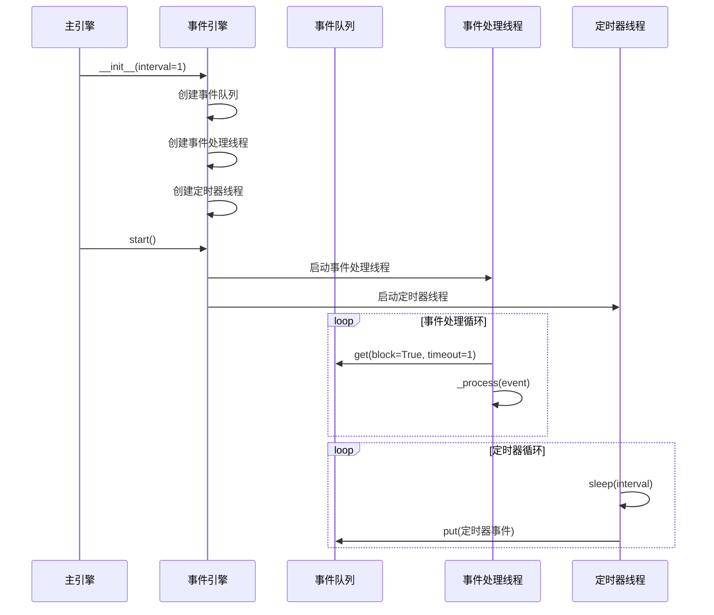
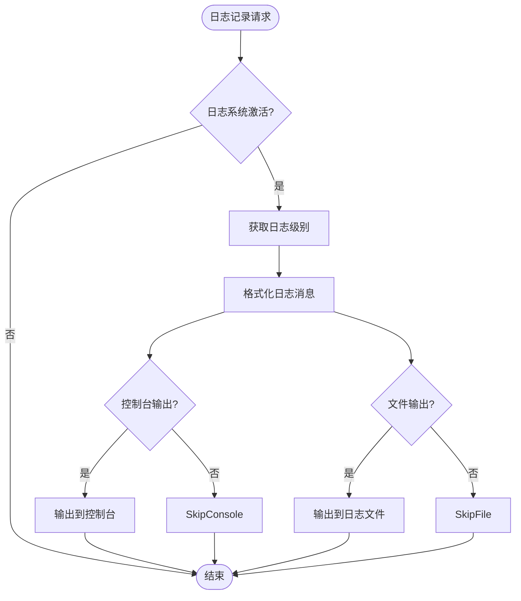

# 主引擎初始化流程

<cite>
**本文档引用的文件**  
- [main_engine.py](file://vnpy/trader/engine.py)
- [event_engine.py](file://vnpy/event/engine.py)
- [logger.py](file://vnpy/trader/logger.py)
- [setting.py](file://vnpy/trader/setting.py)
- [gateway.py](file://vnpy/trader/gateway.py)
- [run.py](file://examples/veighna_trader/run.py)
- [no_ui/run.py](file://examples/no_ui/run.py)
</cite>

## 目录
1. [主引擎初始化概述](#主引擎初始化概述)
2. [事件引擎创建与启动](#事件引擎创建与启动)
3. [组件字典初始化](#组件字典初始化)
4. [日志系统集成](#日志系统集成)
5. [核心服务注册机制](#核心服务注册机制)
6. [初始化参数配置](#初始化参数配置)
7. [事件引擎线程安全设计](#事件引擎线程安全设计)
8. [定时器精度配置](#定时器精度配置)
9. [自定义初始化参数](#自定义初始化参数)
10. [初始化失败排查指南](#初始化失败排查指南)

## 主引擎初始化概述

主引擎（MainEngine）是vn.py交易框架的核心组件，负责协调各个子系统和组件的运行。其初始化过程是一个复杂的多步骤流程，涉及事件引擎的创建、组件字典的初始化、日志系统的集成以及核心服务的注册。初始化过程从`__init__`方法开始，该方法接受一个可选的事件引擎参数，如果未提供则会创建一个新的事件引擎实例。

初始化过程中，主引擎首先创建或接收事件引擎实例，并立即启动事件引擎。随后，主引擎初始化各种组件字典，包括网关字典、引擎字典、应用字典和交易所列表。这些字典用于存储和管理框架中的各种组件。同时，主引擎会改变工作目录到交易者目录（TRADER_DIR），并调用`init_engines`方法来初始化所有功能引擎。

**Section sources**
- [main_engine.py](file://vnpy/trader/engine.py#L78-L93)

## 事件引擎创建与启动

事件引擎（EventEngine）是vn.py框架的事件驱动核心，负责事件的分发和处理。在主引擎的初始化过程中，事件引擎的创建和启动是首要步骤。如果在初始化主引擎时未提供事件引擎实例，主引擎会自动创建一个新的事件引擎实例。

事件引擎的创建过程包括初始化一个事件队列（Queue）、设置活动状态标志、创建事件处理线程和定时器线程。事件队列用于存储待处理的事件，采用线程安全的队列实现，确保多线程环境下的数据一致性。事件处理线程负责从队列中获取事件并进行处理，而定时器线程则负责定期生成定时器事件。

事件引擎启动后，会同时启动事件处理线程和定时器线程。事件处理线程进入一个循环，不断从事件队列中获取事件并调用相应的处理函数。定时器线程也会进入循环，按照预设的时间间隔（默认1秒）生成定时器事件并放入事件队列。这种双线程设计确保了事件处理的实时性和定时任务的准确性。

**Diagram sources**
- [event_engine.py](file://vnpy/event/engine.py#L42-L95)
- [main_engine.py](file://vnpy/trader/engine.py#L80-L84)

**Section sources**
- [event_engine.py](file://vnpy/event/engine.py#L42-L95)
- [main_engine.py](file://vnpy/trader/engine.py#L80-L84)

## 组件字典初始化

主引擎在初始化过程中会创建多个组件字典，用于管理和存储框架中的各种组件。这些字典包括网关字典（gateways）、引擎字典（engines）、应用字典（apps）和交易所列表（exchanges）。这些数据结构的初始化是主引擎能够协调和管理各个组件的基础。

网关字典用于存储所有已添加的交易接口网关，以网关名称为键，网关实例为值。引擎字典用于存储所有功能引擎实例，以引擎名称为键，引擎实例为值。应用字典用于存储所有已添加的应用实例，以应用名称为键，应用实例为值。交易所列表则用于存储所有支持的交易所，避免重复添加。

这些组件字典的初始化在主引擎的`__init__`方法中完成，通过直接实例化空的字典和列表来实现。这种设计使得主引擎能够动态地添加和管理各种组件，提供了良好的扩展性和灵活性。组件字典的初始化顺序和结构设计确保了主引擎能够高效地查找和访问各个组件。

**Section sources**
- [main_engine.py](file://vnpy/trader/engine.py#L86-L89)

## 日志系统集成

日志系统是主引擎初始化过程中的重要组成部分，负责记录框架运行过程中的各种信息。日志系统的集成通过添加日志引擎（LogEngine）来实现，该引擎作为功能引擎之一被注册到主引擎中。日志引擎的初始化在`init_engines`方法中完成，通过调用`add_engine`方法将日志引擎添加到引擎字典中。

日志引擎的实现基于Python的logging模块和loguru库，提供了灵活的日志记录功能。日志引擎会根据全局设置（SETTINGS）中的日志配置来决定日志的输出方式，包括控制台输出和文件输出。日志级别、日志格式和日志文件路径等都可以通过配置文件进行自定义。

日志系统通过事件机制与主引擎集成，当有日志事件发生时，事件引擎会将日志事件分发给日志引擎的处理函数。日志引擎的处理函数会根据日志级别和消息内容，将日志输出到指定的目标。这种基于事件的日志系统设计确保了日志记录的异步性和非阻塞性，不会影响主引擎的正常运行。

**Diagram sources**
- [logger.py](file://vnpy/trader/logger.py#L22-L55)
- [main_engine.py](file://vnpy/trader/engine.py#L160-L166)

**Section sources**
- [logger.py](file://vnpy/trader/logger.py#L22-L55)
- [main_engine.py](file://vnpy/trader/engine.py#L134-L135)

## 核心服务注册机制

主引擎通过一系列方法实现核心服务的注册和管理，这些方法构成了框架的扩展机制。核心服务注册机制主要包括`add_engine`、`add_gateway`和`add_app`三个方法，分别用于添加功能引擎、交易网关和应用程序。

`add_engine`方法用于添加功能引擎，它接受引擎类作为参数，创建引擎实例并将其添加到引擎字典中。`add_gateway`方法用于添加交易网关，它接受网关类和网关名称作为参数，创建网关实例并将其添加到网关字典中，同时将网关支持的交易所添加到交易所列表中。`add_app`方法用于添加应用程序，它接受应用类作为参数，创建应用实例并将其添加到应用字典中，同时调用`add_engine`方法添加应用对应的功能引擎。

这些注册方法的设计体现了依赖注入和控制反转的原则，使得主引擎能够灵活地集成各种组件。注册机制还提供了错误处理功能，当尝试获取不存在的网关或引擎时，会记录相应的错误日志。这种设计确保了系统的健壮性和可维护性。

**Section sources**
- [main_engine.py](file://vnpy/trader/engine.py#L94-L128)

## 初始化参数配置

主引擎的`__init__`方法接受一个可选的事件引擎参数，这个参数的设计提供了灵活性，允许用户在外部创建和配置事件引擎。如果未提供事件引擎参数，主引擎会创建一个新的事件引擎实例，并使用默认的定时器间隔（1秒）。

事件引擎的定时器间隔参数是初始化过程中的一个重要配置选项，它决定了定时器事件的生成频率。较短的间隔可以提供更高的定时精度，但会增加系统开销；较长的间隔则会降低系统开销，但可能影响定时任务的精度。用户可以根据具体需求调整这个参数，以平衡性能和精度。

除了事件引擎参数，主引擎的初始化还受到全局设置（SETTINGS）的影响。这些设置包括日志配置、邮件配置、数据库配置等，都在`setting.py`文件中定义。用户可以通过修改配置文件或在运行时动态修改这些设置来定制主引擎的行为。

**Section sources**
- [main_engine.py](file://vnpy/trader/engine.py#L78-L84)
- [setting.py](file://vnpy/trader/setting.py#L11-L38)

## 事件引擎线程安全设计

事件引擎的线程安全设计是其核心特性之一，确保了在多线程环境下的数据一致性和操作正确性。事件引擎采用多种机制来实现线程安全，包括使用线程安全的队列、同步的字典结构和适当的锁机制。

事件队列使用Python标准库中的Queue类，这是一个线程安全的数据结构，内部实现了必要的锁机制，确保多个线程可以安全地对队列进行入队和出队操作。事件处理线程和定时器线程通过这个队列进行通信，事件生产者将事件放入队列，事件消费者从队列中取出事件进行处理。

事件处理器字典使用defaultdict实现，虽然defaultdict本身不是线程安全的，但事件引擎通过在访问字典时加锁来确保线程安全。注册和注销事件处理器的操作都是原子的，避免了竞态条件。事件引擎的活动状态标志（_active）也通过适当的同步机制进行保护，确保线程能够正确地启动和停止。

这种线程安全设计使得事件引擎能够可靠地处理并发事件，支持高频率的事件分发和处理，为整个交易框架的稳定运行提供了基础保障。

**Section sources**
- [event_engine.py](file://vnpy/event/engine.py#L48-L53)

## 定时器精度配置

事件引擎的定时器精度由`_interval`参数控制，该参数在事件引擎初始化时设置，默认值为1秒。定时器精度直接影响定时任务的执行频率和响应时间，是影响系统性能和功能实现的重要因素。

定时器线程通过`sleep`函数实现时间间隔，每次循环中休眠指定的时间间隔，然后生成一个定时器事件。这种设计简单有效，但精度受到操作系统调度和Python解释器的影响。在实际应用中，定时器的实际间隔可能会有轻微的偏差。

用户可以通过在创建事件引擎时指定不同的间隔值来调整定时器精度。例如，设置为0.1秒可以获得更高的定时精度，适用于需要快速响应的场景；设置为5秒或更长可以降低系统开销，适用于对实时性要求不高的场景。选择合适的定时器精度需要权衡系统性能和功能需求。

**Section sources**
- [event_engine.py](file://vnpy/event/engine.py#L47-L48)

## 自定义初始化参数

在不同的部署环境中，可能需要自定义主引擎的初始化参数以满足特定需求。这可以通过修改全局设置或在代码中动态配置来实现。例如，在生产环境中可能需要启用日志文件输出，而在开发环境中可能只需要控制台输出。

通过修改`SETTINGS`字典中的相应键值，可以自定义日志、邮件、数据库等配置。例如，可以设置`SETTINGS["log.file"] = True`来启用日志文件输出，或设置`SETTINGS["email.server"]`来指定邮件服务器。这些设置可以在程序启动时一次性配置，也可以在运行时根据需要动态调整。

在无UI模式下运行时，可以通过在子进程中配置不同的设置来实现特定的运行环境。例如，在`examples/no_ui/run.py`示例中，子进程会启用日志文件输出，而父进程则不会。这种灵活的配置机制使得vn.py框架能够适应各种部署场景。

**Section sources**
- [setting.py](file://vnpy/trader/setting.py#L15-L18)
- [no_ui/run.py](file://examples/no_ui/run.py#L60)

## 初始化失败排查指南

主引擎初始化失败可能由多种原因引起，常见的问题包括事件引擎创建失败、组件注册失败、日志系统配置错误等。排查初始化失败问题时，应首先检查日志输出，查看是否有明确的错误信息。

如果事件引擎无法启动，应检查线程创建是否成功，以及事件队列是否正常工作。如果组件注册失败，应检查组件类是否正确实现，以及必要的依赖是否已满足。如果日志系统出现问题，应检查日志配置是否正确，以及日志文件路径是否可写。

对于网络相关的组件，如交易网关，还应检查网络连接是否正常，以及认证信息是否正确。在分布式部署环境中，还应检查各组件之间的通信是否畅通。通过系统性的排查和日志分析，通常可以快速定位并解决初始化失败的问题。

**Section sources**
- [main_engine.py](file://vnpy/trader/engine.py#L294-L302)
- [event_engine.py](file://vnpy/event/engine.py#L97-L103)