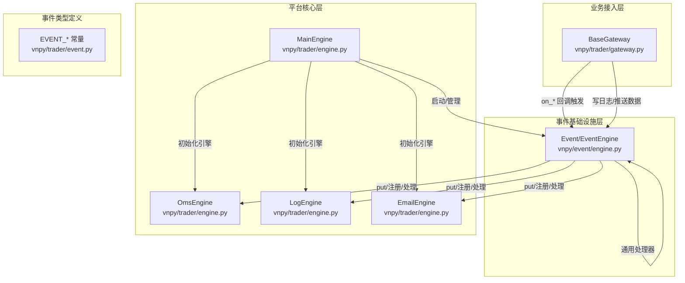
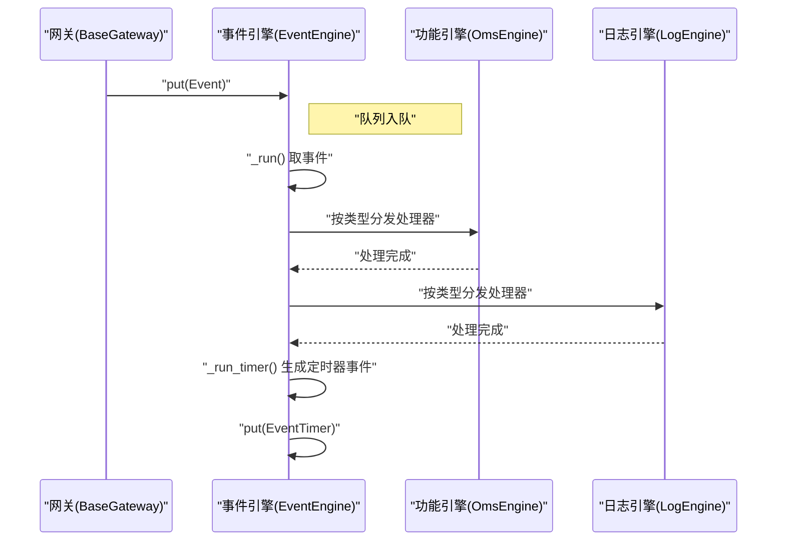
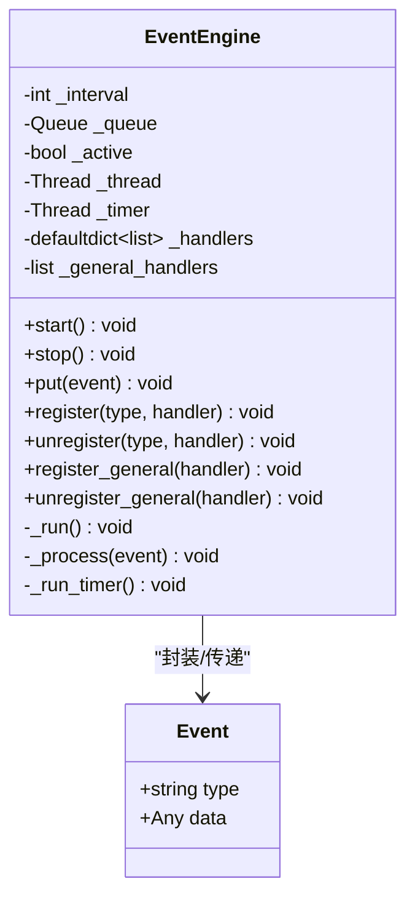
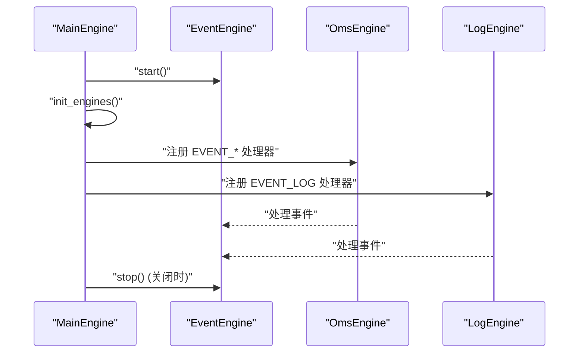
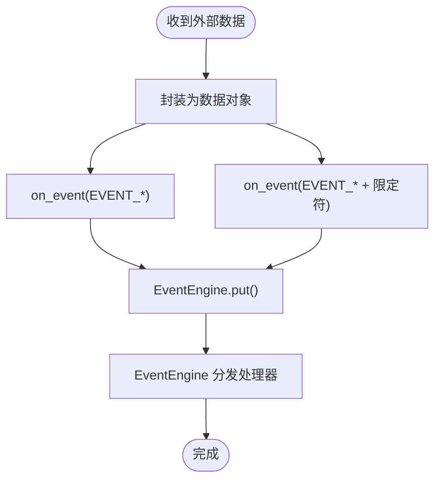
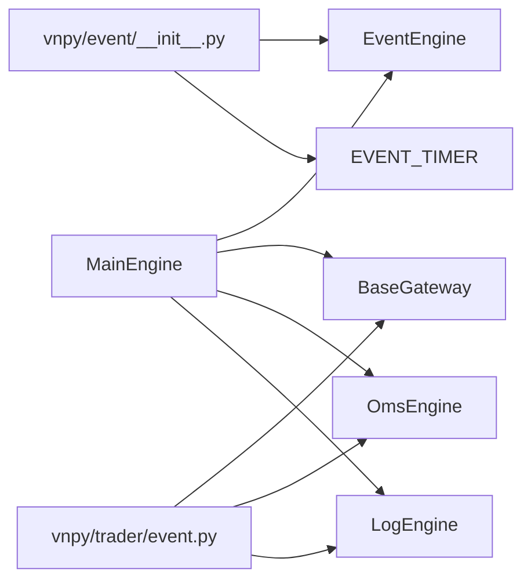

# 事件驱动集成

<cite>
**本文引用的文件列表**
- [vnpy/event/engine.py](file://vnpy/event/engine.py)
- [vnpy/event/__init__.py](file://vnpy/event/__init__.py)
- [vnpy/trader/event.py](file://vnpy/trader/event.py)
- [vnpy/trader/engine.py](file://vnpy/trader/engine.py)
- [vnpy/trader/gateway.py](file://vnpy/trader/gateway.py)
- [vnpy/trader/logger.py](file://vnpy/trader/logger.py)
- [vnpy/event/CLAUDE.md](file://vnpy/event/CLAUDE.md)
</cite>

## 目录
1. [引言](#引言)
2. [项目结构](#项目结构)
3. [核心组件](#核心组件)
4. [架构总览](#架构总览)
5. [详细组件分析](#详细组件分析)
6. [依赖关系分析](#依赖关系分析)
7. [性能考量](#性能考量)
8. [故障排查指南](#故障排查指南)
9. [结论](#结论)
10. [附录](#附录)

## 引言
本文件系统性解析 vnpy 主引擎与事件引擎（EventEngine）的集成架构，围绕事件发布-订阅模式、事件队列的线程安全设计、事件处理回调的注册与执行流程展开；同时阐明主引擎如何通过事件总线协调各网关与应用模块之间的通信，重点分析事件过滤策略、优先级调度机制与异常传播处理，并给出高并发场景下的事件流监控方案与性能调优建议。

## 项目结构
事件驱动体系由三层组成：
- 事件基础设施层：事件对象与事件引擎（vnpy/event）
- 平台核心层：主引擎与功能引擎（vnpy/trader/engine.py）
- 业务接入层：网关与应用（vnpy/trader/gateway.py、vnpy/trader/app.py）

下图展示事件驱动在平台中的位置与交互关系。

图表来源
- [vnpy/event/engine.py](file://vnpy/event/engine.py#L1-L146)
- [vnpy/trader/engine.py](file://vnpy/trader/engine.py#L73-L303)
- [vnpy/trader/gateway.py](file://vnpy/trader/gateway.py#L81-L159)
- [vnpy/trader/event.py](file://vnpy/trader/event.py#L1-L15)

章节来源
- [vnpy/event/engine.py](file://vnpy/event/engine.py#L1-L146)
- [vnpy/trader/engine.py](file://vnpy/trader/engine.py#L73-L303)
- [vnpy/trader/gateway.py](file://vnpy/trader/gateway.py#L81-L159)
- [vnpy/trader/event.py](file://vnpy/trader/event.py#L1-L15)

## 核心组件
- 事件对象 Event：包含事件类型与数据载体，作为事件总线的最小单元。
- 事件引擎 EventEngine：负责事件入队、分发、定时器生成与线程生命周期管理。
- 主引擎 MainEngine：持有并启动 EventEngine，统一管理网关、功能引擎与应用模块。
- 功能引擎 BaseEngine/OmsEngine/LogEngine/EmailEngine：订阅特定事件类型，完成业务处理。
- 网关 BaseGateway：从外部系统接收数据，封装为事件并通过 EventEngine 推送。

章节来源
- [vnpy/event/engine.py](file://vnpy/event/engine.py#L16-L146)
- [vnpy/trader/engine.py](file://vnpy/trader/engine.py#L51-L120)
- [vnpy/trader/gateway.py](file://vnpy/trader/gateway.py#L81-L159)

## 架构总览
事件驱动的核心在于“生产者-消费者”解耦：生产者（网关、引擎等）仅需调用事件引擎的入队接口；事件引擎在独立线程中从队列取事件并按类型分发给已注册的处理器，再统一触发通用处理器。定时器事件通过独立计时线程周期性产生，保证时间驱动能力。

图表来源
- [vnpy/trader/gateway.py](file://vnpy/trader/gateway.py#L86-L159)
- [vnpy/event/engine.py](file://vnpy/event/engine.py#L55-L88)
- [vnpy/trader/engine.py](file://vnpy/trader/engine.py#L339-L440)

## 详细组件分析

### 事件引擎 EventEngine
- 数据结构与复杂度
  - 事件队列：基于标准库队列，入队/出队均为 O(1)。
  - 处理器映射：按事件类型维护处理器列表，查找为 O(n)（n 为该类型处理器数量）。
  - 通用处理器：统一触发，额外开销为 O(m)（m 为通用处理器数量）。
- 线程安全设计
  - 入队/出队使用标准库队列，天然线程安全。
  - 控制标志位与 join 确保停止时序正确，避免资源泄漏。
- 发布-订阅机制
  - 注册：按事件类型注册处理器，重复注册去重。
  - 分发：先按类型分发，再统一触发通用处理器。
  - 取消：支持按类型或通用处理器取消注册。
- 定时器机制
  - 单独线程睡眠间隔后生成定时器事件，便于周期性任务。
- 异常传播
  - 文档明确：处理器异常不会中断引擎运行，但会阻断后续处理器执行（因当前实现为顺序执行）。建议在处理器内部捕获并记录异常，避免影响其他处理器。

图表来源
- [vnpy/event/engine.py](file://vnpy/event/engine.py#L16-L146)

章节来源
- [vnpy/event/engine.py](file://vnpy/event/engine.py#L42-L146)
- [vnpy/event/CLAUDE.md](file://vnpy/event/CLAUDE.md#L67-L119)

### 主引擎 MainEngine 与功能引擎
- 生命周期与初始化
  - MainEngine 在构造时创建并启动 EventEngine，随后初始化各类功能引擎（如 OmsEngine、LogEngine、EmailEngine），并将它们注册到事件总线上。
- 事件总线协调
  - 网关通过 EventEngine 将市场数据、订单回报、账户信息等事件广播至各功能引擎。
  - 日志事件通过 EventEngine 统一汇聚到 LogEngine，实现集中输出。
- 关闭流程
  - 关闭时先停止 EventEngine，再依次关闭各引擎与网关，确保有序退出。

图表来源
- [vnpy/trader/engine.py](file://vnpy/trader/engine.py#L73-L186)
- [vnpy/trader/engine.py](file://vnpy/trader/engine.py#L304-L372)

章节来源
- [vnpy/trader/engine.py](file://vnpy/trader/engine.py#L73-L186)
- [vnpy/trader/engine.py](file://vnpy/trader/engine.py#L304-L440)

### 网关与事件发布
- 网关职责
  - 从外部系统拉取/接收数据，封装为数据对象，再通过 on_* 方法转换为事件并入队。
  - 提供通用 on_event 方法，支持自定义事件类型。
- 事件过滤策略
  - 网关在推送时可按数据维度（如合约代码、账户号等）附加后缀，形成“主题化”的事件类型，实现细粒度过滤与定向订阅。
  - 示例：推送订单事件时，同时推送全局订单事件与按订单编号的定向事件，订阅方可选择订阅全局或定向事件。
- 事件优先级
  - 当前实现未内置优先级队列；可通过不同事件类型或多个事件引擎实现优先级分流。

图表来源
- [vnpy/trader/gateway.py](file://vnpy/trader/gateway.py#L86-L159)

章节来源
- [vnpy/trader/gateway.py](file://vnpy/trader/gateway.py#L86-L159)

### 事件类型与过滤
- 事件类型定义
  - 平台定义了 Tick、Trade、Order、Position、Account、Contract、Quote、Log 等事件类型常量，用于统一标识业务事件。
- 过滤策略
  - 通过事件类型前缀或后缀实现过滤；订阅方可只注册所需类型或定向事件，减少无关处理。
- 优先级调度
  - 未内置优先级；建议通过事件类型区分（如高频事件与低频事件）或拆分多事件引擎实现优先级隔离。

章节来源
- [vnpy/trader/event.py](file://vnpy/trader/event.py#L1-L15)

### 日志与异常传播
- 日志事件
  - MainEngine 写日志时构造 LogData 并通过 EventEngine 推送，LogEngine 注册 EVENT_LOG 处理器统一输出。
- 异常传播
  - EventEngine 的处理器顺序执行，若某处理器抛出异常，会影响后续处理器执行；建议在处理器内捕获并记录异常，避免中断事件总线。

章节来源
- [vnpy/trader/engine.py](file://vnpy/trader/engine.py#L160-L167)
- [vnpy/trader/engine.py](file://vnpy/trader/engine.py#L304-L337)
- [vnpy/event/CLAUDE.md](file://vnpy/event/CLAUDE.md#L67-L119)

## 依赖关系分析
- 模块导出
  - 事件模块导出 Event、EventEngine、EVENT_TIMER，供平台其他模块直接使用。
- 事件类型导出
  - 平台事件类型集中定义于 trader/event.py，供网关与引擎共享。
- 主引擎依赖
  - MainEngine 依赖 EventEngine 与各功能引擎，负责装配与生命周期管理。
- 网关依赖
  - BaseGateway 依赖 EventEngine 与事件类型常量，负责事件生产。

图表来源
- [vnpy/event/__init__.py](file://vnpy/event/__init__.py#L1-L8)
- [vnpy/trader/event.py](file://vnpy/trader/event.py#L1-L15)
- [vnpy/trader/engine.py](file://vnpy/trader/engine.py#L73-L186)
- [vnpy/trader/gateway.py](file://vnpy/trader/gateway.py#L81-L159)

章节来源
- [vnpy/event/__init__.py](file://vnpy/event/__init__.py#L1-L8)
- [vnpy/trader/event.py](file://vnpy/trader/event.py#L1-L15)
- [vnpy/trader/engine.py](file://vnpy/trader/engine.py#L73-L186)
- [vnpy/trader/gateway.py](file://vnpy/trader/gateway.py#L81-L159)

## 性能考量
- 事件处理顺序与吞吐
  - 处理器顺序执行，避免锁竞争，但单线程处理可能成为瓶颈。建议：
    - 将耗时逻辑移出处理器，采用异步或后台线程处理。
    - 使用线程池或消息队列承接长耗时任务。
- 事件类型与过滤
  - 通过定向事件类型减少无关处理器执行，提升吞吐。
- 定时器精度
  - 定时器基于 sleep，精度受系统调度影响；对高精度需求可考虑更高频率的定时器或外部调度器。
- 日志与异常
  - 日志输出建议异步化，避免阻塞事件处理线程。
  - 处理器内部捕获异常并记录，防止异常传播影响总线稳定性。

章节来源
- [vnpy/event/CLAUDE.md](file://vnpy/event/CLAUDE.md#L67-L119)
- [vnpy/trader/engine.py](file://vnpy/trader/engine.py#L570-L634)

## 故障排查指南
- 事件未到达
  - 检查是否正确注册处理器；确认事件类型是否匹配。
  - 确认 EventEngine 是否已启动且未被提前停止。
- 处理器异常导致后续处理器不执行
  - 在处理器内部捕获异常并记录，避免异常传播。
- 日志缺失
  - 确认 LogEngine 已注册 EVENT_LOG 处理器，且日志级别与输出配置正确。
- 关闭时序问题
  - 关闭流程应先停止 EventEngine，再关闭引擎与网关，避免新事件进入。

章节来源
- [vnpy/trader/engine.py](file://vnpy/trader/engine.py#L289-L303)
- [vnpy/trader/engine.py](file://vnpy/trader/engine.py#L304-L337)
- [vnpy/trader/logger.py](file://vnpy/trader/logger.py#L1-L56)

## 结论
vnpy 的事件驱动架构以 EventEngine 为核心，通过发布-订阅模式实现网关与功能引擎的松耦合协作。事件队列的线程安全与处理器顺序执行简化了并发控制，但在高并发场景下需通过异步化与定向过滤等手段提升吞吐与稳定性。通过合理的事件类型设计、异常处理与关闭流程，可在保证一致性的同时满足高性能要求。

## 附录
- 事件类型一览
  - Tick、Trade、Order、Position、Account、Contract、Quote、Log、Timer
- 常用路径参考
  - 事件引擎类与方法：[vnpy/event/engine.py](file://vnpy/event/engine.py#L33-L146)
  - 主引擎与引擎注册：[vnpy/trader/engine.py](file://vnpy/trader/engine.py#L73-L186)
  - 网关事件发布：[vnpy/trader/gateway.py](file://vnpy/trader/gateway.py#L86-L159)
  - 事件类型常量：[vnpy/trader/event.py](file://vnpy/trader/event.py#L1-L15)
  - 日志引擎与日志输出：[vnpy/trader/engine.py](file://vnpy/trader/engine.py#L304-L337), [vnpy/trader/logger.py](file://vnpy/trader/logger.py#L1-L56)