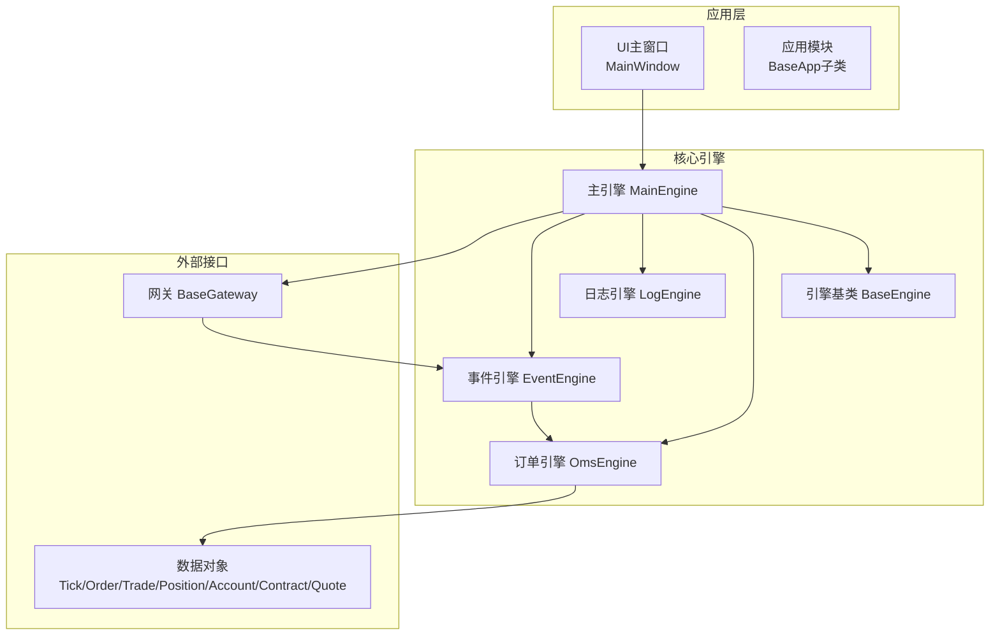
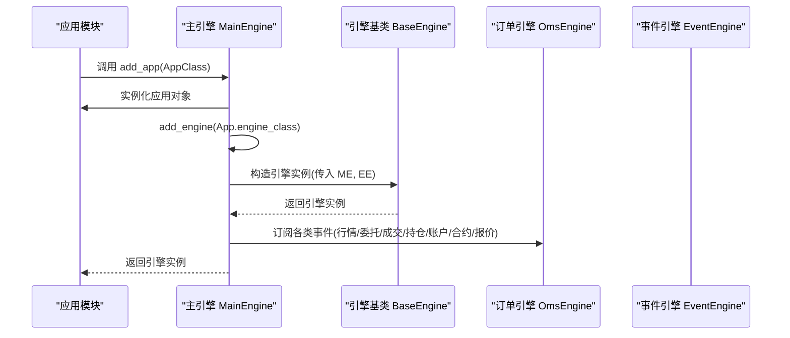
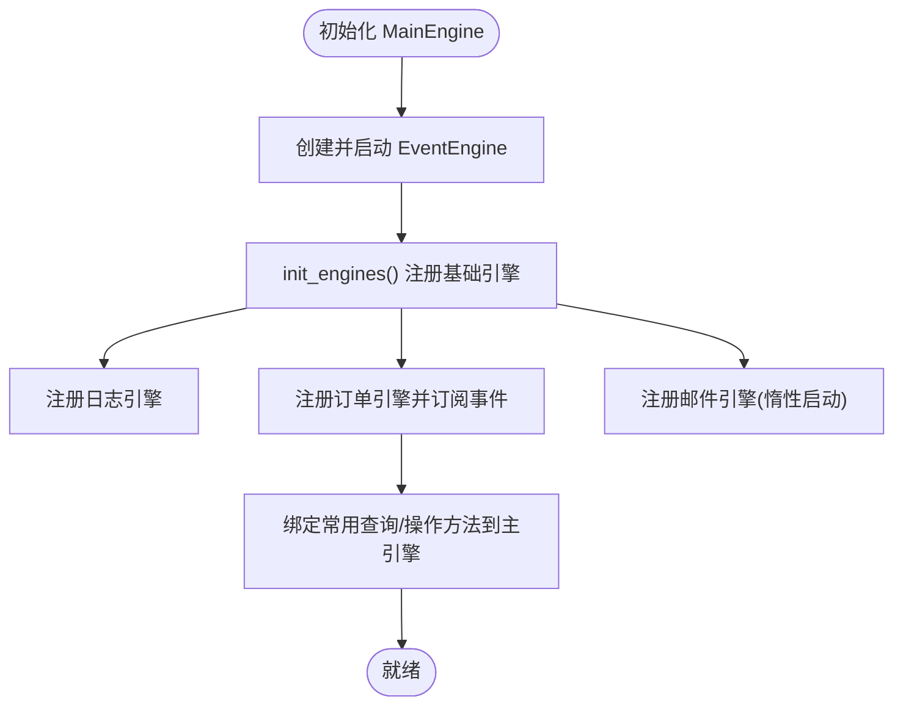
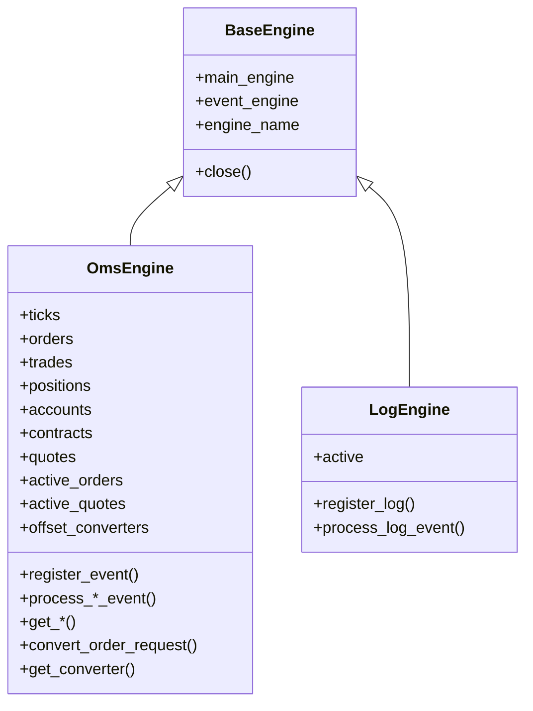
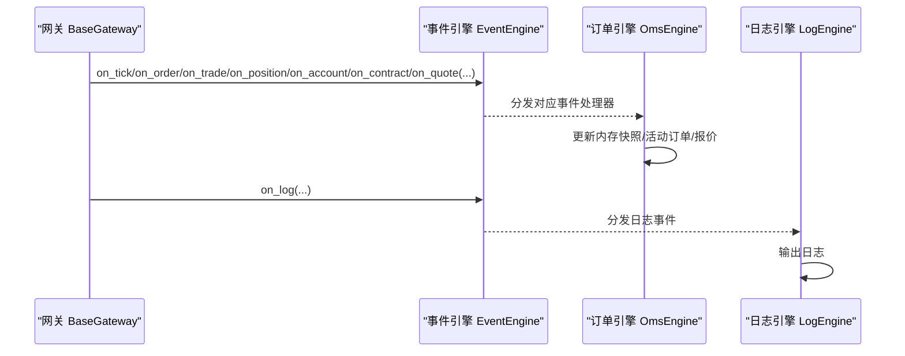
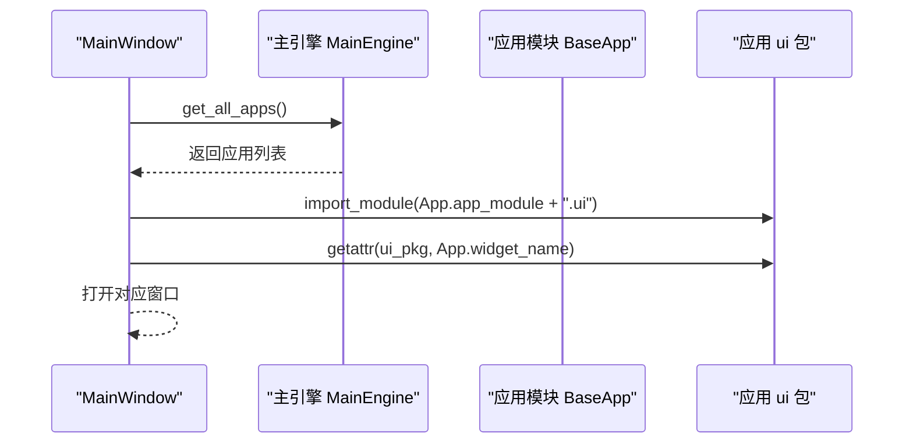
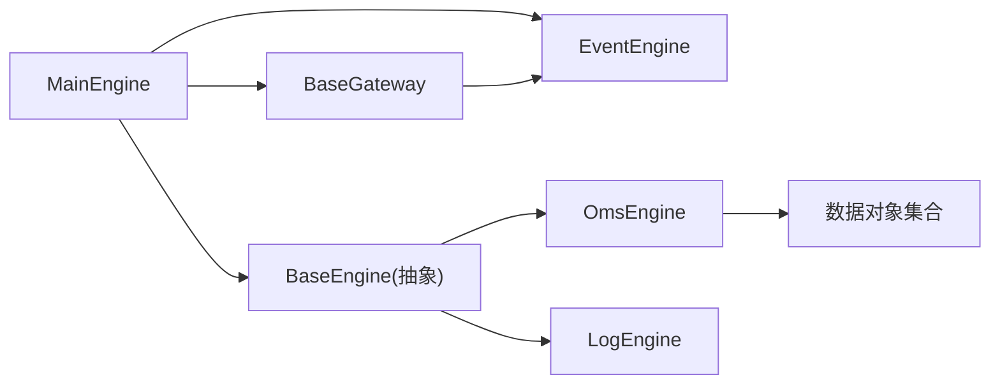

# 应用模块管理

<cite>
**本文引用的文件**
- [vnpy/trader/engine.py](file://vnpy/trader/engine.py)
- [vnpy/trader/app.py](file://vnpy/trader/app.py)
- [vnpy/event/engine.py](file://vnpy/event/engine.py)
- [vnpy/trader/gateway.py](file://vnpy/trader/gateway.py)
- [vnpy/trader/object.py](file://vnpy/trader/object.py)
- [vnpy/trader/ui/mainwindow.py](file://vnpy/trader/ui/mainwindow.py)
- [examples/veighna_trader/run.py](file://examples/veighna_trader/run.py)
</cite>

## 目录
1. [引言](#引言)
2. [项目结构](#项目结构)
3. [核心组件](#核心组件)
4. [架构总览](#架构总览)
5. [详细组件分析](#详细组件分析)
6. [依赖分析](#依赖分析)
7. [性能考量](#性能考量)
8. [故障排查指南](#故障排查指南)
9. [结论](#结论)
10. [附录](#附录)

## 引言
本文件系统性阐述主引擎对功能应用（App）的管理机制，围绕 add_app、init_engines、start_engine（在当前代码中体现为 MainEngine 的初始化流程）等关键方法展开，解释应用模块的加载顺序、依赖关系处理、初始化状态机设计以及运行时控制逻辑。同时，说明应用引擎（Engine）的创建过程与事件订阅机制，展示如何通过 get_engine 获取特定功能引擎实例，并给出应用模块热插拔与动态加载的最佳实践建议。

## 项目结构
从应用模块管理的角度，核心代码集中在以下模块：
- 主引擎与引擎基类：vnpy/trader/engine.py
- 应用抽象定义：vnpy/trader/app.py
- 事件驱动引擎：vnpy/event/engine.py
- 网关抽象与事件推送：vnpy/trader/gateway.py
- 通用数据结构：vnpy/trader/object.py
- UI菜单与应用加载入口：vnpy/trader/ui/mainwindow.py
- 示例启动脚本：examples/veighna_trader/run.py

图表来源
- [vnpy/trader/engine.py](file://vnpy/trader/engine.py#L73-L184)
- [vnpy/event/engine.py](file://vnpy/event/engine.py#L33-L146)
- [vnpy/trader/gateway.py](file://vnpy/trader/gateway.py#L33-L160)
- [vnpy/trader/object.py](file://vnpy/trader/object.py#L14-L230)
- [vnpy/trader/ui/mainwindow.py](file://vnpy/trader/ui/mainwindow.py#L100-L140)

章节来源
- [vnpy/trader/engine.py](file://vnpy/trader/engine.py#L73-L184)
- [vnpy/trader/app.py](file://vnpy/trader/app.py#L10-L22)
- [vnpy/event/engine.py](file://vnpy/event/engine.py#L33-L146)
- [vnpy/trader/gateway.py](file://vnpy/trader/gateway.py#L33-L160)
- [vnpy/trader/object.py](file://vnpy/trader/object.py#L14-L230)
- [vnpy/trader/ui/mainwindow.py](file://vnpy/trader/ui/mainwindow.py#L100-L140)
- [examples/veighna_trader/run.py](file://examples/veighna_trader/run.py#L39-L87)

## 核心组件
- 主引擎 MainEngine
  - 负责事件引擎初始化与启动、网关注册、应用注册与引擎创建、全局日志与查询接口转发。
  - 关键方法：add_app、init_engines、get_engine、write_log、close。
- 引擎基类 BaseEngine
  - 定义引擎抽象接口，包含 main_engine、event_engine、engine_name 字段。
- 订单引擎 OmsEngine
  - 订阅并聚合市场数据事件，维护内存快照与活动订单/报价集合，提供查询与转换能力。
- 日志引擎 LogEngine
  - 订阅日志事件，将日志输出到控制台或文件。
- 事件引擎 EventEngine
  - 事件队列、处理器注册/注销、定时器事件生成。
- 网关 BaseGateway
  - 将底层接口数据封装为事件并推送到事件引擎，提供连接、订阅、下单、撤单等接口。
- 应用抽象 BaseApp
  - 描述应用元信息（名称、模块名、路径、显示名、引擎类、UI部件名、图标名）。
- UI主窗口 MainWindow
  - 构建菜单项，动态导入应用模块UI并打开对应窗口。

章节来源
- [vnpy/trader/engine.py](file://vnpy/trader/engine.py#L51-L184)
- [vnpy/event/engine.py](file://vnpy/event/engine.py#L33-L146)
- [vnpy/trader/gateway.py](file://vnpy/trader/gateway.py#L33-L160)
- [vnpy/trader/app.py](file://vnpy/trader/app.py#L10-L22)
- [vnpy/trader/ui/mainwindow.py](file://vnpy/trader/ui/mainwindow.py#L100-L140)

## 架构总览
主引擎在初始化时创建并启动事件引擎，随后初始化各功能引擎（如日志引擎、订单引擎），并将常用查询与操作方法绑定到主引擎实例上，供其他模块直接调用。应用模块通过 add_app 注册，主引擎会实例化应用对象并为其创建对应的引擎类实例，同时将引擎名映射到引擎字典中，便于后续通过 get_engine 获取。

图表来源
- [vnpy/trader/engine.py](file://vnpy/trader/engine.py#L120-L159)
- [vnpy/trader/engine.py](file://vnpy/trader/engine.py#L339-L372)

章节来源
- [vnpy/trader/engine.py](file://vnpy/trader/engine.py#L120-L159)
- [vnpy/trader/engine.py](file://vnpy/trader/engine.py#L339-L372)

## 详细组件分析

### 主引擎 MainEngine 的应用管理
- add_app(app_class)
  - 实例化应用对象并登记到 apps 字典。
  - 调用 add_engine(app.engine_class) 创建对应引擎实例并登记到 engines 字典。
  - 返回创建的引擎实例，供上层使用。
- init_engines()
  - 在主引擎初始化时调用，注册并启动基础引擎：
    - 日志引擎：注册日志事件处理器。
    - 订单引擎：注册各类事件处理器，建立数据快照与活动订单/报价集合。
    - 邮件引擎：延迟启动，按需发送邮件。
  - 将常用查询与操作方法（如 get_tick/get_order/get_position 等）绑定到主引擎实例，简化调用。
- get_engine(engine_name)
  - 通过引擎名从 engines 字典获取引擎实例，未找到时写入日志。
- close()
  - 停止事件引擎，依次关闭各引擎与网关，保证有序退出。

图表来源
- [vnpy/trader/engine.py](file://vnpy/trader/engine.py#L78-L159)

章节来源
- [vnpy/trader/engine.py](file://vnpy/trader/engine.py#L78-L159)
- [vnpy/trader/engine.py](file://vnpy/trader/engine.py#L177-L184)

### 引擎基类 BaseEngine 与事件订阅
- BaseEngine
  - 统一持有 main_engine、event_engine、engine_name。
  - 提供 close 抽象方法，供子类覆盖。
- 订单引擎 OmsEngine
  - 在 __init__ 中调用 register_event() 订阅 EVENT_TICK、EVENT_ORDER、EVENT_TRADE、EVENT_POSITION、EVENT_ACCOUNT、EVENT_CONTRACT、EVENT_QUOTE。
  - 事件处理器将数据写入内存快照，并维护活动订单/报价集合。
  - 提供 get_* 查询方法与 convert_order_request 等转换能力。
- 日志引擎 LogEngine
  - 订阅 EVENT_LOG，按级别输出日志。

图表来源
- [vnpy/trader/engine.py](file://vnpy/trader/engine.py#L51-L119)
- [vnpy/trader/engine.py](file://vnpy/trader/engine.py#L339-L567)

章节来源
- [vnpy/trader/engine.py](file://vnpy/trader/engine.py#L51-L119)
- [vnpy/trader/engine.py](file://vnpy/trader/engine.py#L339-L567)

### 事件驱动与数据流
- 事件引擎 EventEngine
  - 提供 put、register、unregister、register_general、unregister_general、start、stop 等接口。
  - 内部线程循环从队列取出事件并分发给已注册处理器，同时周期性产生定时事件。
- 网关 BaseGateway
  - 将底层数据封装为事件并通过 on_event/on_* 推送，支持按符号/订单号等细分事件类型。
- 数据对象
  - TickData、OrderData、TradeData、PositionData、AccountData、ContractData、QuoteData 等，统一携带 gateway_name 与 vt_* 标识，便于跨引擎识别与关联。

图表来源
- [vnpy/trader/gateway.py](file://vnpy/trader/gateway.py#L86-L160)
- [vnpy/event/engine.py](file://vnpy/event/engine.py#L55-L146)
- [vnpy/trader/engine.py](file://vnpy/trader/engine.py#L339-L440)

章节来源
- [vnpy/trader/gateway.py](file://vnpy/trader/gateway.py#L86-L160)
- [vnpy/event/engine.py](file://vnpy/event/engine.py#L55-L146)
- [vnpy/trader/object.py](file://vnpy/trader/object.py#L14-L230)

### UI菜单与应用加载入口
- MainWindow
  - 从主引擎获取所有应用列表，动态导入应用模块的 ui 包，反射获取 widget_name 对应的窗口类，点击菜单项打开对应功能面板。
- 示例启动脚本
  - 在创建 MainEngine 后，逐个调用 main_engine.add_app(...) 注册应用模块。

图表来源
- [vnpy/trader/ui/mainwindow.py](file://vnpy/trader/ui/mainwindow.py#L120-L140)
- [examples/veighna_trader/run.py](file://examples/veighna_trader/run.py#L39-L87)

章节来源
- [vnpy/trader/ui/mainwindow.py](file://vnpy/trader/ui/mainwindow.py#L120-L140)
- [examples/veighna_trader/run.py](file://examples/veighna_trader/run.py#L39-L87)

## 依赖分析
- 模块耦合
  - MainEngine 依赖 EventEngine、BaseGateway、BaseApp、BaseEngine 子类（如 OmsEngine、LogEngine）。
  - OmsEngine 依赖 EventEngine 与数据对象集合。
  - Gateway 依赖 EventEngine 与数据对象。
  - UI 依赖 MainEngine 与应用模块的 ui 包。
- 依赖链
  - 应用模块通过 BaseApp 暴露 engine_class，MainEngine 通过 add_engine(app.engine_class) 创建引擎实例。
  - 引擎实例通过 event_engine.register 订阅事件，形成“事件驱动”的解耦数据流。
- 循环依赖
  - 代码层面未见循环依赖迹象；MainEngine 作为中枢协调者，避免了双向强依赖。

图表来源
- [vnpy/trader/engine.py](file://vnpy/trader/engine.py#L73-L184)
- [vnpy/trader/gateway.py](file://vnpy/trader/gateway.py#L33-L160)
- [vnpy/trader/object.py](file://vnpy/trader/object.py#L14-L230)

章节来源
- [vnpy/trader/engine.py](file://vnpy/trader/engine.py#L73-L184)
- [vnpy/trader/gateway.py](file://vnpy/trader/gateway.py#L33-L160)
- [vnpy/trader/object.py](file://vnpy/trader/object.py#L14-L230)

## 性能考量
- 事件引擎采用队列+双线程模型（事件处理线程与定时器线程），避免阻塞。
- OmsEngine 使用字典存储数据快照，查询复杂度近似 O(1)，但需关注内存增长与清理策略。
- 网关回调要求非阻塞与线程安全，避免影响事件引擎吞吐。
- 邮件引擎惰性启动，首次发送邮件时才开启线程与队列，降低常驻开销。

## 故障排查指南
- 找不到引擎或网关
  - get_engine/get_gateway 未找到时会写入日志，检查应用是否正确注册与命名。
- 事件未到达
  - 确认引擎已通过 event_engine.register 订阅相应事件类型。
  - 检查事件类型字符串是否匹配（如按 vt_symbol 的细分事件）。
- 日志不显示
  - LogEngine.active 是否启用；EVENT_LOG 是否被注册。
- 网关连接异常
  - 网关 connect/subscribe/send_order 等方法是否正确实现；底层接口是否可达。
- 退出异常
  - MainEngine.close 是否被调用；确保事件引擎先停止，再关闭引擎与网关。

章节来源
- [vnpy/trader/engine.py](file://vnpy/trader/engine.py#L160-L184)
- [vnpy/trader/engine.py](file://vnpy/trader/engine.py#L289-L303)
- [vnpy/trader/engine.py](file://vnpy/trader/engine.py#L305-L337)

## 结论
主引擎通过清晰的职责划分与事件驱动架构，实现了应用模块的可插拔管理：应用通过 BaseApp 描述自身元信息，主引擎在 add_app 时创建对应引擎实例并注册事件订阅；init_engines 完成基础引擎初始化与常用 API 绑定；get_engine 提供按名获取引擎的能力。UI 层通过动态导入应用 ui 包实现菜单项与窗口的自动化装配。整体设计具备良好的扩展性与运行时控制能力。

## 附录

### 关键方法工作原理与最佳实践
- add_app(app_class)
  - 工作原理：实例化应用对象并登记；创建 app.engine_class 对应引擎实例并登记；返回引擎实例。
  - 最佳实践：确保 app.engine_class 正确指向应用功能引擎类；在应用初始化阶段尽早调用。
- init_engines()
  - 工作原理：注册日志引擎与订单引擎，分别订阅 EVENT_LOG 与各类市场事件；将常用查询方法绑定到主引擎。
  - 最佳实践：新增引擎时在 init_engines 中注册；注意事件订阅顺序与幂等性。
- get_engine(engine_name)
  - 工作原理：从 engines 字典按名取回引擎实例；未找到时写日志。
  - 最佳实践：确保引擎名唯一且与 add_engine 时一致；避免在引擎关闭后继续使用。
- start_engine
  - 当前代码中体现为 MainEngine.__init__ 中启动 EventEngine 并初始化引擎；如需显式启动其他引擎，可在应用引擎内部实现 start 方法并在需要时调用。
- 应用模块热插拔与动态加载
  - 现状：主引擎提供 add_app 与 get_engine，但未提供 remove_app 或卸载引擎的 API。
  - 建议方案：
    - 在应用引擎内部实现生命周期管理（start/stop/close），在 UI 层提供“停用/启用”按钮，调用引擎的 stop/close 并从引擎字典移除。
    - 对于 UI 窗口，MainWindow 已支持动态打开/关闭窗口，可结合应用引擎状态进行联动。
    - 对于网关，可通过 add_gateway/remove_gateway 控制底层连接，配合引擎层的订阅与清理。
  - 动态加载最佳实践：
    - 使用 importlib.import_module 动态导入应用模块的 ui 包，反射获取窗口类。
    - 在应用引擎中集中管理订阅与资源释放，避免泄漏。
    - 对于需要持久化的状态，建议在应用引擎中提供 save/load 接口并与 UI 设置联动。

章节来源
- [vnpy/trader/engine.py](file://vnpy/trader/engine.py#L120-L159)
- [vnpy/trader/engine.py](file://vnpy/trader/engine.py#L177-L184)
- [vnpy/trader/ui/mainwindow.py](file://vnpy/trader/ui/mainwindow.py#L120-L140)
- [examples/veighna_trader/run.py](file://examples/veighna_trader/run.py#L39-L87)