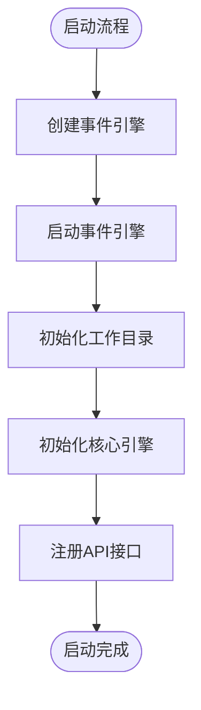
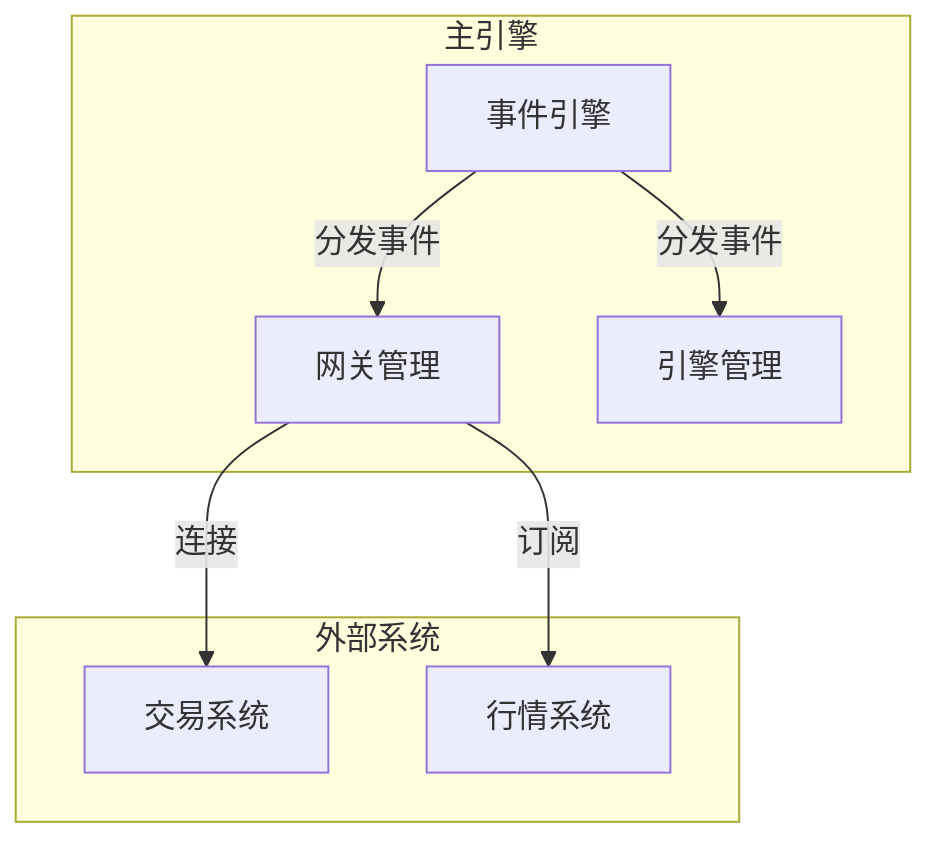
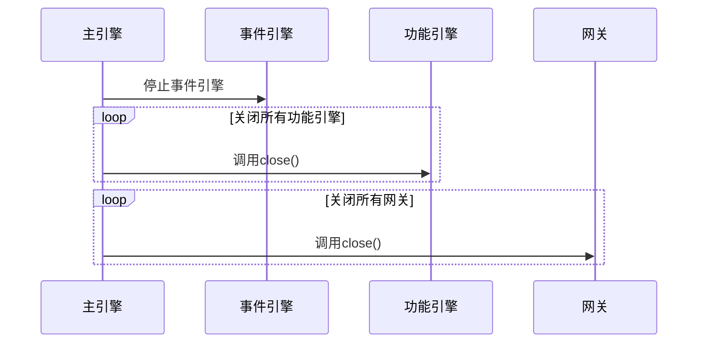
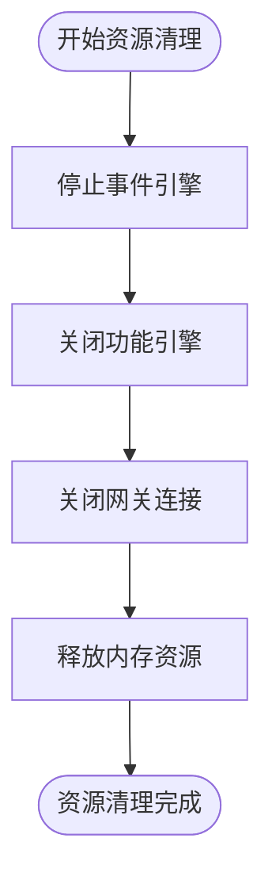
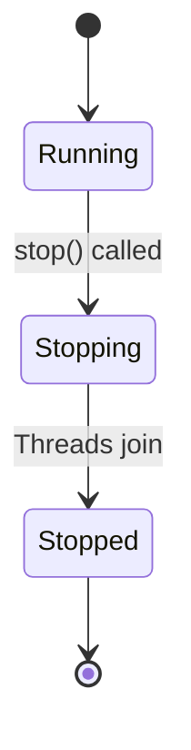
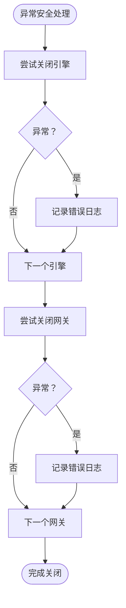
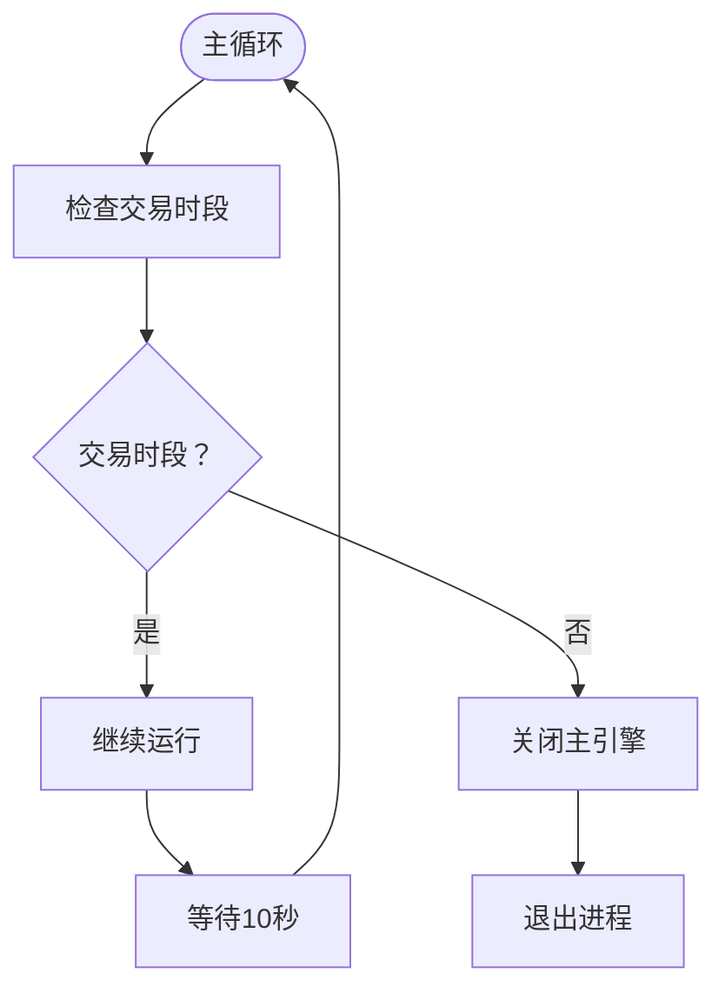
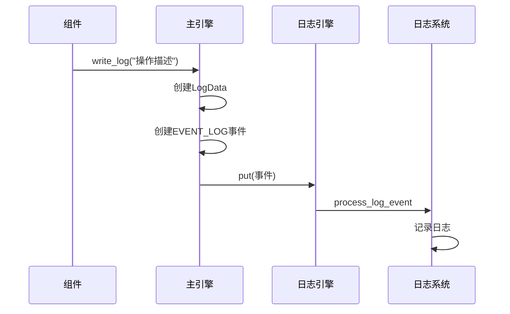
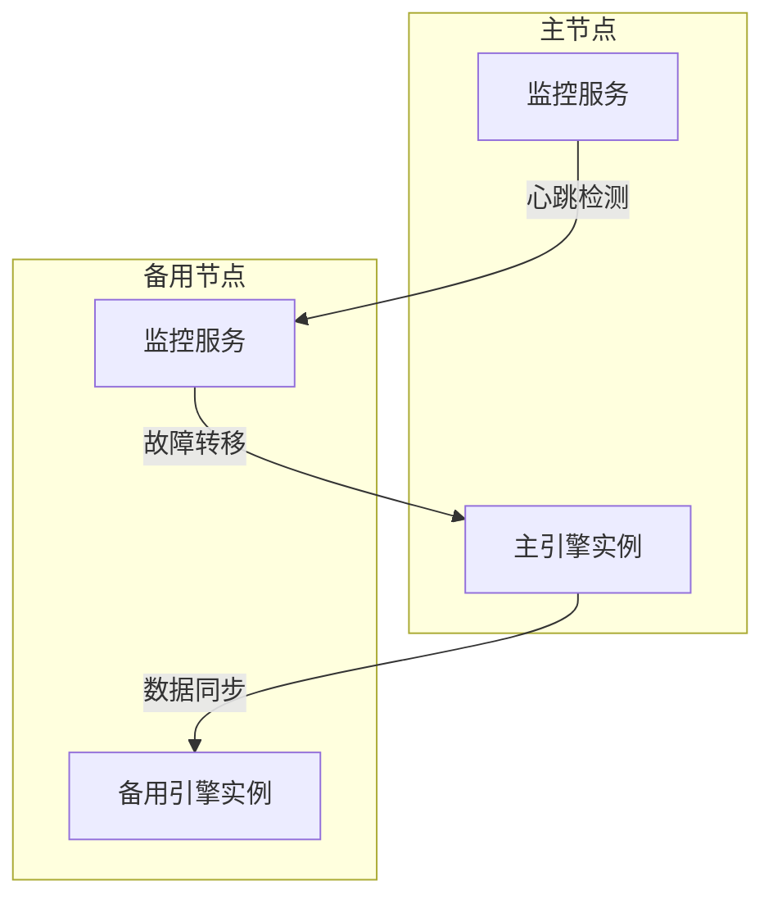
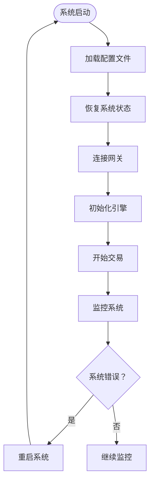

# 生命周期管理

<cite>
**本文档引用的文件**   
- [main_engine.py](file://vnpy/trader/engine.py)
- [event_engine.py](file://vnpy/event/engine.py)
- [gateway.py](file://vnpy/trader/gateway.py)
- [mainwindow.py](file://vnpy/trader/ui/mainwindow.py)
- [run.py](file://examples/no_ui/run.py)
- [run.py](file://examples/veighna_trader/run.py)
</cite>

## 目录
1. [生命周期概述](#生命周期概述)
2. [启动流程](#启动流程)
3. [运行状态维护](#运行状态维护)
4. [优雅关闭机制](#优雅关闭机制)
5. [资源清理与连接断开](#资源清理与连接断开)
6. [线程终止策略](#线程终止策略)
7. [异常安全保证](#异常安全保证)
8. [超时处理与强制终止](#超时处理与强制终止)
9. [日志记录策略](#日志记录策略)
10. [高可用部署实践](#高可用部署实践)
11. [故障恢复方案](#故障恢复方案)

## 生命周期概述

主引擎的生命周期管理是VeighNa框架的核心功能之一，涵盖了从启动、运行到关闭的完整过程。主引擎作为交易系统的中枢，负责协调各个组件的运行，包括事件引擎、网关、应用引擎等。其生命周期管理确保了系统在各种状态下的稳定性和可靠性。

**Section sources**
- [main_engine.py](file://vnpy/trader/engine.py#L73-L93)

## 启动流程

主引擎的启动流程始于`MainEngine`类的初始化。在初始化过程中，首先创建或接收一个事件引擎实例，并启动事件引擎的事件处理线程和定时器线程。随后，主引擎会初始化工作目录，并调用`init_engines`方法来初始化日志引擎、订单管理系统引擎和邮件引擎等核心功能引擎。

**Diagram sources **
- [main_engine.py](file://vnpy/trader/engine.py#L78-L92)

**Section sources**
- [main_engine.py](file://vnpy/trader/engine.py#L78-L93)

## 运行状态维护

在运行期间，主引擎通过事件引擎维持系统的正常运作。事件引擎负责分发各种事件，如行情数据、订单状态更新、成交信息等。主引擎还负责管理网关连接，处理来自不同交易接口的连接请求，并协调各个应用引擎的运行。

**Diagram sources **
- [main_engine.py](file://vnpy/trader/engine.py#L84-L85)
- [event_engine.py](file://vnpy/event/engine.py#L93-L95)

**Section sources**
- [main_engine.py](file://vnpy/trader/engine.py#L84-L85)
- [event_engine.py](file://vnpy/event/engine.py#L93-L95)

## 优雅关闭机制

主引擎的优雅关闭机制通过`close`方法实现。关闭过程首先停止事件引擎，防止新的定时器事件产生。然后依次关闭所有功能引擎和网关连接，确保所有资源得到正确释放。这种有序的关闭顺序保证了系统状态的一致性。

**Diagram sources **
- [main_engine.py](file://vnpy/trader/engine.py#L289-L302)

**Section sources**
- [main_engine.py](file://vnpy/trader/engine.py#L289-L302)

## 资源清理与连接断开

在关闭过程中，主引擎会系统性地清理所有资源。这包括停止事件引擎的线程、关闭所有功能引擎的连接、断开与交易系统的网关连接等。资源清理的顺序至关重要，确保了依赖关系的正确处理。

**Diagram sources **
- [main_engine.py](file://vnpy/trader/engine.py#L294-L302)

**Section sources**
- [main_engine.py](file://vnpy/trader/engine.py#L294-L302)

## 线程终止策略

主引擎采用协作式线程终止策略。事件引擎的线程通过设置`_active`标志位来控制线程的运行状态。当`stop`方法被调用时，事件引擎会将`_active`设置为`False`，使事件处理线程和定时器线程在下一次循环时自然退出。这种策略避免了强制终止线程可能带来的资源泄漏问题。

**Diagram sources **
- [event_engine.py](file://vnpy/event/engine.py#L97-L103)

**Section sources**
- [event_engine.py](file://vnpy/event/engine.py#L97-L103)

## 异常安全保证

主引擎的设计充分考虑了异常安全。在关闭过程中，即使某个组件的关闭操作抛出异常，系统也会继续尝试关闭其他组件，确保尽可能多的资源得到释放。同时，所有关键操作都包含适当的异常处理机制，防止异常传播导致系统崩溃。

**Diagram sources **
- [main_engine.py](file://vnpy/trader/engine.py#L297-L301)

**Section sources**
- [main_engine.py](file://vnpy/trader/engine.py#L297-L301)

## 超时处理与强制终止

虽然主引擎本身没有显式的超时机制，但通过事件引擎的定时器功能可以实现超时控制。在生产环境中，可以通过外部监控系统实现超时检测和强制终止。例如，在`no_ui`示例中，通过检查交易时段来决定是否关闭主引擎。

**Diagram sources **
- [run.py](file://examples/no_ui/run.py#L87-L94)

**Section sources**
- [run.py](file://examples/no_ui/run.py#L87-L94)

## 日志记录策略

主引擎通过日志引擎实现统一的日志记录。所有组件在执行关键操作时都会调用`write_log`方法，将日志事件发送到事件引擎。日志记录包含操作类型、操作对象和操作结果等信息，为系统监控和故障排查提供了重要依据。

**Diagram sources **
- [main_engine.py](file://vnpy/trader/engine.py#L160-L166)
- [main_engine.py](file://vnpy/trader/engine.py#L304-L333)

**Section sources**
- [main_engine.py](file://vnpy/trader/engine.py#L160-L166)
- [main_engine.py](file://vnpy/trader/engine.py#L304-L333)

## 高可用部署实践

在生产环境中，主引擎的高可用部署通常采用主备模式或集群模式。通过`no_ui`示例中的守护进程模式，可以实现自动重启和故障恢复。此外，还可以结合外部监控系统，实现健康检查、负载均衡和故障转移等功能。

**Diagram sources **
- [run.py](file://examples/no_ui/run.py#L97-L124)

**Section sources**
- [run.py](file://examples/no_ui/run.py#L97-L124)

## 故障恢复方案

故障恢复方案包括自动重启、状态恢复和数据一致性保证。在`no_ui`示例中，父进程负责监控子进程的运行状态，并在非交易时段自动重启子进程。对于状态恢复，系统通过持久化存储关键数据，确保重启后能够恢复到一致的状态。

**Diagram sources **
- [run.py](file://examples/no_ui/run.py#L56-L94)
- [mainwindow.py](file://vnpy/trader/ui/mainwindow.py#L271)

**Section sources**
- [run.py](file://examples/no_ui/run.py#L56-L94)
- [mainwindow.py](file://vnpy/trader/ui/mainwindow.py#L271)