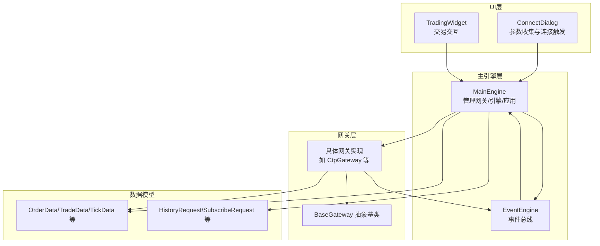
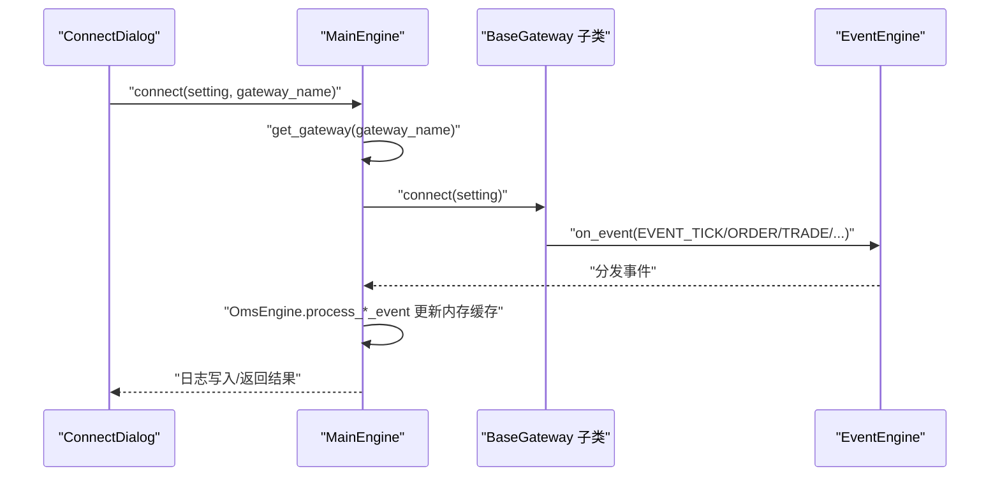
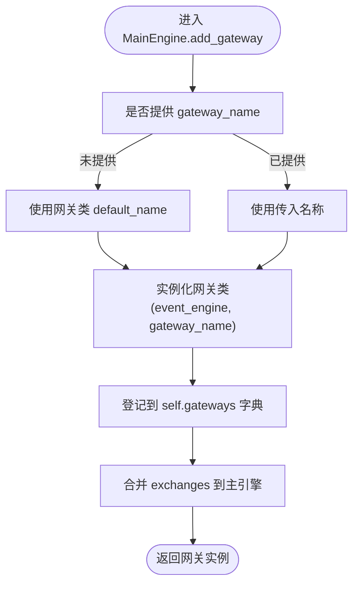
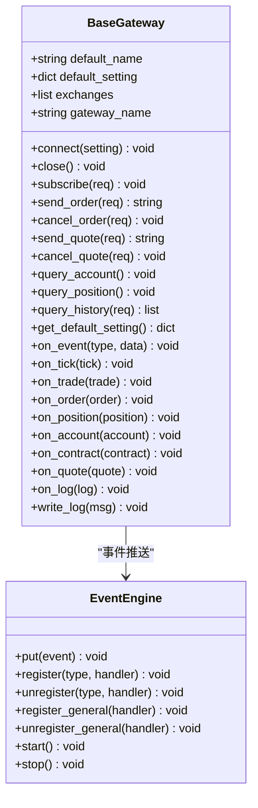
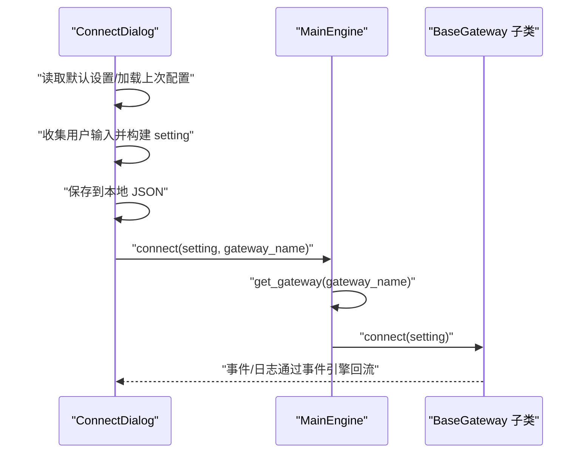
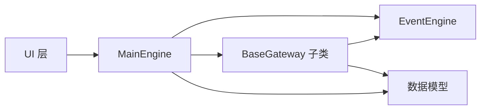

# 网关管理机制

<cite>
**本文引用的文件**
- [vnpy/trader/engine.py](file://vnpy/trader/engine.py)
- [vnpy/trader/gateway.py](file://vnpy/trader/gateway.py)
- [vnpy/event/engine.py](file://vnpy/event/engine.py)
- [vnpy/trader/ui/widget.py](file://vnpy/trader/ui/widget.py)
- [vnpy/trader/object.py](file://vnpy/trader/object.py)
- [docs/community/info/gateway.md](file://docs/community/info/gateway.md)
</cite>

## 目录
1. [引言](#引言)
2. [项目结构](#项目结构)
3. [核心组件](#核心组件)
4. [架构总览](#架构总览)
5. [详细组件分析](#详细组件分析)
6. [依赖关系分析](#依赖关系分析)
7. [性能考量](#性能考量)
8. [故障排查指南](#故障排查指南)
9. [结论](#结论)
10. [附录](#附录)

## 引言
本文围绕主引擎对交易网关（Gateway）的全生命周期管理展开，重点解析以下方面：
- add_gateway 注册流程与组件注入机制
- connect 连接与 close 关闭流程
- 连接状态管理、自动重连策略与异常处理
- 主引擎与网关之间的事件通信协议
- 通过 get_gateway 获取特定网关实例的方法
- 多网关并发管理最佳实践与性能优化建议

## 项目结构
从整体上看，交易系统的控制中枢由主引擎负责，网关作为外部交易系统的适配器，通过事件引擎进行解耦通信。UI层负责交互与参数收集，最终调用主引擎完成网关注册与连接。

图表来源
- [vnpy/trader/engine.py](file://vnpy/trader/engine.py#L73-L303)
- [vnpy/trader/gateway.py](file://vnpy/trader/gateway.py#L33-L273)
- [vnpy/event/engine.py](file://vnpy/event/engine.py#L33-L146)
- [vnpy/trader/ui/widget.py](file://vnpy/trader/ui/widget.py#L599-L701)

章节来源
- [vnpy/trader/engine.py](file://vnpy/trader/engine.py#L73-L303)
- [vnpy/trader/gateway.py](file://vnpy/trader/gateway.py#L33-L273)
- [vnpy/event/engine.py](file://vnpy/event/engine.py#L33-L146)
- [vnpy/trader/ui/widget.py](file://vnpy/trader/ui/widget.py#L599-L701)

## 核心组件
- 主引擎 MainEngine：负责网关注册、连接、订阅、下单、撤单、历史查询、关闭等；维护事件引擎；提供日志写入能力。
- 网关抽象 BaseGateway：定义网关必须实现的接口与回调，提供事件推送与日志写入能力。
- 事件引擎 EventEngine：事件分发与定时器，支撑主引擎与网关之间的异步通信。
- UI ConnectDialog：收集网关连接参数并触发主引擎连接。
- 数据模型：订单、成交、Tick、历史请求等，贯穿主引擎与网关。

章节来源
- [vnpy/trader/engine.py](file://vnpy/trader/engine.py#L73-L303)
- [vnpy/trader/gateway.py](file://vnpy/trader/gateway.py#L33-L273)
- [vnpy/event/engine.py](file://vnpy/event/engine.py#L33-L146)
- [vnpy/trader/ui/widget.py](file://vnpy/trader/ui/widget.py#L599-L701)
- [vnpy/trader/object.py](file://vnpy/trader/object.py#L271-L324)

## 架构总览
主引擎通过 add_gateway 将具体网关实例注册到字典中，随后 UI 层通过 ConnectDialog 收集参数并调用 MainEngine.connect 触发网关连接。网关内部通过 BaseGateway 的 on_event 将数据事件推送到 EventEngine，主引擎侧的 OmsEngine 等引擎订阅相应事件类型，完成数据汇聚与状态管理。

图表来源
- [vnpy/trader/engine.py](file://vnpy/trader/engine.py#L213-L275)
- [vnpy/trader/gateway.py](file://vnpy/trader/gateway.py#L86-L159)
- [vnpy/event/engine.py](file://vnpy/event/engine.py#L33-L146)

## 详细组件分析

### 主引擎 MainEngine 生命周期管理
- add_gateway：根据传入的网关类与名称创建实例，注入事件引擎与网关名，登记到字典；同时将网关支持的交易所合并到主引擎的交易所列表。
- connect：通过 get_gateway 获取目标网关，写入连接日志并调用其 connect(setting)。
- get_gateway：按名称从字典取回网关实例，不存在时写入日志。
- 其他操作：subscribe/send_order/cancel_order/send_quote/cancel_quote/query_history 均遵循相同模式：先 get_gateway，再转发到网关对应方法。
- close：停止事件引擎，依次关闭各引擎与网关，确保资源有序释放。

图表来源
- [vnpy/trader/engine.py](file://vnpy/trader/engine.py#L102-L118)

章节来源
- [vnpy/trader/engine.py](file://vnpy/trader/engine.py#L102-L118)
- [vnpy/trader/engine.py](file://vnpy/trader/engine.py#L213-L275)
- [vnpy/trader/engine.py](file://vnpy/trader/engine.py#L289-L303)

### 网关抽象 BaseGateway 组件注入与事件通信
- 组件注入：构造函数接收事件引擎与网关名，分别赋值为 self.event_engine 与 self.gateway_name，供后续事件推送与日志写入使用。
- 事件推送：on_event/on_tick/on_trade/on_order/on_position/on_account/on_contract/on_quote/on_log 等方法将数据封装为 Event 并投递至事件引擎。
- 日志写入：write_log 将消息封装为 LogData 并通过 on_log 推送。
- 必须实现接口：connect/close/subscribe/send_order/cancel_order 等，部分方法提供默认实现（如 send_quote/cancel_quote/query_history），便于子类选择性覆盖。

图表来源
- [vnpy/trader/gateway.py](file://vnpy/trader/gateway.py#L33-L273)
- [vnpy/event/engine.py](file://vnpy/event/engine.py#L33-L146)

章节来源
- [vnpy/trader/gateway.py](file://vnpy/trader/gateway.py#L33-L273)
- [vnpy/event/engine.py](file://vnpy/event/engine.py#L33-L146)

### UI 层参数收集与连接触发
- ConnectDialog：读取主引擎提供的默认设置，从用户输入构建 setting 字典，保存到本地 JSON 文件，并调用 main_engine.connect(setting, gateway_name)。
- 该流程确保了参数的持久化与一致性，同时将 UI 与业务逻辑解耦。

图表来源
- [vnpy/trader/ui/widget.py](file://vnpy/trader/ui/widget.py#L599-L701)
- [vnpy/trader/engine.py](file://vnpy/trader/engine.py#L213-L221)

章节来源
- [vnpy/trader/ui/widget.py](file://vnpy/trader/ui/widget.py#L599-L701)
- [vnpy/trader/engine.py](file://vnpy/trader/engine.py#L213-L221)

### 事件通信协议与数据模型
- 事件类型：Tick、Order、Trade、Position、Account、Contract、Quote、Log、Timer 等。
- 事件分发：EventEngine 将事件按类型分发给已注册处理器，支持通用处理器。
- 数据模型：OrderData、TradeData、TickData、ContractData、QuoteData、HistoryRequest、SubscribeRequest 等，贯穿主引擎与网关。
- 订阅与推送：网关通过 on_tick/on_trade/on_order/on_position/on_account/on_contract/on_quote 推送事件；主引擎侧 OmsEngine 等引擎注册相应事件处理器，更新内存缓存并提供查询接口。

章节来源
- [vnpy/event/engine.py](file://vnpy/event/engine.py#L13-L146)
- [vnpy/trader/engine.py](file://vnpy/trader/engine.py#L130-L156)
- [vnpy/trader/object.py](file://vnpy/trader/object.py#L271-L324)

### 自动重连策略与异常处理
- 自动重连：BaseGateway 文档明确要求“连接丢失时自动重连”，这是网关实现层面的职责，主引擎不直接承担重连逻辑。
- 异常处理：主引擎在 get_gateway 未找到网关时写入日志；UI 层通过 ConnectDialog 提交参数并触发连接；网关内部应捕获异常并写入日志，保证系统可观测性。
- 建议：在网关实现中采用指数退避或固定间隔重试策略，并在断连期间保持心跳检测与状态上报，以便上层监控与告警。

章节来源
- [vnpy/trader/gateway.py](file://vnpy/trader/gateway.py#L40-L70)
- [vnpy/trader/engine.py](file://vnpy/trader/engine.py#L168-L175)

### get_gateway 方法与多网关并发管理
- get_gateway：按名称从主引擎字典中取出网关实例，不存在时写入日志，避免上层误判。
- 多网关并发：主引擎通过字典管理多个网关实例，UI 层可针对不同网关发起连接、订阅、下单等操作；建议：
  - 使用独立的连接参数文件，避免冲突。
  - 在 UI 层区分网关名称与 vt_symbol，防止事件混杂。
  - 对高频事件（如 Tick）进行限流或去重，降低事件引擎压力。
  - 合理设置事件处理器数量，避免过度注册导致分发开销增大。

章节来源
- [vnpy/trader/engine.py](file://vnpy/trader/engine.py#L168-L175)
- [vnpy/trader/ui/widget.py](file://vnpy/trader/ui/widget.py#L599-L701)

## 依赖关系分析
- 主引擎依赖事件引擎：用于事件分发与定时器。
- 网关依赖事件引擎：用于向主引擎推送数据事件。
- UI 依赖主引擎：用于参数收集与连接触发。
- 数据模型被主引擎与网关共同使用：作为事件数据载体。

图表来源
- [vnpy/trader/engine.py](file://vnpy/trader/engine.py#L73-L303)
- [vnpy/trader/gateway.py](file://vnpy/trader/gateway.py#L33-L273)
- [vnpy/event/engine.py](file://vnpy/event/engine.py#L33-L146)
- [vnpy/trader/object.py](file://vnpy/trader/object.py#L271-L324)

章节来源
- [vnpy/trader/engine.py](file://vnpy/trader/engine.py#L73-L303)
- [vnpy/trader/gateway.py](file://vnpy/trader/gateway.py#L33-L273)
- [vnpy/event/engine.py](file://vnpy/event/engine.py#L33-L146)
- [vnpy/trader/object.py](file://vnpy/trader/object.py#L271-L324)

## 性能考量
- 事件分发：EventEngine 采用队列+线程模型，建议减少不必要的通用处理器注册，仅订阅必要事件类型。
- 网关并发：多网关并行时，注意 IO 与 CPU 资源分配，避免热点网关成为瓶颈。
- 数据缓存：OmsEngine 对 Tick/Order/Trade/Position/Account/Contract/Quote 进行内存缓存，查询效率高，但需关注内存占用与清理策略。
- 请求转换：OffsetConverter 在合约首次到达时初始化，避免重复初始化开销。
- UI 交互：ConnectDialog 参数持久化减少重复输入，提升用户体验。

章节来源
- [vnpy/event/engine.py](file://vnpy/event/engine.py#L33-L146)
- [vnpy/trader/engine.py](file://vnpy/trader/engine.py#L339-L567)

## 故障排查指南
- 找不到网关：get_gateway 返回 None 时，主机会写入日志，检查网关名称是否正确、是否已通过 add_gateway 注册。
- 连接失败：确认 UI 层 ConnectDialog 已正确收集参数并调用 connect；检查网关实现的 connect 是否抛出异常并写入日志。
- 订阅/下单无响应：确认网关已成功连接并推送事件；检查主引擎侧事件处理器是否注册；核对 vt_symbol 与交易所匹配。
- 断线重连：确保网关实现具备自动重连逻辑；在 UI 层观察日志与状态变化；必要时增加心跳检测与超时告警。

章节来源
- [vnpy/trader/engine.py](file://vnpy/trader/engine.py#L168-L175)
- [vnpy/trader/gateway.py](file://vnpy/trader/gateway.py#L160-L187)
- [vnpy/trader/ui/widget.py](file://vnpy/trader/ui/widget.py#L599-L701)

## 结论
主引擎通过清晰的生命周期管理与事件驱动架构，实现了对多网关的统一接入与调度。BaseGateway 定义了严格的接口契约与事件通信协议，确保网关实现的一致性与可扩展性。UI 层与主引擎的解耦设计提升了可用性与可维护性。在实际部署中，建议在网关实现层面完善自动重连与异常处理，并结合事件引擎的特性进行性能优化与监控告警。

## 附录
- 示例文档：官方文档展示了如何通过 add_gateway 注册网关并连接，参见文档路径与示例代码片段。

章节来源
- [docs/community/info/gateway.md](file://docs/community/info/gateway.md#L1-L49)