# 交易核心模块 (trader)

<cite>
**本文引用的文件列表**
- [vnpy/trader/engine.py](file://vnpy/trader/engine.py)
- [vnpy/trader/gateway.py](file://vnpy/trader/gateway.py)
- [vnpy/trader/app.py](file://vnpy/trader/app.py)
- [vnpy/event/engine.py](file://vnpy/event/engine.py)
- [vnpy/trader/object.py](file://vnpy/trader/object.py)
- [vnpy/trader/event.py](file://vnpy/trader/event.py)
- [vnpy/trader/converter.py](file://vnpy/trader/converter.py)
- [vnpy/trader/logger.py](file://vnpy/trader/logger.py)
- [vnpy/trader/constant.py](file://vnpy/trader/constant.py)
- [vnpy/trader/utility.py](file://vnpy/trader/utility.py)
</cite>

## 目录
1. [引言](#引言)
2. [项目结构](#项目结构)
3. [核心组件](#核心组件)
4. [架构总览](#架构总览)
5. [详细组件分析](#详细组件分析)
6. [依赖关系分析](#依赖关系分析)
7. [性能考量](#性能考量)
8. [故障排查指南](#故障排查指南)
9. [结论](#结论)
10. [附录](#附录)

## 引言
本文件面向vnpy交易核心模块（trader），系统性解析MainEngine如何协调EventEngine、GatewayManager与AppManager三大组件；详解Gateway接口规范、连接管理、行情与委托处理流程；解释App注册机制、生命周期管理及其与主引擎的交互模式；覆盖关键数据模型（TickData、OrderData、TradeData等）的设计与使用；提供开发自定义交易接口或功能应用的完整示例路径；并讨论模块的线程模型、异常处理与日志记录机制。

## 项目结构
交易核心模块位于vnpy/trader目录，围绕“事件驱动+引擎化”的架构组织，主要文件职责如下：
- engine.py：主引擎MainEngine及各功能引擎（日志、订单管理、邮件）定义
- gateway.py：抽象网关基类BaseGateway及事件推送规范
- app.py：应用抽象基类BaseApp，描述App元信息与引擎绑定
- event.py：事件类型常量（行情、委托、成交、账户、合约、日志、报价）
- object.py：统一的数据模型与请求/响应对象（含vt_symbol命名规范）
- converter.py：偏移转换器OffsetConverter与持仓持有者PositionHolding，用于锁仓/净仓/上期所特殊规则
- logger.py：日志配置与输出格式
- constant.py：方向、开平、状态、产品、交易所、周期等枚举
- utility.py：工具函数（vt_symbol解析/拼接、BarGenerator、ArrayManager等）

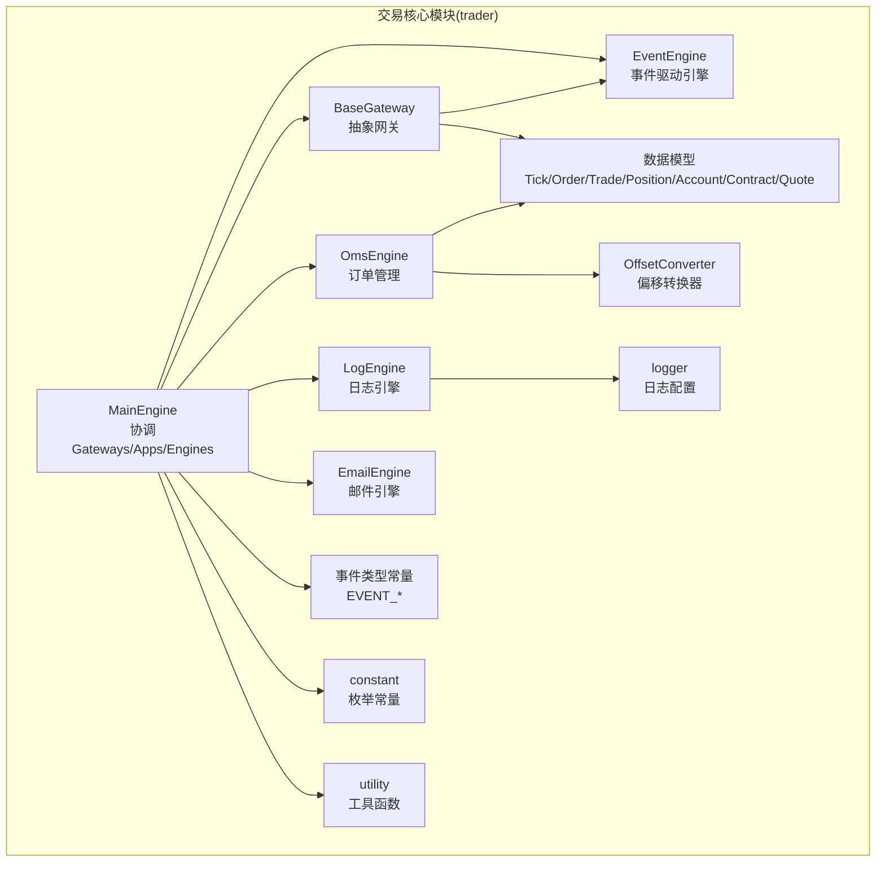

图表来源
- [vnpy/trader/engine.py](file://vnpy/trader/engine.py#L73-L303)
- [vnpy/event/engine.py](file://vnpy/event/engine.py#L33-L146)
- [vnpy/trader/gateway.py](file://vnpy/trader/gateway.py#L33-L273)
- [vnpy/trader/object.py](file://vnpy/trader/object.py#L14-L428)
- [vnpy/trader/event.py](file://vnpy/trader/event.py#L1-L15)
- [vnpy/trader/converter.py](file://vnpy/trader/converter.py#L1-L403)
- [vnpy/trader/logger.py](file://vnpy/trader/logger.py#L1-L56)
- [vnpy/trader/constant.py](file://vnpy/trader/constant.py#L1-L161)
- [vnpy/trader/utility.py](file://vnpy/trader/utility.py#L1-L200)

章节来源
- [vnpy/trader/engine.py](file://vnpy/trader/engine.py#L73-L303)
- [vnpy/event/engine.py](file://vnpy/event/engine.py#L33-L146)
- [vnpy/trader/gateway.py](file://vnpy/trader/gateway.py#L33-L273)
- [vnpy/trader/object.py](file://vnpy/trader/object.py#L14-L428)
- [vnpy/trader/event.py](file://vnpy/trader/event.py#L1-L15)
- [vnpy/trader/converter.py](file://vnpy/trader/converter.py#L1-L403)
- [vnpy/trader/logger.py](file://vnpy/trader/logger.py#L1-L56)
- [vnpy/trader/constant.py](file://vnpy/trader/constant.py#L1-L161)
- [vnpy/trader/utility.py](file://vnpy/trader/utility.py#L1-L200)

## 核心组件
- MainEngine：平台中枢，负责初始化事件引擎、注册功能引擎、管理Gateways与Apps、对外暴露统一API（连接、订阅、下单、撤单、查询历史等）
- EventEngine：事件驱动内核，提供队列、定时器、处理器注册/注销、线程安全分发
- BaseGateway：抽象网关，定义连接、订阅、下单、撤单、查询等接口规范，统一通过事件引擎推送行情/委托/成交/账户/合约/日志/报价事件
- 数据模型：TickData、OrderData、TradeData、PositionData、AccountData、ContractData、QuoteData、请求对象SubscribeRequest、OrderRequest、CancelRequest、HistoryRequest、QuoteRequest
- OmsEngine：订单管理引擎，订阅各类事件，维护内存缓存（ticks/orders/trades/positions/accounts/contracts/quotes），并提供查询接口与偏移转换器对接
- LogEngine：日志引擎，订阅EVENT_LOG，将日志写入logger
- EmailEngine：邮件引擎，异步线程+队列发送邮件
- OffsetConverter/PositionHolding：根据合约属性与交易所规则，将原始OrderRequest转换为符合“锁仓/净仓/上期所特殊规则”的多个子请求
- 日志与常量：logger统一日志格式；constant提供枚举常量

章节来源
- [vnpy/trader/engine.py](file://vnpy/trader/engine.py#L73-L303)
- [vnpy/event/engine.py](file://vnpy/event/engine.py#L33-L146)
- [vnpy/trader/gateway.py](file://vnpy/trader/gateway.py#L33-L273)
- [vnpy/trader/object.py](file://vnpy/trader/object.py#L14-L428)
- [vnpy/trader/converter.py](file://vnpy/trader/converter.py#L1-L403)
- [vnpy/trader/logger.py](file://vnpy/trader/logger.py#L1-L56)
- [vnpy/trader/constant.py](file://vnpy/trader/constant.py#L1-L161)

## 架构总览
MainEngine作为中枢，通过EventEngine实现解耦：
- 外部调用：UI或脚本通过MainEngine发起连接、订阅、下单、撤单、查询历史等
- 网关层：BaseGateway负责与外部交易系统交互，将市场数据与业务事件封装为数据对象并通过EventEngine推送
- 引擎层：OmsEngine订阅并聚合各类事件，维护内存快照；LogEngine订阅日志事件；EmailEngine异步发送邮件
- 应用层：App通过MainEngine注册，引擎类由App绑定，形成功能扩展点

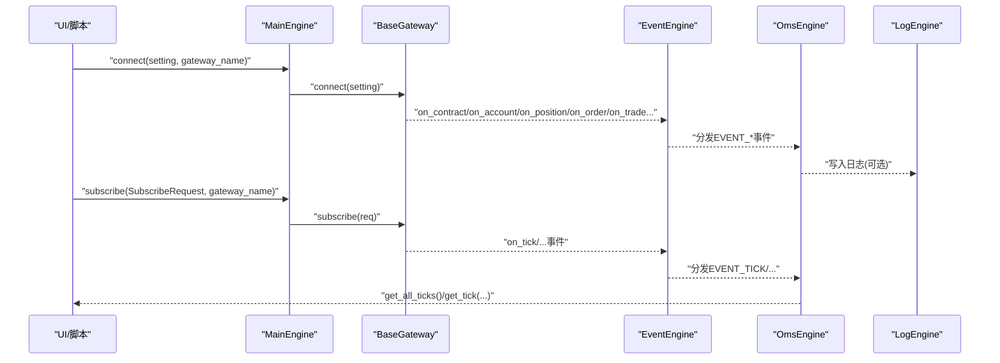

图表来源
- [vnpy/trader/engine.py](file://vnpy/trader/engine.py#L213-L275)
- [vnpy/trader/gateway.py](file://vnpy/trader/gateway.py#L160-L273)
- [vnpy/event/engine.py](file://vnpy/event/engine.py#L33-L146)
- [vnpy/trader/event.py](file://vnpy/trader/event.py#L1-L15)
- [vnpy/trader/object.py](file://vnpy/trader/object.py#L14-L428)

## 详细组件分析

### MainEngine：协调中枢
- 初始化：创建/启动EventEngine；注册基础引擎（日志、订单管理、邮件）
- 管理：Gateways字典、Engines字典、Apps字典、交易所集合
- API：连接、订阅、下单、撤单、报价下单/撤单、历史查询、日志写入、查询默认配置、获取所有网关名/应用、获取交易所列表
- 生命周期：关闭时先停止EventEngine，再依次关闭各引擎与网关

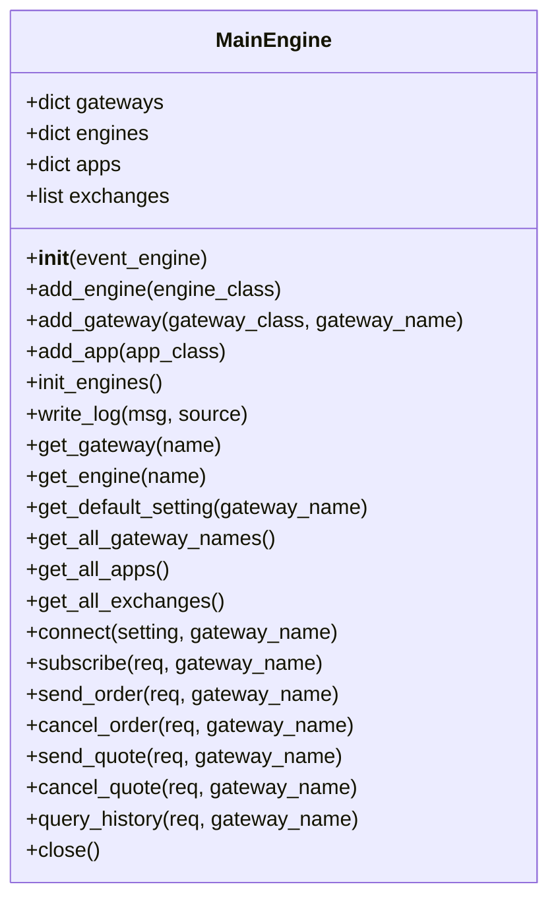

图表来源
- [vnpy/trader/engine.py](file://vnpy/trader/engine.py#L73-L303)

章节来源
- [vnpy/trader/engine.py](file://vnpy/trader/engine.py#L73-L303)

### EventEngine：事件驱动内核
- 线程模型：独立线程处理事件队列；独立线程按间隔产生定时事件
- 注册机制：按事件类型注册处理器；支持通用处理器（监听所有类型）
- 安全性：队列阻塞取事件，避免忙轮询；停止时等待线程join

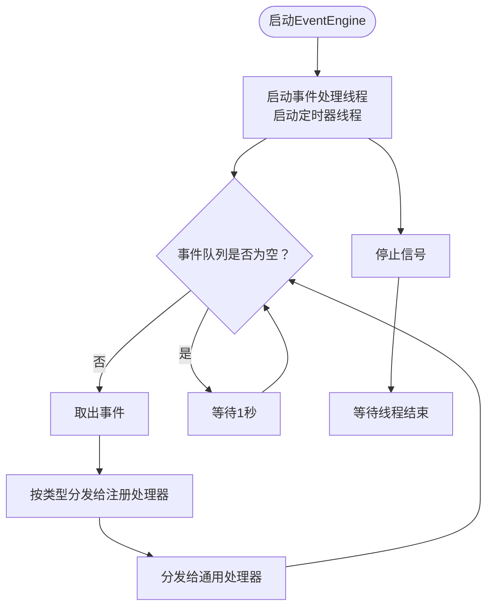

图表来源
- [vnpy/event/engine.py](file://vnpy/event/engine.py#L33-L146)

章节来源
- [vnpy/event/engine.py](file://vnpy/event/engine.py#L33-L146)

### BaseGateway：接口规范与事件推送
- 规范要求：线程安全、非阻塞、自动重连；必须实现connect/close/subscribe/send_order/cancel_order/query_account/query_position等抽象方法
- 事件推送：on_tick/on_trade/on_order/on_position/on_account/on_contract/on_quote/on_log；每个事件同时推送全局与带vt_symbol或vt_orderid的细分事件
- 默认设置：default_name/default_setting/exchanges；get_default_setting返回默认配置
- 日志：write_log封装LogData并通过on_log推送

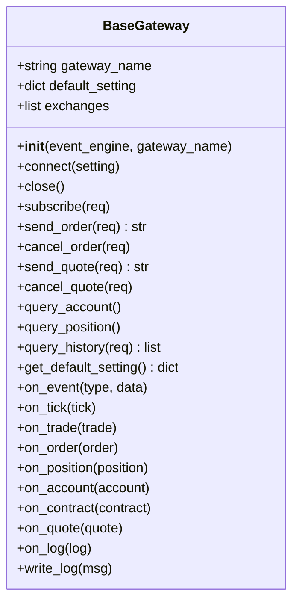

图表来源
- [vnpy/trader/gateway.py](file://vnpy/trader/gateway.py#L33-L273)

章节来源
- [vnpy/trader/gateway.py](file://vnpy/trader/gateway.py#L33-L273)

### 数据模型与vt_symbol命名规范
- vt_symbol：统一格式为“symbol.exchange.value”，贯穿所有数据对象
- 关键模型：
  - TickData：逐笔行情与买卖盘口
  - BarData：K线数据
  - OrderData：委托状态与追踪
  - TradeData：成交明细
  - PositionData：持仓明细
  - AccountData：账户余额/冻结/可用
  - ContractData：合约基本信息与属性
  - QuoteData：报价（双向挂单）
  - 请求对象：SubscribeRequest、OrderRequest、CancelRequest、HistoryRequest、QuoteRequest
- 活跃状态：OrderData/QuoteData提供is_active判断活跃委托/报价

```mermaid
classDiagram
class BaseData {
+string gateway_name
+dict extra
}
class TickData {
+string symbol
+Exchange exchange
+datetime datetime
+float last_price
+float bid_price_1
+float ask_price_1
+float bid_volume_1
+float ask_volume_1
+datetime localtime
+string vt_symbol
}
class BarData {
+string symbol
+Exchange exchange
+datetime datetime
+Interval interval
+float open_price
+float high_price
+float low_price
+float close_price
+float volume
+float turnover
+float open_interest
+string vt_symbol
}
class OrderData {
+string symbol
+Exchange exchange
+string orderid
+OrderType type
+Direction direction
+Offset offset
+float price
+float volume
+float traded
+Status status
+datetime datetime
+string vt_symbol
+string vt_orderid
+is_active() bool
+create_cancel_request() CancelRequest
}
class TradeData {
+string symbol
+Exchange exchange
+string orderid
+string tradeid
+Direction direction
+Offset offset
+float price
+float volume
+datetime datetime
+string vt_symbol
+string vt_orderid
+string vt_tradeid
}
class PositionData {
+string symbol
+Exchange exchange
+Direction direction
+float volume
+float frozen
+float price
+float pnl
+float yd_volume
+string vt_symbol
+string vt_positionid
}
class AccountData {
+string accountid
+float balance
+float frozen
+float available
+string vt_accountid
}
class ContractData {
+string symbol
+Exchange exchange
+string name
+Product product
+float size
+float pricetick
+bool stop_supported
+bool net_position
+bool history_data
+string vt_symbol
}
class QuoteData {
+string symbol
+Exchange exchange
+string quoteid
+float bid_price
+int bid_volume
+float ask_price
+int ask_volume
+Offset bid_offset
+Offset ask_offset
+Status status
+datetime datetime
+string vt_symbol
+string vt_quoteid
+is_active() bool
+create_cancel_request() CancelRequest
}
class SubscribeRequest {
+string symbol
+Exchange exchange
+string vt_symbol
}
class OrderRequest {
+string symbol
+Exchange exchange
+Direction direction
+OrderType type
+float volume
+float price
+Offset offset
+string vt_symbol
+create_order_data(orderid, gateway_name) OrderData
}
class CancelRequest {
+string orderid
+string symbol
+Exchange exchange
+string vt_symbol
}
class HistoryRequest {
+string symbol
+Exchange exchange
+datetime start
+datetime end
+Interval interval
+string vt_symbol
}
class QuoteRequest {
+string symbol
+Exchange exchange
+float bid_price
+int bid_volume
+float ask_price
+int ask_volume
+Offset bid_offset
+Offset ask_offset
+string vt_symbol
+create_quote_data(quoteid, gateway_name) QuoteData
}
BaseData <|-- TickData
BaseData <|-- BarData
BaseData <|-- OrderData
BaseData <|-- TradeData
BaseData <|-- PositionData
BaseData <|-- AccountData
BaseData <|-- ContractData
BaseData <|-- QuoteData
OrderRequest --> OrderData : "create_order_data"
QuoteRequest --> QuoteData : "create_quote_data"
CancelRequest <.. OrderData : "create_cancel_request"
CancelRequest <.. QuoteData : "create_cancel_request"
```

图表来源
- [vnpy/trader/object.py](file://vnpy/trader/object.py#L14-L428)
- [vnpy/trader/constant.py](file://vnpy/trader/constant.py#L1-L161)

章节来源
- [vnpy/trader/object.py](file://vnpy/trader/object.py#L14-L428)
- [vnpy/trader/constant.py](file://vnpy/trader/constant.py#L1-L161)

### OmsEngine：订单管理与内存缓存
- 订阅事件：EVENT_TICK、EVENT_ORDER、EVENT_TRADE、EVENT_POSITION、EVENT_ACCOUNT、EVENT_CONTRACT、EVENT_QUOTE
- 缓存结构：ticks、orders、trades、positions、accounts、contracts、quotes；并维护活跃委托/报价集合
- 偏移转换：为每个gateway_name初始化OffsetConverter，更新Order/Trade/Position触发转换器同步
- 查询接口：按vt_symbol或vt_orderid/quoteid检索最新数据；提供全部数据列表与活跃委托/报价列表
- 转换接口：update_order_request、convert_order_request、get_converter

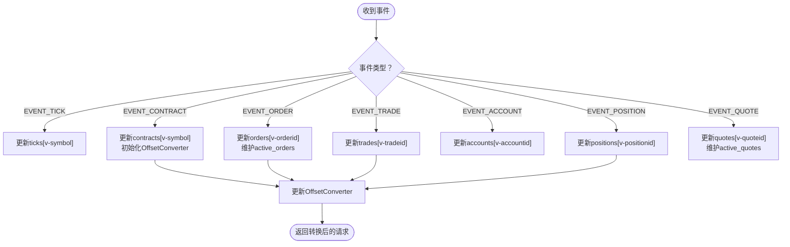

图表来源
- [vnpy/trader/engine.py](file://vnpy/trader/engine.py#L339-L567)
- [vnpy/trader/converter.py](file://vnpy/trader/converter.py#L310-L403)

章节来源
- [vnpy/trader/engine.py](file://vnpy/trader/engine.py#L339-L567)
- [vnpy/trader/converter.py](file://vnpy/trader/converter.py#L1-L403)

### 偏移转换器：OffsetConverter与PositionHolding
- 触发条件：仅当合约net_position为False且交易所支持多空头寸模式时才需要转换
- 转换策略：
  - 锁仓(lock)：优先平今/平昨/开仓组合，确保不占用今仓
  - 净仓(net)：按今昨优先级拆分，上期所特殊处理
  - 上期所(shfe/ine)：按今昨优先级拆分，不足部分从昨仓补齐
- 内部维护PositionHolding：统计long/short的td/yd总量与冻结量，结合活跃委托计算可用量

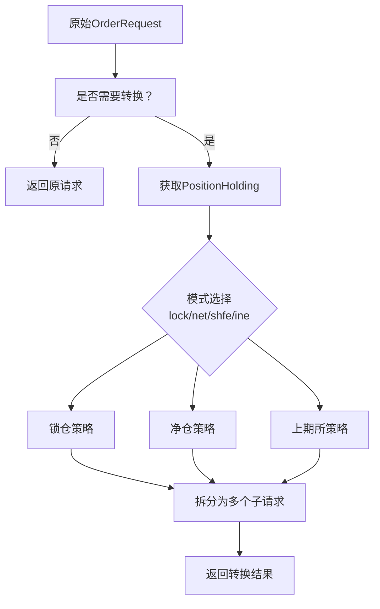

图表来源
- [vnpy/trader/converter.py](file://vnpy/trader/converter.py#L310-L403)

章节来源
- [vnpy/trader/converter.py](file://vnpy/trader/converter.py#L1-L403)

### 日志与邮件引擎
- LogEngine：注册EVENT_LOG处理器，将LogData写入logger（支持级别映射）
- EmailEngine：首次发送邮件时启动线程与队列；通过SMTP_SSL发送；异常时写入日志

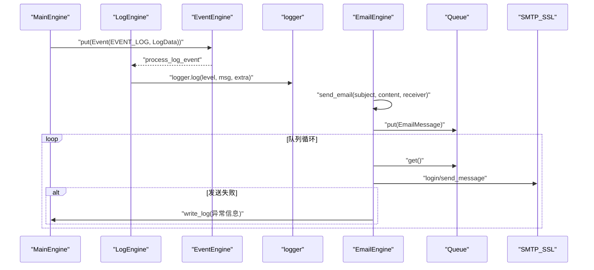

图表来源
- [vnpy/trader/engine.py](file://vnpy/trader/engine.py#L304-L337)
- [vnpy/trader/engine.py](file://vnpy/trader/engine.py#L569-L634)
- [vnpy/trader/logger.py](file://vnpy/trader/logger.py#L1-L56)

章节来源
- [vnpy/trader/engine.py](file://vnpy/trader/engine.py#L304-L337)
- [vnpy/trader/engine.py](file://vnpy/trader/engine.py#L569-L634)
- [vnpy/trader/logger.py](file://vnpy/trader/logger.py#L1-L56)

### App注册机制与生命周期
- BaseApp：定义app_name、app_module、app_path、display_name、engine_class、widget_name、icon_name等元信息
- MainEngine.add_app：实例化BaseApp，注册其engine_class为功能引擎
- 生命周期：MainEngine在close时依次调用各引擎close，确保资源释放

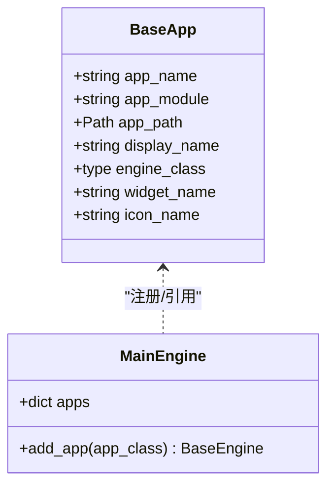

图表来源
- [vnpy/trader/app.py](file://vnpy/trader/app.py#L1-L22)
- [vnpy/trader/engine.py](file://vnpy/trader/engine.py#L120-L128)

章节来源
- [vnpy/trader/app.py](file://vnpy/trader/app.py#L1-L22)
- [vnpy/trader/engine.py](file://vnpy/trader/engine.py#L120-L128)

### 关键流程：下单与撤单
- 下单：MainEngine.send_order -> Gateway.send_order -> 返回vt_orderid；随后网关推送on_order，OmsEngine更新orders与active_orders
- 撤单：MainEngine.cancel_order -> Gateway.cancel_order；网关推送on_order（状态变更），OmsEngine更新缓存
- 报价：send_quote/cancel_quote同理，OmsEngine维护quotes与active_quotes

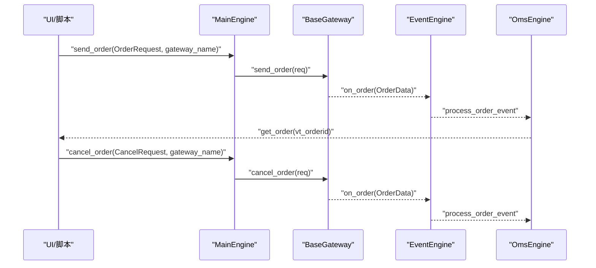

图表来源
- [vnpy/trader/engine.py](file://vnpy/trader/engine.py#L233-L254)
- [vnpy/trader/gateway.py](file://vnpy/trader/gateway.py#L196-L221)
- [vnpy/trader/engine.py](file://vnpy/trader/engine.py#L378-L404)

章节来源
- [vnpy/trader/engine.py](file://vnpy/trader/engine.py#L233-L254)
- [vnpy/trader/gateway.py](file://vnpy/trader/gateway.py#L196-L221)
- [vnpy/trader/engine.py](file://vnpy/trader/engine.py#L378-L404)

### 关键流程：订阅与行情推送
- 订阅：MainEngine.subscribe -> Gateway.subscribe
- 行情：Gateway.on_tick -> EventEngine -> OmsEngine.process_tick_event -> 更新ticks

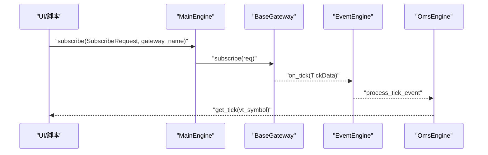

图表来源
- [vnpy/trader/engine.py](file://vnpy/trader/engine.py#L223-L232)
- [vnpy/trader/gateway.py](file://vnpy/trader/gateway.py#L93-L108)
- [vnpy/trader/engine.py](file://vnpy/trader/engine.py#L373-L377)

章节来源
- [vnpy/trader/engine.py](file://vnpy/trader/engine.py#L223-L232)
- [vnpy/trader/gateway.py](file://vnpy/trader/gateway.py#L93-L108)
- [vnpy/trader/engine.py](file://vnpy/trader/engine.py#L373-L377)

### 开发自定义交易接口/功能应用示例（步骤指引）
- 自定义网关（Gateway）：
  - 继承BaseGateway，实现connect/close/subscribe/send_order/cancel_order等抽象方法
  - 在connect中建立连接、查询账户/持仓/委托/成交/合约，并通过on_*推送事件
  - 使用write_log输出日志
  - 参考路径：[vnpy/trader/gateway.py](file://vnpy/trader/gateway.py#L160-L273)
- 注册网关：
  - 在创建MainEngine后，调用add_gateway(GatewayClass, gateway_name)
  - 参考路径：[vnpy/trader/engine.py](file://vnpy/trader/engine.py#L102-L118)
- 自定义应用（App）：
  - 定义BaseApp子类，填写app_name、engine_class、widget_name等元信息
  - 在MainEngine.add_app(AppClass)时，会自动注册其engine_class为功能引擎
  - 参考路径：[vnpy/trader/app.py](file://vnpy/trader/app.py#L1-L22)，[vnpy/trader/engine.py](file://vnpy/trader/engine.py#L120-L128)
- 使用vt_symbol命名：
  - 所有数据对象均包含vt_symbol字段，遵循“symbol.exchange.value”
  - 参考路径：[vnpy/trader/object.py](file://vnpy/trader/object.py#L82-L109)

章节来源
- [vnpy/trader/gateway.py](file://vnpy/trader/gateway.py#L160-L273)
- [vnpy/trader/engine.py](file://vnpy/trader/engine.py#L102-L128)
- [vnpy/trader/app.py](file://vnpy/trader/app.py#L1-L22)
- [vnpy/trader/object.py](file://vnpy/trader/object.py#L82-L109)

## 依赖关系分析
- MainEngine依赖EventEngine进行事件分发；依赖各引擎（LogEngine/OmsEngine/EmailEngine）提供功能；依赖Gateways/Apps进行扩展
- BaseGateway依赖EventEngine推送事件；依赖object中的数据模型；依赖constant中的枚举
- OmsEngine依赖EventEngine与object；依赖converter进行偏移转换
- LogEngine依赖logger；EmailEngine依赖settings与队列线程
- utility提供vt_symbol解析/拼接、BarGenerator、ArrayManager等工具

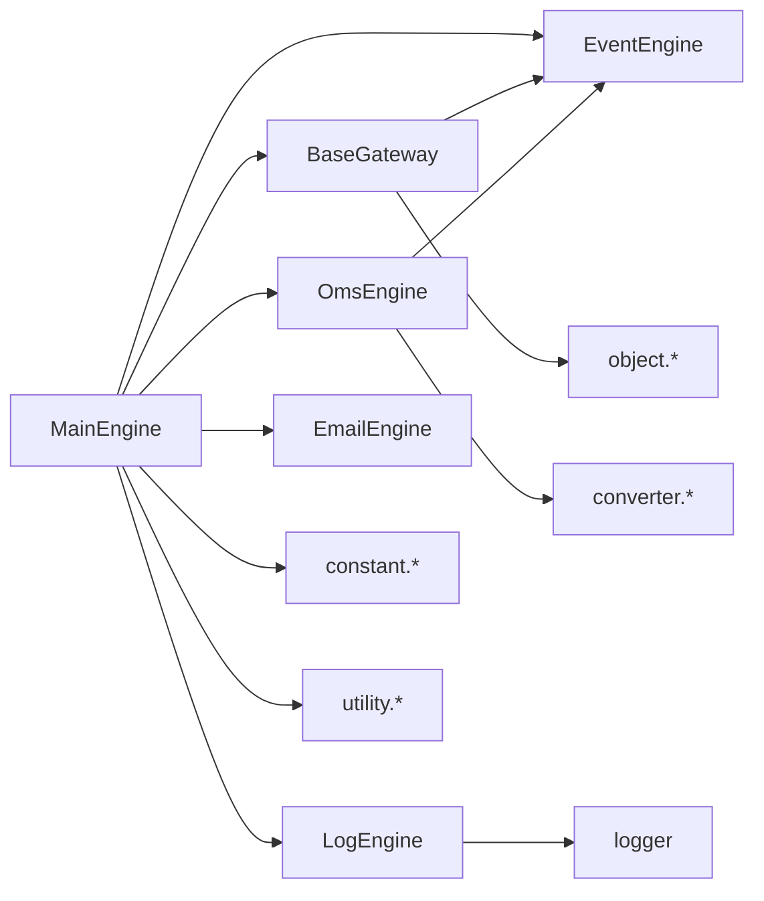

图表来源
- [vnpy/trader/engine.py](file://vnpy/trader/engine.py#L73-L303)
- [vnpy/trader/gateway.py](file://vnpy/trader/gateway.py#L33-L273)
- [vnpy/trader/object.py](file://vnpy/trader/object.py#L14-L428)
- [vnpy/trader/converter.py](file://vnpy/trader/converter.py#L1-L403)
- [vnpy/trader/logger.py](file://vnpy/trader/logger.py#L1-L56)
- [vnpy/trader/constant.py](file://vnpy/trader/constant.py#L1-L161)
- [vnpy/trader/utility.py](file://vnpy/trader/utility.py#L1-L200)

章节来源
- [vnpy/trader/engine.py](file://vnpy/trader/engine.py#L73-L303)
- [vnpy/trader/gateway.py](file://vnpy/trader/gateway.py#L33-L273)
- [vnpy/trader/object.py](file://vnpy/trader/object.py#L14-L428)
- [vnpy/trader/converter.py](file://vnpy/trader/converter.py#L1-L403)
- [vnpy/trader/logger.py](file://vnpy/trader/logger.py#L1-L56)
- [vnpy/trader/constant.py](file://vnpy/trader/constant.py#L1-L161)
- [vnpy/trader/utility.py](file://vnpy/trader/utility.py#L1-L200)

## 性能考量
- 事件驱动：通过EventEngine的队列与线程模型，避免阻塞调用，提高吞吐
- 内存缓存：OmsEngine集中维护各类数据快照，减少重复查询与跨模块传递成本
- 偏移转换：在OmsEngine侧统一处理，避免各应用重复实现复杂规则
- 日志与邮件：异步线程+队列，避免阻塞主线程
- 工具函数：BarGenerator/ArrayManager基于numpy/talib，适合高性能指标计算

章节来源
- [vnpy/event/engine.py](file://vnpy/event/engine.py#L33-L146)
- [vnpy/trader/engine.py](file://vnpy/trader/engine.py#L339-L567)
- [vnpy/trader/converter.py](file://vnpy/trader/converter.py#L1-L403)
- [vnpy/trader/logger.py](file://vnpy/trader/logger.py#L1-L56)
- [vnpy/trader/utility.py](file://vnpy/trader/utility.py#L165-L800)

## 故障排查指南
- 网关未找到：MainEngine.get_gateway返回None时会写日志提示
  - 参考路径：[vnpy/trader/engine.py](file://vnpy/trader/engine.py#L168-L175)
- 引擎未找到：MainEngine.get_engine返回None时会写日志提示
  - 参考路径：[vnpy/trader/engine.py](file://vnpy/trader/engine.py#L177-L184)
- 连接失败：Gateway.connect中应通过write_log记录错误；若查询失败也应写日志
  - 参考路径：[vnpy/trader/gateway.py](file://vnpy/trader/gateway.py#L160-L179)
- 邮件发送异常：EmailEngine捕获异常并写入日志
  - 参考路径：[vnpy/trader/engine.py](file://vnpy/trader/engine.py#L600-L621)
- 日志格式：logger配置支持控制台与文件输出，级别可配置
  - 参考路径：[vnpy/trader/logger.py](file://vnpy/trader/logger.py#L1-L56)

章节来源
- [vnpy/trader/engine.py](file://vnpy/trader/engine.py#L168-L184)
- [vnpy/trader/gateway.py](file://vnpy/trader/gateway.py#L160-L179)
- [vnpy/trader/engine.py](file://vnpy/trader/engine.py#L600-L621)
- [vnpy/trader/logger.py](file://vnpy/trader/logger.py#L1-L56)

## 结论
交易核心模块通过MainEngine统一调度，借助EventEngine实现松耦合的事件驱动架构；BaseGateway提供标准化接口与事件推送；OmsEngine集中管理订单与市场数据，配合OffsetConverter处理复杂的开平仓规则；日志与邮件引擎保证可观测性与告警能力。该设计既满足多网关接入与多应用扩展的需求，又具备良好的性能与可维护性。

## 附录
- vt_symbol命名规范：统一采用“symbol.exchange.value”，便于跨模块识别与关联
  - 参考路径：[vnpy/trader/object.py](file://vnpy/trader/object.py#L82-L109)
- 常用枚举：Direction/Offset/Status/Product/OrderType/Exchange/Interval
  - 参考路径：[vnpy/trader/constant.py](file://vnpy/trader/constant.py#L1-L161)
- 工具函数：vt_symbol解析/拼接、BarGenerator、ArrayManager
  - 参考路径：[vnpy/trader/utility.py](file://vnpy/trader/utility.py#L22-L117)，[vnpy/trader/utility.py](file://vnpy/trader/utility.py#L165-L800)