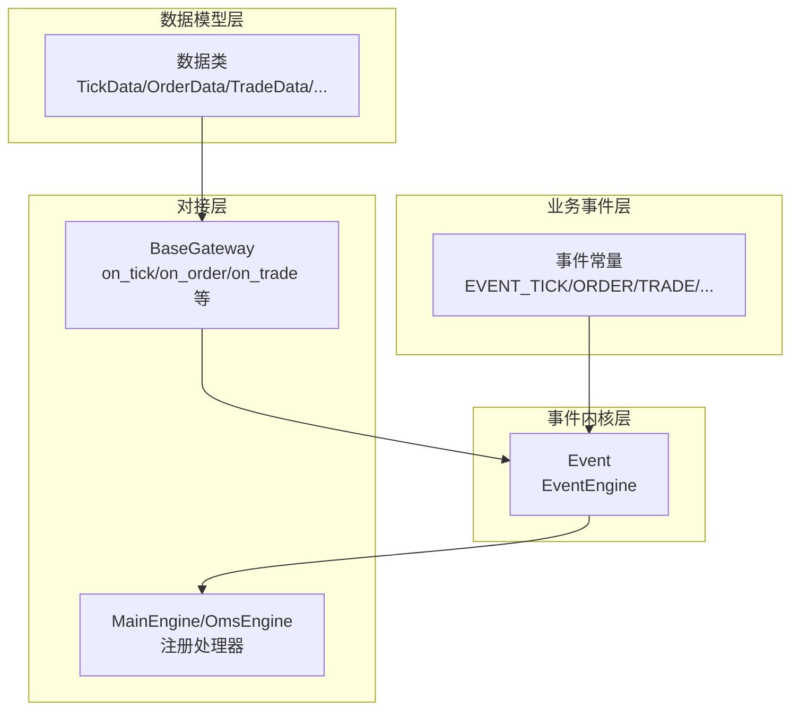
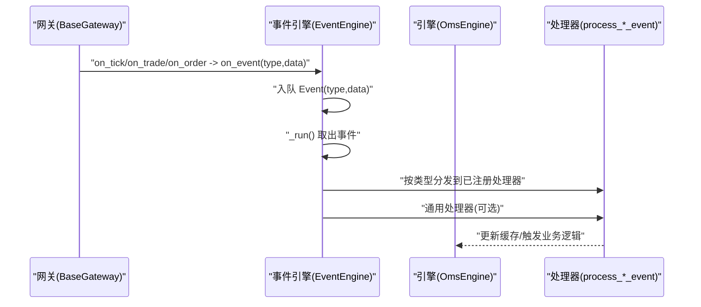
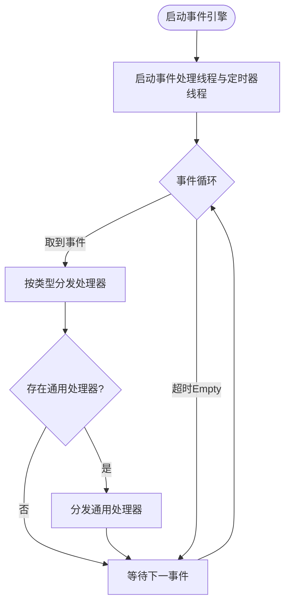
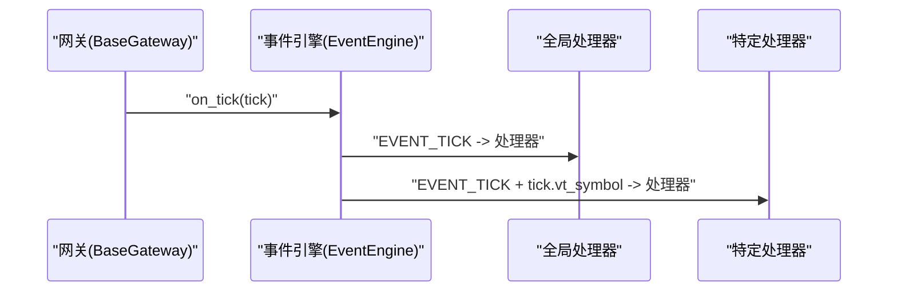
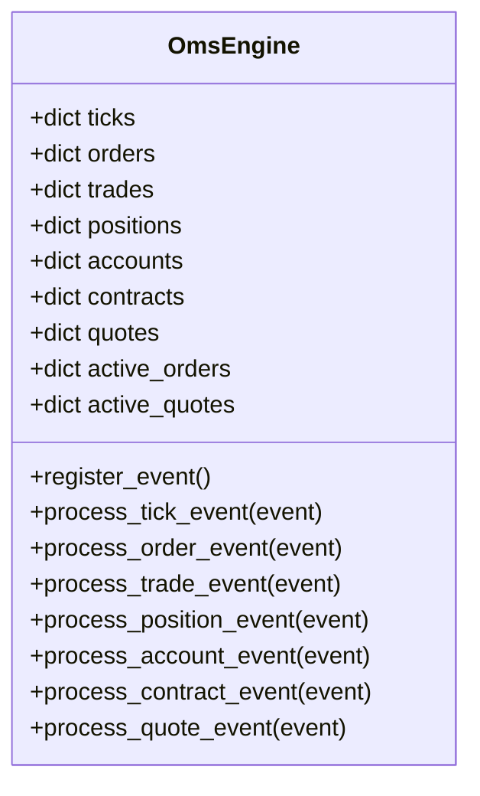
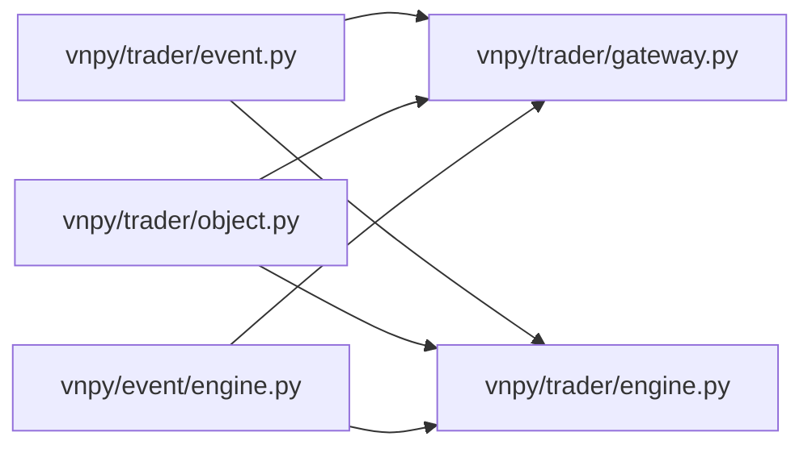

# 事件回调系统

<cite>
**本文引用的文件**
- [vnpy/event/engine.py](file://vnpy/event/engine.py)
- [vnpy/trader/event.py](file://vnpy/trader/event.py)
- [vnpy/trader/object.py](file://vnpy/trader/object.py)
- [vnpy/trader/gateway.py](file://vnpy/trader/gateway.py)
- [vnpy/trader/engine.py](file://vnpy/trader/engine.py)
</cite>

## 目录
1. [引言](#引言)
2. [项目结构](#项目结构)
3. [核心组件](#核心组件)
4. [架构总览](#架构总览)
5. [详细组件分析](#详细组件分析)
6. [依赖关系分析](#依赖关系分析)
7. [性能考量](#性能考量)
8. [故障排查指南](#故障排查指南)
9. [结论](#结论)

## 引言
本文件系统性解析vnpy的事件回调机制，重点围绕以下目标展开：
- 明确on_tick、on_trade、on_order等回调方法的设计契约与职责边界
- 阐述数据对象不可变性原则的实现要求，并解释如何通过浅拷贝(copy.copy)保障数据安全
- 解析事件分级推送机制（全局事件与符号/订单特定事件）的实现原理
- 提供回调处理延迟、事件堆积等性能问题的诊断与优化方案

## 项目结构
事件系统由三层组成：
- 事件内核层：事件类型定义与事件引擎（vnpy/event）
- 业务事件层：交易事件常量（vnpy/trader/event.py）
- 数据模型层：Tick/Order/Trade/Position/Account/Contract/Quote等数据类（vnpy/trader/object.py）
- 网关与引擎对接层：网关负责推送事件，引擎负责注册处理器（vnpy/trader/gateway.py、vnpy/trader/engine.py）

图表来源
- [vnpy/event/engine.py](file://vnpy/event/engine.py#L1-L146)
- [vnpy/trader/event.py](file://vnpy/trader/event.py#L1-L15)
- [vnpy/trader/object.py](file://vnpy/trader/object.py#L1-L300)
- [vnpy/trader/gateway.py](file://vnpy/trader/gateway.py#L1-L160)
- [vnpy/trader/engine.py](file://vnpy/trader/engine.py#L360-L420)

章节来源
- [vnpy/event/engine.py](file://vnpy/event/engine.py#L1-L146)
- [vnpy/trader/event.py](file://vnpy/trader/event.py#L1-L15)
- [vnpy/trader/object.py](file://vnpy/trader/object.py#L1-L300)
- [vnpy/trader/gateway.py](file://vnpy/trader/gateway.py#L1-L160)
- [vnpy/trader/engine.py](file://vnpy/trader/engine.py#L360-L420)

## 核心组件
- 事件类型与事件对象
  - 事件类型常量：tick、trade、order、position、account、quote、contract、log等
  - 事件对象包含type与data两部分，用于分发与承载数据
- 事件引擎
  - 基于队列的异步分发器，支持通用处理器与按类型处理器
  - 定时器线程周期生成定时事件
- 网关回调
  - BaseGateway提供on_tick/on_trade/on_order等回调，同时推送全局事件与特定标识事件
- 引擎处理器
  - OmsEngine注册各事件处理器，维护内存缓存并触发后续流程

章节来源
- [vnpy/trader/event.py](file://vnpy/trader/event.py#L1-L15)
- [vnpy/event/engine.py](file://vnpy/event/engine.py#L1-L146)
- [vnpy/trader/gateway.py](file://vnpy/trader/gateway.py#L86-L159)
- [vnpy/trader/engine.py](file://vnpy/trader/engine.py#L360-L420)

## 架构总览
事件从网关产生，经事件引擎分发至各处理器；处理器可选择性地缓存或进一步处理数据。

图表来源
- [vnpy/trader/gateway.py](file://vnpy/trader/gateway.py#L86-L159)
- [vnpy/event/engine.py](file://vnpy/event/engine.py#L55-L88)
- [vnpy/trader/engine.py](file://vnpy/trader/engine.py#L360-L420)

## 详细组件分析

### 事件类型与事件对象
- 事件类型
  - 全局事件：如“eTick.”、“eTrade.”、“eOrder.”等
  - 特定事件：在全局前缀基础上附加vt_symbol或vt_orderid等唯一标识
- 事件对象
  - 包含type与data字段，data为具体业务数据对象

章节来源
- [vnpy/trader/event.py](file://vnpy/trader/event.py#L1-L15)
- [vnpy/event/engine.py](file://vnpy/event/engine.py#L16-L31)

### 事件引擎（EventEngine）
- 线程与队列
  - 启动两个线程：事件处理线程与定时器线程
  - 使用阻塞队列存储事件，取事件时设置超时避免永久阻塞
- 分发策略
  - 先按事件类型分发给已注册的处理器
  - 再分发给通用处理器（监听所有事件类型）
- 定时器
  - 按间隔秒数生成定时事件，便于周期性任务调度

图表来源
- [vnpy/event/engine.py](file://vnpy/event/engine.py#L55-L88)
- [vnpy/event/engine.py](file://vnpy/event/engine.py#L105-L146)

章节来源
- [vnpy/event/engine.py](file://vnpy/event/engine.py#L1-L146)

### 网关回调契约与事件分级推送
- 设计契约
  - 网关回调必须保证线程安全、非阻塞、自动重连
  - 回调参数XxxData应保持不可变，避免跨线程共享可变状态
- 事件分级推送
  - 全局事件：EVENT_TICK、EVENT_TRADE、EVENT_ORDER、EVENT_POSITION、EVENT_ACCOUNT、EVENT_CONTRACT、EVENT_QUOTE、EVENT_LOG
  - 符号/订单特定事件：在全局前缀后拼接vt_symbol或vt_orderid等唯一标识
- 推送实现
  - on_tick/on_trade/on_order等方法先推送全局事件，再推送特定事件
  - 例如：on_tick会推送“eTick.”与“eTick.<vt_symbol>”

图表来源
- [vnpy/trader/gateway.py](file://vnpy/trader/gateway.py#L93-L116)

章节来源
- [vnpy/trader/gateway.py](file://vnpy/trader/gateway.py#L33-L116)

### 数据对象不可变性与copy.copy
- 不可变性原则
  - 网关在回调中传递的XxxData对象不应被修改
  - 若需要缓存引用，应在传递前使用浅拷贝copy.copy创建新对象
- 实现要点
  - 在网关侧，on_tick/on_trade/on_order等方法在推送事件前，应确保传入的XxxData对象不会被后续修改
  - 在引擎侧，OmsEngine的处理器直接接收事件数据，无需再次拷贝即可安全使用

章节来源
- [vnpy/trader/gateway.py](file://vnpy/trader/gateway.py#L54-L67)
- [vnpy/trader/object.py](file://vnpy/trader/object.py#L1-L120)

### 引擎处理器与数据缓存
- 注册处理器
  - OmsEngine在初始化时注册各类事件处理器，绑定到对应process_*_event方法
- 缓存与状态管理
  - 维护ticks、orders、trades、positions、accounts、contracts、quotes等字典
  - 对于活跃订单/报价，维护独立集合，便于快速查询
- 处理流程
  - process_tick_event：更新最新tick
  - process_order_event：更新订单并维护活跃订单集合
  - process_trade_event：更新成交
  - process_position_event：更新持仓
  - process_account_event：更新账户
  - process_contract_event：更新合约并初始化偏移转换器
  - process_quote_event：更新报价并维护活跃报价集合

图表来源
- [vnpy/trader/engine.py](file://vnpy/trader/engine.py#L360-L559)

章节来源
- [vnpy/trader/engine.py](file://vnpy/trader/engine.py#L360-L559)

## 依赖关系分析
- 事件类型依赖
  - 业务事件常量依赖事件引擎中的定时器事件常量
- 网关依赖
  - BaseGateway依赖事件引擎与业务事件常量，依赖数据模型类
- 引擎依赖
  - OmsEngine依赖事件引擎与业务事件常量，依赖数据模型类
- 数据模型
  - 所有数据类均继承自BaseData，具备gateway_name与extra字段

图表来源
- [vnpy/trader/event.py](file://vnpy/trader/event.py#L1-L15)
- [vnpy/trader/gateway.py](file://vnpy/trader/gateway.py#L1-L40)
- [vnpy/trader/engine.py](file://vnpy/trader/engine.py#L360-L372)
- [vnpy/trader/object.py](file://vnpy/trader/object.py#L1-L60)
- [vnpy/event/engine.py](file://vnpy/event/engine.py#L1-L31)

章节来源
- [vnpy/trader/event.py](file://vnpy/trader/event.py#L1-L15)
- [vnpy/trader/gateway.py](file://vnpy/trader/gateway.py#L1-L40)
- [vnpy/trader/engine.py](file://vnpy/trader/engine.py#L360-L372)
- [vnpy/trader/object.py](file://vnpy/trader/object.py#L1-L60)
- [vnpy/event/engine.py](file://vnpy/event/engine.py#L1-L31)

## 性能考量
- 事件堆积与延迟
  - 事件引擎采用阻塞队列与超时取事件，避免线程长时间阻塞
  - 若处理器处理耗时过长，会导致队列积压，表现为延迟增大
- 优化建议
  - 将耗时计算与IO操作移出回调线程，仅在回调中投递轻量事件
  - 控制处理器内部锁粒度，避免长事务占用
  - 对高频tick事件，考虑批量处理或降采样
  - 合理设置定时器间隔，平衡实时性与CPU开销
- 监控指标
  - 事件队列长度、处理器平均处理时延、定时器事件频率
  - 关注on_tick/on_order/on_trade等高频事件的处理耗时

章节来源
- [vnpy/event/engine.py](file://vnpy/event/engine.py#L55-L88)
- [vnpy/trader/engine.py](file://vnpy/trader/engine.py#L360-L420)

## 故障排查指南
- 回调未触发
  - 检查事件引擎是否已启动
  - 检查是否正确注册了对应事件处理器
- 数据异常或竞态
  - 确认网关在回调中传递的XxxData对象未被修改
  - 若需要缓存引用，确保使用浅拷贝copy.copy
- 事件堆积
  - 观察事件队列长度与处理器耗时
  - 优化处理器逻辑，减少阻塞操作
- 特定事件未命中
  - 确认事件类型前缀与vt_symbol/vt_orderid格式一致
  - 检查是否同时注册了全局与特定事件处理器

章节来源
- [vnpy/trader/gateway.py](file://vnpy/trader/gateway.py#L54-L67)
- [vnpy/trader/gateway.py](file://vnpy/trader/gateway.py#L93-L116)
- [vnpy/event/engine.py](file://vnpy/event/engine.py#L55-L88)
- [vnpy/trader/engine.py](file://vnpy/trader/engine.py#L360-L420)

## 结论
vnpy的事件回调系统通过清晰的契约、严格的不可变性约束与灵活的事件分级推送，实现了高内聚、低耦合的解耦架构。遵循本文提供的设计契约与优化建议，可在保证数据安全的前提下，获得稳定且高性能的事件处理能力。