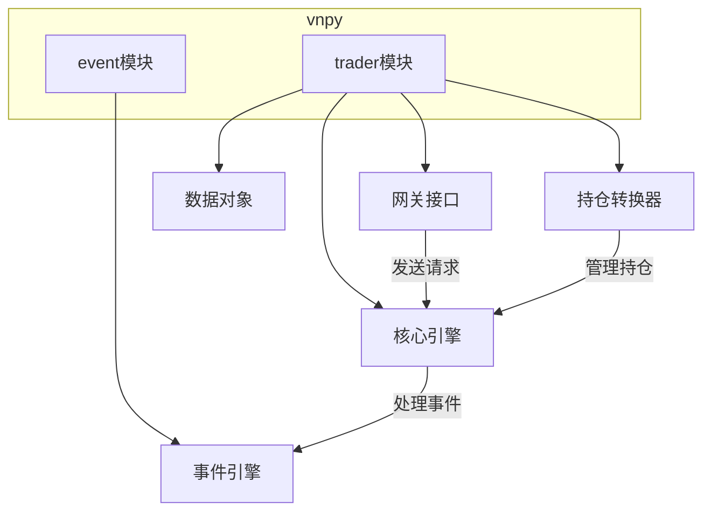
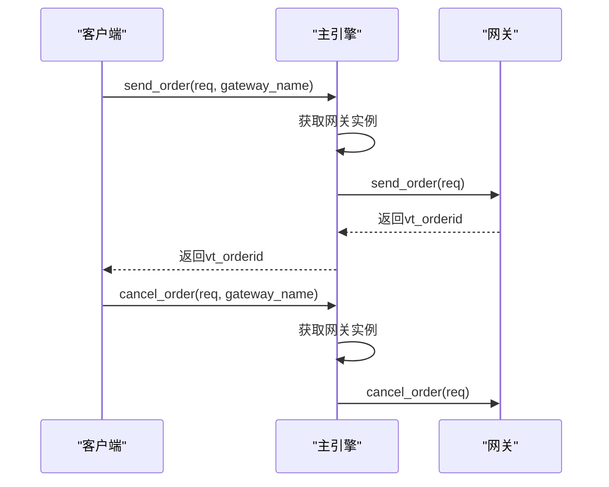
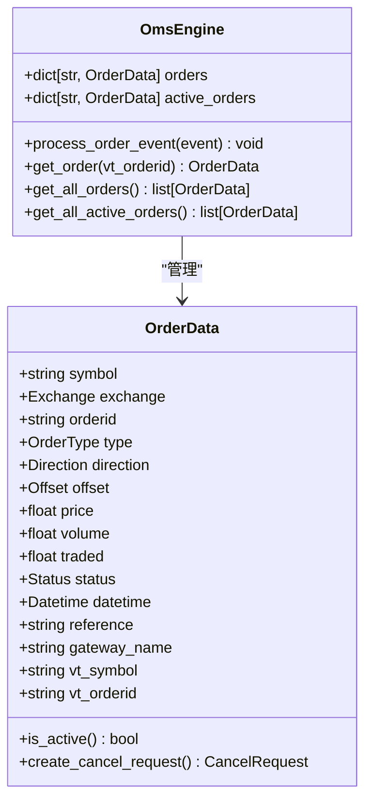
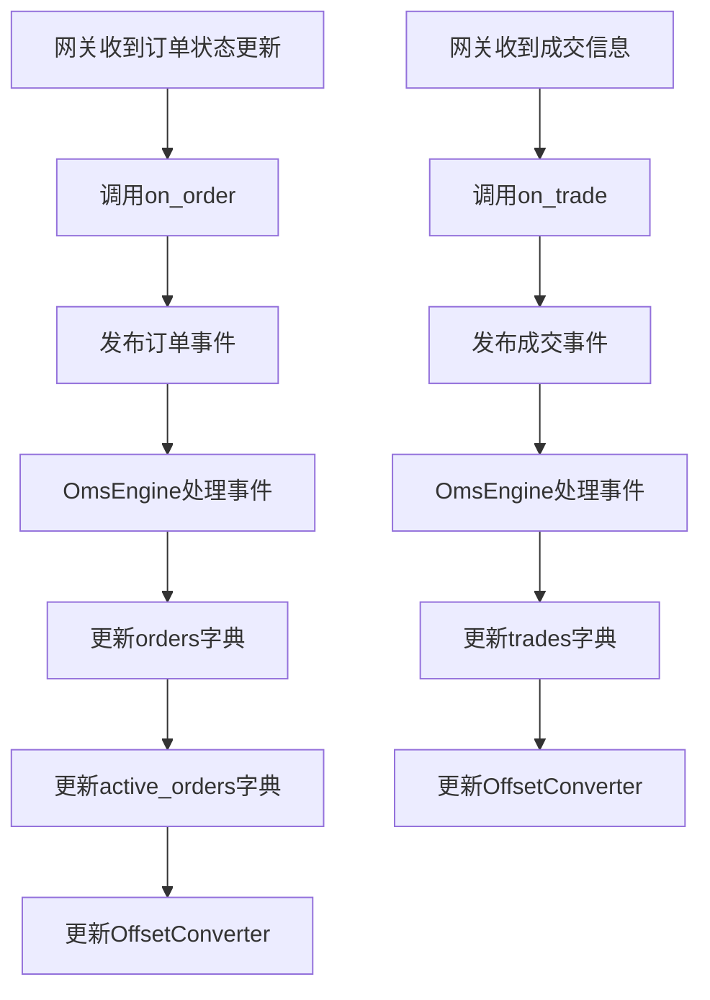
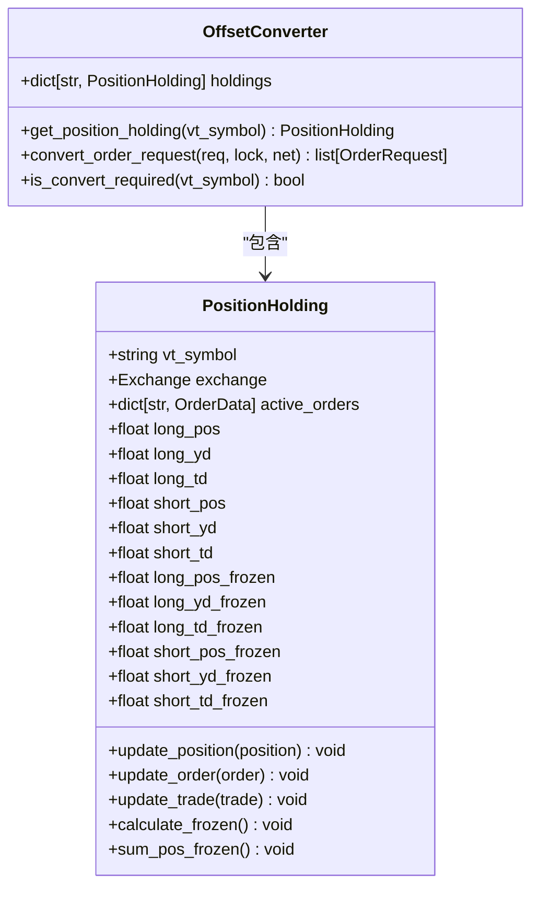

# 交易执行

<cite>
**本文档引用的文件**   
- [gateway.py](file://vnpy/trader/gateway.py)
- [engine.py](file://vnpy/trader/engine.py)
- [object.py](file://vnpy/trader/object.py)
- [converter.py](file://vnpy/trader/converter.py)
- [constant.py](file://vnpy/trader/constant.py)
</cite>

## 目录
1. [项目结构](#项目结构)
2. [核心组件](#核心组件)
3. [请求模型设计规范](#请求模型设计规范)
4. [线程安全实现要求](#线程安全实现要求)
5. [vt_orderid生成与管理](#vt_orderid生成与管理)
6. [回调时序保证与状态同步](#回调时序保证与状态同步)
7. [订单流控与重复下单防护](#订单流控与重复下单防护)

## 项目结构

**Diagram sources**
- [gateway.py](file://vnpy/trader/gateway.py)
- [engine.py](file://vnpy/trader/engine.py)
- [object.py](file://vnpy/trader/object.py)
- [converter.py](file://vnpy/trader/converter.py)

**Section sources**
- [gateway.py](file://vnpy/trader/gateway.py)
- [engine.py](file://vnpy/trader/engine.py)

## 核心组件

交易执行系统的核心由`MainEngine`、`BaseGateway`、`OmsEngine`和`OffsetConverter`等组件构成。`MainEngine`作为交易系统的核心，负责管理所有功能引擎和网关接口。`BaseGateway`是所有交易网关的抽象基类，定义了与具体交易系统连接的统一接口。`OmsEngine`提供订单管理系统功能，维护订单、成交、持仓等数据。`OffsetConverter`负责处理不同交易所的开平仓规则转换。

**Section sources**
- [engine.py](file://vnpy/trader/engine.py#L73-L634)
- [gateway.py](file://vnpy/trader/gateway.py#L33-L273)

## 请求模型设计规范

### OrderRequest设计规范

`OrderRequest`类定义了委托下单请求的数据结构，包含以下关键属性：
- `symbol`: 合约代码
- `exchange`: 交易所
- `direction`: 买卖方向
- `type`: 委托类型
- `volume`: 委托数量
- `price`: 委托价格
- `offset`: 开平标志
- `reference`: 参考信息

`OrderRequest`通过`create_order_data`方法创建`OrderData`对象，该方法接收`orderid`和`gateway_name`参数，用于生成完整的订单数据。

### CancelRequest设计规范

`CancelRequest`类定义了撤单请求的数据结构，包含以下关键属性：
- `orderid`: 原始订单号
- `symbol`: 合约代码
- `exchange`: 交易所

`CancelRequest`的设计遵循简洁原则，仅包含撤销订单所需的最少信息，确保跨网关兼容性。

**Section sources**
- [object.py](file://vnpy/trader/object.py#L320-L371)
- [gateway.py](file://vnpy/trader/gateway.py#L214-L221)

## 线程安全实现要求

### send_order线程安全实现

`send_order`方法的线程安全实现要求如下：
1. 网关实现必须是线程安全的，所有方法都应该是线程安全的
2. 不同对象之间不应有可变的共享属性
3. 所有方法都应该是非阻塞的
4. 必须满足文档字符串中为每个方法和回调写明的所有要求
5. 连接丢失时应自动重连

在`MainEngine`中，`send_order`方法通过获取指定网关并调用其`send_order`方法来实现委托下单，该过程是线程安全的。

### cancel_order线程安全实现

`cancel_order`方法的线程安全实现要求与`send_order`相同。在`MainEngine`中，`cancel_order`方法通过获取指定网关并调用其`cancel_order`方法来实现撤单操作，确保了线程安全性。

**Diagram sources**
- [engine.py](file://vnpy/trader/engine.py#L233-L253)
- [gateway.py](file://vnpy/trader/gateway.py#L214-L221)

**Section sources**
- [engine.py](file://vnpy/trader/engine.py#L233-L253)
- [gateway.py](file://vnpy/trader/gateway.py#L43-L48)

## vt_orderid生成与管理

### vt_orderid生成机制

`vt_orderid`的生成遵循以下规则：
1. 网关实例范围内唯一
2. 格式为`gateway_name.orderid`
3. 在`OrderData`的`__post_init__`方法中生成

`OrderData`类通过`__post_init__`方法将`gateway_name`和`orderid`组合成`vt_orderid`，确保了全局唯一性。

### 订单状态管理

`OmsEngine`通过字典维护所有订单的状态：
- `orders`: 存储所有订单
- `active_orders`: 存储所有活动订单

当订单状态更新时，`process_order_event`方法会根据订单的活动状态将其添加到`active_orders`或从其中移除。

**Diagram sources**
- [object.py](file://vnpy/trader/object.py#L111-L151)
- [engine.py](file://vnpy/trader/engine.py#L348-L357)

**Section sources**
- [object.py](file://vnpy/trader/object.py#L135)
- [engine.py](file://vnpy/trader/engine.py#L381-L388)

## 回调时序保证与状态同步

### on_order回调时序保证

`on_order`回调的时序保证机制如下：
1. 网关在收到订单状态更新后，立即调用`on_order`方法
2. `on_order`方法将订单事件放入事件队列
3. `OmsEngine`的`process_order_event`方法处理订单事件
4. 更新订单状态并维护活动订单字典

### on_trade回调时序保证

`on_trade`回调的时序保证机制与`on_order`类似：
1. 网关在收到成交信息后，立即调用`on_trade`方法
2. `on_trade`方法将成交事件放入事件队列
3. `OmsEngine`的`process_trade_event`方法处理成交事件
4. 更新成交数据并更新持仓转换器

### 状态同步策略

状态同步通过事件驱动机制实现：
- 所有状态变更都通过事件发布-订阅模式传播
- `OmsEngine`注册了所有相关事件的处理器
- 每个事件处理器负责更新相应的数据字典
- 通过`OffsetConverter`保持订单、成交和持仓之间的状态一致性

**Diagram sources**
- [gateway.py](file://vnpy/trader/gateway.py#L109-L115)
- [engine.py](file://vnpy/trader/engine.py#L378-L389)
- [converter.py](file://vnpy/trader/converter.py#L337-L344)

**Section sources**
- [gateway.py](file://vnpy/trader/gateway.py#L109-L115)
- [engine.py](file://vnpy/trader/engine.py#L378-L389)

## 订单流控与重复下单防护

### 订单流控机制

订单流控主要通过`OrderFlowRule`规则实现：
- `order_flow_interval`: 委托流控时间窗口
- `order_flow_limit`: 给定时间窗口内最多允许发出的委托笔数
- `total_order_limit`: 日内总委托笔数上限

当发出的委托笔数在配置的时间窗口内超过限制，或超过日内总委托笔数上限时，系统会拦截委托请求。

### 重复下单防护

重复下单防护通过以下机制实现：
1. `vt_orderid`全局唯一性保证
2. `active_orders`字典维护活动订单状态
3. `OffsetConverter`跟踪订单和持仓状态
4. 网关层面的订单去重（具体实现依赖于各网关）

`OffsetConverter`通过`PositionHolding`类维护每个合约的持仓和订单信息，计算冻结量，防止过度开仓或平仓。

**Diagram sources**
- [converter.py](file://vnpy/trader/converter.py#L310-L403)
- [engine.py](file://vnpy/trader/engine.py#L359-L362)

**Section sources**
- [converter.py](file://vnpy/trader/converter.py#L17-L403)
- [docs/elite/strategy/elite_riskmanager.md](file://docs/elite/strategy/elite_riskmanager.md#L121-L130)