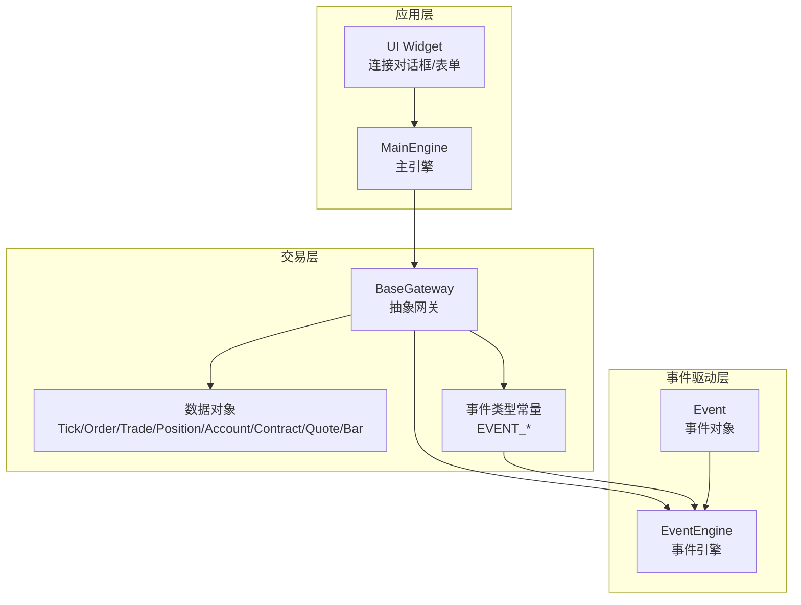
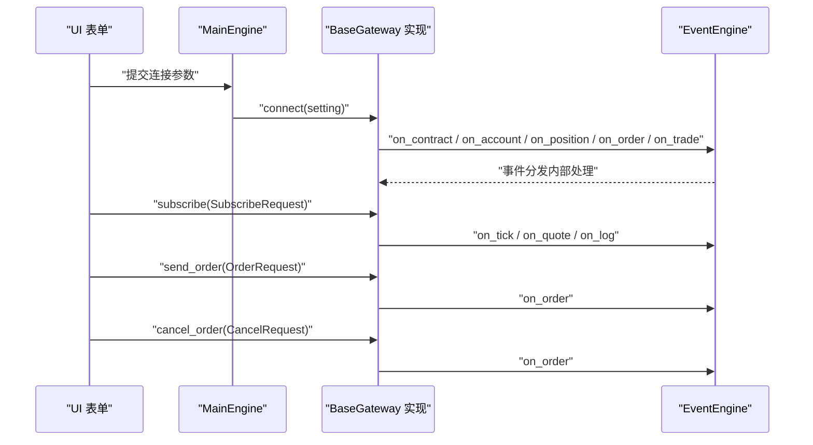
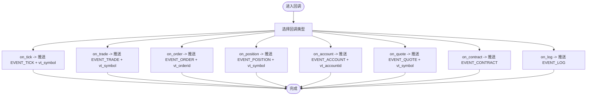
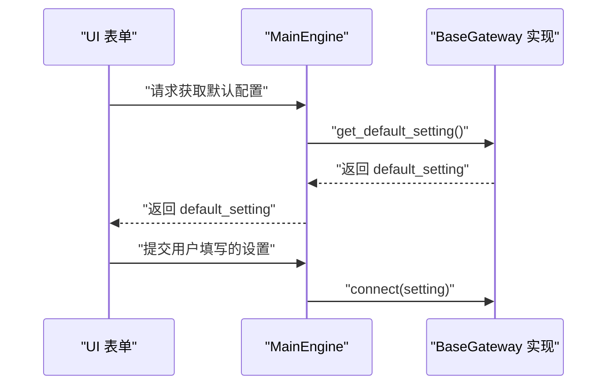
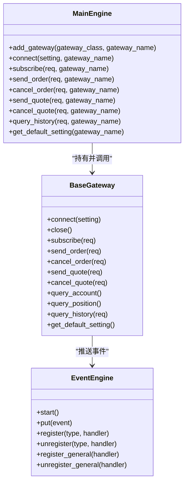
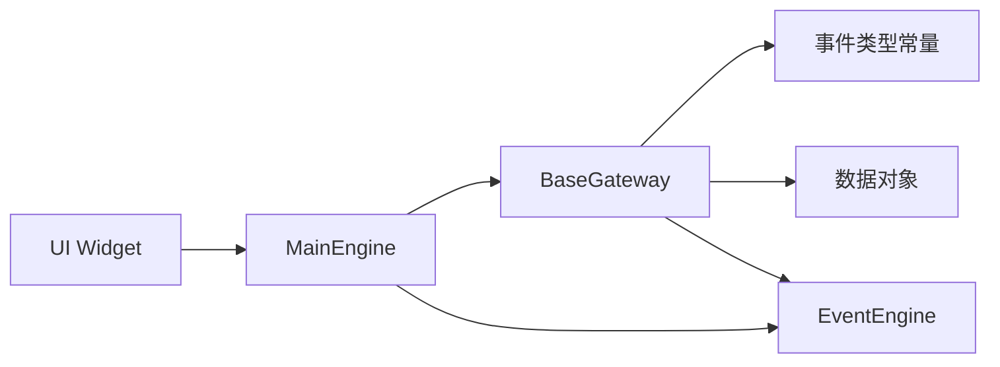

# 交易网关系统

<cite>
**本文引用的文件列表**
- [vnpy/trader/gateway.py](file://vnpy/trader/gateway.py)
- [vnpy/trader/event.py](file://vnpy/trader/event.py)
- [vnpy/event/engine.py](file://vnpy/event/engine.py)
- [vnpy/trader/object.py](file://vnpy/trader/object.py)
- [vnpy/trader/engine.py](file://vnpy/trader/engine.py)
- [vnpy/trader/ui/widget.py](file://vnpy/trader/ui/widget.py)
</cite>

## 目录
1. [引言](#引言)
2. [项目结构](#项目结构)
3. [核心组件](#核心组件)
4. [架构总览](#架构总览)
5. [详细组件分析](#详细组件分析)
6. [依赖关系分析](#依赖关系分析)
7. [性能考量](#性能考量)
8. [故障排查指南](#故障排查指南)
9. [结论](#结论)
10. [附录](#附录)

## 引言
本文件面向vn.py交易框架中的“交易网关（BaseGateway）”设计与实现进行系统化解析，目标是帮助开发者理解：
- 网关抽象接口的契约与实现要求（connect、subscribe、send_order、cancel_order、query_account、query_position、query_history 等）
- 回调事件推送机制（on_tick、on_trade、on_order、on_position、on_account、on_contract、on_quote、on_log）与数据处理流程
- default_setting 配置系统的设计与应用
- 网关与主引擎的注册与通信机制
- 如何通过网关对接不同交易所API
- 开发自定义交易网关的完整指南（线程安全、异常处理、自动重连等）

## 项目结构
围绕交易网关的核心模块主要分布在以下文件中：
- 抽象网关与数据对象：vnpy/trader/gateway.py、vnpy/trader/object.py
- 事件类型常量：vnpy/trader/event.py
- 事件引擎：vnpy/event/engine.py
- 主引擎与网关注册/调用：vnpy/trader/engine.py
- UI交互与默认配置读取：vnpy/trader/ui/widget.py

图表来源
- [vnpy/trader/gateway.py](file://vnpy/trader/gateway.py#L33-L273)
- [vnpy/trader/event.py](file://vnpy/trader/event.py#L1-L15)
- [vnpy/event/engine.py](file://vnpy/event/engine.py#L1-L146)
- [vnpy/trader/object.py](file://vnpy/trader/object.py#L1-L200)
- [vnpy/trader/engine.py](file://vnpy/trader/engine.py#L100-L299)
- [vnpy/trader/ui/widget.py](file://vnpy/trader/ui/widget.py#L658-L690)

章节来源
- [vnpy/trader/gateway.py](file://vnpy/trader/gateway.py#L33-L273)
- [vnpy/trader/event.py](file://vnpy/trader/event.py#L1-L15)
- [vnpy/event/engine.py](file://vnpy/event/engine.py#L1-L146)
- [vnpy/trader/object.py](file://vnpy/trader/object.py#L1-L200)
- [vnpy/trader/engine.py](file://vnpy/trader/engine.py#L100-L299)
- [vnpy/trader/ui/widget.py](file://vnpy/trader/ui/widget.py#L658-L690)

## 核心组件
- BaseGateway：定义所有网关必须实现的抽象接口与回调推送机制；提供 default_setting、exchanges、gateway_name 等基础能力。
- 数据对象：TickData、OrderData、TradeData、PositionData、AccountData、ContractData、QuoteData、BarData、HistoryRequest、SubscribeRequest、OrderRequest、CancelRequest、QuoteRequest 等。
- 事件系统：EVENT_TICK、EVENT_ORDER、EVENT_TRADE、EVENT_POSITION、EVENT_ACCOUNT、EVENT_CONTRACT、EVENT_QUOTE、EVENT_LOG 等事件类型；EventEngine 负责事件分发与定时器。
- 主引擎 MainEngine：负责网关注册、路由调用（connect、subscribe、send_order、cancel_order、send_quote、cancel_quote、query_history），并统一写日志。
- UI Widget：从表单收集设置，调用 MainEngine.connect 完成网关连接。

章节来源
- [vnpy/trader/gateway.py](file://vnpy/trader/gateway.py#L33-L273)
- [vnpy/trader/event.py](file://vnpy/trader/event.py#L1-L15)
- [vnpy/event/engine.py](file://vnpy/event/engine.py#L1-L146)
- [vnpy/trader/object.py](file://vnpy/trader/object.py#L1-L200)
- [vnpy/trader/engine.py](file://vnpy/trader/engine.py#L100-L299)
- [vnpy/trader/ui/widget.py](file://vnpy/trader/ui/widget.py#L658-L690)

## 架构总览
交易网关采用“事件驱动 + 抽象网关”的架构模式：
- 网关通过回调 on_tick/on_trade/on_order/on_position/on_account/on_contract/on_quote/on_log 将数据封装为对应数据对象，并通过 on_event 推送至 EventEngine。
- 主引擎持有 EventEngine 并维护所有已注册网关；UI 通过表单读取 default_setting，将设置传入 MainEngine.connect，再由具体网关执行 connect。
- 网关需保证线程安全、非阻塞、自动重连，并在回调中传递不可变数据对象。

图表来源
- [vnpy/trader/engine.py](file://vnpy/trader/engine.py#L213-L275)
- [vnpy/trader/gateway.py](file://vnpy/trader/gateway.py#L160-L221)
- [vnpy/event/engine.py](file://vnpy/event/engine.py#L105-L146)

章节来源
- [vnpy/trader/engine.py](file://vnpy/trader/engine.py#L213-L275)
- [vnpy/trader/gateway.py](file://vnpy/trader/gateway.py#L160-L221)
- [vnpy/event/engine.py](file://vnpy/event/engine.py#L105-L146)

## 详细组件分析

### BaseGateway 抽象接口与契约
- 设计要点
  - 线程安全：所有方法需线程安全，避免共享可变状态；回调数据对象应视为不可变。
  - 非阻塞：所有方法不应阻塞主线程。
  - 自动重连：连接断开后应自动重连。
  - 回调必须手动触发：on_tick、on_trade、on_order、on_position、on_account、on_contract 必须在合适时机显式调用。
- 关键抽象方法
  - connect(setting): 建立连接、拉取合约、账户、持仓、订单、成交等初始数据，并通过相应回调推送；失败时写日志。
  - close(): 关闭连接。
  - subscribe(req): 订阅行情。
  - send_order(req): 创建 OrderData、分配唯一订单号、发送到服务器、设置状态、回调 on_order、返回 vt_orderid。
  - cancel_order(req): 发送撤单请求。
  - send_quote(req)/cancel_quote(req): 报价相关（默认空实现，子类可覆盖）。
  - query_account()/query_position(): 查询账户与持仓。
  - query_history(req): 查询历史K线（默认空实现，子类可覆盖）。
- 默认配置与支持交易所
  - default_setting：用于 connect 的必填字段集合。
  - exchanges：该网关支持的交易所枚举列表。
  - default_name：默认网关名称（由子类提供）。

章节来源
- [vnpy/trader/gateway.py](file://vnpy/trader/gateway.py#L33-L273)

### 回调事件推送机制与数据处理流程
- 通用推送 on_event(type, data)
  - 将数据封装为 Event 并投递到 EventEngine 队列。
- 具体回调
  - on_tick(tick)：推送 EVENT_TICK 与 EVENT_TICK + vt_symbol
  - on_trade(trade)：推送 EVENT_TRADE 与 EVENT_TRADE + vt_symbol
  - on_order(order)：推送 EVENT_ORDER 与 EVENT_ORDER + vt_orderid
  - on_position(position)：推送 EVENT_POSITION 与 EVENT_POSITION + vt_symbol
  - on_account(account)：推送 EVENT_ACCOUNT 与 EVENT_ACCOUNT + vt_accountid
  - on_quote(quote)：推送 EVENT_QUOTE 与 EVENT_QUOTE + vt_symbol
  - on_contract(contract)：推送 EVENT_CONTRACT
  - on_log(log)：推送 EVENT_LOG
  - write_log(msg)：构造 LogData 并调用 on_log
- 事件类型常量
  - EVENT_TICK、EVENT_ORDER、EVENT_TRADE、EVENT_POSITION、EVENT_ACCOUNT、EVENT_CONTRACT、EVENT_QUOTE、EVENT_LOG

图表来源
- [vnpy/trader/gateway.py](file://vnpy/trader/gateway.py#L86-L152)
- [vnpy/trader/event.py](file://vnpy/trader/event.py#L1-L15)

章节来源
- [vnpy/trader/gateway.py](file://vnpy/trader/gateway.py#L86-L152)
- [vnpy/trader/event.py](file://vnpy/trader/event.py#L1-L15)

### default_setting 配置系统的设计与应用
- 设计目的
  - 统一描述 connect 所需的必填字段，便于 UI 表单自动生成与校验。
- 应用方式
  - 子类提供 default_setting 字段，包含键名与类型（字符串/整数/浮点/布尔）。
  - UI 侧通过读取 default_setting 动态生成输入控件，收集用户输入后调用 MainEngine.connect(setting)。
  - MainEngine.get_default_setting(gateway_name) 返回对应网关的 default_setting，供 UI 初始化表单使用。

图表来源
- [vnpy/trader/engine.py](file://vnpy/trader/engine.py#L186-L193)
- [vnpy/trader/gateway.py](file://vnpy/trader/gateway.py#L268-L273)
- [vnpy/trader/ui/widget.py](file://vnpy/trader/ui/widget.py#L658-L690)

章节来源
- [vnpy/trader/engine.py](file://vnpy/trader/engine.py#L186-L193)
- [vnpy/trader/gateway.py](file://vnpy/trader/gateway.py#L268-L273)
- [vnpy/trader/ui/widget.py](file://vnpy/trader/ui/widget.py#L658-L690)

### 网关与主引擎的注册与通信机制
- 注册
  - MainEngine.add_gateway(gateway_class, gateway_name)：实例化网关并加入字典，同时合并其支持的交易所列表。
- 通信
  - MainEngine.connect/subscribe/send_order/cancel_order/send_quote/cancel_quote/query_history：根据 gateway_name 获取网关并转发调用。
  - 所有调用前会记录日志，便于追踪。
- 事件引擎
  - EventEngine.start() 在 MainEngine.__init__ 中启动；EventEngine 内部线程循环从队列取出事件并分发给注册的处理器。

图表来源
- [vnpy/trader/engine.py](file://vnpy/trader/engine.py#L100-L299)
- [vnpy/event/engine.py](file://vnpy/event/engine.py#L1-L146)
- [vnpy/trader/gateway.py](file://vnpy/trader/gateway.py#L160-L273)

章节来源
- [vnpy/trader/engine.py](file://vnpy/trader/engine.py#L100-L299)
- [vnpy/event/engine.py](file://vnpy/event/engine.py#L1-L146)
- [vnpy/trader/gateway.py](file://vnpy/trader/gateway.py#L160-L273)

### 与不同交易所API对接的实现思路
- 以 BaseGateway 为抽象边界，子类实现 connect/subscribe/send_order/cancel_order 等方法，对接具体交易所的REST/WebSocket/行情/交易API。
- 在 connect 中完成认证、拉取合约、账户、持仓、历史委托与成交等初始化工作，并通过回调推送。
- 在行情/交易回调中，将原始数据转换为 TickData/OrderData/TradeData 等对象，调用对应 on_* 回调推送。
- 使用 default_setting 描述连接所需的参数（如账号、密码、地址、密钥等），UI 自动生成表单并传入 MainEngine.connect。

章节来源
- [vnpy/trader/gateway.py](file://vnpy/trader/gateway.py#L160-L221)
- [vnpy/trader/engine.py](file://vnpy/trader/engine.py#L213-L275)
- [vnpy/trader/ui/widget.py](file://vnpy/trader/ui/widget.py#L658-L690)

### 开发自定义交易网关的完整指南
- 基础要求
  - 线程安全：所有公共方法与回调均需线程安全；避免共享可变状态。
  - 非阻塞：connect/subscribe/send_order/cancel_order 等方法不得阻塞。
  - 自动重连：网络断开后应自动重连；重连策略需考虑退避与幂等。
  - 回调完整性：必须显式调用 on_tick/on_trade/on_order/on_position/on_account/on_contract/on_quote/on_log。
  - 不可变数据：回调传递的数据对象不应被修改；如需缓存，应在传递前复制。
- 接口实现
  - 提供 default_name、default_setting、exchanges。
  - 实现 connect(setting)：建立连接、拉取初始数据并通过 on_* 推送；失败时写日志。
  - 实现 subscribe(req)：向交易所订阅行情。
  - 实现 send_order(req)：创建 OrderData、分配唯一订单号、发送到服务器、设置状态、回调 on_order、返回 vt_orderid。
  - 实现 cancel_order(req)：发送撤单请求。
  - 可选实现 send_quote/cancel_quote/query_account/query_position/query_history。
- 事件与日志
  - 使用 on_event 推送事件；使用 write_log 输出日志。
- UI 集成
  - 通过 default_setting 供 UI 自动生成表单；MainEngine.get_default_setting(gateway_name) 返回配置项。
  - UI 收集用户输入后调用 MainEngine.connect(setting) 完成连接。

章节来源
- [vnpy/trader/gateway.py](file://vnpy/trader/gateway.py#L33-L273)
- [vnpy/trader/engine.py](file://vnpy/trader/engine.py#L186-L193)
- [vnpy/trader/ui/widget.py](file://vnpy/trader/ui/widget.py#L658-L690)

## 依赖关系分析
- BaseGateway 依赖
  - 事件类型常量：EVENT_TICK、EVENT_ORDER、EVENT_TRADE、EVENT_POSITION、EVENT_ACCOUNT、EVENT_CONTRACT、EVENT_QUOTE、EVENT_LOG
  - 数据对象：TickData、OrderData、TradeData、PositionData、AccountData、ContractData、QuoteData、BarData、SubscribeRequest、OrderRequest、CancelRequest、HistoryRequest、QuoteRequest
  - 事件引擎：EventEngine
- MainEngine 依赖
  - BaseGateway：注册与调用
  - EventEngine：事件驱动
  - 日志：统一写日志
- UI 依赖
  - MainEngine：获取默认配置、发起连接
  - 配置文件：保存用户设置

图表来源
- [vnpy/trader/gateway.py](file://vnpy/trader/gateway.py#L1-L152)
- [vnpy/trader/event.py](file://vnpy/trader/event.py#L1-L15)
- [vnpy/trader/object.py](file://vnpy/trader/object.py#L1-L200)
- [vnpy/event/engine.py](file://vnpy/event/engine.py#L1-L146)
- [vnpy/trader/engine.py](file://vnpy/trader/engine.py#L100-L299)
- [vnpy/trader/ui/widget.py](file://vnpy/trader/ui/widget.py#L658-L690)

章节来源
- [vnpy/trader/gateway.py](file://vnpy/trader/gateway.py#L1-L152)
- [vnpy/trader/event.py](file://vnpy/trader/event.py#L1-L15)
- [vnpy/trader/object.py](file://vnpy/trader/object.py#L1-L200)
- [vnpy/event/engine.py](file://vnpy/event/engine.py#L1-L146)
- [vnpy/trader/engine.py](file://vnpy/trader/engine.py#L100-L299)
- [vnpy/trader/ui/widget.py](file://vnpy/trader/ui/widget.py#L658-L690)

## 性能考量
- 非阻塞与线程安全：所有网关方法与回调必须非阻塞，避免阻塞事件引擎线程。
- 事件吞吐：EventEngine 使用队列与独立线程处理事件，建议减少不必要的事件类型与冗余数据。
- 自动重连：在连接层实现指数退避与幂等控制，避免频繁重试导致资源浪费。
- 数据对象不可变：回调传递的对象不应被修改，降低并发访问风险。
- UI与业务分离：UI 层仅负责收集配置与触发调用，不参与业务逻辑，有助于降低耦合。

## 故障排查指南
- 连接失败
  - 检查 default_setting 是否完整；确认 UI 已正确收集并传入 MainEngine.connect。
  - 查看日志输出（write_log），定位连接阶段错误。
- 订阅无效
  - 确认交易所支持的 symbol/exchange 是否在 exchanges 列表中。
  - 检查 on_tick 是否被触发；若未触发，检查订阅是否成功。
- 下单无响应
  - 检查 send_order 是否返回 vt_orderid；确认 on_order 是否被回调。
  - 核对 OrderData 的状态流转（SUBMITTING/REJECTED/TRADED 等）。
- 撤单失败
  - 确认 CancelRequest 的 orderid/symbol/exchange 与下单一致。
  - 检查 cancel_order 是否被正确转发到交易所。
- 自动重连
  - 若出现断线，检查连接层的重连逻辑与心跳检测；必要时增加日志输出。

章节来源
- [vnpy/trader/engine.py](file://vnpy/trader/engine.py#L213-L275)
- [vnpy/trader/gateway.py](file://vnpy/trader/gateway.py#L160-L221)
- [vnpy/trader/ui/widget.py](file://vnpy/trader/ui/widget.py#L658-L690)

## 结论
BaseGateway 通过清晰的抽象接口与事件驱动机制，为多交易所对接提供了统一入口。开发者只需遵循线程安全、非阻塞、自动重连与回调完整性等约束，即可快速实现自定义网关，并通过 default_setting 与 UI 协作完成配置与连接。配合 EventEngine 的事件分发与 MainEngine 的路由能力，vn.py 的交易网关体系具备良好的扩展性与可维护性。

## 附录
- 常用数据对象与请求对象
  - TickData、OrderData、TradeData、PositionData、AccountData、ContractData、QuoteData、BarData
  - SubscribeRequest、OrderRequest、CancelRequest、HistoryRequest、QuoteRequest
- 事件类型
  - EVENT_TICK、EVENT_ORDER、EVENT_TRADE、EVENT_POSITION、EVENT_ACCOUNT、EVENT_CONTRACT、EVENT_QUOTE、EVENT_LOG

章节来源
- [vnpy/trader/object.py](file://vnpy/trader/object.py#L1-L200)
- [vnpy/trader/event.py](file://vnpy/trader/event.py#L1-L15)