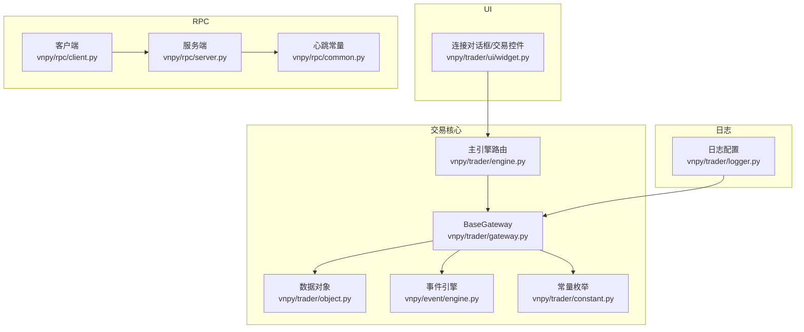
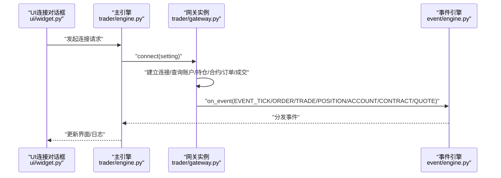
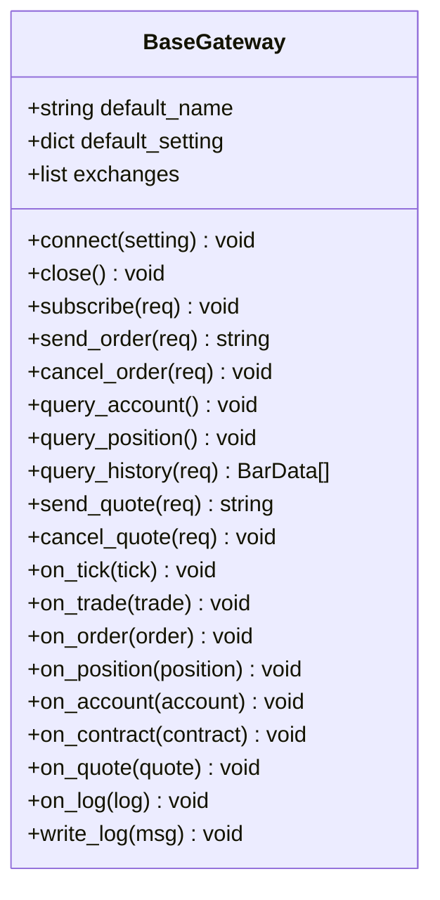
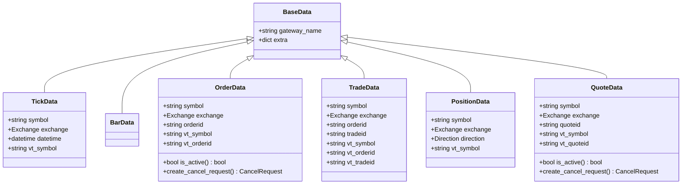
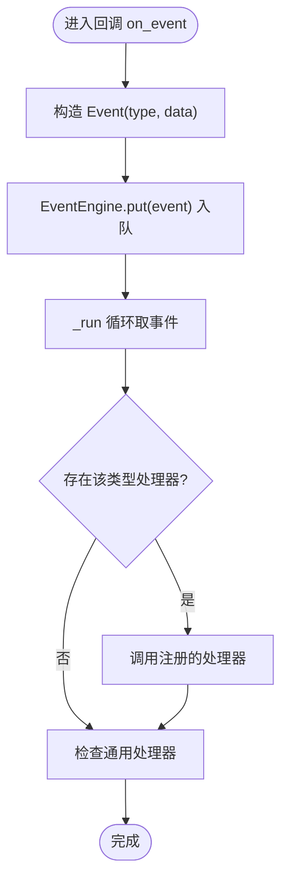
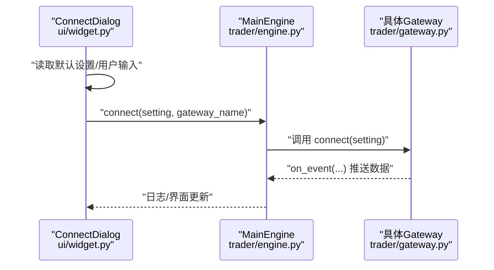
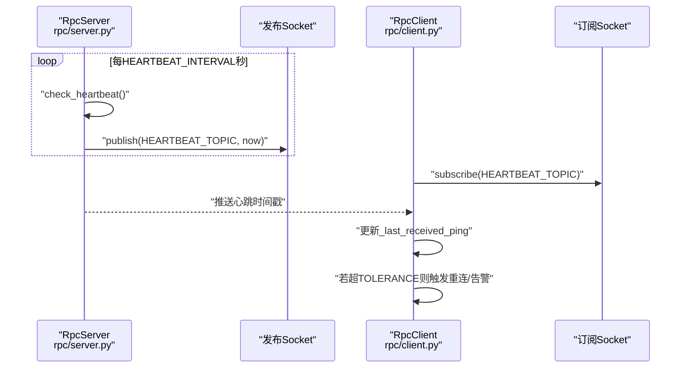
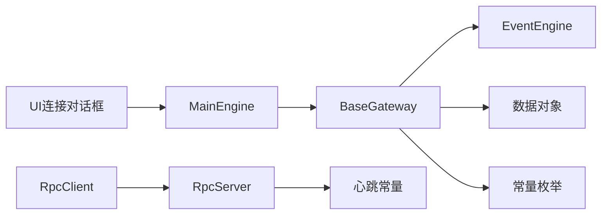

# 自定义网关开发指南

<cite>
**本文引用的文件列表**
- [vnpy/trader/gateway.py](file://vnpy/trader/gateway.py)
- [vnpy/trader/object.py](file://vnpy/trader/object.py)
- [vnpy/trader/engine.py](file://vnpy/trader/engine.py)
- [vnpy/event/engine.py](file://vnpy/event/engine.py)
- [vnpy/trader/logger.py](file://vnpy/trader/logger.py)
- [vnpy/rpc/client.py](file://vnpy/rpc/client.py)
- [vnpy/rpc/server.py](file://vnpy/rpc/server.py)
- [vnpy/rpc/common.py](file://vnpy/rpc/common.py)
- [vnpy/trader/constant.py](file://vnpy/trader/constant.py)
- [vnpy/trader/ui/widget.py](file://vnpy/trader/ui/widget.py)
</cite>

## 目录
1. [引言](#引言)
2. [项目结构](#项目结构)
3. [核心组件](#核心组件)
4. [架构总览](#架构总览)
5. [详细组件分析](#详细组件分析)
6. [依赖关系分析](#依赖关系分析)
7. [性能与并发特性](#性能与并发特性)
8. [调试与日志规范](#调试与日志规范)
9. [单元测试建议](#单元测试建议)
10. [故障排查指南](#故障排查指南)
11. [结论](#结论)

## 引言
本指南面向希望在vn.py平台上开发“自定义交易网关”的工程师，系统性讲解如何从继承BaseGateway开始，逐步实现所有抽象方法，并覆盖线程安全、异步处理、自动重连与心跳检测、调试与日志、以及单元测试等关键主题。文档以仓库中的实际代码为依据，结合架构图与流程图帮助读者快速上手并构建稳定可靠的网关。

## 项目结构
vn.py采用模块化分层设计：
- 交易核心层：网关基类、数据对象、常量枚举、事件引擎
- UI层：连接对话框、交易界面等
- RPC层：基于ZeroMQ的心跳与发布订阅通信
- 日志层：统一的日志配置与输出

图表来源
- [vnpy/trader/gateway.py](file://vnpy/trader/gateway.py#L1-L273)
- [vnpy/trader/object.py](file://vnpy/trader/object.py#L1-L200)
- [vnpy/event/engine.py](file://vnpy/event/engine.py#L1-L146)
- [vnpy/trader/engine.py](file://vnpy/trader/engine.py#L241-L275)
- [vnpy/trader/ui/widget.py](file://vnpy/trader/ui/widget.py#L587-L701)
- [vnpy/rpc/client.py](file://vnpy/rpc/client.py#L1-L101)
- [vnpy/rpc/server.py](file://vnpy/rpc/server.py#L1-L140)
- [vnpy/rpc/common.py](file://vnpy/rpc/common.py#L1-L10)
- [vnpy/trader/logger.py](file://vnpy/trader/logger.py#L1-L56)

章节来源
- [vnpy/trader/gateway.py](file://vnpy/trader/gateway.py#L1-L273)
- [vnpy/trader/object.py](file://vnpy/trader/object.py#L1-L200)
- [vnpy/event/engine.py](file://vnpy/event/engine.py#L1-L146)
- [vnpy/trader/engine.py](file://vnpy/trader/engine.py#L241-L275)
- [vnpy/trader/ui/widget.py](file://vnpy/trader/ui/widget.py#L587-L701)
- [vnpy/rpc/client.py](file://vnpy/rpc/client.py#L1-L101)
- [vnpy/rpc/server.py](file://vnpy/rpc/server.py#L1-L140)
- [vnpy/rpc/common.py](file://vnpy/rpc/common.py#L1-L10)
- [vnpy/trader/logger.py](file://vnpy/trader/logger.py#L1-L56)

## 核心组件
- BaseGateway：定义网关抽象接口与回调推送机制，要求实现connect/close/subscribe/send_order/cancel_order/query_account/query_position等方法；同时提供on_tick/on_trade/on_order/on_position/on_account/on_contract/on_quote/on_log/write_log等回调与日志写入能力。
- 数据对象：TickData/BarData/OrderData/TradeData/PositionData/ContractData/QuoteData等，统一vt_symbol/vt_orderid/vt_tradeid/vt_quoteid命名规则，便于跨组件识别与事件分发。
- 常量枚举：Direction/Offset/Status/OrderType/Exchange/Interval等，保证状态机与业务一致性。
- 事件引擎：EventEngine负责事件队列、定时器与处理器注册，是网关与上层应用解耦的关键。
- 主引擎路由：MainEngine封装了发送订单/撤单/报价等入口，调用具体Gateway实例的方法。
- UI连接对话框：负责读取默认配置、用户输入并发起连接请求。
- RPC心跳：基于ZeroMQ的发布订阅与心跳检测，用于长连接健康监控。

章节来源
- [vnpy/trader/gateway.py](file://vnpy/trader/gateway.py#L33-L273)
- [vnpy/trader/object.py](file://vnpy/trader/object.py#L1-L200)
- [vnpy/trader/constant.py](file://vnpy/trader/constant.py#L1-L161)
- [vnpy/event/engine.py](file://vnpy/event/engine.py#L1-L146)
- [vnpy/trader/engine.py](file://vnpy/trader/engine.py#L241-L275)
- [vnpy/trader/ui/widget.py](file://vnpy/trader/ui/widget.py#L587-L701)
- [vnpy/rpc/common.py](file://vnpy/rpc/common.py#L1-L10)

## 架构总览
下图展示从UI到主引擎再到具体网关的调用链路，以及事件回推路径。

图表来源
- [vnpy/trader/ui/widget.py](file://vnpy/trader/ui/widget.py#L587-L701)
- [vnpy/trader/engine.py](file://vnpy/trader/engine.py#L241-L275)
- [vnpy/trader/gateway.py](file://vnpy/trader/gateway.py#L93-L159)
- [vnpy/event/engine.py](file://vnpy/event/engine.py#L55-L103)

## 详细组件分析

### BaseGateway抽象与回调体系
- 抽象方法清单（必须实现）：connect/close/subscribe/send_order/cancel_order/query_account/query_position。
- 回调推送：on_tick/on_trade/on_order/on_position/on_account/on_contract/on_quote/on_log/write_log，均通过事件引擎分发。
- 线程安全要求：所有方法需线程安全，避免共享可变状态；回调传递的数据应视为不可变对象，必要时复制后传递。
- 非阻塞原则：所有公开方法不得阻塞，网络IO与外部调用应异步化或在后台线程执行。

图表来源
- [vnpy/trader/gateway.py](file://vnpy/trader/gateway.py#L33-L273)

章节来源
- [vnpy/trader/gateway.py](file://vnpy/trader/gateway.py#L33-L273)

### 数据对象与命名约定
- vt_symbol/vt_orderid/vt_tradeid/vt_quoteid：统一由各数据对象在构造后生成，确保跨组件唯一标识。
- ACTIVE_STATUSES：用于判断订单/报价是否仍处于活跃状态。
- 订单/报价取消：提供create_cancel_request便捷方法，直接复用symbol/exchange/orderid/quoteid。

图表来源
- [vnpy/trader/object.py](file://vnpy/trader/object.py#L1-L200)
- [vnpy/trader/object.py](file://vnpy/trader/object.py#L271-L324)

章节来源
- [vnpy/trader/object.py](file://vnpy/trader/object.py#L1-L200)
- [vnpy/trader/object.py](file://vnpy/trader/object.py#L271-L324)

### 事件引擎与非阻塞回调
- EventEngine内部维护一个队列与两个后台线程：事件处理线程与定时器线程。
- put方法将事件入队；_run循环从队列取出事件并分发给对应类型的处理器；定时器周期性产生EVENT_TIMER事件。
- 网关回调通过on_event将数据封装为Event并交由EventEngine，确保主线程不被阻塞。

图表来源
- [vnpy/event/engine.py](file://vnpy/event/engine.py#L55-L103)
- [vnpy/trader/gateway.py](file://vnpy/trader/gateway.py#L86-L100)

章节来源
- [vnpy/event/engine.py](file://vnpy/event/engine.py#L1-L146)
- [vnpy/trader/gateway.py](file://vnpy/trader/gateway.py#L86-L100)

### 主引擎路由与UI交互
- 主引擎提供send_order/cancel_order/send_quote/cancel_quote等入口，内部根据gateway_name获取具体网关实例并转发调用。
- UI连接对话框收集用户输入，保存到本地JSON，然后调用MainEngine.connect发起连接。

图表来源
- [vnpy/trader/ui/widget.py](file://vnpy/trader/ui/widget.py#L587-L701)
- [vnpy/trader/engine.py](file://vnpy/trader/engine.py#L241-L275)
- [vnpy/trader/gateway.py](file://vnpy/trader/gateway.py#L160-L209)

章节来源
- [vnpy/trader/ui/widget.py](file://vnpy/trader/ui/widget.py#L587-L701)
- [vnpy/trader/engine.py](file://vnpy/trader/engine.py#L241-L275)
- [vnpy/trader/gateway.py](file://vnpy/trader/gateway.py#L160-L209)

### RPC心跳与长连接健康监控
- 心跳常量：HEARTBEAT_TOPIC、HEARTBEAT_INTERVAL、HEARTBEAT_TOLERANCE。
- 服务端：定时检查是否需要发布心跳，使用发布-订阅模式向客户端广播心跳时间戳。
- 客户端：订阅心跳主题，记录最近一次收到心跳的时间；若超过容差仍未收到心跳，则判定连接异常。

图表来源
- [vnpy/rpc/server.py](file://vnpy/rpc/server.py#L1-L140)
- [vnpy/rpc/client.py](file://vnpy/rpc/client.py#L1-L101)
- [vnpy/rpc/common.py](file://vnpy/rpc/common.py#L1-L10)

章节来源
- [vnpy/rpc/server.py](file://vnpy/rpc/server.py#L1-L140)
- [vnpy/rpc/client.py](file://vnpy/rpc/client.py#L1-L101)
- [vnpy/rpc/common.py](file://vnpy/rpc/common.py#L1-L10)

## 依赖关系分析
- BaseGateway依赖事件引擎进行回调分发；依赖数据对象与常量枚举保证数据一致性与状态机正确性。
- 主引擎路由依赖具体Gateway实例；UI依赖MainEngine发起连接。
- RPC层独立于交易核心，但可作为网关底层通信通道，配合心跳机制保障长连接健康。

图表来源
- [vnpy/trader/gateway.py](file://vnpy/trader/gateway.py#L33-L273)
- [vnpy/event/engine.py](file://vnpy/event/engine.py#L1-L146)
- [vnpy/trader/object.py](file://vnpy/trader/object.py#L1-L200)
- [vnpy/trader/constant.py](file://vnpy/trader/constant.py#L1-L161)
- [vnpy/trader/engine.py](file://vnpy/trader/engine.py#L241-L275)
- [vnpy/trader/ui/widget.py](file://vnpy/trader/ui/widget.py#L587-L701)
- [vnpy/rpc/client.py](file://vnpy/rpc/client.py#L1-L101)
- [vnpy/rpc/server.py](file://vnpy/rpc/server.py#L1-L140)
- [vnpy/rpc/common.py](file://vnpy/rpc/common.py#L1-L10)

章节来源
- [vnpy/trader/gateway.py](file://vnpy/trader/gateway.py#L33-L273)
- [vnpy/event/engine.py](file://vnpy/event/engine.py#L1-L146)
- [vnpy/trader/engine.py](file://vnpy/trader/engine.py#L241-L275)
- [vnpy/trader/ui/widget.py](file://vnpy/trader/ui/widget.py#L587-L701)
- [vnpy/rpc/client.py](file://vnpy/rpc/client.py#L1-L101)
- [vnpy/rpc/server.py](file://vnpy/rpc/server.py#L1-L140)
- [vnpy/rpc/common.py](file://vnpy/rpc/common.py#L1-L10)

## 性能与并发特性
- 线程安全
  - 所有公共方法必须线程安全，避免共享可变状态；回调传递的对象应视为不可变，必要时复制后再传递。
  - 使用锁保护共享资源（如RPC客户端/服务端的发送操作），参考RpcClient/RpcServer中的_lock使用。
- 非阻塞
  - 网络IO与外部调用必须异步化，通过后台线程或事件驱动方式处理，避免阻塞主线程。
- 事件驱动
  - 利用EventEngine的队列与线程模型，将耗时处理放入后台线程，仅在回调中做轻量级事件分发。
- 资源管理
  - 正确关闭连接、释放套接字与线程；在stop/exit流程中确保资源回收。

章节来源
- [vnpy/trader/gateway.py](file://vnpy/trader/gateway.py#L42-L67)
- [vnpy/rpc/client.py](file://vnpy/rpc/client.py#L1-L101)
- [vnpy/rpc/server.py](file://vnpy/rpc/server.py#L1-L140)
- [vnpy/event/engine.py](file://vnpy/event/engine.py#L55-L103)

## 调试与日志规范
- 日志配置
  - 使用loguru统一格式化输出，支持控制台与文件输出；通过extra字段携带gateway_name，便于区分不同网关日志。
  - 可通过配置项调整日志级别与输出位置。
- 异常捕获
  - 主线程与后台线程异常钩子会记录异常堆栈并通过UI弹窗提示，便于定位问题。
- 调试建议
  - 在关键路径添加日志点，记录参数、返回值与状态变化。
  - 对网络请求增加超时与重试策略，记录失败原因与重试次数。
  - 使用断言与边界条件检查，尽早暴露逻辑错误。

章节来源
- [vnpy/trader/logger.py](file://vnpy/trader/logger.py#L1-L56)
- [vnpy/trader/ui/widget.py](file://vnpy/trader/ui/widget.py#L43-L80)

## 单元测试建议
- 测试目标
  - 网关初始化与配置加载、连接/断开流程、订阅/下单/撤单/报价/历史数据查询等核心功能。
  - 回调事件的正确性与顺序性，确保vt_symbol/vt_orderid/vt_tradeid/vt_quoteid生成一致。
  - 线程安全与并发场景下的稳定性，模拟高并发请求与异常中断。
- 测试策略
  - Mock外部依赖（如网络、交易所API），验证网关内部逻辑与事件分发。
  - 使用EventEngine的处理器注册/注销能力，验证事件分发是否按预期路由。
  - 针对RPC心跳场景，构造心跳缺失与恢复场景，验证重连策略。
- 覆盖范围
  - 关键分支：成功/失败、超时/重试、活跃/非活跃状态。
  - 边界条件：空参数、重复订阅、重复下单、重复撤单等。

章节来源
- [vnpy/event/engine.py](file://vnpy/event/engine.py#L111-L146)
- [vnpy/trader/gateway.py](file://vnpy/trader/gateway.py#L160-L273)
- [vnpy/rpc/common.py](file://vnpy/rpc/common.py#L1-L10)

## 故障排查指南
- 连接失败
  - 检查setting参数是否完整；确认网络连通性与端口绑定。
  - 查看日志中connect阶段的写入信息，定位查询账户/持仓/合约/订单/成交失败的具体环节。
- 心跳异常
  - 若客户端长时间未收到心跳，检查服务端是否正常运行、发布频率是否符合预期。
  - 校验客户端订阅主题与服务端发布主题一致。
- 回调未到达
  - 确认EventEngine已启动且处理器已注册；检查事件类型字符串是否匹配。
  - 检查回调中传递的数据对象是否被修改，避免后续处理出现不一致。
- 并发问题
  - 检查是否存在共享可变状态；必要时引入锁或使用线程安全的数据结构。
  - 避免在回调中执行耗时操作，改用异步任务或后台线程。

章节来源
- [vnpy/trader/gateway.py](file://vnpy/trader/gateway.py#L160-L209)
- [vnpy/rpc/server.py](file://vnpy/rpc/server.py#L129-L140)
- [vnpy/rpc/client.py](file://vnpy/rpc/client.py#L53-L101)
- [vnpy/event/engine.py](file://vnpy/event/engine.py#L55-L103)

## 结论
开发自定义交易网关的核心在于严格遵循BaseGateway的抽象契约，确保线程安全与非阻塞特性，利用事件引擎实现解耦与异步处理，并通过心跳与重连机制保障长连接的稳定性。配合完善的日志与单元测试，可以显著提升网关的可靠性与可维护性。建议在实现过程中以本指南为纲，结合实际业务场景迭代优化。