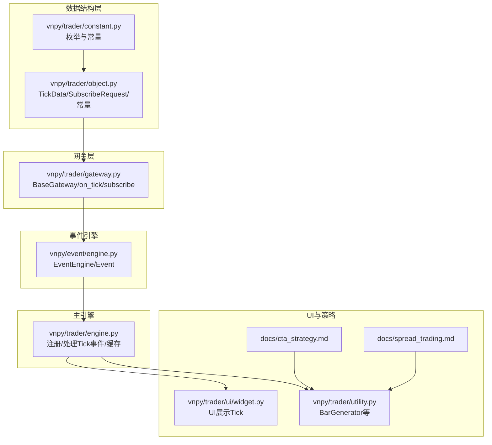
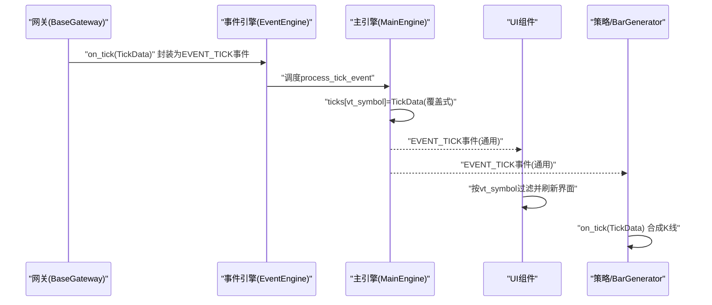
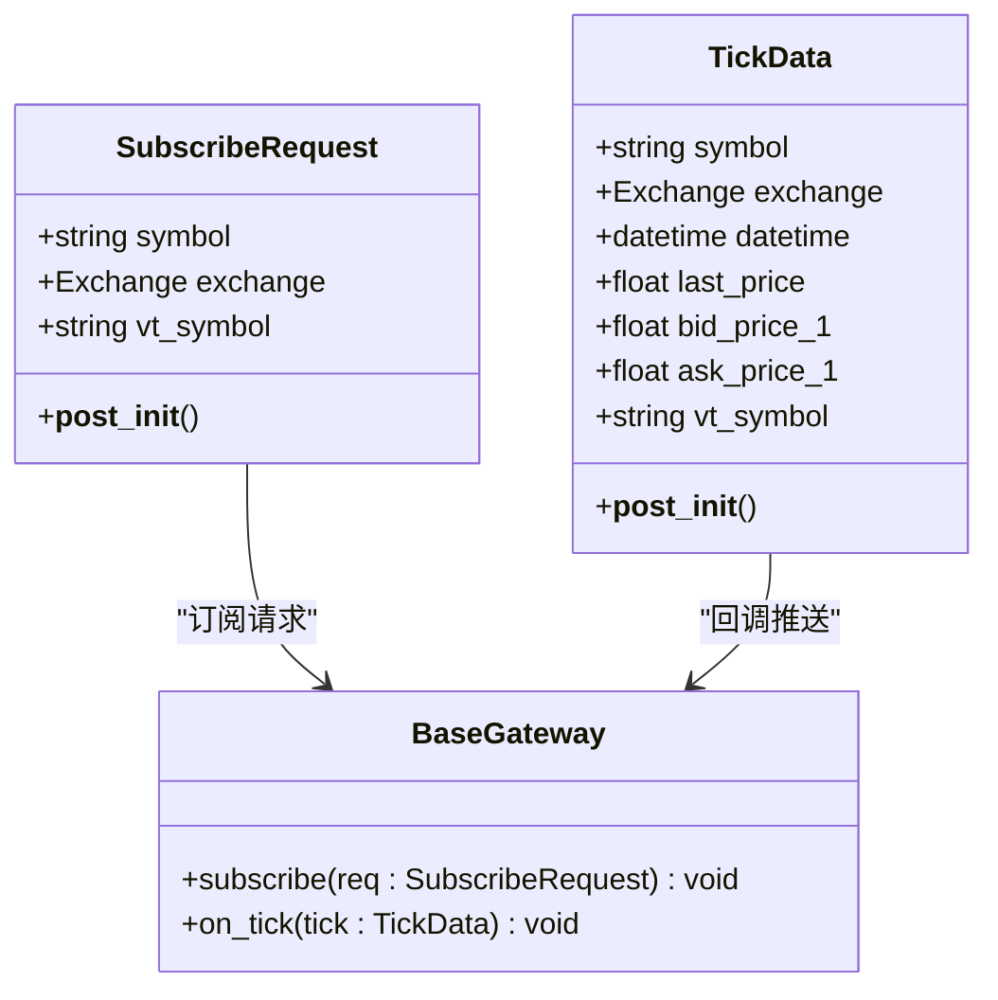
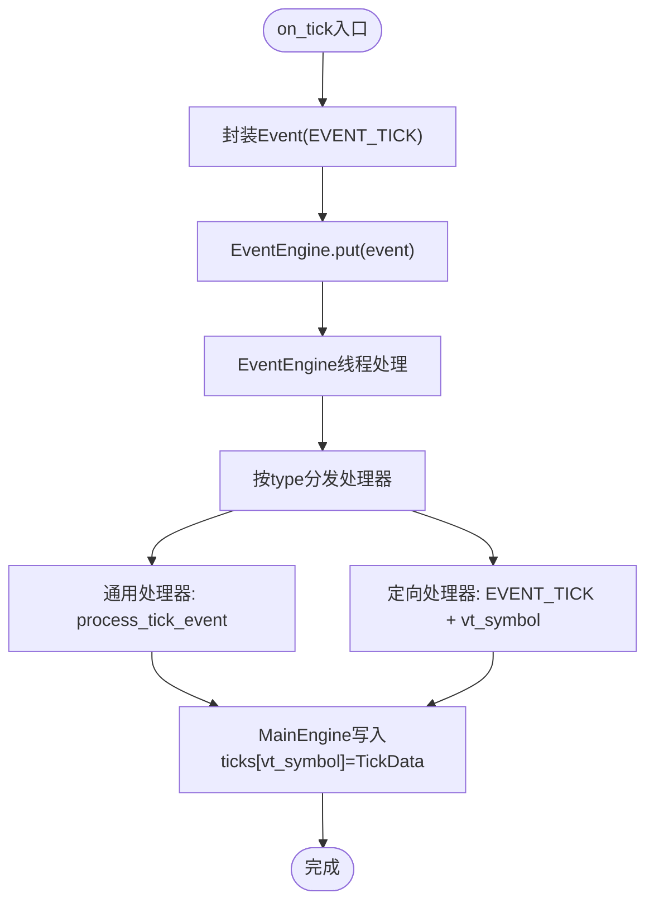
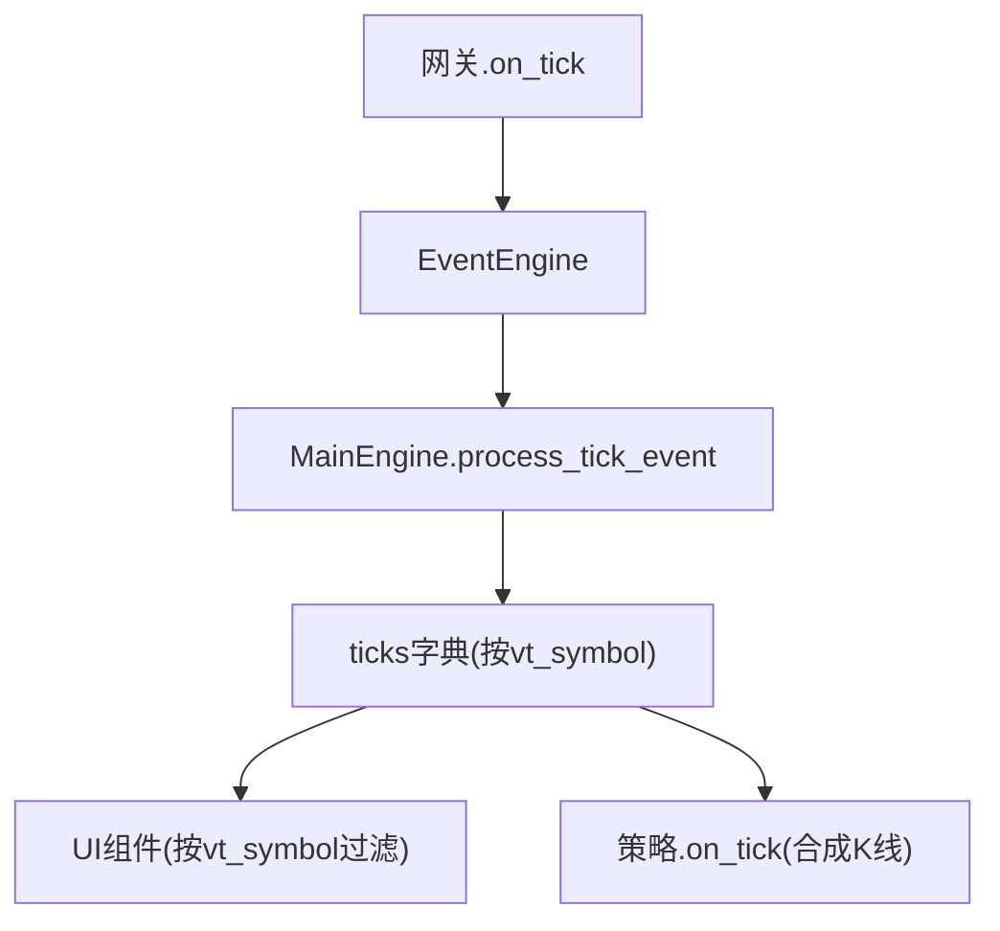
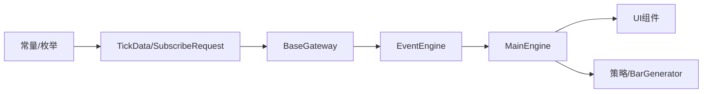

# 行情订阅

<cite>
**本文引用的文件**
- [vnpy/trader/object.py](file://vnpy/trader/object.py)
- [vnpy/trader/gateway.py](file://vnpy/trader/gateway.py)
- [vnpy/event/engine.py](file://vnpy/event/engine.py)
- [vnpy/trader/engine.py](file://vnpy/trader/engine.py)
- [vnpy/trader/constant.py](file://vnpy/trader/constant.py)
- [vnpy/trader/ui/widget.py](file://vnpy/trader/ui/widget.py)
- [vnpy/trader/utility.py](file://vnpy/trader/utility.py)
- [docs/community/app/cta_strategy.md](file://docs/community/app/cta_strategy.md)
- [docs/community/app/spread_trading.md](file://docs/community/app/spread_trading.md)
- [docs/community/info/veighna_trader.md](file://docs/community/info/veighna_trader.md)
- [docs/elite/info/elite_trader.md](file://docs/elite/info/elite_trader.md)
</cite>

## 目录
1. [引言](#引言)
2. [项目结构](#项目结构)
3. [核心组件](#核心组件)
4. [架构总览](#架构总览)
5. [详细组件分析](#详细组件分析)
6. [依赖关系分析](#依赖关系分析)
7. [性能考量与优化建议](#性能考量与优化建议)
8. [故障排查指南](#故障排查指南)
9. [结论](#结论)

## 引言
本文件围绕vnpy框架中的“行情订阅”功能展开，重点解析以下方面：
- SubscribeRequest数据结构的设计与使用方式
- on_tick回调方法的事件推送流程
- TickData对象的线程安全处理原则
- 网关如何通过EventEngine将行情数据分发到系统各组件
- 高频行情订阅的性能优化建议与流量控制策略

目标是帮助读者从架构到实现细节全面理解vnpy的行情订阅机制，并能在实际开发中正确使用与优化。

## 项目结构
与行情订阅直接相关的核心代码分布在以下模块：
- 数据结构与常量：vnpy/trader/object.py、vnpy/trader/constant.py
- 网关抽象与回调：vnpy/trader/gateway.py
- 事件引擎：vnpy/event/engine.py
- 主引擎事件处理与缓存：vnpy/trader/engine.py
- UI展示与策略回调入口：vnpy/trader/ui/widget.py、vnpy/trader/utility.py
- 文档与使用说明：docs/community/app/cta_strategy.md、docs/community/app/spread_trading.md、docs/community/info/veighna_trader.md、docs/elite/info/elite_trader.md

**图表来源**
- [vnpy/trader/object.py](file://vnpy/trader/object.py#L30-L85)
- [vnpy/trader/gateway.py](file://vnpy/trader/gateway.py#L93-L116)
- [vnpy/event/engine.py](file://vnpy/event/engine.py#L16-L110)
- [vnpy/trader/engine.py](file://vnpy/trader/engine.py#L361-L377)
- [vnpy/trader/ui/widget.py](file://vnpy/trader/ui/widget.py#L861-L888)
- [vnpy/trader/utility.py](file://vnpy/trader/utility.py#L165-L211)
- [docs/community/app/cta_strategy.md](file://docs/community/app/cta_strategy.md#L573-L590)
- [docs/community/app/spread_trading.md](file://docs/community/app/spread_trading.md#L518-L533)

**章节来源**
- [vnpy/trader/object.py](file://vnpy/trader/object.py#L30-L85)
- [vnpy/trader/gateway.py](file://vnpy/trader/gateway.py#L93-L116)
- [vnpy/event/engine.py](file://vnpy/event/engine.py#L16-L110)
- [vnpy/trader/engine.py](file://vnpy/trader/engine.py#L361-L377)
- [vnpy/trader/ui/widget.py](file://vnpy/trader/ui/widget.py#L861-L888)
- [vnpy/trader/utility.py](file://vnpy/trader/utility.py#L165-L211)
- [docs/community/app/cta_strategy.md](file://docs/community/app/cta_strategy.md#L573-L590)
- [docs/community/app/spread_trading.md](file://docs/community/app/spread_trading.md#L518-L533)

## 核心组件
- SubscribeRequest：用于向具体网关发起行情订阅的请求对象，包含合约标识与交易所信息，并在初始化时生成本地唯一vt_symbol。
- TickData：行情Tick数据载体，包含最新价、成交量、买卖盘口等字段，初始化时生成vt_symbol。
- BaseGateway.on_tick：将TickData封装为事件并推送到EventEngine，同时按vt_symbol细分推送。
- EventEngine：事件驱动引擎，负责事件入队、线程化处理、定时器事件与处理器注册/注销。
- MainEngine.process_tick_event：注册处理Tick事件，将TickData写入内存缓存（按vt_symbol覆盖式保存）。
- UI与策略：UI组件按vt_symbol过滤并展示Tick；策略通过on_tick回调接收Tick并合成K线。

**章节来源**
- [vnpy/trader/object.py](file://vnpy/trader/object.py#L30-L85)
- [vnpy/trader/object.py](file://vnpy/trader/object.py#L306-L318)
- [vnpy/trader/gateway.py](file://vnpy/trader/gateway.py#L93-L116)
- [vnpy/event/engine.py](file://vnpy/event/engine.py#L16-L110)
- [vnpy/trader/engine.py](file://vnpy/trader/engine.py#L361-L377)
- [vnpy/trader/ui/widget.py](file://vnpy/trader/ui/widget.py#L861-L888)
- [vnpy/trader/utility.py](file://vnpy/trader/utility.py#L165-L211)

## 架构总览
下面的序列图展示了从网关产生Tick到UI与策略消费的完整链路。

**图表来源**
- [vnpy/trader/gateway.py](file://vnpy/trader/gateway.py#L93-L116)
- [vnpy/event/engine.py](file://vnpy/event/engine.py#L66-L79)
- [vnpy/trader/engine.py](file://vnpy/trader/engine.py#L361-L377)
- [vnpy/trader/ui/widget.py](file://vnpy/trader/ui/widget.py#L861-L888)
- [vnpy/trader/utility.py](file://vnpy/trader/utility.py#L165-L211)

## 详细组件分析

### SubscribeRequest数据结构设计与使用
- 设计要点
  - 字段：symbol、exchange，用于唯一标识订阅目标。
  - 初始化逻辑：在__post_init__中生成vt_symbol，统一跨模块使用的本地符号。
- 使用方式
  - 网关侧：BaseGateway.subscribe(req: SubscribeRequest)为抽象方法，具体网关实现负责对接底层行情源。
  - 上层应用：通过订阅接口传入vt_symbol或由上层构造SubscribeRequest后调用网关subscribe。
- 与vt_symbol的关系
  - vt_symbol在SubscribeRequest与TickData中均存在，保证了订阅、推送与UI展示的一致性。

**图表来源**
- [vnpy/trader/object.py](file://vnpy/trader/object.py#L306-L318)
- [vnpy/trader/object.py](file://vnpy/trader/object.py#L30-L85)
- [vnpy/trader/gateway.py](file://vnpy/trader/gateway.py#L190-L194)
- [vnpy/trader/gateway.py](file://vnpy/trader/gateway.py#L93-L116)

**章节来源**
- [vnpy/trader/object.py](file://vnpy/trader/object.py#L306-L318)
- [vnpy/trader/gateway.py](file://vnpy/trader/gateway.py#L190-L194)

### on_tick回调与事件推送流程
- on_tick职责
  - 将TickData封装为Event(EVENT_TICK)，并通过on_event统一推送。
  - 同时推送EVENT_TICK + tick.vt_symbol的定向事件，便于按合约精确分发。
- 事件引擎处理
  - EventEngine在独立线程中循环从队列取事件并分发给已注册处理器。
  - 通用处理器与定向处理器分别处理。
- 主引擎处理
  - MainEngine.register_event注册process_tick_event，接收Tick事件并写入ticks字典（按vt_symbol覆盖）。

**图表来源**
- [vnpy/trader/gateway.py](file://vnpy/trader/gateway.py#L93-L116)
- [vnpy/event/engine.py](file://vnpy/event/engine.py#L55-L88)
- [vnpy/trader/engine.py](file://vnpy/trader/engine.py#L361-L377)

**章节来源**
- [vnpy/trader/gateway.py](file://vnpy/trader/gateway.py#L93-L116)
- [vnpy/event/engine.py](file://vnpy/event/engine.py#L55-L88)
- [vnpy/trader/engine.py](file://vnpy/trader/engine.py#L361-L377)

### TickData对象的线程安全处理原则
- 线程模型
  - EventEngine运行在独立线程中，事件处理器在该线程同步执行，避免复杂线程同步。
- 网关回调约束
  - 文档明确要求传递给回调的XxxData对象应保持“常量”，即不应在回调后被修改；若缓存引用，应在传递前复制一份。
- 实践建议
  - 在网关侧生成TickData后，不要在回调之外再修改其字段；如需缓存，使用浅拷贝或复制对象后再传递。
  - 主引擎对ticks的写入是覆盖式，避免并发写冲突；但UI与策略仍需注意在回调线程中处理，避免跨线程共享可变状态。

**章节来源**
- [vnpy/trader/gateway.py](file://vnpy/trader/gateway.py#L40-L67)
- [vnpy/event/engine.py](file://vnpy/event/engine.py#L80-L103)

### 网关通过EventEngine分发行情到系统各组件
- 注册与分发
  - MainEngine在启动时注册EVENT_TICK处理器，接收Tick事件并写入内存缓存。
  - UI组件可注册EVENT_TICK或定向vt_symbol事件，按合约过滤展示。
  - 策略通过on_tick回调接收TickData，通常用于合成K线。
- 数据流向
  - 网关on_tick -> EventEngine -> MainEngine.process_tick_event -> ticks缓存 -> UI/策略消费。

**图表来源**
- [vnpy/trader/gateway.py](file://vnpy/trader/gateway.py#L93-L116)
- [vnpy/trader/engine.py](file://vnpy/trader/engine.py#L361-L377)
- [vnpy/trader/ui/widget.py](file://vnpy/trader/ui/widget.py#L861-L888)
- [vnpy/trader/utility.py](file://vnpy/trader/utility.py#L165-L211)

**章节来源**
- [vnpy/trader/engine.py](file://vnpy/trader/engine.py#L361-L377)
- [vnpy/trader/ui/widget.py](file://vnpy/trader/ui/widget.py#L861-L888)
- [vnpy/trader/utility.py](file://vnpy/trader/utility.py#L165-L211)

### 高频行情订阅的性能优化与流量控制
- 事件引擎特性
  - 轻量级实现，无外部依赖；线程安全队列；处理器按顺序同步执行，避免并发。
  - 处理器应避免耗时操作；必要时可使用线程池或异步任务。
- Tick缓存与消费
  - 主引擎采用覆盖式写入ticks，仅保留最新Tick，降低内存占用。
  - UI与策略应尽量在回调中做轻量处理，避免阻塞事件线程。
- 流量控制策略
  - 合约粒度：按vt_symbol定向订阅，减少无关Tick进入处理链路。
  - 屏蔽无效Tick：在策略层或UI层过滤last_price为0等无效数据。
  - 批量与合并：对高频Tick进行合并或降采样（例如仅处理每秒一次的最新值）。
  - 资源隔离：将重计算逻辑迁移到独立线程或定时器事件中，避免阻塞事件引擎。
- 文档参考
  - 策略层on_tick回调与BarGenerator使用，体现高频Tick的典型处理模式。

**章节来源**
- [vnpy/event/engine.py](file://vnpy/event/engine.py#L80-L103)
- [vnpy/trader/engine.py](file://vnpy/trader/engine.py#L361-L377)
- [vnpy/trader/utility.py](file://vnpy/trader/utility.py#L165-L211)
- [docs/community/app/cta_strategy.md](file://docs/community/app/cta_strategy.md#L573-L590)
- [docs/community/app/spread_trading.md](file://docs/community/app/spread_trading.md#L518-L533)

## 依赖关系分析
- 组件耦合
  - BaseGateway与EventEngine解耦：通过事件接口传递数据，不直接共享可变状态。
  - MainEngine与EventEngine解耦：通过事件类型与处理器注册解耦。
  - TickData作为纯数据载体，被广泛复用，但不持有可变状态。
- 外部依赖
  - EventEngine依赖标准库queue、threading、time，无第三方依赖。
- 潜在风险
  - 若处理器中执行耗时操作，可能阻塞事件线程；应遵循“轻回调、重异步”的原则。

**图表来源**
- [vnpy/trader/gateway.py](file://vnpy/trader/gateway.py#L93-L116)
- [vnpy/event/engine.py](file://vnpy/event/engine.py#L16-L110)
- [vnpy/trader/engine.py](file://vnpy/trader/engine.py#L361-L377)
- [vnpy/trader/object.py](file://vnpy/trader/object.py#L30-L85)
- [vnpy/trader/constant.py](file://vnpy/trader/constant.py#L82-L140)

**章节来源**
- [vnpy/trader/gateway.py](file://vnpy/trader/gateway.py#L93-L116)
- [vnpy/event/engine.py](file://vnpy/event/engine.py#L16-L110)
- [vnpy/trader/engine.py](file://vnpy/trader/engine.py#L361-L377)
- [vnpy/trader/object.py](file://vnpy/trader/object.py#L30-L85)
- [vnpy/trader/constant.py](file://vnpy/trader/constant.py#L82-L140)

## 性能考量与优化建议
- 回调线程模型
  - 事件引擎在独立线程中处理，处理器同步执行；避免在处理器中执行阻塞IO或长耗时计算。
- Tick缓存策略
  - 仅保留最新Tick，避免无限增长；如需历史，可在策略层或专用缓存中管理。
- 订阅粒度
  - 仅订阅所需vt_symbol，减少事件分发与处理压力。
- 屏蔽无效数据
  - 在策略或UI层过滤last_price为0等无效Tick，降低后续处理成本。
- 合成K线的时机
  - 利用BarGenerator在on_tick中增量合成，避免重复遍历历史数据。

**章节来源**
- [vnpy/event/engine.py](file://vnpy/event/engine.py#L80-L103)
- [vnpy/trader/engine.py](file://vnpy/trader/engine.py#L361-L377)
- [vnpy/trader/utility.py](file://vnpy/trader/utility.py#L165-L211)

## 故障排查指南
- 订阅无效或无Tick
  - 检查SubscribeRequest的symbol/exchange是否与交易所一致；确认vt_symbol生成正确。
  - 确认网关subscribe实现是否调用底层订阅接口。
- UI不刷新或显示异常
  - 检查UI组件是否按vt_symbol过滤；确认EVENT_TICK事件是否被注册。
- 回调阻塞或卡顿
  - 检查on_tick中是否有耗时操作；将重计算迁移至异步任务或定时器事件。
- 数据一致性问题
  - 遵循“常量对象”原则，避免在回调后修改TickData；如需缓存，先复制对象再传递。

**章节来源**
- [vnpy/trader/gateway.py](file://vnpy/trader/gateway.py#L40-L67)
- [vnpy/trader/ui/widget.py](file://vnpy/trader/ui/widget.py#L861-L888)
- [vnpy/event/engine.py](file://vnpy/event/engine.py#L80-L103)

## 结论
vnpy的行情订阅机制以事件驱动为核心，通过SubscribeRequest与TickData建立清晰的数据契约，借助EventEngine实现跨组件解耦与线程安全。on_tick回调将TickData以通用与定向两种事件形式分发，主引擎负责缓存与路由，UI与策略在各自线程中消费。高频场景下，应遵循“轻回调、重异步”的原则，并通过订阅粒度、无效数据屏蔽与K线合成策略提升整体性能与稳定性。