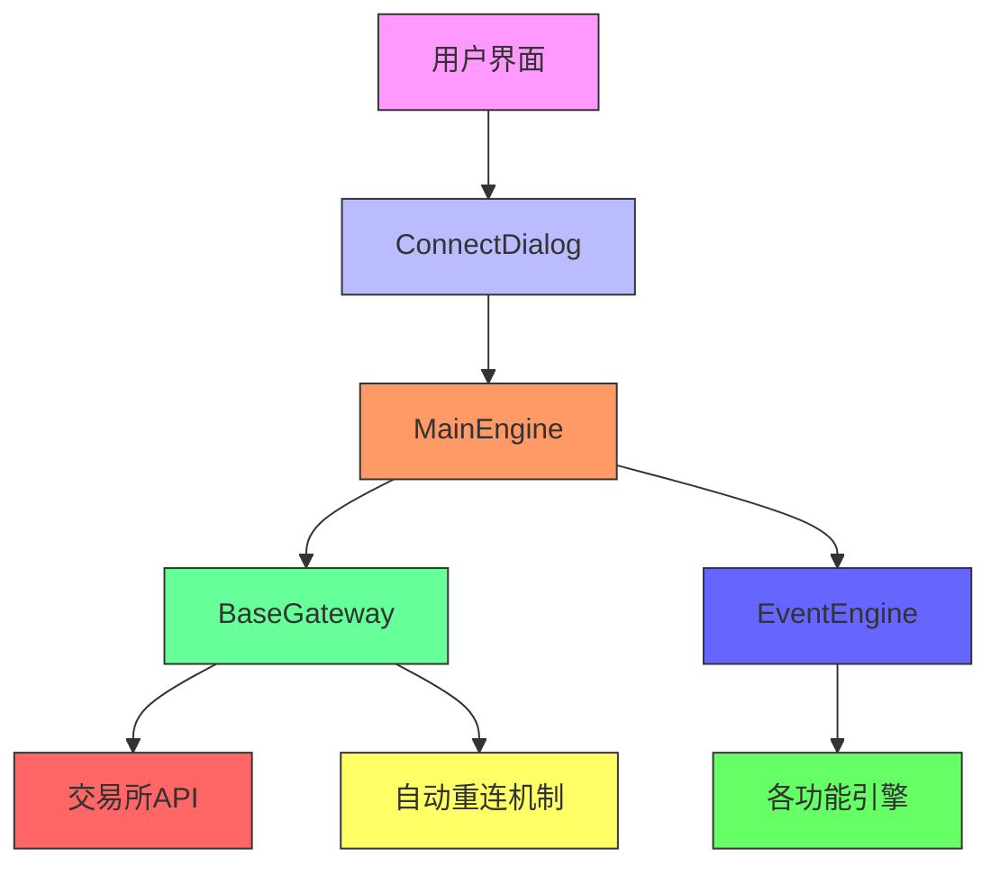
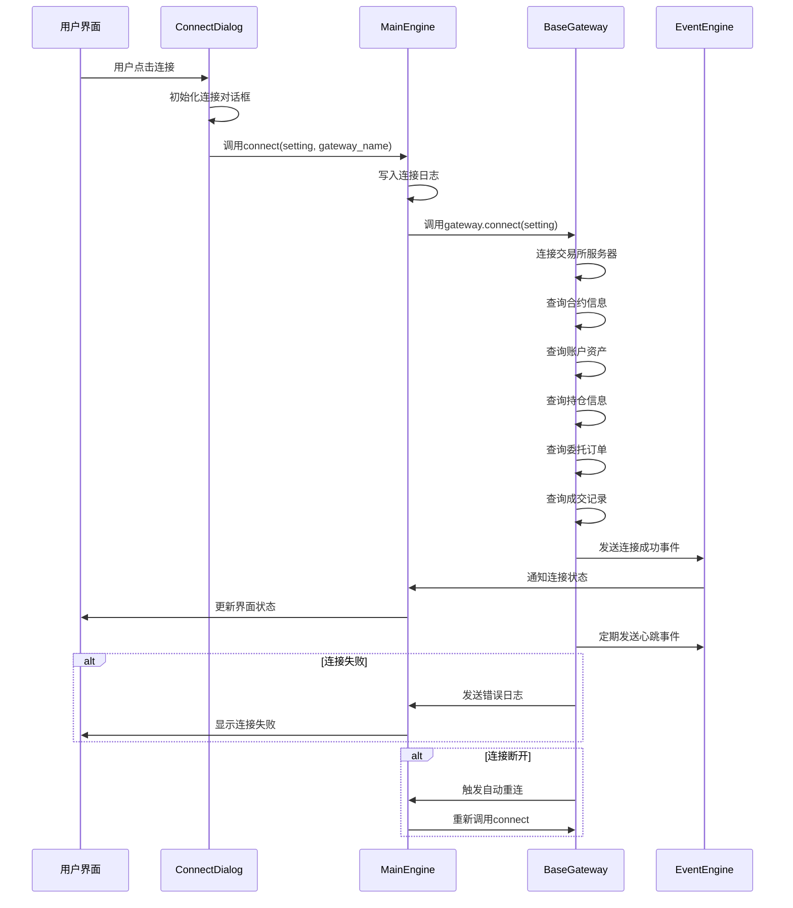
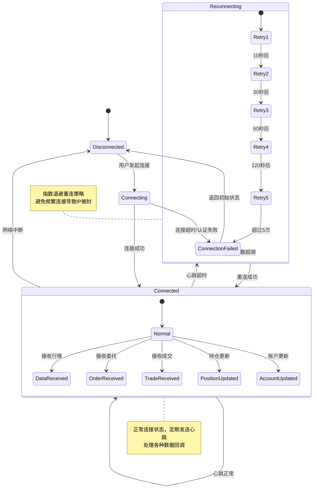

# 连接管理

<cite>
**本文档中引用的文件**  
- [gateway.py](file://vnpy/trader/gateway.py)
- [engine.py](file://vnpy/trader/engine.py)
- [setting.py](file://vnpy/trader/setting.py)
- [widget.py](file://vnpy/trader/ui/widget.py)
- [mainwindow.py](file://vnpy/trader/ui/mainwindow.py)
</cite>

## 目录
1. [引言](#引言)
2. [核心组件分析](#核心组件分析)
3. [连接管理架构](#连接管理架构)
4. [BaseGateway连接契约](#basegateway连接契约)
5. [生命周期管理机制](#生命周期管理机制)
6. [配置系统设计](#配置系统设计)
7. [异常处理与重连策略](#异常处理与重连策略)
8. [常见问题解决方案](#常见问题解决方案)
9. [最佳实践](#最佳实践)
10. [结论](#结论)

## 引言
交易网关的连接管理是量化交易平台的核心功能之一，负责与不同交易所的API进行通信和数据交互。本文档详细解析vn.py框架中交易网关的连接管理机制，重点阐述BaseGateway中connect和close方法的抽象契约与实现要求，说明网关如何通过MainEngine进行生命周期管理，包括自动重连、连接状态维护和异常处理策略。同时分析default_setting配置系统的设计原理及其在不同交易所连接中的应用，并提供连接超时、认证失败等常见问题的解决方案和最佳实践。

## 核心组件分析

**Section sources**
- [gateway.py](file://vnpy/trader/gateway.py#L33-L273)
- [engine.py](file://vnpy/trader/engine.py#L73-L634)

## 连接管理架构



**Diagram sources**
- [gateway.py](file://vnpy/trader/gateway.py#L33-L273)
- [engine.py](file://vnpy/trader/engine.py#L73-L634)
- [widget.py](file://vnpy/trader/ui/widget.py#L599-L701)
- [mainwindow.py](file://vnpy/trader/ui/mainwindow.py#L243-L248)

## BaseGateway连接契约

```mermaid
classDiagram
class BaseGateway {
+str default_name
+dict[str, str|int|float|bool] default_setting
+list[Exchange] exchanges
+__init__(event_engine, gateway_name)
+on_event(type, data)
+on_tick(tick)
+on_trade(trade)
+on_order(order)
+on_position(position)
+on_account(account)
+on_contract(contract)
+write_log(msg)
+connect(setting) abstract
+close() abstract
+subscribe(req) abstract
+send_order(req) abstract
+cancel_order(req) abstract
+query_account() abstract
+query_position() abstract
}
class MainEngine {
+dict[str, BaseGateway] gateways
+dict[str, BaseEngine] engines
+EventEngine event_engine
+add_gateway(gateway_class, gateway_name)
+connect(setting, gateway_name)
+get_gateway(gateway_name)
+get_default_setting(gateway_name)
+close()
}
BaseGateway <|-- SpecificGateway
MainEngine --> BaseGateway : 管理
ConnectDialog --> MainEngine : 发起连接
MainEngine --> EventEngine : 事件分发
note right of BaseGateway
抽象基类，定义网关接口契约
所有具体网关必须继承并实现
抽象方法
end note
note left of MainEngine
核心引擎，负责网关的生命周期
管理和事件调度
end note
```

**Diagram sources**
- [gateway.py](file://vnpy/trader/gateway.py#L33-L273)
- [engine.py](file://vnpy/trader/engine.py#L73-L634)

**Section sources**
- [gateway.py](file://vnpy/trader/gateway.py#L160-L187)
- [engine.py](file://vnpy/trader/engine.py#L213-L222)

## 生命周期管理机制



**Diagram sources**
- [gateway.py](file://vnpy/trader/gateway.py#L160-L187)
- [engine.py](file://vnpy/trader/engine.py#L213-L222)
- [widget.py](file://vnpy/trader/ui/widget.py#L667-L689)

**Section sources**
- [engine.py](file://vnpy/trader/engine.py#L213-L222)
- [widget.py](file://vnpy/trader/ui/widget.py#L667-L689)

## 配置系统设计

```mermaid
flowchart TD
A[用户输入] --> B[ConnectDialog]
B --> C{加载配置}
C --> |首次连接| D[使用default_setting]
C --> |非首次连接| E[加载保存的JSON配置]
D --> F[显示默认值]
E --> G[显示上次使用的值]
F --> H[用户修改]
G --> H
H --> I[验证输入类型]
I --> J[保存到JSON文件]
J --> K[传递给MainEngine]
K --> L[调用gateway.connect(setting)]
L --> M[网关使用配置连接]
style A fill:#f9f,stroke:#333
style B fill:#bbf,stroke:#333
style C fill:#f96,stroke:#333
style D fill:#6f9,stroke:#333
style E fill:#6f9,stroke:#333
style F fill:#6f9,stroke:#333
style G fill:#6f9,stroke:#333
style H fill:#6f9,stroke:#333
style I fill:#6f9,stroke:#333
style J fill:#6f9,stroke:#333
style K fill:#6f9,stroke:#333
style L fill:#6f9,stroke:#333
style M fill:#6f9,stroke:#333
```

**Diagram sources**
- [gateway.py](file://vnpy/trader/gateway.py#L75-L77)
- [engine.py](file://vnpy/trader/engine.py#L186-L193)
- [widget.py](file://vnpy/trader/ui/widget.py#L621-L687)

**Section sources**
- [gateway.py](file://vnpy/trader/gateway.py#L75-L77)
- [setting.py](file://vnpy/trader/setting.py#L11-L38)

## 异常处理与重连策略



**Diagram sources**
- [gateway.py](file://vnpy/trader/gateway.py#L48)
- [engine.py](file://vnpy/trader/engine.py#L290-L302)

**Section sources**
- [gateway.py](file://vnpy/trader/gateway.py#L48)
- [engine.py](file://vnpy/trader/engine.py#L290-L302)

## 常见问题解决方案

### 连接超时问题
当出现连接超时问题时，可能的原因包括网络延迟、服务器响应慢或防火墙限制。解决方案包括：

1. 检查网络连接是否正常
2. 确认交易所API地址和端口正确
3. 检查防火墙设置，确保相关端口开放
4. 增加连接超时时间设置
5. 尝试在非高峰时段连接

### 认证失败问题
认证失败通常由以下原因导致：

1. API密钥或密码错误
2. API权限不足
3. IP地址不在白名单中
4. 账户被锁定或禁用

解决方案包括：

1. 重新核对API密钥和密码
2. 检查API权限设置
3. 将当前IP添加到交易所的白名单
4. 联系交易所客服确认账户状态

### 自动重连机制失效
如果自动重连机制未能正常工作，可能的原因有：

1. 重连间隔设置过短，导致被服务器封禁
2. 网络问题持续存在
3. 网关实现未正确处理连接断开事件

建议的解决方案：

1. 采用指数退避算法调整重连间隔
2. 增加重连次数限制，避免无限重连
3. 记录重连日志，便于问题排查

**Section sources**
- [gateway.py](file://vnpy/trader/gateway.py#L48)
- [engine.py](file://vnpy/trader/engine.py#L290-L302)

## 最佳实践

### 连接管理最佳实践
1. **连接初始化**：在connect方法中完成所有必要的初始化工作，包括建立网络连接、认证、订阅行情等。
2. **资源清理**：在close方法中确保释放所有资源，包括网络连接、定时器、线程等。
3. **线程安全**：确保所有方法都是线程安全的，避免共享可变状态。
4. **非阻塞操作**：所有方法都应该是非阻塞的，避免影响主线程性能。
5. **错误处理**：对所有可能的异常情况进行妥善处理，并记录详细的错误日志。

### 配置管理最佳实践
1. **默认配置**：通过default_setting属性提供合理的默认配置值。
2. **配置验证**：在connect方法中验证配置参数的正确性。
3. **配置持久化**：将用户输入的配置保存到本地文件，方便下次使用。
4. **配置灵活性**：支持多种配置方式，如环境变量、配置文件、命令行参数等。

### 异常处理最佳实践
1. **全面覆盖**：处理所有可能的异常情况，包括网络异常、认证失败、数据格式错误等。
2. **详细日志**：记录详细的错误信息，包括错误类型、时间、上下文等。
3. **用户友好**：向用户提供清晰的错误提示，指导其如何解决问题。
4. **自动恢复**：实现智能的自动重连机制，提高系统的可用性。

**Section sources**
- [gateway.py](file://vnpy/trader/gateway.py#L43-L48)
- [engine.py](file://vnpy/trader/engine.py#L290-L302)

## 结论
vn.py框架的连接管理机制通过BaseGateway抽象基类定义了清晰的连接契约，确保了不同交易所网关实现的一致性。MainEngine作为核心引擎，负责网关的生命周期管理，实现了连接、断开、重连等关键功能。default_setting配置系统提供了灵活的配置管理能力，支持不同交易所的连接需求。自动重连机制和完善的异常处理策略保证了系统的稳定性和可靠性。通过遵循本文档中的最佳实践，开发者可以构建出高效、稳定、易维护的交易网关，为量化交易提供坚实的基础。