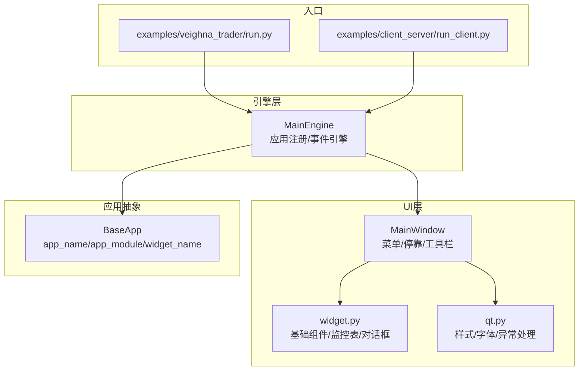
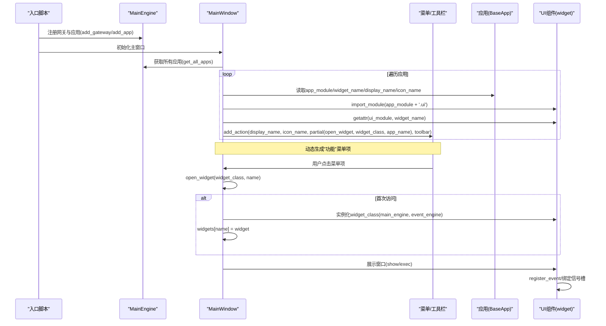
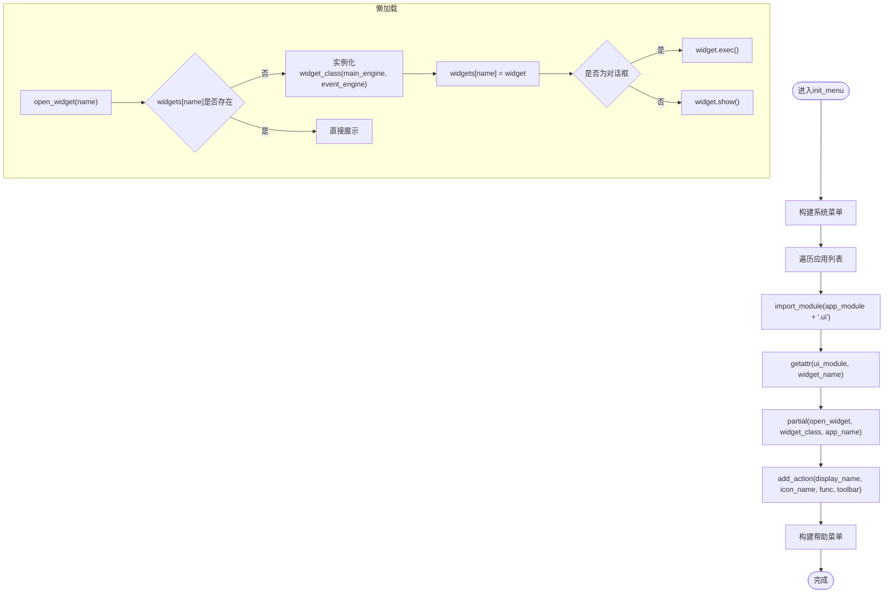
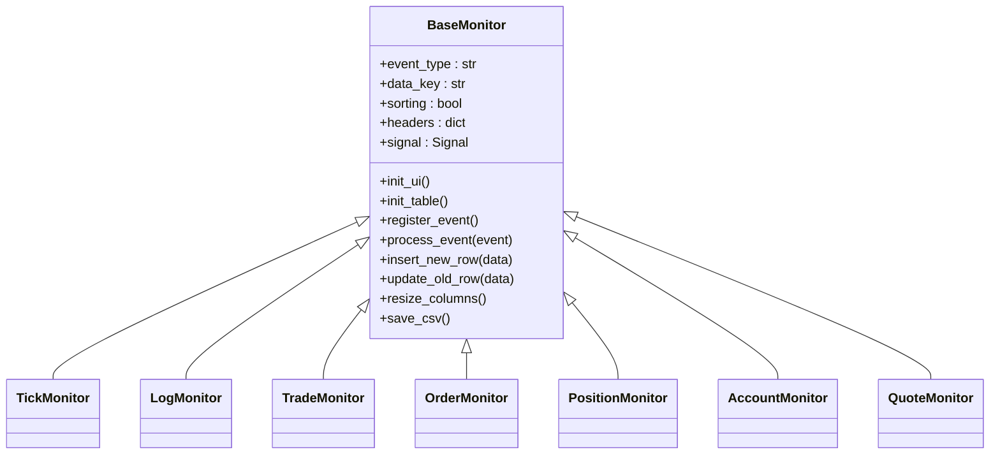
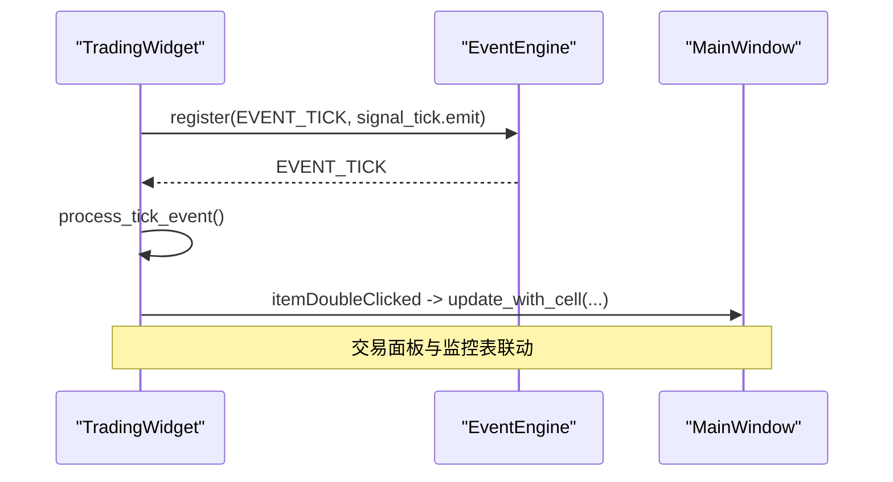
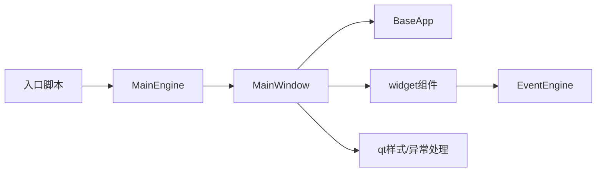

# UI组件集成与菜单生成

<cite>
**本文引用的文件**
- [vnpy/trader/ui/mainwindow.py](file://vnpy/trader/ui/mainwindow.py)
- [vnpy/trader/ui/widget.py](file://vnpy/trader/ui/widget.py)
- [vnpy/trader/ui/qt.py](file://vnpy/trader/ui/qt.py)
- [vnpy/trader/app.py](file://vnpy/trader/app.py)
- [vnpy/trader/engine.py](file://vnpy/trader/engine.py)
- [examples/veighna_trader/run.py](file://examples/veighna_trader/run.py)
- [examples/client_server/run_client.py](file://examples/client_server/run_client.py)
- [vnpy/trader/locale/__init__.py](file://vnpy/trader/locale/__init__.py)
</cite>

## 目录
1. [引言](#引言)
2. [项目结构](#项目结构)
3. [核心组件](#核心组件)
4. [架构总览](#架构总览)
5. [详细组件分析](#详细组件分析)
6. [依赖关系分析](#依赖关系分析)
7. [性能考量](#性能考量)
8. [故障排查指南](#故障排查指南)
9. [结论](#结论)
10. [附录](#附录)

## 引言
本文件围绕vnpy平台的UI组件集成机制与动态菜单生成流程展开，重点解释widget_name属性如何关联到具体UI组件类，并由MainWindow通过init_menu方法动态创建菜单项；阐述UI组件的懒加载策略（仅在用户首次访问时才实例化窗口）以优化启动性能；分析主窗口如何管理多个应用UI的布局、激活状态与事件绑定；并结合代码示例给出自定义UI组件的开发规范（信号槽连接、主题适配、多语言支持），最后提供常见问题的调试技巧。

## 项目结构
从入口到UI层的关键文件组织如下：
- 应用入口：examples目录下的示例脚本负责创建QApplication、EventEngine、MainEngine与MainWindow，并注册网关与应用。
- UI层：
  - MainWindow：主窗口，负责菜单、工具栏、停靠面板、窗口状态持久化与事件绑定。
  - widget：基础UI组件集合，包含监控表格、交易面板、连接对话框等。
  - qt：应用样式、字体、图标与异常处理封装。
- 应用抽象：BaseApp定义了app_name、app_module、widget_name等字段，作为动态菜单生成与组件实例化的契约。
- 引擎层：MainEngine负责应用注册、事件引擎初始化与全局能力暴露。

**图表来源**
- [examples/veighna_trader/run.py](file://examples/veighna_trader/run.py#L39-L87)
- [examples/client_server/run_client.py](file://examples/client_server/run_client.py#L1-L27)
- [vnpy/trader/ui/mainwindow.py](file://vnpy/trader/ui/mainwindow.py#L1-L120)
- [vnpy/trader/ui/widget.py](file://vnpy/trader/ui/widget.py#L1-L120)
- [vnpy/trader/ui/qt.py](file://vnpy/trader/ui/qt.py#L1-L72)
- [vnpy/trader/app.py](file://vnpy/trader/app.py#L1-L22)
- [vnpy/trader/engine.py](file://vnpy/trader/engine.py#L73-L160)

**章节来源**
- [examples/veighna_trader/run.py](file://examples/veighna_trader/run.py#L39-L87)
- [examples/client_server/run_client.py](file://examples/client_server/run_client.py#L1-L27)

## 核心组件
- MainWindow：负责菜单栏、工具栏、停靠面板初始化与窗口状态持久化；通过open_widget实现UI组件的懒加载；通过create_dock预置部分监控组件。
- widget：提供基础UI组件，如BaseMonitor（监控表格基类）、TradingWidget（交易面板）、ConnectDialog（网关连接对话框）等。
- qt：创建QApplication，应用qdarkstyle主题、字体与图标；统一异常捕获与提示。
- BaseApp：定义应用元数据（app_name、app_module、widget_name、display_name、icon_name），作为动态菜单生成的依据。
- MainEngine：注册应用与引擎，提供get_all_apps、get_all_gateway_names等能力，供MainWindow动态构建菜单。

**章节来源**
- [vnpy/trader/ui/mainwindow.py](file://vnpy/trader/ui/mainwindow.py#L44-L120)
- [vnpy/trader/ui/widget.py](file://vnpy/trader/ui/widget.py#L229-L399)
- [vnpy/trader/ui/qt.py](file://vnpy/trader/ui/qt.py#L21-L72)
- [vnpy/trader/app.py](file://vnpy/trader/app.py#L10-L22)
- [vnpy/trader/engine.py](file://vnpy/trader/engine.py#L120-L200)

## 架构总览
下面的架构图展示了从应用注册到菜单生成、再到组件实例化与事件绑定的整体流程。

**图表来源**
- [vnpy/trader/ui/mainwindow.py](file://vnpy/trader/ui/mainwindow.py#L100-L182)
- [vnpy/trader/ui/mainwindow.py](file://vnpy/trader/ui/mainwindow.py#L277-L290)
- [vnpy/trader/app.py](file://vnpy/trader/app.py#L10-L22)
- [vnpy/trader/engine.py](file://vnpy/trader/engine.py#L120-L160)

## 详细组件分析

### 组件A：MainWindow（动态菜单与懒加载）
- 动态菜单生成
  - 系统菜单：连接网关、退出。
  - 功能菜单：遍历MainEngine.get_all_apps()，导入app_module.ui，通过getattr(ui_module, app.widget_name)获取组件类，使用partial绑定open_widget，添加到菜单并可选加入工具栏。
  - 帮助菜单：合约查询、窗口恢复、测试邮件、社区论坛、关于。
- 懒加载策略
  - open_widget根据name检查是否已存在实例；不存在则实例化并缓存到self.widgets字典；随后按是否为对话框决定exec或show。
- 停靠面板与事件绑定
  - init_dock中通过create_dock预置交易、行情、委托、活动委托、成交、日志、资金、持仓等监控组件；对某些监控表与交易面板建立双击联动。
- 窗口状态持久化
  - save_window_setting/load_window_setting/restore_window_setting分别保存、加载与恢复窗口布局与几何尺寸。

**图表来源**
- [vnpy/trader/ui/mainwindow.py](file://vnpy/trader/ui/mainwindow.py#L100-L182)
- [vnpy/trader/ui/mainwindow.py](file://vnpy/trader/ui/mainwindow.py#L277-L290)

**章节来源**
- [vnpy/trader/ui/mainwindow.py](file://vnpy/trader/ui/mainwindow.py#L66-L120)
- [vnpy/trader/ui/mainwindow.py](file://vnpy/trader/ui/mainwindow.py#L184-L222)
- [vnpy/trader/ui/mainwindow.py](file://vnpy/trader/ui/mainwindow.py#L277-L290)

### 组件B：BaseMonitor（监控表格基类与事件绑定）
- 表头与排序：通过headers定义列、显示名、单元格类型与是否更新；init_table设置表头、交替行色与排序开关。
- 事件注册：通过signal与event_engine.register绑定事件类型，process_event根据data_key判断插入新行或更新旧行。
- 右键菜单：提供列宽自适应与数据导出CSV功能。
- 列表项更新：insert_new_row与update_old_row配合BaseCell/EnumCell等派生类实现不同字段的格式化显示。

**图表来源**
- [vnpy/trader/ui/widget.py](file://vnpy/trader/ui/widget.py#L229-L399)
- [vnpy/trader/ui/widget.py](file://vnpy/trader/ui/widget.py#L407-L598)

**章节来源**
- [vnpy/trader/ui/widget.py](file://vnpy/trader/ui/widget.py#L229-L399)
- [vnpy/trader/ui/widget.py](file://vnpy/trader/ui/widget.py#L407-L598)

### 组件C：TradingWidget（交易面板与信号槽）
- UI组成：交易所、合约、方向、开平、订单类型、价格、数量、接口等输入控件；深度档位显示区域。
- 事件绑定：注册EVENT_TICK并通过自定义signal_tick转发到process_tick_event进行实时刷新；提供双击联动更新vt_symbol与价格等能力。
- 业务交互：发送委托、全撤委托等。

**图表来源**
- [vnpy/trader/ui/widget.py](file://vnpy/trader/ui/widget.py#L692-L860)
- [vnpy/trader/ui/mainwindow.py](file://vnpy/trader/ui/mainwindow.py#L66-L100)

**章节来源**
- [vnpy/trader/ui/widget.py](file://vnpy/trader/ui/widget.py#L692-L860)
- [vnpy/trader/ui/mainwindow.py](file://vnpy/trader/ui/mainwindow.py#L66-L100)

### 组件D：ConnectDialog（网关连接对话框）
- 动态表单：根据网关默认配置生成表单项（文本框、下拉框、校验器等），支持密码隐藏与类型转换。
- 连接逻辑：收集表单值，保存配置，调用main_engine.connect发起连接。

**章节来源**
- [vnpy/trader/ui/widget.py](file://vnpy/trader/ui/widget.py#L599-L691)

### 组件E：BaseApp（应用契约）
- 字段说明：app_name、app_module、display_name、engine_class、widget_name、icon_name。
- 作用：作为动态菜单生成与组件实例化的契约，确保app_module.ui中存在widget_name对应的类。

**章节来源**
- [vnpy/trader/app.py](file://vnpy/trader/app.py#L10-L22)

### 组件F：MainEngine（应用注册与能力暴露）
- add_app：实例化应用类，注册其engine_class到引擎集合。
- get_all_apps：返回已注册的应用列表，供MainWindow动态构建菜单。
- get_all_gateway_names：用于系统菜单中的连接网关项。

**章节来源**
- [vnpy/trader/engine.py](file://vnpy/trader/engine.py#L120-L160)

## 依赖关系分析
- 入口脚本通过add_gateway与add_app向MainEngine注册应用与网关。
- MainWindow依赖MainEngine提供的应用列表与网关列表，动态导入应用模块的ui并获取widget类。
- widget中的BaseMonitor系列组件依赖EventEngine进行事件订阅与更新。
- qt.py提供全局样式、字体与异常处理，贯穿UI层。

**图表来源**
- [examples/veighna_trader/run.py](file://examples/veighna_trader/run.py#L39-L87)
- [vnpy/trader/ui/mainwindow.py](file://vnpy/trader/ui/mainwindow.py#L100-L182)
- [vnpy/trader/ui/widget.py](file://vnpy/trader/ui/widget.py#L229-L399)
- [vnpy/trader/ui/qt.py](file://vnpy/trader/ui/qt.py#L21-L72)

**章节来源**
- [examples/veighna_trader/run.py](file://examples/veighna_trader/run.py#L39-L87)
- [vnpy/trader/engine.py](file://vnpy/trader/engine.py#L120-L160)

## 性能考量
- 懒加载窗口实例：MainWindow.open_widget仅在首次访问时实例化组件，避免启动时一次性加载全部UI，降低内存占用与启动时间。
- 监控表更新优化：BaseMonitor在更新前禁用排序，更新后再启用，减少不必要的排序开销。
- 窗口状态持久化：MainWindow保存窗口布局与几何，避免每次启动重新布局带来的闪烁与计算成本。
- 事件驱动：通过EventEngine与信号槽解耦，UI组件仅在事件到达时更新，避免轮询造成的CPU浪费。

[本节为通用性能建议，无需特定文件引用]

## 故障排查指南
- 界面卡顿
  - 检查是否有大量重复的事件注册或未释放的信号槽连接。
  - 确认BaseMonitor在更新时未频繁启停排序。
  - 确保MainWindow.open_widget未在短时间内反复创建销毁组件。
- 组件冲突
  - 确认app_module与widget_name组合唯一，避免同名组件覆盖。
  - 检查工具栏与菜单项是否重复添加。
- 异常崩溃
  - 使用qt.py中的异常捕获机制，查看异常弹窗内容，定位具体堆栈。
  - 在后台线程异常时，确认threading.excepthook已被正确设置。
- 多语言与主题
  - 确认locale翻译已加载，菜单与对话框文本使用本地化函数。
  - 确认qdarkstyle样式已应用，字体与图标路径正确。

**章节来源**
- [vnpy/trader/ui/qt.py](file://vnpy/trader/ui/qt.py#L43-L126)
- [vnpy/trader/locale/__init__.py](file://vnpy/trader/locale/__init__.py#L1-L9)

## 结论
vnpy通过BaseApp定义应用契约，MainWindow在运行时动态导入应用UI模块并按widget_name定位组件类，结合懒加载策略与事件驱动更新，实现了灵活、高性能的UI集成方案。开发者只需在应用类中正确配置app_module与widget_name，即可无缝接入主菜单与工具栏，并享受统一的主题、多语言与异常处理体验。

[本节为总结性内容，无需特定文件引用]

## 附录

### 自定义UI组件开发规范（示例路径）
- 组件类命名与位置
  - 在应用模块的ui子包中定义组件类，类名与BaseApp.widget_name一致。
  - 示例路径参考：[vnpy/trader/ui/mainwindow.py](file://vnpy/trader/ui/mainwindow.py#L130-L138)
- 信号槽连接
  - 在组件构造中注册事件，例如：
    - [vnpy/trader/ui/widget.py](file://vnpy/trader/ui/widget.py#L286-L293)
    - [vnpy/trader/ui/widget.py](file://vnpy/trader/ui/widget.py#L856-L859)
- 主题适配
  - 使用qdarkstyle样式，字体与图标由qt.py统一设置：
    - [vnpy/trader/ui/qt.py](file://vnpy/trader/ui/qt.py#L21-L41)
- 多语言支持
  - 文本统一使用本地化函数：
    - [vnpy/trader/ui/mainwindow.py](file://vnpy/trader/ui/mainwindow.py#L100-L182)
    - [vnpy/trader/ui/widget.py](file://vnpy/trader/ui/widget.py#L616-L620)
    - [vnpy/trader/locale/__init__.py](file://vnpy/trader/locale/__init__.py#L1-L9)
- 应用注册与入口
  - 在入口脚本中注册应用与网关：
    - [examples/veighna_trader/run.py](file://examples/veighna_trader/run.py#L39-L87)
    - [examples/client_server/run_client.py](file://examples/client_server/run_client.py#L1-L27)