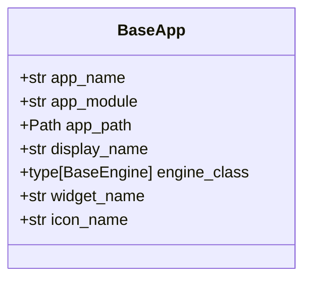
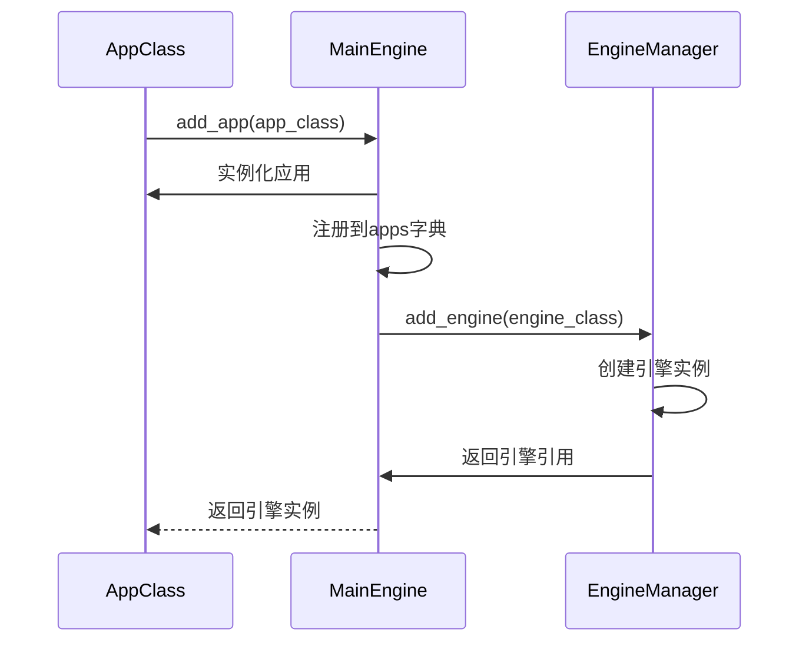
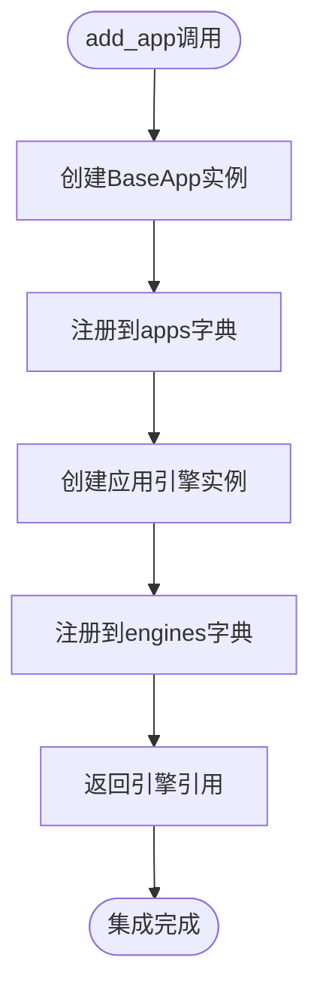
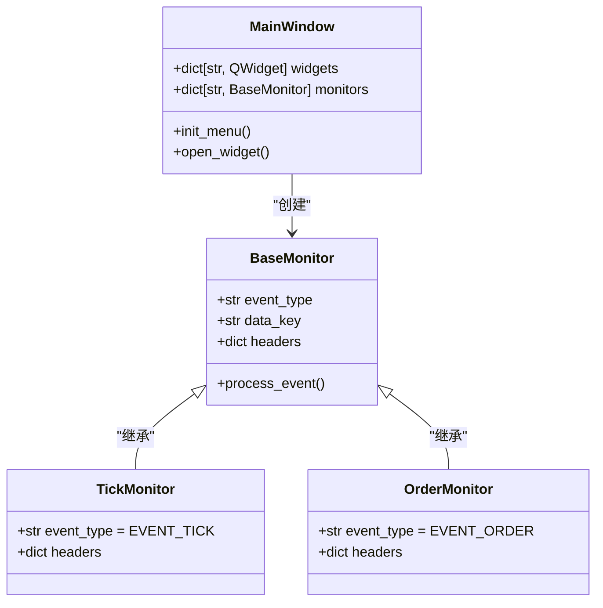
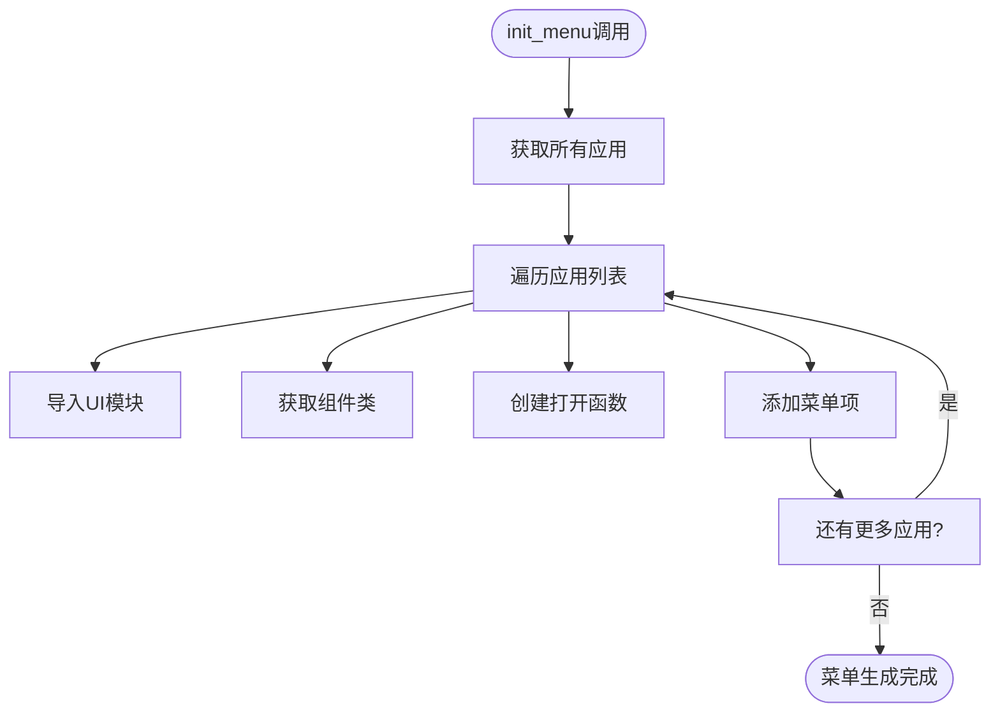
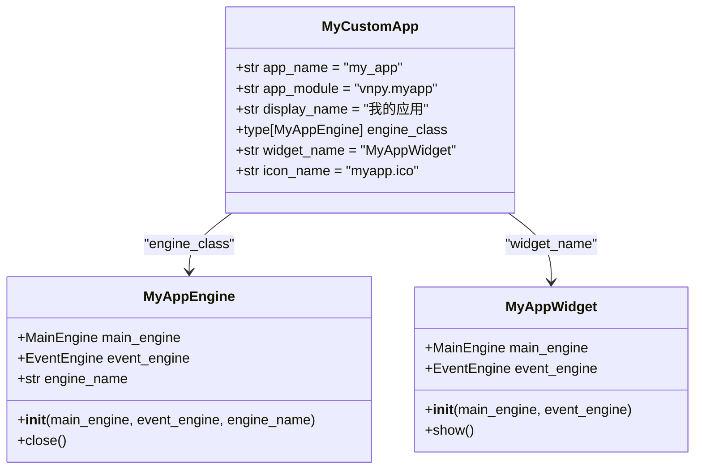

# 功能应用生态系统

<cite>
**本文档引用的文件**  
- [app.py](file://vnpy/trader/app.py)
- [engine.py](file://vnpy/trader/engine.py)
- [mainwindow.py](file://vnpy/trader/ui/mainwindow.py)
- [widget.py](file://vnpy/trader/ui/widget.py)
</cite>

## 目录
1. [引言](#引言)
2. [应用元数据定义](#应用元数据定义)
3. [应用注册与生命周期管理](#应用注册与生命周期管理)
4. [主引擎集成机制](#主引擎集成机制)
5. [UI组件协同工作](#ui组件协同工作)
6. [应用菜单动态生成](#应用菜单动态生成)
7. [自定义功能应用开发示例](#自定义功能应用开发示例)
8. [结论](#结论)

## 引言
功能应用生态系统是VeighNa Trader平台的核心架构之一，它通过BaseApp抽象类定义了一套标准化的应用开发框架。该系统实现了应用的模块化设计，支持动态注册、加载和管理，为交易策略、风险管理、数据管理等功能提供了统一的集成方式。本文档将深入解析该生态系统的设计原理和运行机制。

## 应用元数据定义
功能应用通过一系列元数据属性来定义其在系统中的身份和行为。这些元数据在BaseApp抽象类中声明，为每个应用提供了标准化的配置接口。

**图表来源**  
- [app.py](file://vnpy/trader/app.py#L15-L21)

### 元数据属性详解
- **app_name**: 应用的唯一标识符，用于创建引擎和UI组件实例
- **app_module**: 应用模块的字符串表示，用于import_module动态导入
- **app_path**: 应用文件夹的绝对路径，便于资源定位
- **display_name**: 菜单显示名称，支持国际化
- **engine_class**: 应用引擎类，处理核心业务逻辑
- **widget_name**: UI组件类名，负责用户界面展示
- **icon_name**: 应用图标文件名，用于菜单和工具栏显示

**本节来源**  
- [app.py](file://vnpy/trader/app.py#L15-L21)

## 应用注册与生命周期管理
应用的注册和生命周期管理由MainEngine统一负责，确保了应用实例的有序创建和销毁。

**图表来源**  
- [engine.py](file://vnpy/trader/engine.py#L120-L128)

### 注册流程
1. 调用MainEngine的add_app方法传入应用类
2. 实例化BaseApp子类，获取应用元数据
3. 将应用实例注册到apps字典中，以app_name为键
4. 通过add_engine方法创建并注册应用引擎
5. 返回引擎实例供后续操作使用

### 生命周期管理
应用的生命周期与MainEngine紧密耦合：
- **初始化**: 在MainEngine初始化时通过init_engines方法批量注册
- **运行**: 通过事件引擎接收和处理系统事件
- **关闭**: 在MainEngine关闭时，调用各引擎的close方法进行资源清理

**本节来源**  
- [engine.py](file://vnpy/trader/engine.py#L120-L128)
- [engine.py](file://vnpy/trader/engine.py#L289-L302)

## 主引擎集成机制
主引擎通过add_app方法实现应用的无缝集成，协调应用引擎与UI组件的协同工作。

**图表来源**  
- [engine.py](file://vnpy/trader/engine.py#L120-L128)

### 集成过程
主引擎的add_app方法是应用集成的核心：

1. **应用实例化**: 通过app_class()创建BaseApp子类实例
2. **应用注册**: 将应用实例存储在apps字典中，以app_name为键
3. **引擎创建**: 调用add_engine方法创建engine_class实例
4. **依赖注入**: 将MainEngine和EventEngine注入到应用引擎中
5. **引用返回**: 返回创建的引擎实例，供调用者使用

这种设计实现了应用与核心系统的松耦合，同时保证了必要的依赖关系。

**本节来源**  
- [engine.py](file://vnpy/trader/engine.py#L120-L128)

## UI组件协同工作
应用的UI组件通过模块化设计实现与引擎的协同工作，确保了数据与界面的分离。

**图表来源**  
- [mainwindow.py](file://vnpy/trader/ui/mainwindow.py#L53-L54)
- [widget.py](file://vnpy/trader/ui/widget.py#L229-L237)

### 组件交互模式
UI组件与应用引擎通过事件驱动模式进行交互：

1. **事件订阅**: UI组件在初始化时注册感兴趣的事件类型
2. **数据更新**: 当事件发生时，组件的process_event方法被调用
3. **界面刷新**: 根据新数据更新表格内容，保持界面实时性
4. **用户操作**: 用户通过界面操作触发命令，发送到应用引擎

这种模式实现了MVC架构，确保了业务逻辑与用户界面的分离。

**本节来源**  
- [widget.py](file://vnpy/trader/ui/widget.py#L286-L292)
- [widget.py](file://vnpy/trader/ui/widget.py#L294-L318)

## 应用菜单动态生成
主窗口通过init_menu方法实现应用菜单的动态生成，为用户提供直观的应用访问接口。

**图表来源**  
- [mainwindow.py](file://vnpy/trader/ui/mainwindow.py#L130-L138)

### 菜单生成流程
1. 调用MainEngine的get_all_apps方法获取所有注册的应用
2. 遍历应用列表，对每个应用执行以下操作：
   - 通过import_module动态导入应用的UI模块
   - 使用getattr获取指定的widget_name类
   - 使用partial创建打开组件的回调函数
   - 调用add_action方法添加菜单项和工具栏按钮
3. 完成所有应用的菜单项添加

这种动态生成机制使得新应用的集成无需修改主窗口代码，实现了真正的插件化架构。

**本节来源**  
- [mainwindow.py](file://vnpy/trader/ui/mainwindow.py#L130-L138)

## 自定义功能应用开发示例
开发自定义功能应用需要遵循标准的开发模式，包括应用类定义、引擎实现、UI组件开发和模块集成。

### 应用类定义

**图表来源**  
- [app.py](file://vnpy/trader/app.py#L10-L21)

### 开发步骤
1. **创建应用目录**: 在vnpy目录下创建新的应用文件夹
2. **定义应用类**: 继承BaseApp，设置元数据属性
3. **实现应用引擎**: 继承BaseEngine，实现业务逻辑
4. **开发UI组件**: 创建Qt界面组件，处理用户交互
5. **模块集成**: 在__init__.py中导出应用类，完成集成

这种标准化的开发流程确保了所有应用的一致性和可维护性。

**本节来源**  
- [app.py](file://vnpy/trader/app.py#L10-L21)
- [engine.py](file://vnpy/trader/engine.py#L51-L70)

## 结论
功能应用生态系统通过BaseApp抽象类和MainEngine核心引擎的协同工作，构建了一个灵活、可扩展的交易平台架构。该系统实现了应用的模块化设计、动态注册、生命周期管理和UI集成，为开发者提供了标准化的开发框架。通过元数据驱动的配置方式和事件驱动的通信机制，确保了系统的松耦合和高内聚，为交易策略、风险管理、数据管理等功能的开发提供了坚实的基础。