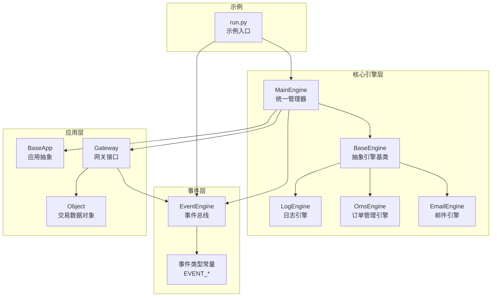
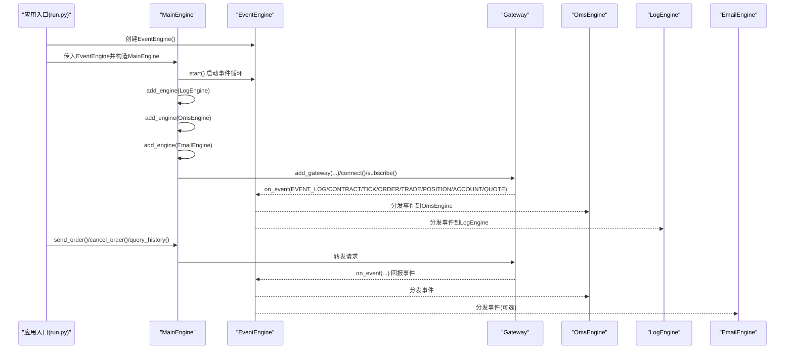
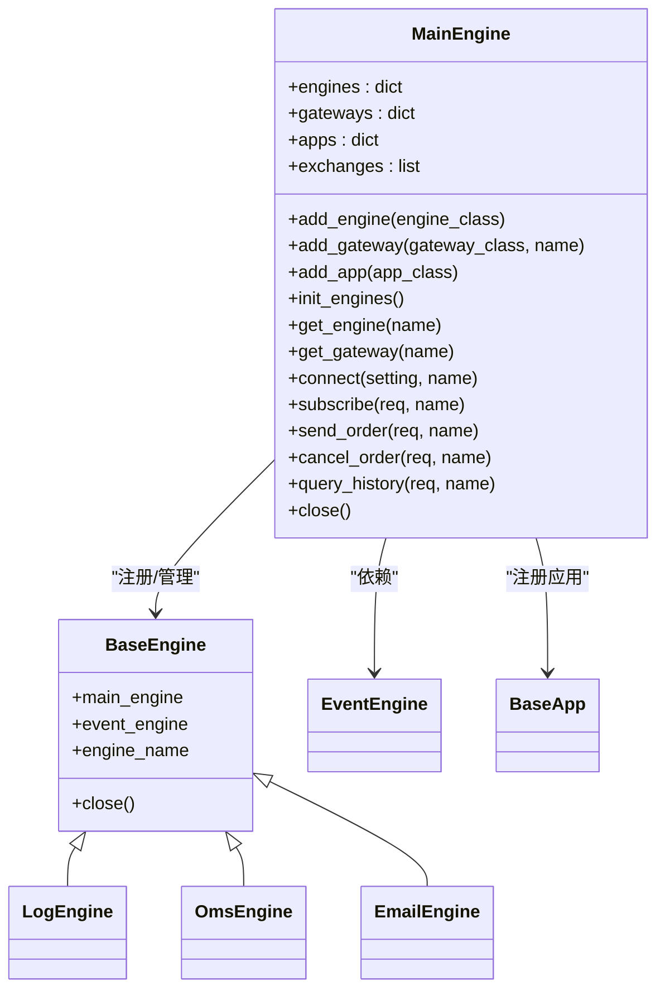
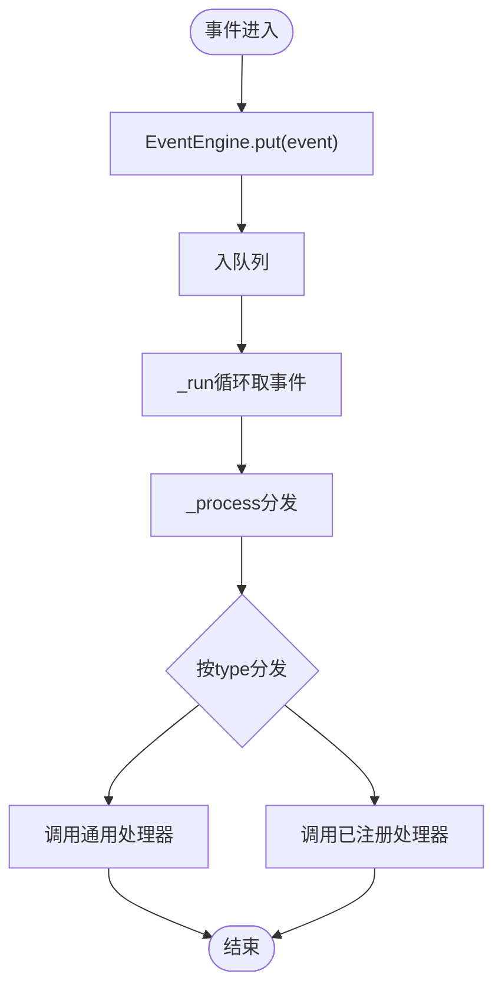
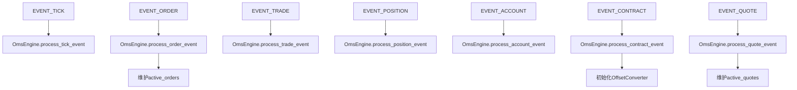
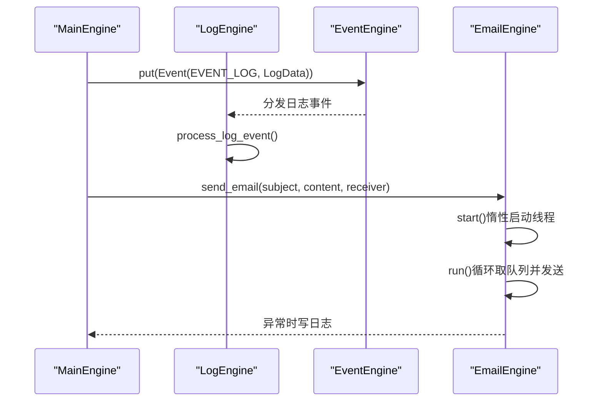
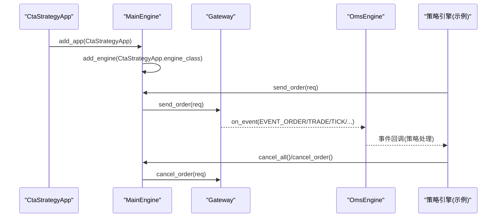
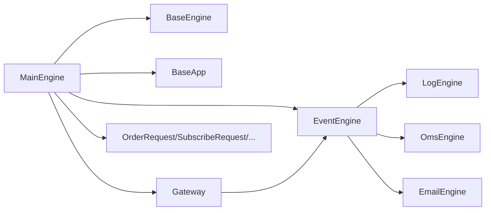

# 应用引擎生命周期管理

<cite>
**本文引用的文件**
- [vnpy/trader/engine.py](file://vnpy/trader/engine.py)
- [vnpy/event/engine.py](file://vnpy/event/engine.py)
- [vnpy/trader/event.py](file://vnpy/trader/event.py)
- [vnpy/trader/app.py](file://vnpy/trader/app.py)
- [vnpy/trader/gateway.py](file://vnpy/trader/gateway.py)
- [vnpy/trader/object.py](file://vnpy/trader/object.py)
- [examples/veighna_trader/run.py](file://examples/veighna_trader/run.py)
- [docs/community/app/cta_strategy.md](file://docs/community/app/cta_strategy.md)
</cite>

## 目录
1. [引言](#引言)
2. [项目结构](#项目结构)
3. [核心组件](#核心组件)
4. [架构总览](#架构总览)
5. [详细组件分析](#详细组件分析)
6. [依赖关系分析](#依赖关系分析)
7. [性能考量](#性能考量)
8. [故障排查指南](#故障排查指南)
9. [结论](#结论)
10. [附录](#附录)

## 引言
本文件围绕vnpy框架的应用引擎生命周期管理展开，重点说明引擎基类engine_class如何继承自BaseEngine并实现启动、停止等核心方法；剖析主引擎MainEngine对应用引擎的统一管理策略（启动顺序控制、事件监听器注册、资源分配与回收）；深入讲解引擎间通信模式，尤其是通过事件总线EventEngine进行跨应用消息传递的实现细节；结合CTA策略引擎等实际案例，展示引擎如何订阅市场数据、处理交易指令并维护状态信息；最后给出性能监控与故障恢复的最佳实践建议。

## 项目结构
- 核心引擎与应用管理位于vnpy/trader目录：
  - engine.py：定义BaseEngine抽象基类、MainEngine主引擎、LogEngine/OmsEngine/EmailEngine等具体引擎
  - event.py：定义平台使用的事件类型常量
  - app.py：定义BaseApp抽象应用类，承载engine_class等元信息
  - gateway.py：定义网关基类，负责与外部交易接口交互
  - object.py：定义交易相关数据对象（如OrderRequest、SubscribeRequest等）
- 事件驱动引擎位于vnpy/event目录：
  - engine.py：EventEngine事件总线，负责事件分发、定时器、线程安全处理
- 示例入口位于examples/veighna_trader/run.py：演示MainEngine与EventEngine的组合使用

图表来源
- [vnpy/trader/engine.py](file://vnpy/trader/engine.py#L51-L120)
- [vnpy/event/engine.py](file://vnpy/event/engine.py#L1-L146)
- [vnpy/trader/event.py](file://vnpy/trader/event.py#L1-L15)
- [vnpy/trader/app.py](file://vnpy/trader/app.py#L1-L22)
- [vnpy/trader/gateway.py](file://vnpy/trader/gateway.py#L141-L225)
- [vnpy/trader/object.py](file://vnpy/trader/object.py#L306-L324)
- [examples/veighna_trader/run.py](file://examples/veighna_trader/run.py#L39-L87)

章节来源
- [vnpy/trader/engine.py](file://vnpy/trader/engine.py#L51-L120)
- [vnpy/event/engine.py](file://vnpy/event/engine.py#L1-L146)
- [vnpy/trader/event.py](file://vnpy/trader/event.py#L1-L15)
- [vnpy/trader/app.py](file://vnpy/trader/app.py#L1-L22)
- [vnpy/trader/gateway.py](file://vnpy/trader/gateway.py#L141-L225)
- [vnpy/trader/object.py](file://vnpy/trader/object.py#L306-L324)
- [examples/veighna_trader/run.py](file://examples/veighna_trader/run.py#L39-L87)

## 核心组件
- BaseEngine：抽象引擎基类，定义构造签名与close钩子，供具体引擎继承
- MainEngine：平台核心，负责EventEngine初始化、引擎注册与管理、网关注册、应用注册、统一的业务接口（连接、订阅、下单、撤单、查询历史等）
- LogEngine：订阅EVENT_LOG，将日志事件写入系统日志
- OmsEngine：订阅市场与交易事件，维护ticks/orders/trades/positions/accounts/contracts/quotes等内存快照，提供查询与转换能力
- EmailEngine：异步邮件发送引擎，按需启动线程，消费队列并发送邮件
- EventEngine：事件总线，提供start/stop、put、register/unregister、register_general等接口
- BaseApp：应用抽象，携带engine_class等元信息，MainEngine通过add_app间接注册应用引擎
- Gateway：网关抽象，提供connect/subscribe/send_order/cancel_order等接口，内部通过on_event派发事件到EventEngine

章节来源
- [vnpy/trader/engine.py](file://vnpy/trader/engine.py#L51-L120)
- [vnpy/trader/engine.py](file://vnpy/trader/engine.py#L304-L361)
- [vnpy/trader/engine.py](file://vnpy/trader/engine.py#L339-L567)
- [vnpy/trader/engine.py](file://vnpy/trader/engine.py#L569-L634)
- [vnpy/event/engine.py](file://vnpy/event/engine.py#L1-L146)
- [vnpy/trader/app.py](file://vnpy/trader/app.py#L1-L22)
- [vnpy/trader/gateway.py](file://vnpy/trader/gateway.py#L141-L225)

## 架构总览
下图展示了引擎生命周期与事件驱动的整体流程：MainEngine在启动时初始化EventEngine并启动；随后注册各类引擎；应用通过BaseApp.engine_class绑定到具体引擎；网关通过Gateway接口与外部系统交互，并将事件经EventEngine分发至各引擎；引擎之间通过事件总线进行跨应用通信。

图表来源
- [examples/veighna_trader/run.py](file://examples/veighna_trader/run.py#L39-L87)
- [vnpy/trader/engine.py](file://vnpy/trader/engine.py#L73-L120)
- [vnpy/event/engine.py](file://vnpy/event/engine.py#L89-L146)
- [vnpy/trader/gateway.py](file://vnpy/trader/gateway.py#L141-L225)
- [vnpy/trader/event.py](file://vnpy/trader/event.py#L1-L15)

## 详细组件分析

### BaseEngine与MainEngine：生命周期与统一管理
- 生命周期要点
  - 初始化：MainEngine构造时创建EventEngine并start；随后调用init_engines注册基础引擎（日志、订单管理、邮件等）
  - 启动顺序：EventEngine优先启动，确保引擎注册阶段能正确投递事件；随后按序add_engine注册各功能引擎
  - 关闭顺序：MainEngine.close中先停止EventEngine，再依次调用各引擎的close，最后关闭网关，避免新事件产生
- 统一管理策略
  - 引擎注册：add_engine将实例存入字典，便于get_engine按名称检索
  - 应用注册：add_app创建BaseApp实例，再通过app.engine_class注册对应引擎
  - 事件监听器注册：引擎在构造时通过event_engine.register订阅所需事件类型
  - 资源分配与回收：引擎各自持有独立线程（如EmailEngine）或共享EventEngine线程；关闭时释放线程与队列资源

图表来源
- [vnpy/trader/engine.py](file://vnpy/trader/engine.py#L51-L120)
- [vnpy/trader/engine.py](file://vnpy/trader/engine.py#L304-L361)
- [vnpy/trader/engine.py](file://vnpy/trader/engine.py#L569-L634)
- [vnpy/trader/app.py](file://vnpy/trader/app.py#L1-L22)

章节来源
- [vnpy/trader/engine.py](file://vnpy/trader/engine.py#L73-L120)
- [vnpy/trader/engine.py](file://vnpy/trader/engine.py#L289-L303)

### EventEngine：事件总线与跨引擎通信
- 事件模型
  - Event：包含type与data两部分，作为事件载体
  - EventEngine：内部维护队列、分发器、通用处理器列表与定时器线程
- 分发机制
  - put：将事件入队
  - _run：从队列取出事件并调用_process
  - _process：先按事件type分发给注册的处理器，再分发给通用处理器
  - 定时器：按interval周期生成EVENT_TIMER事件
- 跨引擎通信
  - 网关通过Gateway.on_event将市场与交易回报事件投递到EventEngine
  - 各引擎通过event_engine.register订阅所需事件类型，实现松耦合通信
  - 通用处理器可用于全局审计或统计

图表来源
- [vnpy/event/engine.py](file://vnpy/event/engine.py#L55-L104)

章节来源
- [vnpy/event/engine.py](file://vnpy/event/engine.py#L1-L146)

### OmsEngine：状态维护与事件处理
- 订阅事件类型：EVENT_TICK、EVENT_ORDER、EVENT_TRADE、EVENT_POSITION、EVENT_ACCOUNT、EVENT_CONTRACT、EVENT_QUOTE
- 状态维护
  - 维护ticks/orders/trades/positions/accounts/contracts/quotes等字典，提供get_*系列查询
  - 维护active_orders/active_quotes集合，区分活跃与非活跃状态
  - 为每个gateway_name维护OffsetConverter，支持锁仓/净仓转换
- 查询与转换
  - 提供get_all_*系列方法返回完整列表
  - 提供convert_order_request/update_order_request等转换接口

图表来源
- [vnpy/trader/engine.py](file://vnpy/trader/engine.py#L339-L567)

章节来源
- [vnpy/trader/engine.py](file://vnpy/trader/engine.py#L339-L567)

### LogEngine与EmailEngine：事件驱动的日志与邮件
- LogEngine
  - 订阅EVENT_LOG，将日志事件写入系统日志
  - 支持开关与级别映射
- EmailEngine
  - 首次发送邮件时惰性启动线程与队列
  - run循环从队列取邮件并发送，异常时通过MainEngine写日志

图表来源
- [vnpy/trader/engine.py](file://vnpy/trader/engine.py#L304-L361)
- [vnpy/trader/engine.py](file://vnpy/trader/engine.py#L569-L634)

章节来源
- [vnpy/trader/engine.py](file://vnpy/trader/engine.py#L304-L361)
- [vnpy/trader/engine.py](file://vnpy/trader/engine.py#L569-L634)

### 应用引擎与CTA策略引擎：订阅与指令处理
- 应用注册
  - BaseApp定义engine_class字段，MainEngine.add_app会创建BaseApp实例并注册其engine_class
- CTA策略引擎（以文档描述为准）
  - 初始化流程：加载历史数据、载入缓存变量、订阅行情
  - 运行期：接收EVENT_TICK/ORDER/TRADE等事件，根据策略逻辑生成买卖指令
  - 停止流程：撤销所有活动委托，持久化策略状态
- 实际对接
  - 策略通过MainEngine的send_order/cancel_order等接口发起交易请求
  - 网关收到请求后执行connect/subscribe/send_order/cancel_order等动作，并通过on_event回推回报事件

图表来源
- [vnpy/trader/app.py](file://vnpy/trader/app.py#L1-L22)
- [vnpy/trader/engine.py](file://vnpy/trader/engine.py#L120-L134)
- [vnpy/trader/gateway.py](file://vnpy/trader/gateway.py#L141-L225)
- [docs/community/app/cta_strategy.md](file://docs/community/app/cta_strategy.md#L1-L150)

章节来源
- [vnpy/trader/app.py](file://vnpy/trader/app.py#L1-L22)
- [vnpy/trader/engine.py](file://vnpy/trader/engine.py#L120-L134)
- [vnpy/trader/gateway.py](file://vnpy/trader/gateway.py#L141-L225)
- [docs/community/app/cta_strategy.md](file://docs/community/app/cta_strategy.md#L1-L150)

## 依赖关系分析
- MainEngine依赖EventEngine进行事件分发；依赖BaseApp.engine_class进行应用引擎注册
- 各引擎依赖EventEngine进行事件订阅与发布
- 网关依赖EventEngine进行事件上报
- 交易请求对象（OrderRequest、SubscribeRequest等）贯穿MainEngine与Gateway

图表来源
- [vnpy/trader/engine.py](file://vnpy/trader/engine.py#L51-L120)
- [vnpy/event/engine.py](file://vnpy/event/engine.py#L1-L146)
- [vnpy/trader/object.py](file://vnpy/trader/object.py#L306-L324)

章节来源
- [vnpy/trader/engine.py](file://vnpy/trader/engine.py#L51-L120)
- [vnpy/event/engine.py](file://vnpy/event/engine.py#L1-L146)
- [vnpy/trader/object.py](file://vnpy/trader/object.py#L306-L324)

## 性能考量
- 事件处理吞吐
  - EventEngine采用队列+双线程模型，建议合理设置interval以平衡定时器开销与实时性
  - 避免在事件处理器中执行阻塞操作，必要时将耗时逻辑放入后台线程
- 状态存储与查询
  - OmsEngine维护大量字典与集合，注意键空间增长导致的内存占用；定期清理非活跃订单/报价
- 线程与资源
  - EmailEngine惰性启动线程，避免不必要的CPU与IO开销
  - MainEngine关闭顺序先停止EventEngine，再关闭引擎与网关，确保无新事件产生
- 日志与监控
  - LogEngine仅在开启状态下处理EVENT_LOG，减少无谓开销
  - 建议在策略层使用put_event触发界面刷新，避免频繁I/O

[本节为通用指导，不直接分析具体文件]

## 故障排查指南
- 启动失败
  - 检查EventEngine是否成功start；确认MainEngine构造与init_engines调用顺序正确
  - 确认add_app/add_engine调用是否成功，get_engine返回非None
- 事件未到达
  - 确认引擎是否在构造时注册了相应事件类型
  - 检查EventEngine.register/register_general是否重复注册导致覆盖
- 下单/撤单无效
  - 检查Gateway.connect/subscribe/send_order/cancel_order实现是否正确
  - 确认MainEngine.get_gateway返回有效实例
- 邮件发送失败
  - 查看EmailEngine.run异常分支是否写入日志
  - 核对SMTP配置与网络连通性

章节来源
- [vnpy/trader/engine.py](file://vnpy/trader/engine.py#L160-L193)
- [vnpy/trader/engine.py](file://vnpy/trader/engine.py#L213-L276)
- [vnpy/trader/engine.py](file://vnpy/trader/engine.py#L569-L634)
- [vnpy/trader/gateway.py](file://vnpy/trader/gateway.py#L141-L225)

## 结论
vnpy通过EventEngine构建了高内聚、低耦合的事件驱动架构：MainEngine统一管理生命周期与资源，BaseEngine提供一致的扩展点，各引擎通过事件总线实现跨应用通信。OmsEngine集中维护市场与交易状态，LogEngine与EmailEngine分别承担日志与通知职责。结合CTA策略引擎的订阅与指令处理流程，形成了从数据采集、状态维护到策略决策与执行的完整闭环。遵循合理的启动/关闭顺序、事件注册与资源回收策略，可获得稳定可靠的运行表现。

[本节为总结性内容，不直接分析具体文件]

## 附录
- 示例入口：examples/veighna_trader/run.py展示了如何创建EventEngine与MainEngine，并注册多个应用与网关
- CTA策略文档：描述了策略初始化、订阅行情、停止与撤销委托等关键流程

章节来源
- [examples/veighna_trader/run.py](file://examples/veighna_trader/run.py#L39-L87)
- [docs/community/app/cta_strategy.md](file://docs/community/app/cta_strategy.md#L1-L150)