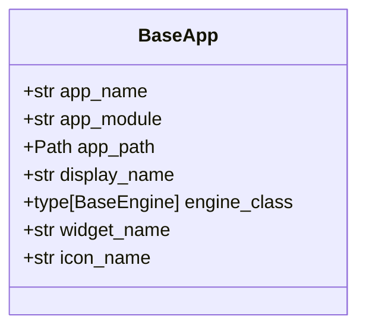
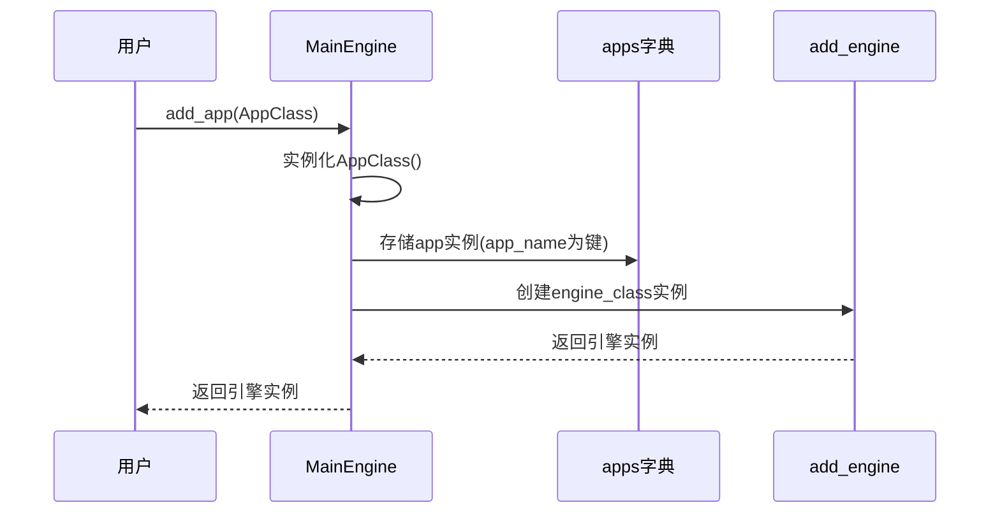
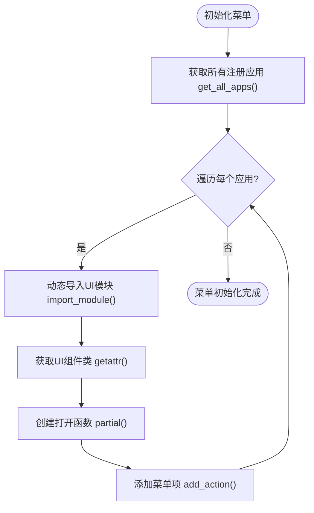
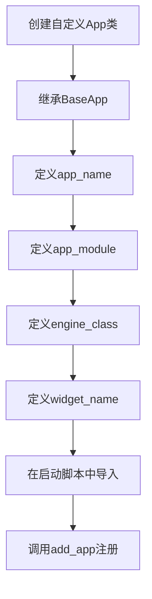

# 应用注册与加载机制

<cite>
**本文档引用的文件**  
- [app.py](file://vnpy/trader/app.py)
- [engine.py](file://vnpy/trader/engine.py)
- [mainwindow.py](file://vnpy/trader/ui/mainwindow.py)
- [portfolio_strategy.md](file://docs/community/app/portfolio_strategy.md)
- [cta_strategy.md](file://docs/community/app/cta_strategy.md)
</cite>

## 目录
1. [简介](#简介)
2. [核心元数据字段](#核心元数据字段)
3. [应用注册流程](#应用注册流程)
4. [应用加载与实例化](#应用加载与实例化)
5. [应用注册表示例](#应用注册表示例)
6. [自定义应用注册实现](#自定义应用注册实现)
7. [常见配置错误与排查](#常见配置错误与排查)

## 简介
VeighNa框架采用模块化设计，通过`MainEngine`统一管理各类功能应用（App）。应用注册与加载机制是系统的核心架构之一，它允许用户通过简单的配置将不同的功能模块集成到交易系统中。该机制基于`BaseApp`抽象类定义的标准接口，实现了应用的发现、注册、实例化和UI集成。

**Section sources**
- [app.py](file://vnpy/trader/app.py#L10-L21)
- [engine.py](file://vnpy/trader/engine.py#L73-L303)

## 核心元数据字段
每个应用都必须继承`BaseApp`抽象类，并定义一组元数据字段，这些字段在系统发现和加载应用过程中起着关键作用。



**Diagram sources**
- [app.py](file://vnpy/trader/app.py#L15-L21)

### 字段说明
- **app_name**: 应用的唯一标识符，用于创建引擎和UI组件，必须全局唯一
- **app_module**: 应用模块的导入路径字符串，用于动态导入模块
- **app_path**: 应用文件夹的绝对路径，由系统自动设置
- **display_name**: 菜单中显示的应用名称，支持国际化
- **engine_class**: 应用引擎类，负责后台业务逻辑处理
- **widget_name**: 应用UI组件的类名，用于动态创建界面
- **icon_name**: 应用图标的文件名，用于菜单和工具栏显示

**Section sources**
- [app.py](file://vnpy/trader/app.py#L15-L21)

## 应用注册流程
应用通过`MainEngine`的`add_app`方法注册到系统中，该过程涉及应用实例化、注册表维护和引擎创建。



**Diagram sources**
- [engine.py](file://vnpy/trader/engine.py#L120-L128)

### 注册过程详解
1. 调用`MainEngine.add_app`方法传入应用类
2. 系统实例化应用类，创建`BaseApp`子类对象
3. 将应用实例存储到`apps`字典中，以`app_name`为键
4. 调用`add_engine`方法创建并注册对应的引擎实例
5. 返回创建的引擎实例供后续使用

**Section sources**
- [engine.py](file://vnpy/trader/engine.py#L120-L128)

## 应用加载与实例化
应用注册后，系统会自动处理UI组件的加载和实例化，这一过程在`MainWindow`的菜单初始化时完成。



**Diagram sources**
- [mainwindow.py](file://vnpy/trader/ui/mainwindow.py#L130-L137)

### 加载机制分析
系统通过反射机制动态加载应用UI组件：
1. 调用`get_all_apps()`获取所有已注册的应用
2. 对每个应用，使用`import_module`动态导入其UI模块
3. 通过`getattr`从导入的模块中获取指定的UI组件类
4. 使用`partial`创建带有参数的回调函数
5. 将回调函数与菜单项关联，实现点击时打开对应UI

**Section sources**
- [mainwindow.py](file://vnpy/trader/ui/mainwindow.py#L130-L137)

## 应用注册表示例
以下代码示例展示了如何在启动脚本中注册和加载应用：

```python
# 导入应用模块
from vnpy_ctastrategy import CtaStrategyApp
from vnpy_portfoliostrategy import PortfolioStrategyApp

# 创建主引擎
main_engine = MainEngine(event_engine)

# 注册应用到系统
main_engine.add_app(CtaStrategyApp)
main_engine.add_app(PortfolioStrategyApp)

# 创建主窗口
main_window = MainWindow(main_engine, event_engine)
```

**Section sources**
- [portfolio_strategy.md](file://docs/community/app/portfolio_strategy.md#L19-L22)
- [cta_strategy.md](file://docs/community/app/cta_strategy.md#L19-L22)

## 自定义应用注册实现
要实现自定义应用注册，需要遵循以下步骤：

1. 创建继承`BaseApp`的类
2. 定义必要的元数据字段
3. 在启动脚本中导入并注册应用



**Diagram sources**
- [app.py](file://vnpy/trader/app.py#L10-L21)
- [engine.py](file://vnpy/trader/engine.py#L120-L128)

## 常见配置错误与排查
### 常见错误
- **模块导入错误**: `app_module`路径不正确导致`ImportError`
- **类名错误**: `widget_name`或`engine_class`指定的类不存在
- **名称冲突**: 多个应用使用相同的`app_name`
- **依赖缺失**: 应用依赖的第三方库未安装

### 排查方法
1. 检查应用类的元数据字段定义是否完整
2. 验证模块路径和类名的正确性
3. 确认`app_name`的唯一性
4. 检查依赖库是否已正确安装
5. 查看系统日志中的错误信息

**Section sources**
- [app.py](file://vnpy/trader/app.py#L15-L21)
- [engine.py](file://vnpy/trader/engine.py#L120-L128)
- [mainwindow.py](file://vnpy/trader/ui/mainwindow.py#L130-L137)