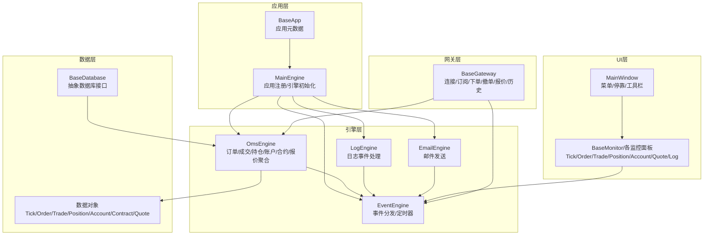
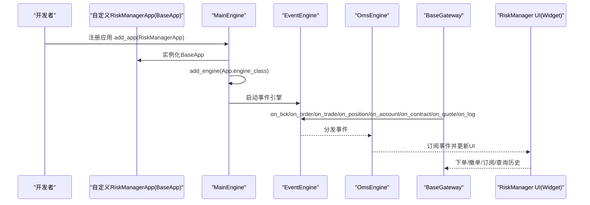
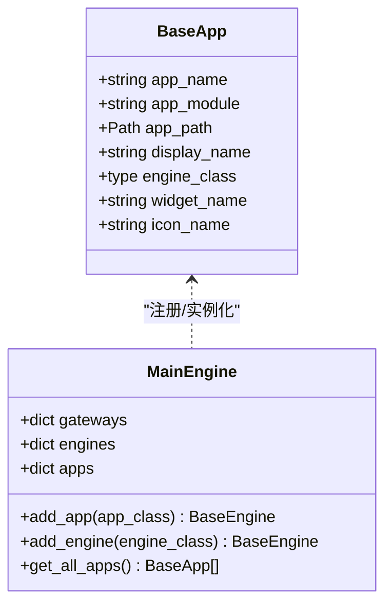
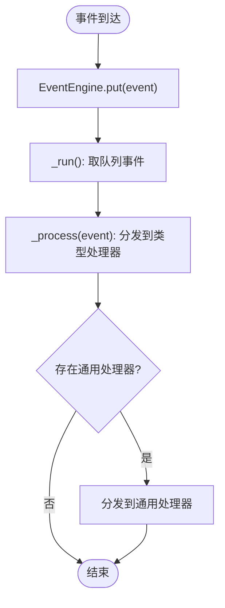
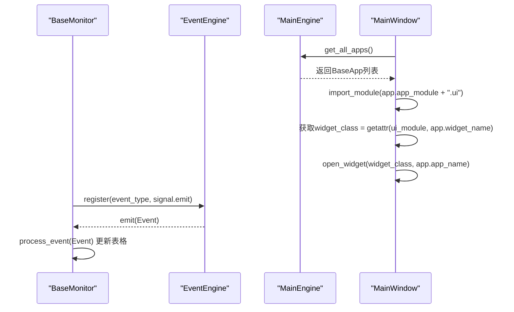
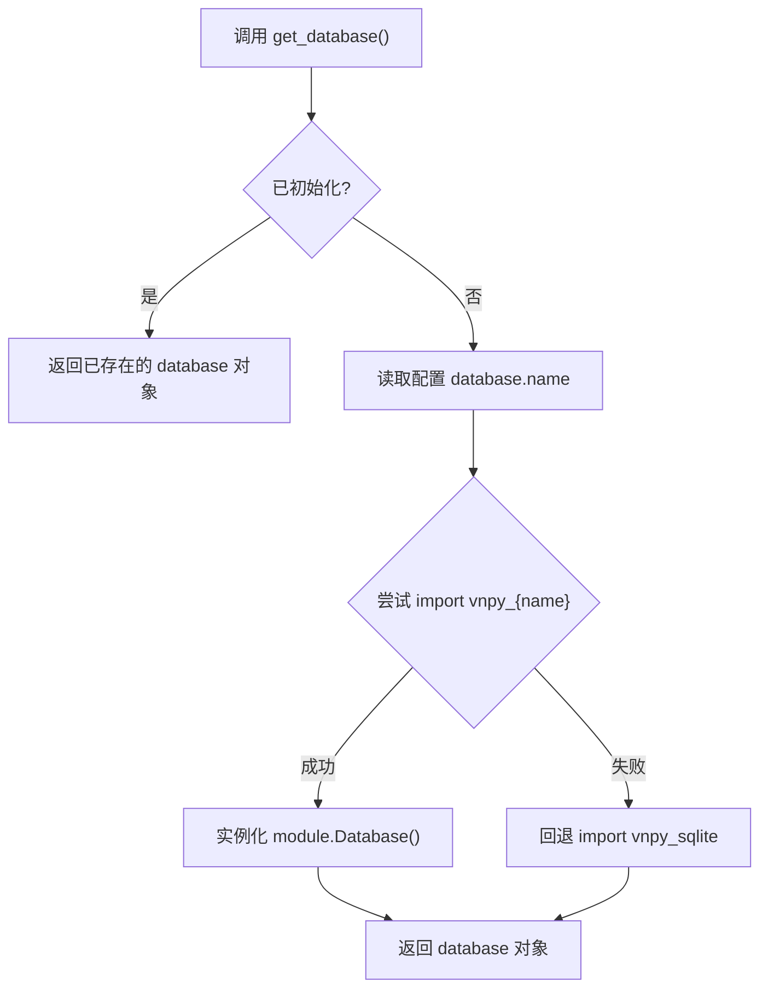
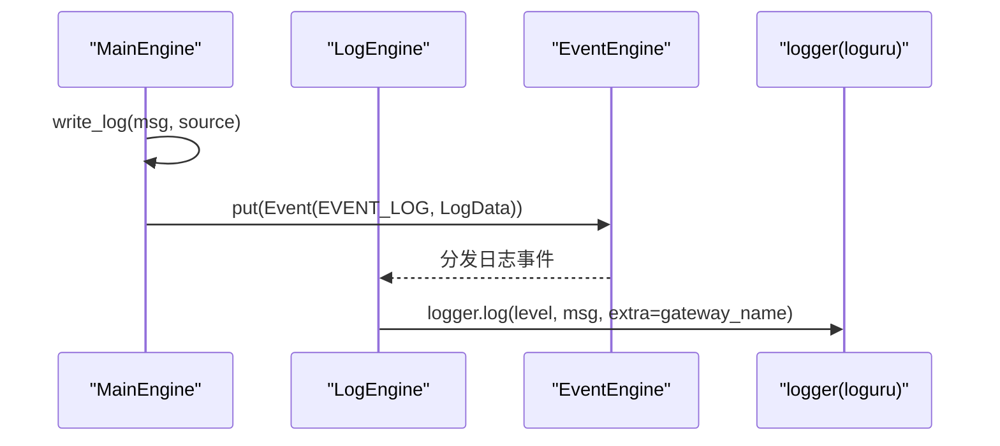
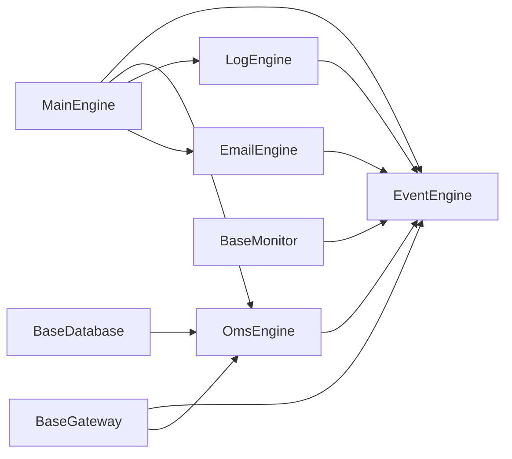

# 自定义功能应用开发指南

<cite>
**本文引用的文件列表**
- [vnpy/trader/app.py](file://vnpy/trader/app.py)
- [vnpy/trader/engine.py](file://vnpy/trader/engine.py)
- [vnpy/event/engine.py](file://vnpy/event/engine.py)
- [vnpy/trader/event.py](file://vnpy/trader/event.py)
- [vnpy/trader/gateway.py](file://vnpy/trader/gateway.py)
- [vnpy/trader/database.py](file://vnpy/trader/database.py)
- [vnpy/trader/logger.py](file://vnpy/trader/logger.py)
- [vnpy/trader/setting.py](file://vnpy/trader/setting.py)
- [vnpy/trader/object.py](file://vnpy/trader/object.py)
- [vnpy/trader/ui/widget.py](file://vnpy/trader/ui/widget.py)
- [vnpy/trader/ui/mainwindow.py](file://vnpy/trader/ui/mainwindow.py)
- [docs/community/app/risk_manager.md](file://docs/community/app/risk_manager.md)
</cite>

## 目录
1. [引言](#引言)
2. [项目结构](#项目结构)
3. [核心组件](#核心组件)
4. [架构总览](#架构总览)
5. [详细组件分析](#详细组件分析)
6. [依赖关系分析](#依赖关系分析)
7. [性能考量](#性能考量)
8. [故障排查指南](#故障排查指南)
9. [结论](#结论)
10. [附录](#附录)

## 引言
本指南面向希望从零开始开发自定义功能应用的开发者，围绕vnpy框架的“应用-引擎-事件-数据-UI”一体化架构，系统讲解如何定义应用元数据、实现应用引擎逻辑、开发UI交互界面，并将其集成到主系统中。文档以“自定义风险管理应用”为贯穿示例，演示应用类的继承结构、事件订阅模式、数据持久化方法和错误处理机制，强调与核心模块（数据库、事件引擎、网关）的正确交互方式，避免资源竞争和内存泄漏。同时总结常见陷阱与最佳实践，覆盖日志记录、配置管理、单元测试与文档编写，并说明如何打包与分发自定义应用模块。

## 项目结构
vnpy采用清晰的分层与模块化设计：
- 应用层：通过BaseApp定义应用元数据与引擎绑定，由MainEngine统一注册与初始化。
- 引擎层：BaseEngine抽象引擎基类，MainEngine协调事件引擎、网关、应用引擎与全局功能。
- 事件层：EventEngine提供线程安全的事件分发与定时器；事件类型由trader.event统一定义。
- 数据层：对象模型（Tick/Order/Trade/Position/Account/Contract/Quote）与数据库抽象（BaseDatabase）。
- UI层：基于PyQt的通用组件与监控面板，统一接入事件引擎进行数据展示与交互。
- 网关层：BaseGateway封装与外部交易系统的对接，统一推送事件。

图表来源
- [vnpy/trader/app.py](file://vnpy/trader/app.py#L1-L22)
- [vnpy/trader/engine.py](file://vnpy/trader/engine.py#L73-L212)
- [vnpy/event/engine.py](file://vnpy/event/engine.py#L1-L146)
- [vnpy/trader/event.py](file://vnpy/trader/event.py#L1-L15)
- [vnpy/trader/database.py](file://vnpy/trader/database.py#L52-L160)
- [vnpy/trader/object.py](file://vnpy/trader/object.py#L1-L428)
- [vnpy/trader/ui/widget.py](file://vnpy/trader/ui/widget.py#L200-L392)
- [vnpy/trader/ui/mainwindow.py](file://vnpy/trader/ui/mainwindow.py#L1-L120)
- [vnpy/trader/gateway.py](file://vnpy/trader/gateway.py#L33-L159)

章节来源
- [vnpy/trader/app.py](file://vnpy/trader/app.py#L1-L22)
- [vnpy/trader/engine.py](file://vnpy/trader/engine.py#L73-L212)
- [vnpy/event/engine.py](file://vnpy/event/engine.py#L1-L146)
- [vnpy/trader/event.py](file://vnpy/trader/event.py#L1-L15)
- [vnpy/trader/database.py](file://vnpy/trader/database.py#L52-L160)
- [vnpy/trader/object.py](file://vnpy/trader/object.py#L1-L428)
- [vnpy/trader/ui/widget.py](file://vnpy/trader/ui/widget.py#L200-L392)
- [vnpy/trader/ui/mainwindow.py](file://vnpy/trader/ui/mainwindow.py#L1-L120)
- [vnpy/trader/gateway.py](file://vnpy/trader/gateway.py#L33-L159)

## 核心组件
- 应用元数据与注册
  - BaseApp定义应用名称、模块路径、显示名、引擎类、UI部件类名与图标名等元数据字段，供MainEngine识别与加载。
  - MainEngine.add_app根据BaseApp创建实例并注册对应引擎类，随后调用add_engine初始化引擎。
- 事件系统
  - EventEngine提供线程安全队列、定时器线程、通用处理器与特定类型处理器注册/注销，支持多线程事件分发。
  - 事件类型常量集中于trader.event，如tick、order、trade、position、account、contract、quote、log等。
- 引擎体系
  - BaseEngine抽象引擎基类，持有MainEngine与EventEngine引用，提供close钩子。
  - MainEngine负责事件引擎启动、网关/引擎/应用注册、全局功能暴露（如查询、下单、撤单、邮件发送）。
  - OmsEngine作为OMS核心，订阅各类事件并维护内存缓存，提供查询接口。
  - LogEngine订阅日志事件，按配置输出到控制台与文件。
  - EmailEngine异步发送邮件，使用线程与队列解耦。
- 数据与数据库
  - 数据对象定义了统一的数据结构与标识符生成规则（vt_symbol/vt_orderid/vt_tradeid等）。
  - BaseDatabase抽象数据库接口，get_database按配置动态加载具体驱动，默认回退到SQLite。
- UI与交互
  - BaseMonitor通用监控面板，通过事件引擎注册监听，实现表格渲染、排序、右键菜单、CSV导出、列宽记忆。
  - MainWindow负责菜单、停靠面板、工具栏、全局设置编辑与应用图标加载，动态导入应用UI模块并创建窗口。

章节来源
- [vnpy/trader/app.py](file://vnpy/trader/app.py#L10-L22)
- [vnpy/trader/engine.py](file://vnpy/trader/engine.py#L51-L120)
- [vnpy/event/engine.py](file://vnpy/event/engine.py#L33-L146)
- [vnpy/trader/event.py](file://vnpy/trader/event.py#L1-L15)
- [vnpy/trader/object.py](file://vnpy/trader/object.py#L1-L200)
- [vnpy/trader/database.py](file://vnpy/trader/database.py#L52-L160)
- [vnpy/trader/ui/widget.py](file://vnpy/trader/ui/widget.py#L200-L392)
- [vnpy/trader/ui/mainwindow.py](file://vnpy/trader/ui/mainwindow.py#L100-L180)

## 架构总览
下面以“自定义风险管理应用”为例，展示从应用元数据定义到UI集成的完整流程与关键交互点。

图表来源
- [vnpy/trader/engine.py](file://vnpy/trader/engine.py#L120-L167)
- [vnpy/trader/gateway.py](file://vnpy/trader/gateway.py#L93-L158)
- [vnpy/trader/ui/widget.py](file://vnpy/trader/ui/widget.py#L286-L318)

章节来源
- [vnpy/trader/engine.py](file://vnpy/trader/engine.py#L120-L167)
- [vnpy/trader/gateway.py](file://vnpy/trader/gateway.py#L93-L158)
- [vnpy/trader/ui/widget.py](file://vnpy/trader/ui/widget.py#L286-L318)

## 详细组件分析

### 应用元数据与注册流程（BaseApp与MainEngine）
- BaseApp元数据字段
  - app_name：应用唯一标识，用于引擎命名与菜单项映射。
  - app_module：应用模块字符串，用于动态导入UI模块。
  - app_path：应用目录绝对路径，便于资源定位。
  - display_name：菜单显示名称。
  - engine_class：应用对应的引擎类。
  - widget_name：应用UI部件类名。
  - icon_name：应用图标文件名。
- MainEngine.add_app流程
  - 实例化BaseApp，注册到self.apps字典。
  - 调用add_engine(app.engine_class)创建并注册引擎实例。
  - 初始化完成后，MainEngine会将引擎能力暴露为方法或属性，供其他模块使用。

图表来源
- [vnpy/trader/app.py](file://vnpy/trader/app.py#L10-L22)
- [vnpy/trader/engine.py](file://vnpy/trader/engine.py#L120-L167)

章节来源
- [vnpy/trader/app.py](file://vnpy/trader/app.py#L10-L22)
- [vnpy/trader/engine.py](file://vnpy/trader/engine.py#L120-L167)

### 事件订阅与处理（EventEngine与OmsEngine）
- EventEngine
  - 提供start/stop生命周期管理，内部线程循环从队列取出事件并分发至注册处理器。
  - 支持按事件类型注册与通用处理器注册，定时器事件每间隔秒产生一次。
- OmsEngine
  - 订阅所有交易相关事件，维护内存缓存（ticks/orders/trades/positions/accounts/contracts/quotes）。
  - 维护活跃委托与报价集合，提供查询接口（get_*、get_all_*、get_all_active_*）。
  - 与OffsetConverter联动，处理开平仓转换请求。

图表来源
- [vnpy/event/engine.py](file://vnpy/event/engine.py#L55-L88)
- [vnpy/event/engine.py](file://vnpy/event/engine.py#L66-L79)

章节来源
- [vnpy/event/engine.py](file://vnpy/event/engine.py#L33-L146)
- [vnpy/trader/engine.py](file://vnpy/trader/engine.py#L339-L567)

### UI交互与监控（BaseMonitor与MainWindow）
- BaseMonitor
  - 通过event_type/data_key注册事件监听，使用signal.emit桥接事件到UI线程。
  - 支持插入新行、更新旧行、排序、右键菜单（调整列宽、保存CSV）、列宽状态持久化。
- MainWindow
  - 动态构建菜单项，扫描MainEngine.get_all_apps()，按app.app_module.ui.widget_name导入并创建窗口。
  - 管理停靠面板、工具栏、全局设置编辑、邮件测试、论坛链接等。

图表来源
- [vnpy/trader/ui/widget.py](file://vnpy/trader/ui/widget.py#L286-L318)
- [vnpy/trader/ui/mainwindow.py](file://vnpy/trader/ui/mainwindow.py#L120-L180)

章节来源
- [vnpy/trader/ui/widget.py](file://vnpy/trader/ui/widget.py#L200-L392)
- [vnpy/trader/ui/mainwindow.py](file://vnpy/trader/ui/mainwindow.py#L100-L180)

### 数据持久化与数据库抽象（BaseDatabase与get_database）
- BaseDatabase定义统一接口：保存/加载/删除/概览（bar/tick）。
- get_database按配置动态加载具体数据库驱动，若未找到则回退到默认SQLite驱动。
- 时间与时区处理：convert_tz将datetime转换为DB_TZ（来自配置）。

图表来源
- [vnpy/trader/database.py](file://vnpy/trader/database.py#L139-L160)

章节来源
- [vnpy/trader/database.py](file://vnpy/trader/database.py#L52-L160)

### 错误处理与日志（LogEngine与EmailEngine）
- LogEngine
  - 通过write_log统一写入日志事件，按配置开关与级别输出到控制台与文件。
- EmailEngine
  - 使用线程与队列异步发送邮件，异常时记录traceback到日志。
- 配置管理
  - 全局配置SETTINGS集中管理日志、邮件、数据库等参数，支持从JSON文件加载。

图表来源
- [vnpy/trader/engine.py](file://vnpy/trader/engine.py#L160-L167)
- [vnpy/trader/engine.py](file://vnpy/trader/engine.py#L304-L338)
- [vnpy/trader/logger.py](file://vnpy/trader/logger.py#L1-L56)
- [vnpy/trader/setting.py](file://vnpy/trader/setting.py#L11-L44)

章节来源
- [vnpy/trader/engine.py](file://vnpy/trader/engine.py#L160-L167)
- [vnpy/trader/engine.py](file://vnpy/trader/engine.py#L304-L338)
- [vnpy/trader/logger.py](file://vnpy/trader/logger.py#L1-L56)
- [vnpy/trader/setting.py](file://vnpy/trader/setting.py#L11-L44)

### 示例：自定义风险管理应用（RiskManager）
- 文档示例说明了RiskManager应用的加载、启动、参数修改与停止流程，强调在委托发出前进行风控校验。
- 开发要点
  - 定义RiskManagerApp（继承BaseApp），设置app_name、app_module、display_name、engine_class、widget_name、icon_name。
  - 在引擎中订阅订单事件，结合OmsEngine提供的活跃委托、成交、账户等数据进行风控判断。
  - UI通过BaseMonitor展示风控状态、统计指标与日志。
  - 使用数据库存储风控规则配置与历史统计（可选）。

章节来源
- [docs/community/app/risk_manager.md](file://docs/community/app/risk_manager.md#L1-L72)
- [vnpy/trader/app.py](file://vnpy/trader/app.py#L10-L22)
- [vnpy/trader/engine.py](file://vnpy/trader/engine.py#L339-L567)
- [vnpy/trader/ui/widget.py](file://vnpy/trader/ui/widget.py#L200-L392)

## 依赖关系分析
- 组件耦合与内聚
  - MainEngine高内聚地管理事件引擎、网关、引擎与应用，降低跨模块耦合。
  - EventEngine与各引擎松耦合，通过事件类型解耦。
  - UI层通过事件引擎与引擎层解耦，仅依赖事件类型与数据对象。
- 外部依赖与集成点
  - 数据库驱动按配置动态加载，支持扩展不同数据库。
  - 网关层统一事件推送，屏蔽底层接口差异。
- 潜在环形依赖
  - 通过事件与接口契约避免直接循环引用，保持清晰的单向依赖链。

图表来源
- [vnpy/trader/engine.py](file://vnpy/trader/engine.py#L73-L212)
- [vnpy/event/engine.py](file://vnpy/event/engine.py#L33-L146)
- [vnpy/trader/gateway.py](file://vnpy/trader/gateway.py#L93-L158)
- [vnpy/trader/database.py](file://vnpy/trader/database.py#L139-L160)
- [vnpy/trader/ui/widget.py](file://vnpy/trader/ui/widget.py#L286-L318)

章节来源
- [vnpy/trader/engine.py](file://vnpy/trader/engine.py#L73-L212)
- [vnpy/event/engine.py](file://vnpy/event/engine.py#L33-L146)
- [vnpy/trader/gateway.py](file://vnpy/trader/gateway.py#L93-L158)
- [vnpy/trader/database.py](file://vnpy/trader/database.py#L139-L160)
- [vnpy/trader/ui/widget.py](file://vnpy/trader/ui/widget.py#L286-L318)

## 性能考量
- 事件处理
  - EventEngine采用队列+线程模型，建议避免在事件处理器中执行阻塞操作，必要时使用异步或后台线程。
  - 通用处理器与特定类型处理器并存时，注意处理顺序与性能开销。
- UI渲染
  - BaseMonitor禁用排序以减少不必要的重排，批量更新数据后再启用排序。
  - CSV导出与列宽调整为IO密集型操作，建议在后台线程执行。
- 数据缓存
  - OmsEngine维护内存缓存，注意定期清理过期数据，避免内存膨胀。
- 数据库访问
  - 批量写入优于逐条写入，合理使用事务与索引。
- 线程安全
  - 网关回调必须保证线程安全，避免共享可变状态；事件推送应为不可变对象。

[本节为通用指导，无需列出章节来源]

## 故障排查指南
- 事件未到达UI
  - 检查事件类型是否正确，BaseMonitor.event_type与注册事件一致。
  - 确认EventEngine已启动且未被提前stop。
- UI无数据更新
  - 确认MainEngine.get_all_apps()包含目标应用，菜单项已生成。
  - 检查BaseMonitor.register_event是否成功注册。
- 日志不输出
  - 检查SETTINGS中log.active、log.level、log.console、log.file配置。
  - 确认LogEngine已注册EVENT_LOG处理器。
- 邮件发送失败
  - 检查EmailEngine线程状态与队列消费情况，查看异常traceback是否写入日志。
- 数据库驱动缺失
  - 确认database.name配置与已安装驱动匹配，回退到默认SQLite驱动。
- 网关连接问题
  - 检查BaseGateway回调是否正确推送事件，关注on_log输出。

章节来源
- [vnpy/trader/ui/widget.py](file://vnpy/trader/ui/widget.py#L286-L318)
- [vnpy/trader/engine.py](file://vnpy/trader/engine.py#L160-L167)
- [vnpy/trader/logger.py](file://vnpy/trader/logger.py#L1-L56)
- [vnpy/trader/setting.py](file://vnpy/trader/setting.py#L11-L44)
- [vnpy/trader/database.py](file://vnpy/trader/database.py#L139-L160)
- [vnpy/trader/gateway.py](file://vnpy/trader/gateway.py#L93-L158)

## 结论
通过以上分析可知，vnpy提供了完善的“应用-引擎-事件-数据-UI”一体化框架。开发者只需遵循BaseApp元数据规范、在引擎中订阅所需事件、在UI中使用BaseMonitor进行数据展示，并通过MainEngine统一注册与初始化，即可快速构建自定义功能应用。配合事件驱动与线程安全设计，可有效避免资源竞争与内存泄漏；借助配置管理与日志系统，能够实现良好的可观测性与可维护性。

[本节为总结，无需列出章节来源]

## 附录

### 开发步骤清单（自定义风险管理应用）
- 定义应用元数据
  - 创建RiskManagerApp，填写app_name、app_module、display_name、engine_class、widget_name、icon_name。
- 实现应用引擎
  - 继承BaseEngine，构造函数接收main_engine、event_engine、engine_name。
  - 在引擎中注册事件处理器（如订阅EVENT_ORDER），结合OmsEngine数据进行风控判断。
  - 提供必要的查询/控制接口，必要时使用数据库持久化配置与统计。
- 开发UI交互
  - 编写RiskManager UI部件类，继承QWidget或对话框。
  - 在MainWindow菜单中动态加载该UI部件，确保app.app_module.ui与widget_name正确。
  - 使用BaseMonitor展示风控状态、统计指标与日志。
- 集成到主系统
  - 在启动脚本中调用main_engine.add_app(RiskManagerApp)。
  - 确保EventEngine已启动，应用引擎初始化完成。
- 测试与验证
  - 单元测试覆盖事件处理、UI交互与数据库读写。
  - 使用日志与邮件功能验证异常路径。
- 打包与分发
  - 将应用代码与UI模块打包为独立Python包，提供setup.py或pyproject.toml。
  - 在文档中说明安装、配置与使用步骤，参考RiskManager文档示例。

章节来源
- [vnpy/trader/app.py](file://vnpy/trader/app.py#L10-L22)
- [vnpy/trader/engine.py](file://vnpy/trader/engine.py#L51-L120)
- [vnpy/trader/ui/mainwindow.py](file://vnpy/trader/ui/mainwindow.py#L120-L180)
- [docs/community/app/risk_manager.md](file://docs/community/app/risk_manager.md#L1-L72)