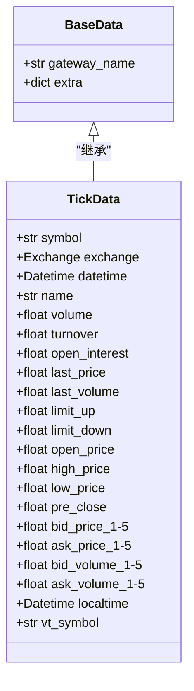
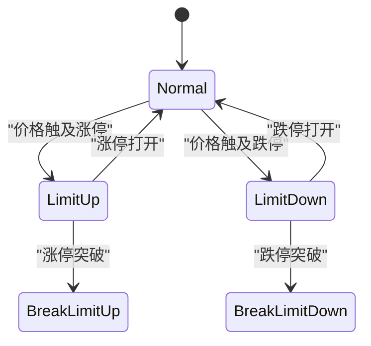
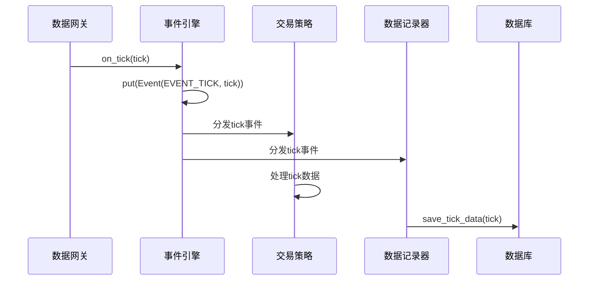
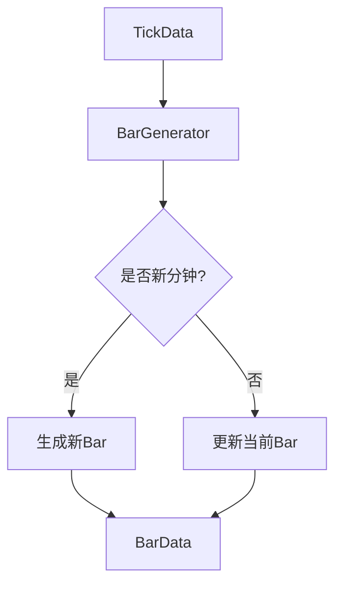
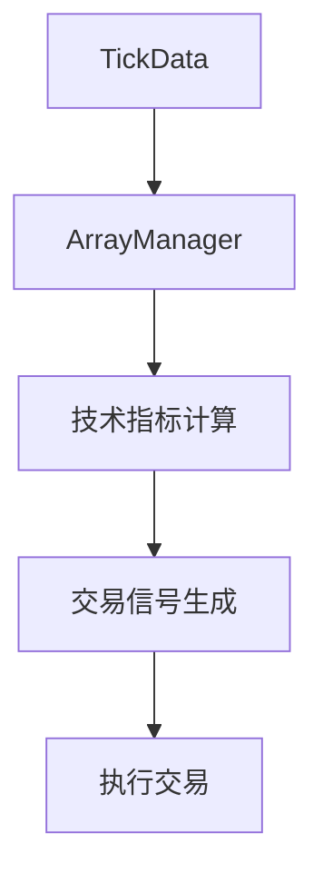

# Tick行情数据

<cite>
**本文档引用文件**   
- [object.py](file://vnpy/trader/object.py)
- [engine.py](file://vnpy/event/engine.py)
- [gateway.py](file://vnpy/trader/gateway.py)
- [event.py](file://vnpy/trader/event.py)
- [database.py](file://vnpy/trader/database.py)
- [utility.py](file://vnpy/trader/utility.py)
- [data_recorder.py](file://examples/data_recorder/data_recorder.py)
- [data_manager.md](file://docs/community/app/data_manager.md)
- [cta_strategy.md](file://docs/community/app/cta_strategy.md)
</cite>

## 目录
1. [简介](#简介)
2. [TickData数据模型](#tickdata数据模型)
3. [核心行情字段详解](#核心行情字段详解)
4. [衍生数据字段应用](#衍生数据字段应用)
5. [事件驱动架构中的流转](#事件驱动架构中的流转)
6. [TickData与BarData转换](#tickdata与bardata转换)
7. [策略计算中的使用模式](#策略计算中的使用模式)
8. [最佳实践](#最佳实践)
9. [结论](#结论)

## 简介
Tick行情数据是量化交易系统中最基础、最精细的市场数据形式，记录了市场交易的每一个瞬间变化。在vnpy框架中，TickData数据模型作为核心数据结构，承载着市场实时行情的采集、传输、存储和分析功能。本文档将全面解析TickData数据模型，从字段定义到系统流转，从数据转换到策略应用，为开发者和交易员提供完整的知识体系。

## TickData数据模型

TickData数据模型在vnpy框架中定义于`object.py`文件中，作为`BaseData`类的子类，继承了基础数据结构的通用特性。该模型采用Python的dataclass装饰器实现，确保了数据结构的清晰性和可维护性。



**Diagram sources**
- [object.py](file://vnpy/trader/object.py#L17-L85)

**Section sources**
- [object.py](file://vnpy/trader/object.py#L29-L85)

## 核心行情字段详解

TickData模型中的核心行情字段主要分为三类：最新成交信息、买卖盘口信息和日内统计信息。

### 最新成交信息
- **last_price**: 最新成交价，反映当前市场最活跃的交易价格，是市场情绪的重要指标
- **last_volume**: 最新成交量，表示最近一笔交易的成交手数，揭示市场交易的活跃程度
- **volume**: 累计成交量，从交易日开始到当前时刻的总成交量，用于评估市场参与度
- **turnover**: 累计成交额，从交易日开始到当前时刻的总成交金额，反映资金流动规模

### 买卖盘口信息
买卖盘口信息采用五档报价结构，提供市场深度的详细视图：

```mermaid
flowchart TD
A[买一] --> |价格| B[bid_price_1]
A --> |数量| C[bid_volume_1]
D[买二] --> |价格| E[bid_price_2]
D --> |数量| F[bid_volume_2]
G[买三] --> |价格| H[bid_price_3]
G --> |数量| I[bid_volume_3]
J[买四] --> |价格| K[bid_price_4]
J --> |数量| L[bid_volume_4]
M[买五] --> |价格| N[bid_price_5]
M --> |数量| O[bid_volume_5]
P[卖一] --> |价格| Q[ask_price_1]
P --> |数量| R[ask_volume_1]
S[卖二] --> |价格| T[ask_price_2]
S --> |数量| U[ask_volume_2]
V[卖三] --> |价格| W[ask_price_3]
V --> |数量| X[ask_volume_3]
Y[卖四] --> |价格| Z[ask_price_4]
Y --> |数量| AA[ask_volume_4]
BB[卖五] --> |价格| CC[ask_price_5]
BB --> |数量| DD[ask_volume_5]
```



**Diagram sources**
- [object.py](file://vnpy/trader/object.py#L56-L78)

买卖盘口信息的作用包括：
- **市场深度分析**: 通过买卖盘口的挂单量分布，判断市场支撑和阻力位
- **流动性评估**: 五档报价的厚度反映市场流动性状况
- **交易策略支持**: 为做市商策略、套利策略提供决策依据
- **价格预测**: 盘口失衡往往预示着价格的短期走势

### 日内统计信息
- **open_price**: 当日开盘价，反映市场开盘时的供需平衡
- **high_price**: 当日最高价，标识市场的短期高点
- **low_price**: 当日最低价，标识市场的短期低点
- **pre_close**: 前收盘价，用于计算涨跌幅和价格变化
- **open_interest**: 持仓量，反映市场未平仓合约的总量，是判断市场趋势强度的重要指标

**Section sources**
- [object.py](file://vnpy/trader/object.py#L51-L54)

## 衍生数据字段应用

### 涨跌停价
- **limit_up**: 涨停价，当日价格上限，超过此价格的买单将无法成交
- **limit_down**: 跌停价，当日价格下限，低于此价格的卖单将无法成交

涨跌停价在交易系统中的应用场景包括：
- **风险控制**: 在策略中设置价格保护，避免在极端行情下产生过大亏损
- **交易决策**: 当价格触及涨跌停时，调整交易策略，如停止开仓或调整止损位
- **流动性管理**: 涨跌停状态下市场流动性急剧下降，需要特殊处理订单执行



**Diagram sources**
- [object.py](file://vnpy/trader/object.py#L48-L49)

### 持仓量
- **open_interest**: 持仓量是期货市场特有的重要指标，其变化反映市场多空力量的对比

持仓量的应用场景：
- **趋势确认**: 持仓量与价格同向增长，确认趋势的强度
- **反转预警**: 价格创新高但持仓量下降，可能预示趋势反转
- **市场情绪分析**: 持仓量的快速增加反映市场参与者的信心

**Section sources**
- [object.py](file://vnpy/trader/object.py#L45)

## 事件驱动架构中的流转

TickData在vnpy框架中的流转遵循典型的事件驱动架构模式，从数据采集到分发的完整路径如下：



### 数据采集
数据采集由具体的交易网关实现，如CTP网关、IB网关等。网关通过API连接到交易所，实时接收市场行情数据，并将其转换为vnpy标准的TickData对象。

```python
def on_tick(self, tick: TickData) -> None:
    """
    Tick事件推送。
    Tick事件的特定vt_symbol也会被推送。
    """
    self.on_event(EVENT_TICK, tick)
    self.on_event(EVENT_TICK + tick.vt_symbol, tick)
```

**Diagram sources**
- [gateway.py](file://vnpy/trader/gateway.py#L93-L99)

### 事件分发
事件引擎（EventEngine）是vnpy框架的核心组件，负责事件的分发和调度。当网关接收到TickData后，通过`on_event`方法将其包装为Event对象并放入事件队列。

```python
def on_event(self, type: str, data: object = None) -> None:
    """
    通用事件推送。
    """
    event: Event = Event(type, data)
    self.event_engine.put(event)
```

**Section sources**
- [gateway.py](file://vnpy/trader/gateway.py#L86-L92)
- [engine.py](file://vnpy/event/engine.py#L105-L109)

### 事件处理
事件引擎从队列中取出事件，并根据事件类型分发给注册的事件处理器。策略模块、数据记录器等组件通过注册事件监听器来接收TickData。

```python
def _process(self, event: Event) -> None:
    """
    首先将事件分发给注册了此类型的处理器。
    然后将事件分发给所有类型的通用处理器。
    """
    if event.type in self._handlers:
        [handler(event) for handler in self._handlers[event.type]]

    if self._general_handlers:
        [handler(event) for handler in self._general_handlers]
```

**Section sources**
- [engine.py](file://vnpy/event/engine.py#L66-L78)

## TickData与BarData转换

TickData到BarData的转换是量化交易中的关键环节，通过BarGenerator组件实现。该转换过程将高频的Tick数据聚合为低频的K线数据，便于技术分析和策略计算。



### 转换机制
BarGenerator组件通过以下步骤实现转换：
1. **初始化**: 创建BarData对象，设置初始值
2. **数据更新**: 接收新的TickData，更新当前Bar的最高价、最低价、收盘价等
3. **成交量计算**: 基于Tick数据的累计成交量差值计算当前分钟的成交量
4. **Bar完成**: 当分钟切换时，生成完整的BarData并触发回调

```python
def update_tick(self, tick: TickData) -> None:
    """
    将新的Tick数据更新到生成器中。
    """
    new_minute: bool = False

    # 过滤最后价格为0的Tick数据
    if not tick.last_price:
        return

    # 判断是否为新的一分钟
    if not self.bar or self.bar.datetime.minute != tick.datetime.minute:
        if self.bar:
            finished_bar: BarData = self.bar
            self.on_bar(finished_bar)
        new_minute = True

    # 初始化新的分钟线
    if new_minute:
        self.bar = BarData(
            symbol=tick.symbol,
            exchange=tick.exchange,
            datetime=tick.datetime,
            gateway_name=tick.gateway_name,
            open_price=tick.last_price,
            high_price=tick.last_price,
            low_price=tick.last_price,
            close_price=tick.last_price,
            open_interest=tick.open_interest
        )
    else:
        self.bar.high_price = max(self.bar.high_price, tick.last_price)
        self.bar.low_price = min(self.bar.low_price, tick.last_price)
        self.bar.close_price = tick.last_price
        self.bar.open_interest = tick.open_interest

    # 计算成交量
    if self.last_tick and self.bar:
        volume_change: float = tick.volume - self.last_tick.volume
        self.bar.volume += max(volume_change, 0)

        turnover_change: float = tick.turnover - self.last_tick.turnover
        self.bar.turnover += max(turnover_change, 0)

    self.last_tick = tick
```

**Section sources**
- [utility.py](file://vnpy/trader/utility.py#L203-L260)

### 多周期K线生成
BarGenerator还支持生成多周期K线，如5分钟、15分钟、小时线等。这通过将1分钟K线进一步聚合实现。

```python
def update_bar(self, bar: BarData) -> None:
    """
    将1分钟K线更新到生成器中
    """
    if self.interval == Interval.MINUTE:
        self.update_bar_minute_window(bar)
    elif self.interval == Interval.HOUR:
        self.update_bar_hour_window(bar)
    else:
        self.update_bar_daily_window(bar)
```

**Section sources**
- [utility.py](file://vnpy/trader/utility.py#L261-L270)

## 策略计算中的使用模式

### 实时交易策略
在实时交易策略中，TickData是决策的基础。策略通过`on_tick`回调函数接收实时行情，并根据盘口信息、最新成交等数据做出交易决策。

```python
def on_tick(self, tick: TickData):
    """
    新的Tick数据更新回调。
    """
    self.bg.update_tick(tick)
```

**Section sources**
- [cta_strategy.md](file://docs/community/app/cta_strategy.md#L584-L589)

### 技术指标计算
虽然技术指标通常基于K线数据计算，但TickData提供了更精细的市场信息，可用于改进指标计算的准确性。



ArrayManager组件将K线数据转化为便于向量化计算的时间序列数据结构，支持使用talib库计算技术指标。

**Diagram sources**
- [cta_strategy.md](file://docs/community/app/cta_strategy.md#L499-L500)

### 高频交易策略
对于高频交易策略，直接使用TickData进行决策是必要的。策略可以分析盘口动态、订单流等微观市场结构特征。

```python
# 示例：基于盘口失衡的交易策略
if tick.ask_volume_1 > tick.bid_volume_1 * 2:
    # 卖方压力大，考虑卖出
    self.sell(tick.ask_price_1, volume)
elif tick.bid_volume_1 > tick.ask_volume_1 * 2:
    # 买方力量强，考虑买入
    self.buy(tick.bid_price_1, volume)
```

**Section sources**
- [cta_strategy.md](file://docs/community/app/cta_strategy.md#L614-L651)

## 最佳实践

### 数据去重
在实际交易中，由于网络延迟或系统故障，可能会收到重复的TickData。有效的数据去重策略至关重要。

```python
class TickDeduplicator:
    def __init__(self, window_seconds=1):
        self.recent_ticks = {}
        self.window = window_seconds
    
    def is_duplicate(self, tick: TickData) -> bool:
        key = f"{tick.symbol}.{tick.exchange.value}.{tick.datetime.timestamp()}"
        current_time = time.time()
        
        # 清理过期的记录
        expired_keys = [
            k for k, v in self.recent_ticks.items() 
            if current_time - v > self.window
        ]
        for k in expired_keys:
            del self.recent_ticks[k]
        
        # 检查是否为重复数据
        if key in self.recent_ticks:
            return True
        
        # 记录新数据
        self.recent_ticks[key] = current_time
        return False
```

**Section sources**
- [object.py](file://vnpy/trader/object.py#L38-L85)

### 异常值处理
市场数据中可能出现异常值，如价格跳空、成交量异常等。需要建立有效的异常值检测和处理机制。

```python
def validate_tick(tick: TickData) -> bool:
    """验证Tick数据的有效性"""
    # 检查价格合理性
    if tick.last_price <= 0:
        return False
    
    # 检查涨跌停价合理性
    if tick.limit_up > 0 and tick.limit_down > 0:
        if tick.last_price > tick.limit_up or tick.last_price < tick.limit_down:
            return False
    
    # 检查成交量合理性
    if tick.volume < 0:
        return False
    
    # 检查盘口合理性
    if (tick.bid_price_1 > 0 and tick.ask_price_1 > 0 
        and tick.bid_price_1 >= tick.ask_price_1):
        return False
    
    return True
```

**Section sources**
- [object.py](file://vnpy/trader/object.py#L46-L49)

### 性能优化建议
处理高频TickData时，性能是关键考虑因素。以下是一些性能优化建议：

1. **批量处理**: 尽量采用批量处理方式，减少函数调用开销
2. **内存优化**: 使用numpy数组等高效数据结构存储历史数据
3. **异步处理**: 将耗时操作（如数据库写入）放入异步队列
4. **选择性订阅**: 只订阅必要的合约，减少数据流量
5. **数据压缩**: 对存储的TickData进行压缩，节省磁盘空间

```python
# 示例：异步数据存储
import asyncio
from queue import Queue

class AsyncDataRecorder:
    def __init__(self):
        self.queue = Queue()
        self.running = False
    
    async def run(self):
        self.running = True
        while self.running:
            try:
                tick = self.queue.get(timeout=1)
                await self.save_to_database(tick)
            except:
                continue
    
    def add_tick(self, tick: TickData):
        self.queue.put(tick)
```

**Section sources**
- [database.py](file://vnpy/trader/database.py#L58-L69)

## 结论
TickData数据模型是vnpy量化交易框架的核心组成部分，贯穿于数据采集、传输、存储和分析的全过程。通过深入理解TickData的字段定义、业务含义和系统流转，开发者可以构建更加稳健和高效的交易系统。在实际应用中，应结合具体策略需求，合理利用TickData的丰富信息，同时注意数据质量控制和性能优化，以实现最佳的交易效果。