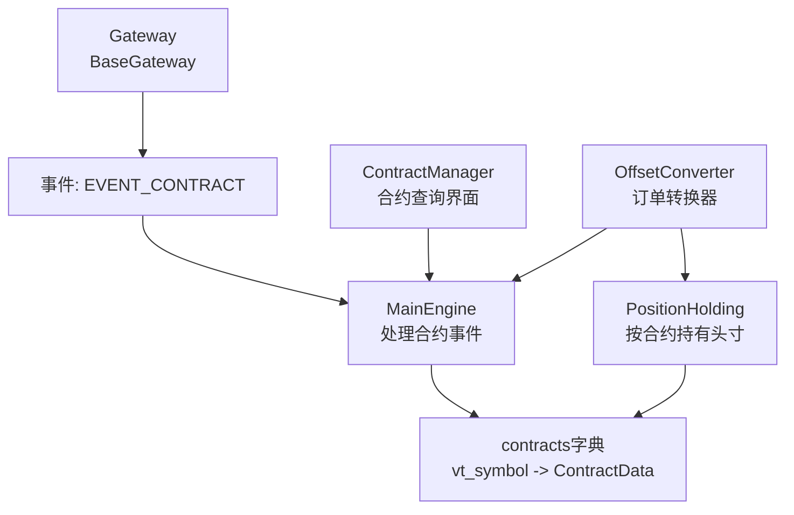
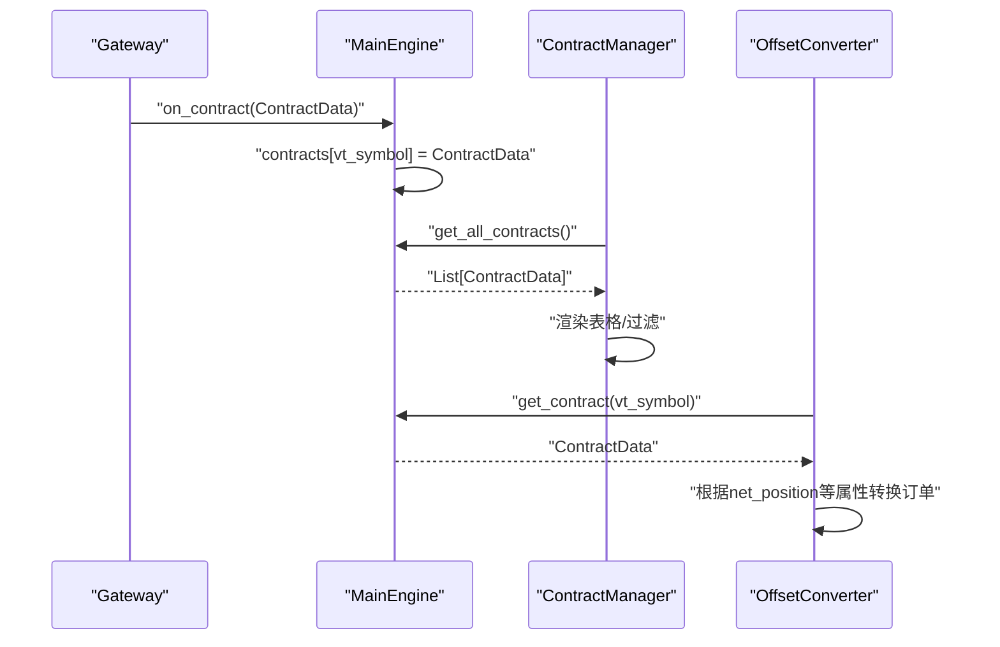
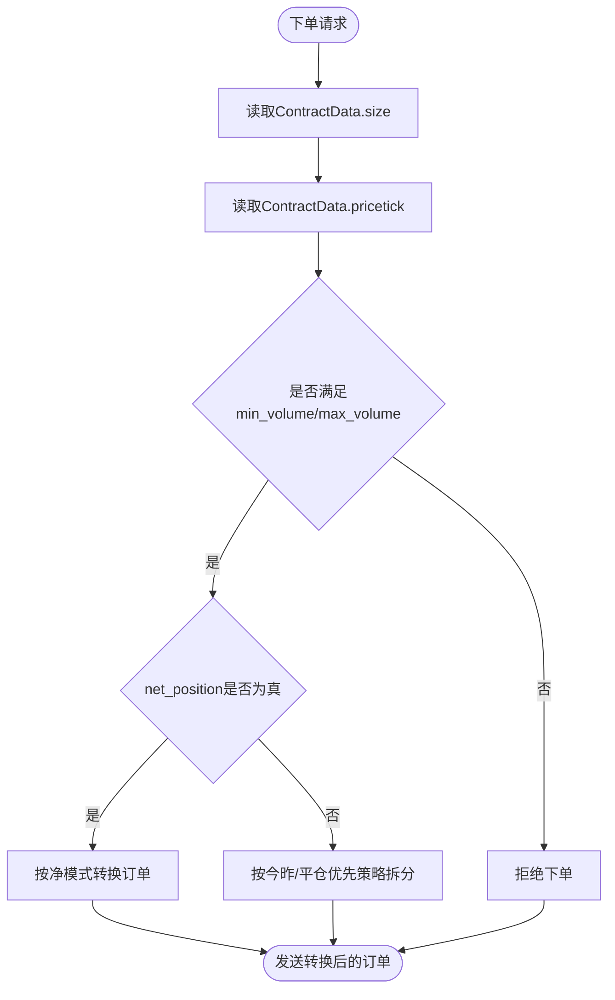
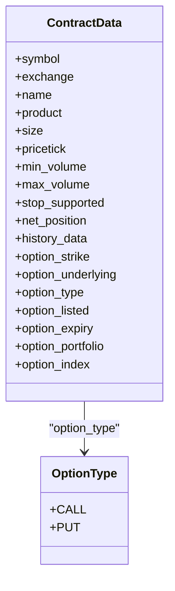
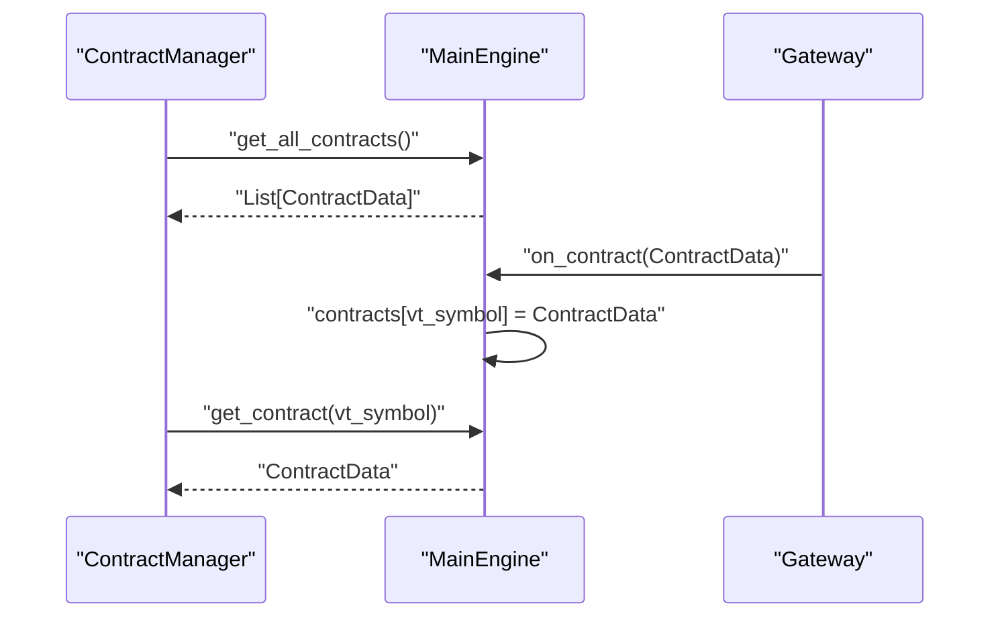
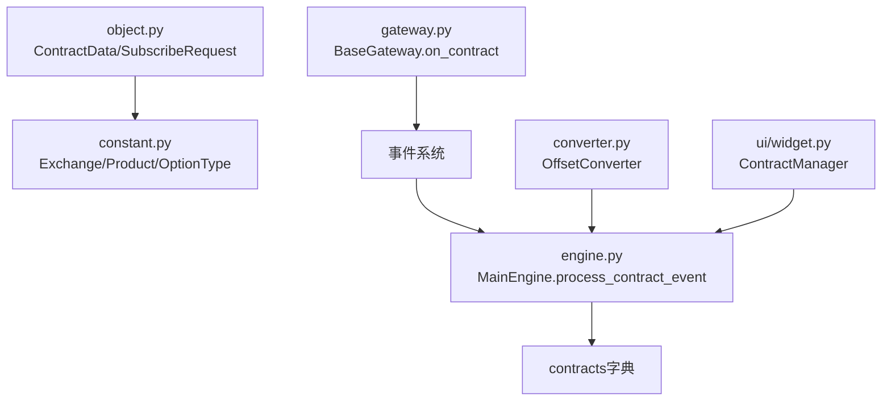

# 合约数据

<cite>
**本文引用的文件**
- [vnpy/trader/object.py](file://vnpy/trader/object.py)
- [vnpy/trader/constant.py](file://vnpy/trader/constant.py)
- [vnpy/trader/engine.py](file://vnpy/trader/engine.py)
- [vnpy/trader/gateway.py](file://vnpy/trader/gateway.py)
- [vnpy/trader/converter.py](file://vnpy/trader/converter.py)
- [vnpy/trader/ui/widget.py](file://vnpy/trader/ui/widget.py)
- [docs/community/app/option_master.md](file://docs/community/app/option_master.md)
- [docs/elite/strategy/elite_optionstrategy.md](file://docs/elite/strategy/elite_optionstrategy.md)
- [docs/community/app/data_manager.md](file://docs/community/app/data_manager.md)
- [docs/community/app/script_trader.md](file://docs/community/app/script_trader.md)
</cite>

## 目录
1. [引言](#引言)
2. [项目结构](#项目结构)
3. [核心组件](#核心组件)
4. [架构总览](#架构总览)
5. [详细组件分析](#详细组件分析)
6. [依赖关系分析](#依赖关系分析)
7. [性能考量](#性能考量)
8. [故障排查指南](#故障排查指南)
9. [结论](#结论)
10. [附录](#附录)

## 引言
本文件围绕vnpy平台中的合约数据模型ContractData展开，系统性梳理其核心字段的业务含义与使用方式，重点阐释合约乘数(size)与价格跳动(pricetick)在交易计算中的关键作用，详解期权合约特有的option_strike、option_type、option_expiry等字段的应用场景，并说明max_volume、stop_supported、net_position等交易属性对交易行为的影响。同时，结合合约查询与订阅机制，分析合约数据的获取、缓存与更新策略，并给出合约数据管理的最佳实践，包括数据校验、版本控制与扩展支持建议。

## 项目结构
围绕合约数据模型的关键文件与职责如下：
- 数据模型与常量
  - ContractData：合约基础信息载体，包含symbol、exchange、name、product、size、pricetick、min_volume、max_volume、stop_supported、net_position、history_data、option_*等字段。
  - 常量枚举：Exchange、Product、OptionType等，为ContractData提供标准化的业务语义。
- 事件与引擎
  - MainEngine：统一注册EVENT_CONTRACT事件，接收并缓存ContractData，提供按vt_symbol查询与全量导出能力。
  - BaseGateway：通过on_contract推送ContractData事件，触发MainEngine缓存。
- 订单转换器
  - OffsetConverter/PositionHolding：依据ContractData的net_position等属性，决定是否需要对订单请求进行“开平仓/今昨”转换，从而影响下单行为。
- 用户界面
  - ContractManager：提供合约查询界面，展示ContractData字段，支持过滤与表格化展示。
- 文档与策略
  - option_master与elite_optionstrategy：强调期权链、期权产品、到期日、行权价等字段在期权策略中的实际应用。
  - DataManager与script_trader：说明历史数据范围与全量合约查询接口，辅助合约数据的更新与验证。

图表来源
- [vnpy/trader/gateway.py](file://vnpy/trader/gateway.py#L141-L225)
- [vnpy/trader/engine.py](file://vnpy/trader/engine.py#L420-L463)
- [vnpy/trader/converter.py](file://vnpy/trader/converter.py#L310-L403)
- [vnpy/trader/ui/widget.py](file://vnpy/trader/ui/widget.py#L1074-L1171)

章节来源
- [vnpy/trader/object.py](file://vnpy/trader/object.py#L232-L262)
- [vnpy/trader/constant.py](file://vnpy/trader/constant.py#L42-L101)
- [vnpy/trader/engine.py](file://vnpy/trader/engine.py#L420-L463)
- [vnpy/trader/gateway.py](file://vnpy/trader/gateway.py#L141-L225)
- [vnpy/trader/converter.py](file://vnpy/trader/converter.py#L310-L403)
- [vnpy/trader/ui/widget.py](file://vnpy/trader/ui/widget.py#L1074-L1171)

## 核心组件
- ContractData（合约数据模型）
  - 字段概览与业务含义
    - symbol：合约代码标识
    - exchange：交易所枚举
    - name：合约名称
    - product：产品类别（股票、期货、期权、指数、外汇、现货、ETF、债券、权证、价差、基金、CFD、互换等）
    - size：合约乘数（单位：手/份/份额等），直接影响名义价值与保证金计算
    - pricetick：价格跳动（最小价格变动单位），决定报价精度与滑点估算
    - min_volume/max_volume：最小/最大委托量，约束下单数量范围
    - stop_supported：是否支持止损单
    - net_position：是否使用净持仓模式（影响开平仓转换逻辑）
    - history_data：是否提供K线历史数据
    - option_strike：期权行权价
    - option_underlying：标的合约vt_symbol
    - option_type：期权类型（看涨/看跌）
    - option_listed：期权上市时间
    - option_expiry：期权到期日
    - option_portfolio：期权产品（如“IO”、“HO”等）
    - option_index：期权索引（用于识别相同行权价的期权）
  - 关键作用
    - size与pricetick是交易计算的基石：size用于将交易量转换为名义价值，pricetick用于计算最小变动金额与滑点成本。
    - net_position决定是否启用开平仓/今昨转换，从而影响下单拆分与可用头寸判断。
    - max_volume用于风控与合规限制，stop_supported决定是否允许止损单。
    - 期权字段（option_*）支撑期权链、组合与定价模型的构建与运行。

章节来源
- [vnpy/trader/object.py](file://vnpy/trader/object.py#L232-L262)
- [vnpy/trader/constant.py](file://vnpy/trader/constant.py#L42-L101)

## 架构总览
合约数据在系统内的流转路径如下：
- Gateway通过on_contract推送ContractData事件
- MainEngine注册并处理EVENT_CONTRACT，将ContractData存入内存字典，供全局查询
- UI通过ContractManager调用MainEngine接口获取全量合约并展示
- OffsetConverter基于ContractData的net_position等属性，对订单请求进行转换，影响下单行为

图表来源
- [vnpy/trader/gateway.py](file://vnpy/trader/gateway.py#L141-L225)
- [vnpy/trader/engine.py](file://vnpy/trader/engine.py#L420-L463)
- [vnpy/trader/ui/widget.py](file://vnpy/trader/ui/widget.py#L1074-L1171)
- [vnpy/trader/converter.py](file://vnpy/trader/converter.py#L310-L403)

## 详细组件分析

### 合约乘数(size)与价格跳动(pricetick)的交易计算作用
- 合约乘数(size)
  - 用于将交易量转换为名义价值，是保证金、收益/损失、风险限额等计算的基础。
  - 在不同市场与产品中，size的含义可能不同（如股指期货以点数计，商品期货以实物重量或标准仓单计）。
- 价格跳动(pricetick)
  - 决定报价精度与最小变动金额，影响滑点估算与手续费计算。
  - 与tick级别数据配合，用于策略信号生成与回测精度评估。
- 实际影响
  - 订单拆分与可用头寸：在支持“今昨”分离的交易所，pricetick与size共同决定最小可成交单位与冻结金额。
  - 风控阈值：max_volume与size组合，形成对单笔/累计委托的规模限制。

图表来源
- [vnpy/trader/object.py](file://vnpy/trader/object.py#L232-L262)
- [vnpy/trader/converter.py](file://vnpy/trader/converter.py#L310-L403)

章节来源
- [vnpy/trader/object.py](file://vnpy/trader/object.py#L232-L262)
- [vnpy/trader/converter.py](file://vnpy/trader/converter.py#L310-L403)

### 期权合约字段的应用场景
- option_strike：期权行权价，用于期权链构建与定价模型计算
- option_type：期权类型（CALL/PUT），决定期权内在价值与Gamma方向
- option_expiry：期权到期日，用于期权链筛选与到期风险管理
- option_underlying：标的合约vt_symbol，用于合成期货价格计算与跨品套利
- option_portfolio：期权产品标识（如“IO”、“HO”等），用于按产品维度组织期权链
- option_listed：期权上市时间，用于历史回测与数据完整性校验
- option_index：期权索引，用于同行权价期权的快速定位与映射

图表来源
- [vnpy/trader/object.py](file://vnpy/trader/object.py#L232-L262)
- [vnpy/trader/constant.py](file://vnpy/trader/constant.py#L74-L81)

章节来源
- [vnpy/trader/object.py](file://vnpy/trader/object.py#L232-L262)
- [vnpy/trader/constant.py](file://vnpy/trader/constant.py#L74-L81)
- [docs/community/app/option_master.md](file://docs/community/app/option_master.md#L45-L93)
- [docs/elite/strategy/elite_optionstrategy.md](file://docs/elite/strategy/elite_optionstrategy.md#L519-L617)

### 交易属性对交易行为的影响
- max_volume：限制单笔/累计委托的最大数量，避免超仓或违规
- stop_supported：决定是否允许止损单，影响风控策略与订单类型选择
- net_position：决定是否启用“开平仓/今昨”转换，影响可用头寸与冻结逻辑
- history_data：决定是否能通过接口/数据服务获取历史K线，影响策略初始化与回测

章节来源
- [vnpy/trader/object.py](file://vnpy/trader/object.py#L232-L262)
- [vnpy/trader/converter.py](file://vnpy/trader/converter.py#L310-L403)

### 合约查询与订阅机制
- 合约查询
  - UI层：ContractManager通过MainEngine.get_all_contracts()获取全量合约，支持按vt_symbol过滤与表格展示
  - 接口层：MainEngine.process_contract_event将ContractData写入内存字典，提供get_contract/get_all_contracts等查询接口
- 合约订阅
  - Gateway通过subscribe接口订阅行情，随后on_contract推送合约信息
  - 订阅成功后，合约信息进入系统，后续策略与UI可直接查询

图表来源
- [vnpy/trader/ui/widget.py](file://vnpy/trader/ui/widget.py#L1074-L1171)
- [vnpy/trader/engine.py](file://vnpy/trader/engine.py#L420-L463)
- [vnpy/trader/gateway.py](file://vnpy/trader/gateway.py#L141-L225)

章节来源
- [vnpy/trader/ui/widget.py](file://vnpy/trader/ui/widget.py#L1074-L1171)
- [vnpy/trader/engine.py](file://vnpy/trader/engine.py#L420-L463)
- [vnpy/trader/gateway.py](file://vnpy/trader/gateway.py#L141-L225)

### 合约数据的获取、缓存与更新策略
- 获取
  - Gateway在连接成功后推送ContractData事件，MainEngine统一接收并缓存
  - UI层通过get_all_contracts()一次性拉取全量合约，或按过滤条件查询
- 缓存
  - MainEngine以vt_symbol为键缓存ContractData，提供O(1)查询
  - OffsetConverter按需从MainEngine获取ContractData，构建PositionHolding
- 更新
  - 当Gateway推送新的ContractData（如新增合约或字段变更）时，MainEngine覆盖旧记录
  - DataManager支持历史数据更新，确保K线连续性与回测稳定性

章节来源
- [vnpy/trader/engine.py](file://vnpy/trader/engine.py#L420-L463)
- [vnpy/trader/converter.py](file://vnpy/trader/converter.py#L310-L403)
- [docs/community/app/data_manager.md](file://docs/community/app/data_manager.md#L157-L177)

### 合约数据管理的最佳实践
- 数据校验
  - 必填字段：symbol、exchange、product、size、pricetick
  - 合法性校验：pricetick与size应为正数；option_expiry应晚于option_listed；max_volume应不小于min_volume
  - 一致性校验：vt_symbol由symbol与exchange拼接而成，应保持稳定
- 版本控制
  - 合约元数据变更应纳入版本管理，记录变更历史与影响范围
  - 对于期权产品（option_portfolio），建议建立产品清单与映射表，便于策略侧统一管理
- 扩展支持
  - 新增字段时，应在ContractData中声明默认值，并在UI与事件处理中兼容
  - 对于特殊交易所（如支持“锁仓”或“净模式”），通过net_position与stop_supported等属性驱动差异化逻辑

章节来源
- [vnpy/trader/object.py](file://vnpy/trader/object.py#L232-L262)
- [vnpy/trader/ui/widget.py](file://vnpy/trader/ui/widget.py#L1074-L1171)
- [docs/community/app/script_trader.md](file://docs/community/app/script_trader.md#L340-L366)

## 依赖关系分析
- 组件耦合
  - ContractData依赖Exchange、Product、OptionType等枚举，确保字段语义一致
  - MainEngine依赖EventEngine接收EVENT_CONTRACT，集中管理合约缓存
  - OffsetConverter依赖MainEngine的get_contract能力，动态构建PositionHolding
- 外部依赖
  - Gateway负责推送ContractData与行情，是合约数据的源头
  - UI层依赖MainEngine的查询接口，提供可视化展示

图表来源
- [vnpy/trader/object.py](file://vnpy/trader/object.py#L232-L262)
- [vnpy/trader/constant.py](file://vnpy/trader/constant.py#L42-L101)
- [vnpy/trader/gateway.py](file://vnpy/trader/gateway.py#L141-L225)
- [vnpy/trader/engine.py](file://vnpy/trader/engine.py#L420-L463)
- [vnpy/trader/converter.py](file://vnpy/trader/converter.py#L310-L403)
- [vnpy/trader/ui/widget.py](file://vnpy/trader/ui/widget.py#L1074-L1171)

章节来源
- [vnpy/trader/object.py](file://vnpy/trader/object.py#L232-L262)
- [vnpy/trader/constant.py](file://vnpy/trader/constant.py#L42-L101)
- [vnpy/trader/gateway.py](file://vnpy/trader/gateway.py#L141-L225)
- [vnpy/trader/engine.py](file://vnpy/trader/engine.py#L420-L463)
- [vnpy/trader/converter.py](file://vnpy/trader/converter.py#L310-L403)
- [vnpy/trader/ui/widget.py](file://vnpy/trader/ui/widget.py#L1074-L1171)

## 性能考量
- 查询性能
  - 使用vt_symbol作为键的字典存储，查询为O(1)，适合高频查询场景
- 订单转换性能
  - OffsetConverter按需构建PositionHolding，避免重复计算
  - 对于支持“今昨”分离的交易所，转换逻辑较为复杂，建议在策略层尽量减少频繁拆单
- UI渲染性能
  - ContractManager一次性获取全量合约并渲染，建议在大数据量时增加分页或虚拟滚动优化

## 故障排查指南
- 合约未显示
  - 检查Gateway是否成功推送on_contract事件
  - 确认MainEngine是否注册EVENT_CONTRACT并写入contracts字典
  - 使用ContractManager过滤查询，确认vt_symbol格式正确
- 订单拆分异常
  - 检查ContractData.net_position与交易所是否支持“今昨”分离
  - 核对pricetick与size是否正确，避免最小变动单位导致的拆单失败
- 历史数据缺失
  - 检查接口是否提供历史数据，必要时通过数据服务或本地数据库补充
  - 更新后使用“查看”按钮核对数据连续性

章节来源
- [vnpy/trader/engine.py](file://vnpy/trader/engine.py#L420-L463)
- [vnpy/trader/gateway.py](file://vnpy/trader/gateway.py#L141-L225)
- [vnpy/trader/ui/widget.py](file://vnpy/trader/ui/widget.py#L1074-L1171)
- [docs/community/app/data_manager.md](file://docs/community/app/data_manager.md#L157-L177)

## 结论
ContractData是vnpy交易系统的核心数据载体，其字段直接决定了交易计算、风控与策略执行的行为。size与pricetick是交易精度与成本的基础，net_position与max_volume等属性则影响订单转换与风控策略。通过Gateway推送+MainEngine缓存+UI查询的机制，系统实现了合约数据的高效获取与管理。结合期权字段与策略文档，可进一步完善期权链与组合管理。建议在实践中加强数据校验、版本控制与扩展支持，确保合约数据的完整性与一致性。

## 附录
- 相关接口与文档
  - get_all_contracts：全量合约查询
  - get_contract：按vt_symbol查询合约
  - 订阅接口：subscribe
  - 历史数据更新：DataManager

章节来源
- [docs/community/app/script_trader.md](file://docs/community/app/script_trader.md#L340-L366)
- [vnpy/trader/gateway.py](file://vnpy/trader/gateway.py#L141-L225)
- [vnpy/trader/engine.py](file://vnpy/trader/engine.py#L420-L463)
- [docs/community/app/data_manager.md](file://docs/community/app/data_manager.md#L157-L177)