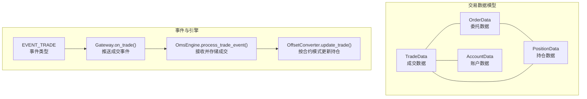
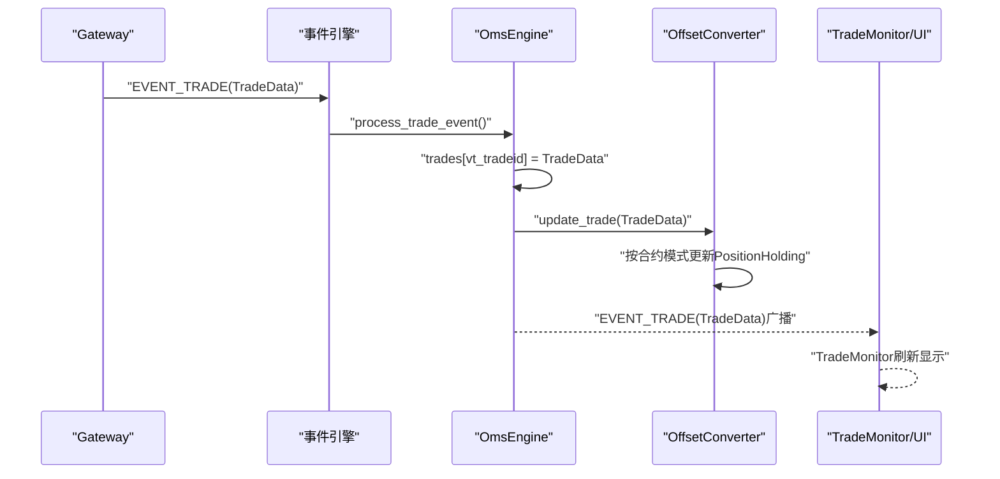
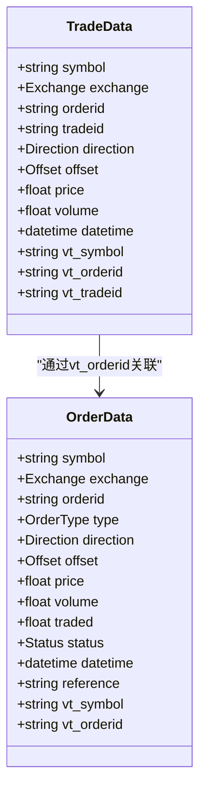
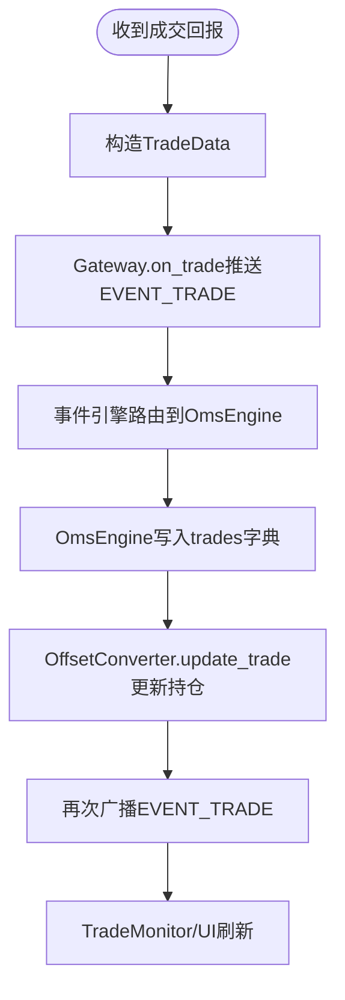
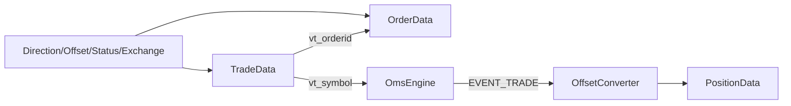

# 成交数据

<cite>
**本文引用的文件列表**
- [vnpy/trader/object.py](file://vnpy/trader/object.py)
- [vnpy/trader/engine.py](file://vnpy/trader/engine.py)
- [vnpy/trader/event.py](file://vnpy/trader/event.py)
- [vnpy/trader/gateway.py](file://vnpy/trader/gateway.py)
- [vnpy/trader/converter.py](file://vnpy/trader/converter.py)
- [vnpy/trader/constant.py](file://vnpy/trader/constant.py)
- [vnpy/trader/ui/widget.py](file://vnpy/trader/ui/widget.py)
- [vnpy/alpha/strategy/backtesting.py](file://vnpy/alpha/strategy/backtesting.py)
- [vnpy/alpha/strategy/backtesting.py](file://vnpy/alpha/strategy/backtesting.py)
- [vnpy/trader/database.py](file://vnpy/trader/database.py)
- [docs/community/app/paper_account.md](file://docs/community/app/paper_account.md)
</cite>

## 目录
1. [引言](#引言)
2. [项目结构](#项目结构)
3. [核心组件](#核心组件)
4. [架构总览](#架构总览)
5. [详细组件分析](#详细组件分析)
6. [依赖关系分析](#依赖关系分析)
7. [性能考量](#性能考量)
8. [故障排查指南](#故障排查指南)
9. [结论](#结论)
10. [附录](#附录)

## 引言
本文件围绕TradeData（成交数据）进行全面文档化，重点说明tradeid、orderid、price、volume、datetime等核心字段的业务含义；阐明成交数据与订单数据的关联关系及通过vt_orderid建立的映射机制；解释成交数据在持仓计算、盈亏统计和策略绩效评估中的关键作用；分析成交数据的生成时机与事件驱动传播路径；结合OmsEngine的成交处理逻辑，说明成交数据的累积与更新机制；最后给出成交数据处理的最佳实践，包括成交匹配、费用计算与数据一致性保障。

## 项目结构
TradeData属于vnpy.trader模块的核心数据模型之一，与OrderData、PositionData、AccountData等共同构成交易系统的数据基础。成交数据通过事件驱动在OmsEngine中被接收、存储与转发，并由OffsetConverter参与持仓维度的转换与更新。

图示来源
- [vnpy/trader/object.py](file://vnpy/trader/object.py#L153-L176)
- [vnpy/trader/event.py](file://vnpy/trader/event.py#L7-L14)
- [vnpy/trader/gateway.py](file://vnpy/trader/gateway.py#L101-L108)
- [vnpy/trader/engine.py](file://vnpy/trader/engine.py#L359-L404)
- [vnpy/trader/converter.py](file://vnpy/trader/converter.py#L310-L344)

章节来源
- [vnpy/trader/object.py](file://vnpy/trader/object.py#L153-L176)
- [vnpy/trader/event.py](file://vnpy/trader/event.py#L7-L14)
- [vnpy/trader/gateway.py](file://vnpy/trader/gateway.py#L101-L108)
- [vnpy/trader/engine.py](file://vnpy/trader/engine.py#L359-L404)
- [vnpy/trader/converter.py](file://vnpy/trader/converter.py#L310-L344)

## 核心组件
- TradeData：描述一次委托成交的完整信息，包含symbol、exchange、orderid、tradeid、direction、offset、price、volume、datetime等字段，以及vt_symbol、vt_orderid、vt_tradeid的唯一标识生成。
- OrderData：委托数据，包含委托编号、方向、开平、价格、数量、已成交、状态、时间等，vt_orderid用于跨网关唯一标识。
- OmsEngine：订单管理系统引擎，注册并处理EVENT_TRADE事件，维护orders、trades、positions、accounts等字典，提供查询与转换器集成。
- OffsetConverter：按合约的开平仓模式（多空仓/净仓）对成交进行转换与累计，更新PositionHolding中的多空仓分档与冻结量。
- EVENT_TRADE：成交事件类型字符串，Gateway在收到成交回报后推送该事件。
- Gateway.on_trade：将成交事件推送到全局事件引擎，并同时推送按vt_symbol细分的事件，便于订阅与过滤。

章节来源
- [vnpy/trader/object.py](file://vnpy/trader/object.py#L118-L176)
- [vnpy/trader/engine.py](file://vnpy/trader/engine.py#L359-L404)
- [vnpy/trader/converter.py](file://vnpy/trader/converter.py#L310-L344)
- [vnpy/trader/event.py](file://vnpy/trader/event.py#L7-L14)
- [vnpy/trader/gateway.py](file://vnpy/trader/gateway.py#L101-L108)

## 架构总览
成交数据在事件驱动架构中的传播路径如下：Gateway从上游接口收到成交回报后，构造TradeData并通过EVENT_TRADE推送；OmsEngine注册该事件并将其写入trades字典；随后通知OffsetConverter按合约模式更新持仓；最终通过UI监控或策略订阅获取最新成交与持仓信息。

图示来源
- [vnpy/trader/gateway.py](file://vnpy/trader/gateway.py#L101-L108)
- [vnpy/trader/engine.py](file://vnpy/trader/engine.py#L359-L404)
- [vnpy/trader/converter.py](file://vnpy/trader/converter.py#L328-L336)
- [vnpy/trader/ui/widget.py](file://vnpy/trader/ui/widget.py#L450-L471)

## 详细组件分析

### TradeData数据模型与字段语义
- tradeid：成交编号，用于唯一标识一次成交，vt_tradeid由gateway_name与tradeid拼接而成，便于跨网关区分。
- orderid：委托编号，vt_orderid由gateway_name与orderid拼接而成，用于将成交与委托建立映射关系。
- price：成交价格，单位为合约价格精度。
- volume：成交数量，单位为合约乘数对应的“手”或“份额”。
- datetime：成交发生的时间戳，通常为本地时间或接口时间。
- direction、offset：成交方向与开平属性，配合合约的开平仓模式决定持仓更新逻辑。
- vt_symbol：合约唯一符号，由symbol与exchange拼接而成，用于跨模块统一识别。

图示来源
- [vnpy/trader/object.py](file://vnpy/trader/object.py#L118-L176)

章节来源
- [vnpy/trader/object.py](file://vnpy/trader/object.py#L118-L176)

### 成交与订单的关联关系与vt_orderid映射
- 通过vt_orderid建立成交与委托的强关联：TradeData.vt_orderid与OrderData.vt_orderid一致，使得查询某委托的所有成交或某成交所属的委托成为O(1)操作。
- OmsEngine在接收ORDER事件时，将OrderData写入orders字典并维护active_orders；在接收TRADE事件时，将TradeData写入trades字典并调用OffsetConverter.update_trade进行持仓转换。
- UI层TradeMonitor以EVENT_TRADE为事件源，展示tradeid、orderid、price、volume、datetime等字段，便于人工核对与审计。

章节来源
- [vnpy/trader/engine.py](file://vnpy/trader/engine.py#L359-L404)
- [vnpy/trader/ui/widget.py](file://vnpy/trader/ui/widget.py#L450-L471)

### 成交数据在持仓计算中的关键作用
- OffsetConverter.update_trade依据合约的开平仓模式（多空仓/净仓）与交易所规则（如上期所/国际能源交易中心的平今/平昨限制），对PositionHolding中的long_td/long_yd、short_td/short_yd进行累计与冻结量更新。
- PositionHolding.update_trade根据成交的offset与exchange，正确累加/扣减td/yd分档，并在必要时将td扣减至0并回补yd，确保td/yd一致性。
- 多空仓模式下，挂出平仓委托会冻结相应td/yd数量，避免可用不足导致的超仓；净仓模式下则按pos_available进行拆分与冻结。

章节来源
- [vnpy/trader/converter.py](file://vnpy/trader/converter.py#L86-L121)
- [vnpy/trader/converter.py](file://vnpy/trader/converter.py#L189-L300)
- [vnpy/trader/converter.py](file://vnpy/trader/converter.py#L310-L344)

### 成交数据在盈亏统计与策略绩效评估中的作用
- Alpha回测引擎在calculate_result阶段按日聚合TradeData，计算逐日交易盈亏、手续费、总盈亏等；随后在calculate_statistics阶段计算年化收益、夏普比率、最大回撤等指标。
- 回测中成交价由引擎基于行情与下单价格撮合得出，成交记录可查看每笔委托的成交细节，支撑策略绩效归因与优化。

章节来源
- [vnpy/alpha/strategy/backtesting.py](file://vnpy/alpha/strategy/backtesting.py#L168-L227)
- [vnpy/alpha/strategy/backtesting.py](file://vnpy/alpha/strategy/backtesting.py#L228-L406)

### 成交数据的生成时机与事件驱动传播路径
- 生成时机：当Gateway收到上游接口的成交回报时，构造TradeData并调用on_trade推送EVENT_TRADE；同时推送按vt_symbol细分的事件，便于按合约订阅。
- 传播路径：EVENT_TRADE经事件引擎路由到OmsEngine.process_trade_event，写入trades字典并调用OffsetConverter.update_trade；随后再次广播EVENT_TRADE，供UI与策略订阅者消费。

图示来源
- [vnpy/trader/gateway.py](file://vnpy/trader/gateway.py#L101-L108)
- [vnpy/trader/engine.py](file://vnpy/trader/engine.py#L359-L404)
- [vnpy/trader/converter.py](file://vnpy/trader/converter.py#L328-L336)
- [vnpy/trader/ui/widget.py](file://vnpy/trader/ui/widget.py#L450-L471)

### OmsEngine的成交处理逻辑与累积更新机制
- 注册事件：OmsEngine.register_event中注册EVENT_TRADE处理器。
- 处理流程：process_trade_event接收TradeData，写入trades字典；随后调用OffsetConverter.update_trade，将成交转换为持仓维度的累计与冻结更新。
- 查询接口：提供get_trade按vt_tradeid查询成交，get_all_trades返回全部成交集合，便于回测与统计。

章节来源
- [vnpy/trader/engine.py](file://vnpy/trader/engine.py#L359-L404)
- [vnpy/trader/engine.py](file://vnpy/trader/engine.py#L453-L457)

### 成交匹配、费用计算与数据一致性最佳实践
- 成交匹配
  - 使用EVENT_TRADE事件驱动，确保成交到达与处理的顺序性与一致性。
  - 通过vt_orderid建立一对一或一对多的成交映射，避免错配与重复统计。
- 费用计算
  - 回测引擎在calculate_result阶段汇总手续费与成交金额，策略统计阶段据此计算日均手续费、总手续费等指标。
  - 实盘中费用通常由上游接口或网关提供，需在TradeData中保留费用字段以便统一统计。
- 数据一致性
  - 通过vt_*唯一标识（vt_symbol、vt_orderid、vt_tradeid）确保跨模块一致性。
  - 在OffsetConverter中严格遵循交易所规则（如平今/平昨）与合约模式（多空仓/净仓），避免td/yd与pos不一致。
  - UI层TradeMonitor以EVENT_TRADE为事件源，确保界面与引擎数据同步。

章节来源
- [vnpy/trader/converter.py](file://vnpy/trader/converter.py#L189-L300)
- [vnpy/alpha/strategy/backtesting.py](file://vnpy/alpha/strategy/backtesting.py#L168-L227)
- [vnpy/trader/ui/widget.py](file://vnpy/trader/ui/widget.py#L450-L471)

## 依赖关系分析
- TradeData依赖OrderData通过vt_orderid建立关联，OmsEngine通过vt_tradeid维护成交索引，OffsetConverter按合约模式更新PositionHolding。
- EVENT_TRADE作为统一事件类型，Gateway负责推送，OmsEngine负责接收与存储，UI负责展示。
- 常量枚举Direction、Offset、Status、Exchange等为TradeData与OrderData提供语义约束。

图示来源
- [vnpy/trader/object.py](file://vnpy/trader/object.py#L118-L176)
- [vnpy/trader/engine.py](file://vnpy/trader/engine.py#L359-L404)
- [vnpy/trader/converter.py](file://vnpy/trader/converter.py#L310-L344)
- [vnpy/trader/constant.py](file://vnpy/trader/constant.py#L10-L161)

章节来源
- [vnpy/trader/object.py](file://vnpy/trader/object.py#L118-L176)
- [vnpy/trader/engine.py](file://vnpy/trader/engine.py#L359-L404)
- [vnpy/trader/converter.py](file://vnpy/trader/converter.py#L310-L344)
- [vnpy/trader/constant.py](file://vnpy/trader/constant.py#L10-L161)

## 性能考量
- 事件驱动：通过EVENT_TRADE与事件引擎解耦，避免阻塞与长链路等待，提升吞吐。
- 字典索引：OmsEngine以vt_*为键的字典存储，查询与更新均为O(1)，适合高频成交场景。
- 分层处理：Gateway负责原始数据接入与事件推送，OmsEngine负责业务存储与转换，OffsetConverter负责合约维度的累计，职责清晰、易于扩展。
- UI刷新：TradeMonitor以EVENT_TRADE为事件源，批量刷新，避免频繁重绘。

[本节为通用性能讨论，不直接分析具体文件]

## 故障排查指南
- 成交未显示
  - 检查Gateway是否正确调用on_trade推送EVENT_TRADE；确认事件引擎已注册EVENT_TRADE。
  - 确认TradeMonitor的event_type是否为EVENT_TRADE，headers中是否包含tradeid、orderid、price、volume、datetime等列。
- 成交与委托不匹配
  - 核对vt_orderid是否一致；检查OrderData与TradeData的gateway_name与orderid是否匹配。
- 持仓异常
  - 检查OffsetConverter.update_trade是否按合约模式与交易所规则正确更新td/yd；确认PositionHolding的冻结量计算逻辑。
- 回测指标异常
  - 检查calculate_result阶段是否正确按日聚合TradeData；确认手续费与成交金额计算是否纳入。

章节来源
- [vnpy/trader/gateway.py](file://vnpy/trader/gateway.py#L101-L108)
- [vnpy/trader/engine.py](file://vnpy/trader/engine.py#L359-L404)
- [vnpy/trader/ui/widget.py](file://vnpy/trader/ui/widget.py#L450-L471)
- [vnpy/trader/converter.py](file://vnpy/trader/converter.py#L86-L121)
- [vnpy/alpha/strategy/backtesting.py](file://vnpy/alpha/strategy/backtesting.py#L168-L227)

## 结论
TradeData作为交易系统的核心数据载体，通过vt_orderid与OrderData建立稳定映射，依托EVENT_TRADE事件驱动在OmsEngine中被高效接收与存储，并由OffsetConverter按合约模式完成持仓累计与冻结更新。成交数据在回测与实盘中分别承担盈亏统计与费用计算的基础角色，是策略绩效评估与风控管理的关键输入。遵循vt_*唯一标识、事件驱动与分层处理的最佳实践，可显著提升系统的可靠性与可维护性。

[本节为总结性内容，不直接分析具体文件]

## 附录
- 文档中涉及的字段与枚举参考
  - TradeData字段：symbol、exchange、orderid、tradeid、direction、offset、price、volume、datetime、vt_symbol、vt_orderid、vt_tradeid
  - OrderData字段：symbol、exchange、orderid、type、direction、offset、price、volume、traded、status、datetime、reference、vt_symbol、vt_orderid
  - 常量枚举：Direction、Offset、Status、OrderType、Exchange、Interval

章节来源
- [vnpy/trader/object.py](file://vnpy/trader/object.py#L118-L176)
- [vnpy/trader/constant.py](file://vnpy/trader/constant.py#L10-L161)