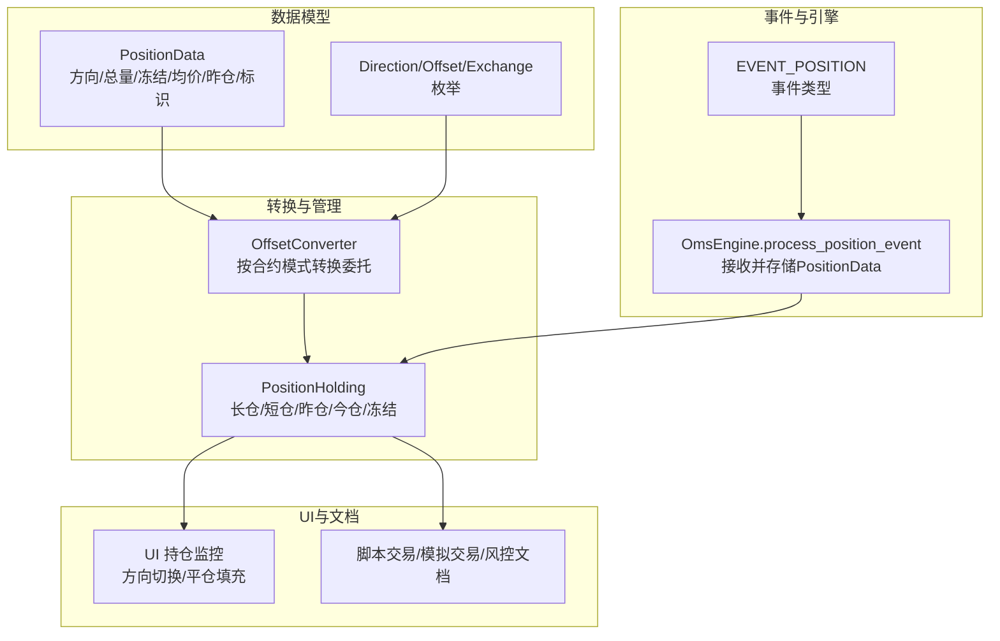
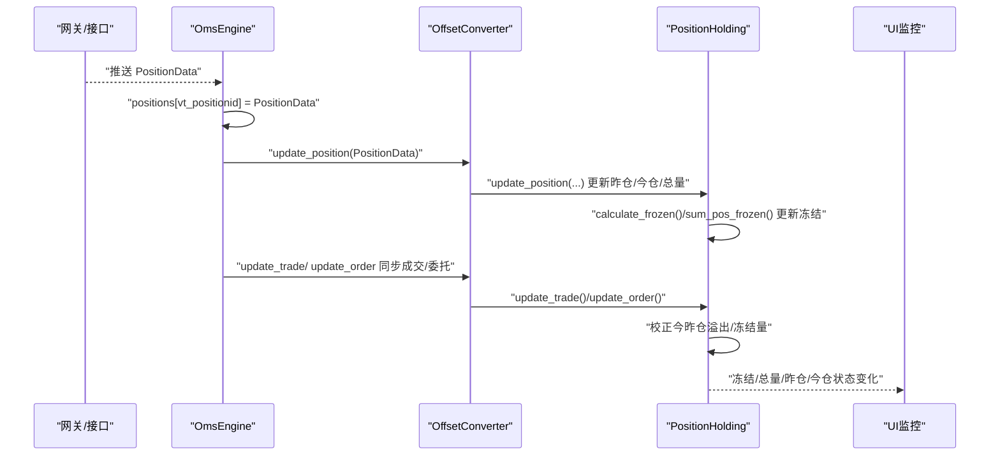
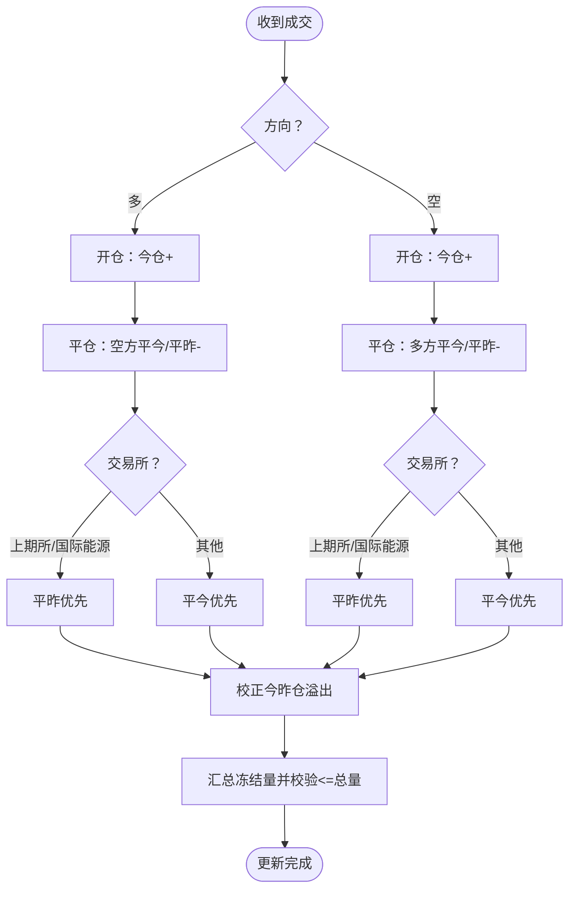
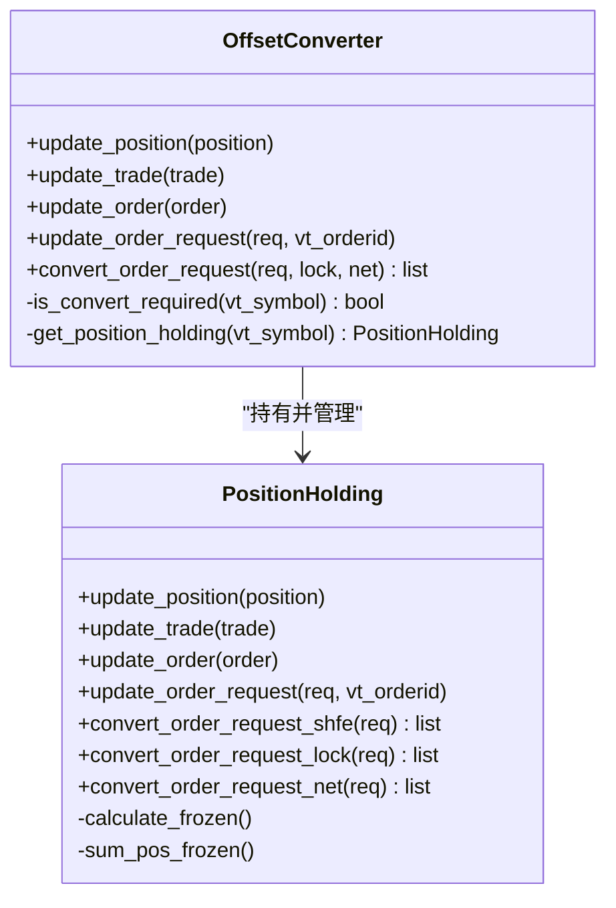
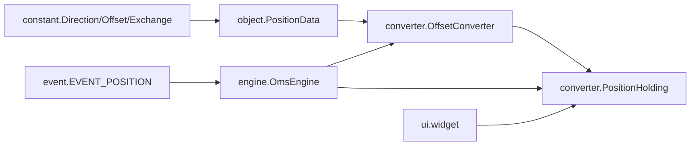

# 持仓数据

<cite>
**本文引用的文件**
- [vnpy/trader/object.py](file://vnpy/trader/object.py)
- [vnpy/trader/converter.py](file://vnpy/trader/converter.py)
- [vnpy/trader/engine.py](file://vnpy/trader/engine.py)
- [vnpy/trader/constant.py](file://vnpy/trader/constant.py)
- [vnpy/trader/event.py](file://vnpy/trader/event.py)
- [vnpy/trader/ui/widget.py](file://vnpy/trader/ui/widget.py)
- [docs/community/app/script_trader.md](file://docs/community/app/script_trader.md)
- [docs/community/app/paper_account.md](file://docs/community/app/paper_account.md)
- [docs/elite/strategy/elite_riskmanager.md](file://docs/elite/strategy/elite_riskmanager.md)
</cite>

## 目录
1. [简介](#简介)
2. [项目结构](#项目结构)
3. [核心组件](#核心组件)
4. [架构总览](#架构总览)
5. [详细组件分析](#详细组件分析)
6. [依赖关系分析](#依赖关系分析)
7. [性能考量](#性能考量)
8. [故障排查指南](#故障排查指南)
9. [结论](#结论)
10. [附录](#附录)

## 简介
本文件围绕 PositionData 数据模型展开，系统性阐释其核心字段（direction、volume、frozen、price、pnl、yd_volume）的业务含义与计算逻辑；详解多空双向持仓的管理机制与 vt_positionid 的生成规则；梳理开仓、平仓、移仓等操作对持仓的影响；说明昨仓 yd_volume 的特殊用途与计算方法；结合 OffsetConverter 的净仓/总仓转换能力，解释不同交易市场（含上期所/国际能源交易中心等）下的持仓管理模式；最后给出持仓数据监控与风险控制的最佳实践，包括持仓验证、数据同步与异常处理建议。

## 项目结构
围绕 PositionData 的关键代码分布在以下模块：
- 数据模型定义：PositionData、Direction、Offset、Exchange 等基础枚举
- 持仓管理与转换：OffsetConverter、PositionHolding
- 事件与引擎：事件类型、OMS 引擎对 PositionData 的接收与存储
- UI 展示：持仓监控与方向切换逻辑
- 文档与示例：脚本交易、模拟交易、风控规则等

图表来源
- [vnpy/trader/object.py](file://vnpy/trader/object.py#L179-L206)
- [vnpy/trader/converter.py](file://vnpy/trader/converter.py#L17-L111)
- [vnpy/trader/engine.py](file://vnpy/trader/engine.py#L390-L414)
- [vnpy/trader/event.py](file://vnpy/trader/event.py#L7-L14)
- [vnpy/trader/ui/widget.py](file://vnpy/trader/ui/widget.py#L1031-L1052)
- [docs/community/app/script_trader.md](file://docs/community/app/script_trader.md#L244-L257)

章节来源
- [vnpy/trader/object.py](file://vnpy/trader/object.py#L179-L206)
- [vnpy/trader/converter.py](file://vnpy/trader/converter.py#L17-L111)
- [vnpy/trader/engine.py](file://vnpy/trader/engine.py#L390-L414)
- [vnpy/trader/event.py](file://vnpy/trader/event.py#L7-L14)
- [vnpy/trader/ui/widget.py](file://vnpy/trader/ui/widget.py#L1031-L1052)
- [docs/community/app/script_trader.md](file://docs/community/app/script_trader.md#L244-L257)

## 核心组件
- PositionData：用于追踪单个持仓头寸的明细数据，包含 symbol、exchange、direction、volume、frozen、price、pnl、yd_volume，并在 __post_init__ 中生成 vt_symbol 与 vt_positionid。
- OffsetConverter：根据合约的多空仓/净仓模式，将委托请求转换为符合交易所规则的拆单（平今/平昨/开仓），并维护 PositionHolding。
- PositionHolding：维护某合约的长仓/短仓总量与其昨仓/今仓拆分，以及冻结量的计算与校验。
- OmsEngine：接收 PositionData 事件，将其存入内存索引 positions[vt_positionid]，并同步至 OffsetConverter。
- UI：提供持仓监控与方向切换，便于快速平仓或反向建仓。

章节来源
- [vnpy/trader/object.py](file://vnpy/trader/object.py#L179-L206)
- [vnpy/trader/converter.py](file://vnpy/trader/converter.py#L17-L111)
- [vnpy/trader/engine.py](file://vnpy/trader/engine.py#L390-L414)
- [vnpy/trader/ui/widget.py](file://vnpy/trader/ui/widget.py#L1031-L1052)

## 架构总览
PositionData 的生命周期与转换流程如下：

图表来源
- [vnpy/trader/engine.py](file://vnpy/trader/engine.py#L390-L414)
- [vnpy/trader/converter.py](file://vnpy/trader/converter.py#L310-L366)
- [vnpy/trader/converter.py](file://vnpy/trader/converter.py#L43-L111)
- [vnpy/trader/converter.py](file://vnpy/trader/converter.py#L112-L167)

## 详细组件分析

### PositionData 字段语义与生成规则
- 字段说明
  - direction：多/空/净（NET），决定 vt_positionid 的方向后缀
  - volume：该方向的总持仓量
  - frozen：该方向的冻结量（不可平仓的数量）
  - price：持仓成本均价（用于盈亏计算）
  - pnl：浮动盈亏（通常由外部引擎按最新价计算并更新）
  - yd_volume：昨仓量（仅在多空仓模式下有意义）
- 生成规则
  - vt_symbol：由 symbol 与 exchange.value 组成
  - vt_positionid：由 gateway_name、vt_symbol、direction.value 组成，确保同一合约、同一方向、同一网关的唯一性

章节来源
- [vnpy/trader/object.py](file://vnpy/trader/object.py#L179-L206)
- [vnpy/trader/constant.py](file://vnpy/trader/constant.py#L10-L28)

### 多空双向持仓管理机制
- 昨仓/今仓拆分
  - 长仓/短仓分别维护 yd_volume（昨仓）与 td_volume（今仓），并满足：pos = td + yd
  - 平仓时优先消耗今仓，若不足则回补昨仓；若出现负值，自动回拨至昨仓并归零今仓
- 冻结量计算
  - 对于非开仓委托（平仓/平昨），统计未成交剩余量累加到对应方向的冻结量
  - 冻结量不得高于该方向的今仓/昨仓可用量，最终汇总为 pos_frozen
- 委托/成交同步
  - update_order：维护活跃委托集合，触发 calculate_frozen
  - update_trade：按 Offset（开/平今/平昨/平）更新今昨仓，并校正溢出

图表来源
- [vnpy/trader/converter.py](file://vnpy/trader/converter.py#L71-L111)
- [vnpy/trader/converter.py](file://vnpy/trader/converter.py#L112-L167)

章节来源
- [vnpy/trader/converter.py](file://vnpy/trader/converter.py#L43-L111)
- [vnpy/trader/converter.py](file://vnpy/trader/converter.py#L112-L167)

### vt_positionid 的生成规则与用途
- 生成规则：gateway_name + "." + vt_symbol + "." + direction.value
- 用途：作为 PositionData 的唯一键，用于 OmsEngine 的内存索引与 UI 的定位
- 示例：脚本交易文档明确指出 vt_positionid 的格式与查询方式

章节来源
- [vnpy/trader/object.py](file://vnpy/trader/object.py#L194-L206)
- [docs/community/app/script_trader.md](file://docs/community/app/script_trader.md#L244-L257)

### 开仓、平仓、移仓对持仓的影响
- 开仓
  - 今仓增加（td_volume += volume）
  - 成交均价按加权平均更新（模拟交易文档说明）
- 平仓
  - 优先消耗今仓；不足时回补昨仓
  - 若出现负值，自动回拨至昨仓并归零今仓
- 移仓（平昨/平今）
  - 上期所/国际能源交易中心：平昨优先
  - 其他交易所：平今优先

章节来源
- [docs/community/app/paper_account.md](file://docs/community/app/paper_account.md#L101-L108)
- [vnpy/trader/converter.py](file://vnpy/trader/converter.py#L71-L111)
- [vnpy/trader/converter.py](file://vnpy/trader/converter.py#L168-L201)

### yd_volume（昨仓）的特殊用途与计算方法
- 特殊用途
  - 区分今昨仓，满足上期所/国际能源交易中心的平昨规则
  - 用于风控与结算口径的一致性（不同交易所对平仓顺序的要求不同）
- 计算方法
  - pos = td + yd
  - 平仓时若 td 变为负，回拨到 yd 并将 td 归零
  - 冻结量不得高于 td/yd 的可用量

章节来源
- [vnpy/trader/converter.py](file://vnpy/trader/converter.py#L43-L53)
- [vnpy/trader/converter.py](file://vnpy/trader/converter.py#L86-L111)
- [vnpy/trader/converter.py](file://vnpy/trader/converter.py#L156-L167)

### OffsetConverter 的净仓/总仓转换功能
- 模式识别
  - 若合约 net_position 为真，则视为净仓模式，无需转换
  - 否则为多空仓模式，需按交易所规则拆单
- 转换策略
  - 上期所/国际能源：平仓优先平昨，不足再开仓
  - 其他交易所：平仓优先平今，不足再平昨，再不足再开仓
  - 锁仓模式：优先消耗今仓，不足时平昨并开仓

图表来源
- [vnpy/trader/converter.py](file://vnpy/trader/converter.py#L310-L403)
- [vnpy/trader/converter.py](file://vnpy/trader/converter.py#L17-L111)

章节来源
- [vnpy/trader/converter.py](file://vnpy/trader/converter.py#L310-L403)

### 持仓数据的动态更新逻辑
- 接收与存储
  - OmsEngine 接收 PositionData 事件，写入 positions[vt_positionid]
- 同步与转换
  - 将 PositionData/TradeData/OrderData 同步至 OffsetConverter，进而更新 PositionHolding
- UI 展示
  - UI 根据 PositionData 的方向与数量，自动填充平仓方向与数量，便于快速反手

章节来源
- [vnpy/trader/engine.py](file://vnpy/trader/engine.py#L390-L414)
- [vnpy/trader/converter.py](file://vnpy/trader/converter.py#L310-L366)
- [vnpy/trader/ui/widget.py](file://vnpy/trader/ui/widget.py#L1031-L1052)

## 依赖关系分析
- PositionData 依赖 Direction、Offset、Exchange 枚举，用于标识方向与开平属性
- OffsetConverter 依赖 OmsEngine 的合约查询接口，按合约 net_position 判断是否需要转换
- OmsEngine 依赖事件系统，接收 PositionData 并写入内存索引

图表来源
- [vnpy/trader/constant.py](file://vnpy/trader/constant.py#L10-L28)
- [vnpy/trader/object.py](file://vnpy/trader/object.py#L179-L206)
- [vnpy/trader/converter.py](file://vnpy/trader/converter.py#L310-L403)
- [vnpy/trader/engine.py](file://vnpy/trader/engine.py#L390-L414)
- [vnpy/trader/event.py](file://vnpy/trader/event.py#L7-L14)
- [vnpy/trader/ui/widget.py](file://vnpy/trader/ui/widget.py#L1031-L1052)

章节来源
- [vnpy/trader/constant.py](file://vnpy/trader/constant.py#L10-L28)
- [vnpy/trader/object.py](file://vnpy/trader/object.py#L179-L206)
- [vnpy/trader/converter.py](file://vnpy/trader/converter.py#L310-L403)
- [vnpy/trader/engine.py](file://vnpy/trader/engine.py#L390-L414)
- [vnpy/trader/event.py](file://vnpy/trader/event.py#L7-L14)
- [vnpy/trader/ui/widget.py](file://vnpy/trader/ui/widget.py#L1031-L1052)

## 性能考量
- 冻结量计算复杂度：遍历活跃委托，按方向与 Offset 分类累加，时间复杂度 O(N)，N 为活跃委托数
- 今昨仓校正：每次平仓后进行溢出校正，常数级操作
- 冻结量上限校验：对 td/yd 分别取最小值，避免超额冻结
- 建议
  - 控制活跃委托规模，减少冻结量重算频率
  - 对高频交易场景，可在 UI 层面合并同类委托，降低频繁更新带来的开销

[本节为通用建议，不直接分析具体文件]

## 故障排查指南
- 持仓方向与数量不符
  - 检查 vt_positionid 是否正确（gateway_name、vt_symbol、direction）
  - 确认是否误用了 NET 模式导致方向被推断为相反
- 冻结量异常
  - 检查活跃委托是否包含开仓委托（开仓不应计入冻结）
  - 核对平仓顺序是否符合交易所规则（上期所/国际能源优先平昨）
- 今昨仓溢出
  - 平仓后 td 变为负值时应自动回拨至 yd 并归零 td
- UI 平仓方向错误
  - UI 会根据 PositionData 的方向自动反向，确认 PositionData 的方向字段是否正确
- 风控拦截
  - 使用 PosLimitRule 等风控规则时，确认 long_pos_limit/short_pos_limit/net_pos_limit/total_pos_limit 设置合理

章节来源
- [docs/community/app/script_trader.md](file://docs/community/app/script_trader.md#L244-L257)
- [vnpy/trader/converter.py](file://vnpy/trader/converter.py#L112-L167)
- [vnpy/trader/ui/widget.py](file://vnpy/trader/ui/widget.py#L1031-L1052)
- [docs/elite/strategy/elite_riskmanager.md](file://docs/elite/strategy/elite_riskmanager.md#L95-L108)

## 结论
PositionData 作为 vnpy 持仓管理的核心数据模型，通过 direction、volume、frozen、price、pnl、yd_volume 等字段清晰刻画了多空双向持仓的全貌。OffsetConverter 基于合约模式与交易所规则，实现了委托请求的拆单转换，保障了不同市场的合规性与一致性。通过 OmsEngine 的事件驱动与内存索引，PositionData 实现了高效、可追溯的动态更新。结合 UI 展示与风控规则，可构建完善的持仓监控与风险控制体系。

[本节为总结性内容，不直接分析具体文件]

## 附录
- 术语
  - 昨仓：上一交易日结转的持仓
  - 今仓：当日开仓形成的持仓
  - 冻结：因委托未成交而被占用的可平数量
- 参考文档
  - 脚本交易：vt_positionid 查询与格式说明
  - 模拟交易：开仓加权均价、平仓成本价不变、冻结与盈亏计算
  - 风控：PosLimitRule 等规则对总仓/净仓/多空仓的限制

章节来源
- [docs/community/app/script_trader.md](file://docs/community/app/script_trader.md#L244-L257)
- [docs/community/app/paper_account.md](file://docs/community/app/paper_account.md#L101-L108)
- [docs/elite/strategy/elite_riskmanager.md](file://docs/elite/strategy/elite_riskmanager.md#L95-L108)