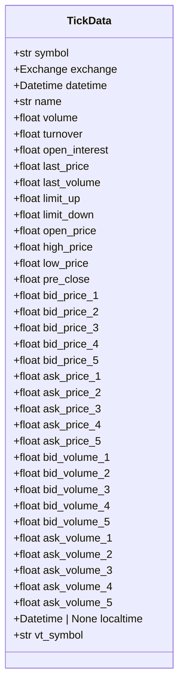
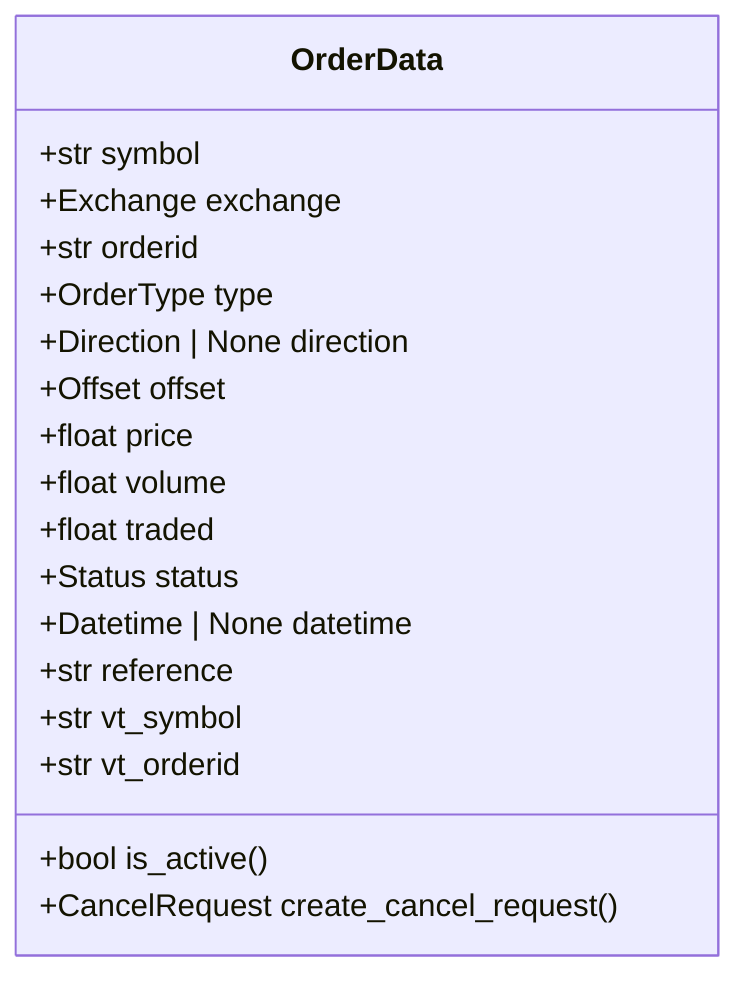
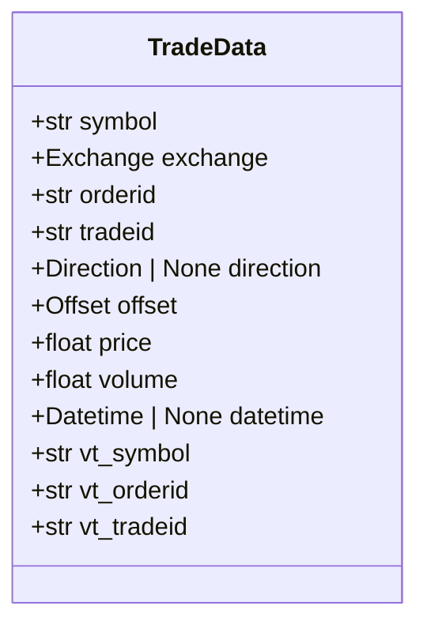
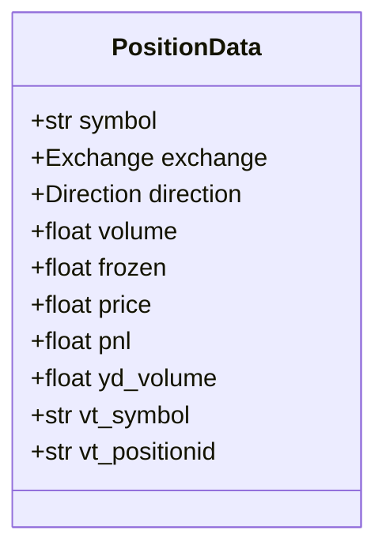
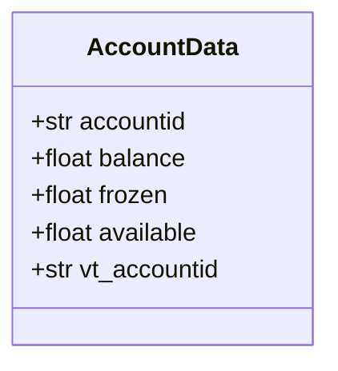
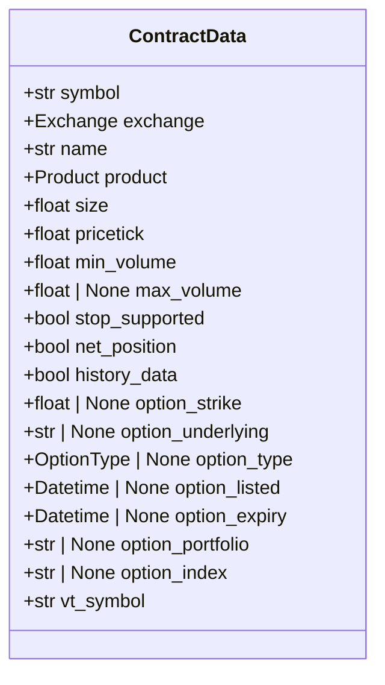
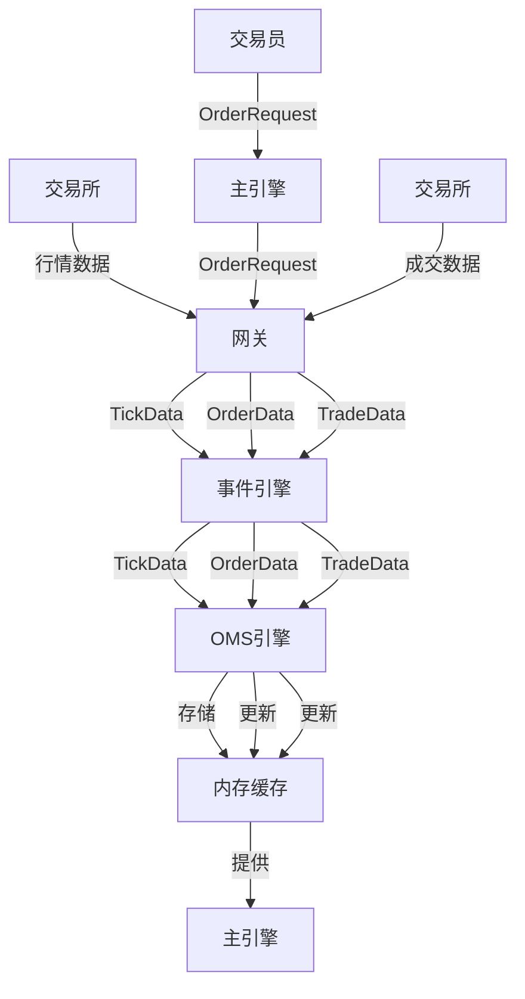
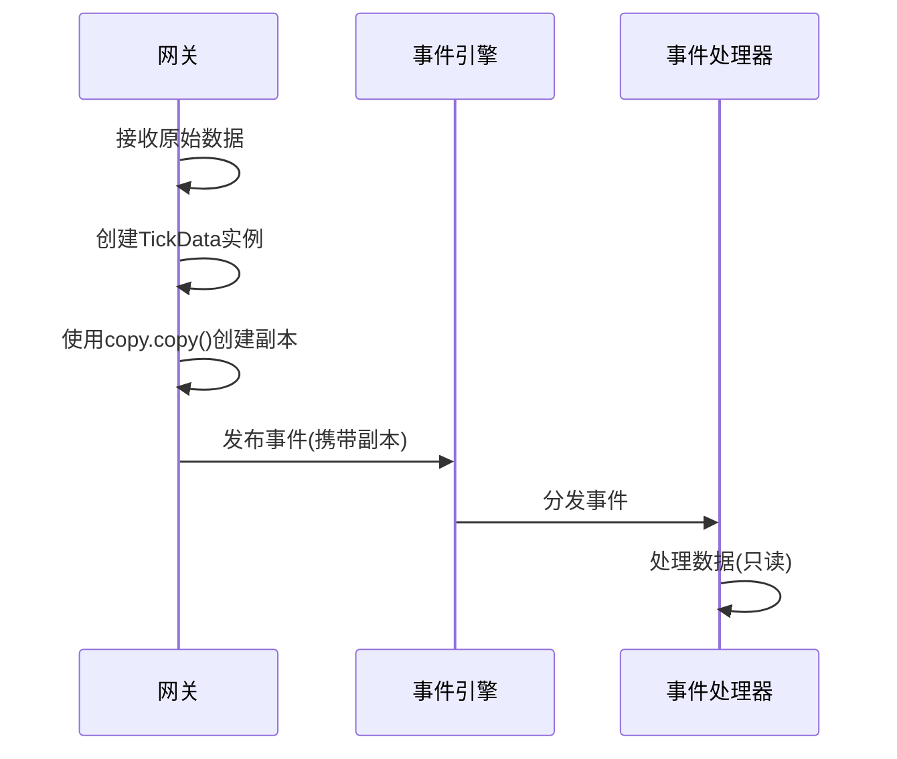
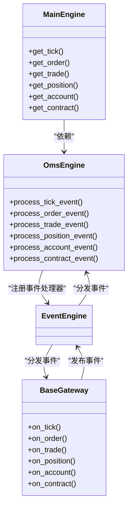

# 核心数据模型

<cite>
**本文档引用的文件**  
- [object.py](file://vnpy/trader/object.py)
- [engine.py](file://vnpy/trader/engine.py)
- [gateway.py](file://vnpy/trader/gateway.py)
- [constant.py](file://vnpy/trader/constant.py)
- [event.py](file://vnpy/event/engine.py)
</cite>

## 目录
1. [引言](#引言)
2. [核心数据模型定义](#核心数据模型定义)
3. [数据模型生命周期与流转路径](#数据模型生命周期与流转路径)
4. [序列化与反序列化机制](#序列化与反序列化机制)
5. [事件传递中的不可变性原则](#事件传递中的不可变性原则)
6. [数据模型与系统组件的交互关系](#数据模型与系统组件的交互关系)
7. [最佳实践使用指南](#最佳实践使用指南)
8. [结论](#结论)

## 引言

vn.py交易框架中的核心数据模型是整个系统数据流转和状态管理的基础。这些数据模型定义了交易过程中涉及的关键实体，包括市场行情、委托订单、成交记录、持仓信息、账户资金和合约信息等。本文档旨在全面文档化这些核心数据模型，详细说明其字段定义、业务含义、生命周期、序列化机制以及在系统中的交互关系，为开发者提供清晰的使用指南。

**Section sources**
- [object.py](file://vnpy/trader/object.py#L1-L428)

## 核心数据模型定义

vn.py的核心数据模型基于Python的`dataclass`实现，所有模型均继承自`BaseData`基类，确保了统一的结构和行为。以下是对各个核心数据模型的详细定义。

### BaseData 基类

`BaseData`是所有数据模型的基类，定义了所有数据对象都必须具备的`gateway_name`属性，用于标识数据来源的网关。

**Section sources**
- [object.py](file://vnpy/trader/object.py#L17-L27)

### TickData 行情数据

`TickData`类用于表示市场行情的实时快照，包含最新成交、盘口挂单和日内统计信息。



**Diagram sources**
- [object.py](file://vnpy/trader/object.py#L29-L85)

### OrderData 委托数据

`OrderData`类用于跟踪特定委托订单的最新状态，是订单管理系统的核心。



**Diagram sources**
- [object.py](file://vnpy/trader/object.py#L111-L151)

### TradeData 成交数据

`TradeData`类表示一个订单的成交记录，一个订单可以有多个成交。



**Diagram sources**
- [object.py](file://vnpy/trader/object.py#L153-L176)

### PositionData 持仓数据

`PositionData`类用于跟踪每个具体的持仓头寸。



**Diagram sources**
- [object.py](file://vnpy/trader/object.py#L178-L198)

### AccountData 账户数据

`AccountData`类包含账户的余额、冻结资金和可用资金信息。



**Diagram sources**
- [object.py](file://vnpy/trader/object.py#L200-L216)

### ContractData 合约数据

`ContractData`类包含每个交易合约的基本信息。



**Diagram sources**
- [object.py](file://vnpy/trader/object.py#L232-L262)

## 数据模型生命周期与流转路径

核心数据模型在vn.py系统中的生命周期遵循特定的流转路径，主要通过事件驱动机制进行传递和更新。

### 数据流转路径



**Diagram sources**
- [engine.py](file://vnpy/trader/engine.py#L339-L517)
- [gateway.py](file://vnpy/trader/gateway.py#L86-L152)

### 生命周期管理

每个数据模型的生命周期由OMS引擎（`OmsEngine`）负责管理。OMS引擎维护了所有数据模型的字典缓存，如`self.ticks`、`self.orders`等。当接收到对应类型的事件时，OMS引擎会更新相应的缓存。

**Section sources**
- [engine.py](file://vnpy/trader/engine.py#L348-L358)

## 序列化与反序列化机制

vn.py框架中的数据模型主要通过Python内置的`pickle`模块进行序列化和反序列化，用于数据的持久化存储。

### 序列化实现

在`AlphaLab`模块中，`AlphaDataset`和`AlphaModel`等对象通过`pickle.dump()`方法被序列化到文件中。

```python
with open(file_path, mode="wb") as f:
    pickle.dump(model, f)
```

### 反序列化实现

通过`pickle.load()`方法从文件中加载序列化的对象。

```python
with open(file_path, mode="rb") as f:
    dataset: AlphaDataset = pickle.load(f)
    return dataset
```

**Section sources**
- [lab.py](file://vnpy/alpha/lab.py#L403-L437)

## 事件传递中的不可变性原则

在vn.py的事件驱动架构中，数据模型在事件传递过程中遵循不可变性原则，确保数据的一致性和线程安全。

### 不可变性原则

根据网关（`BaseGateway`）的文档注释，所有传递给回调函数的`XxxData`对象都应该是常量，即在传递给`on_xxxx`之后不应再被修改。如果需要缓存数据引用，应在传递前使用`copy.copy`创建新对象。



**Diagram sources**
- [gateway.py](file://vnpy/trader/gateway.py#L63-L67)

**Section sources**
- [gateway.py](file://vnpy/trader/gateway.py#L63-L67)

## 数据模型与系统组件的交互关系

核心数据模型在vn.py系统中与网关、主引擎和OMS引擎等核心组件紧密交互。

### 组件交互关系



**Diagram sources**
- [engine.py](file://vnpy/trader/engine.py#L73-L361)
- [gateway.py](file://vnpy/trader/gateway.py#L33-L152)

### 与网关的交互

网关负责从交易接口接收原始数据，并将其转换为vn.py标准的数据模型，然后通过事件引擎发布。

**Section sources**
- [gateway.py](file://vnpy/trader/gateway.py#L93-L152)

### 与主引擎的交互

主引擎（`MainEngine`）通过OMS引擎提供的接口，为上层应用提供对核心数据模型的访问。

**Section sources**
- [engine.py](file://vnpy/trader/engine.py#L136-L154)

### 与OMS引擎的交互

OMS引擎是核心数据模型的管理中心，负责接收事件、更新缓存和提供查询接口。

**Section sources**
- [engine.py](file://vnpy/trader/engine.py#L339-L517)

## 最佳实践使用指南

### 数据访问

通过主引擎提供的便捷方法访问核心数据：

```python
# 获取最新行情
tick: TickData = main_engine.get_tick("IF2106.CFFEX")

# 获取委托状态
order: OrderData = main_engine.get_order("GATEWAY.123456")
```

### 状态判断

使用`is_active()`方法判断订单或报价是否处于活动状态：

```python
if order.is_active():
    # 订单仍在市场中
    pass
```

### 业务逻辑处理

在处理业务逻辑时，应始终假设数据模型是不可变的，并避免直接修改接收到的数据对象。

**Section sources**
- [object.py](file://vnpy/trader/object.py#L137-L142)
- [engine.py](file://vnpy/trader/engine.py#L441-L481)

## 结论

vn.py的核心数据模型设计精巧，通过`dataclass`和事件驱动架构实现了高效、安全的数据流转。理解这些数据模型的定义、生命周期和交互关系，对于开发基于vn.py的交易策略和应用至关重要。遵循不可变性原则和最佳实践，可以确保系统的稳定性和数据的一致性。