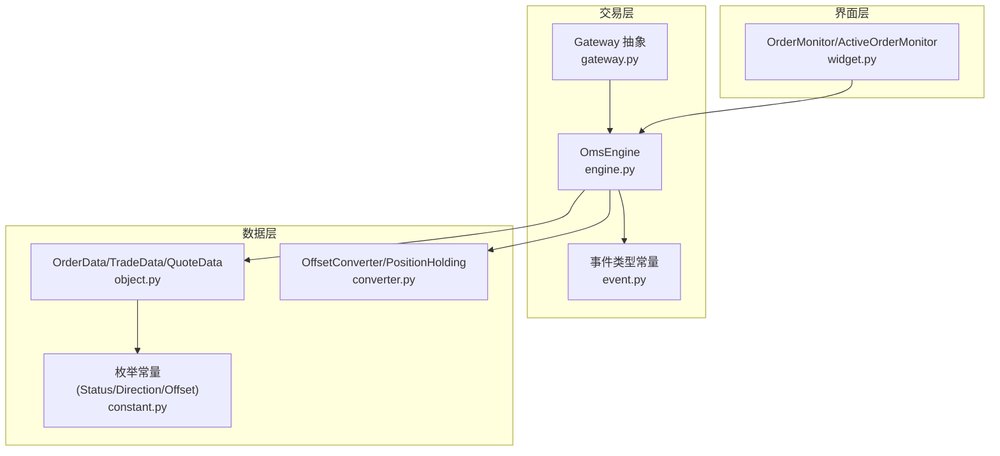
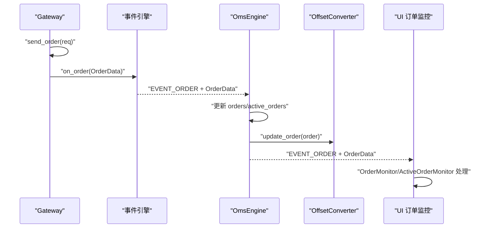
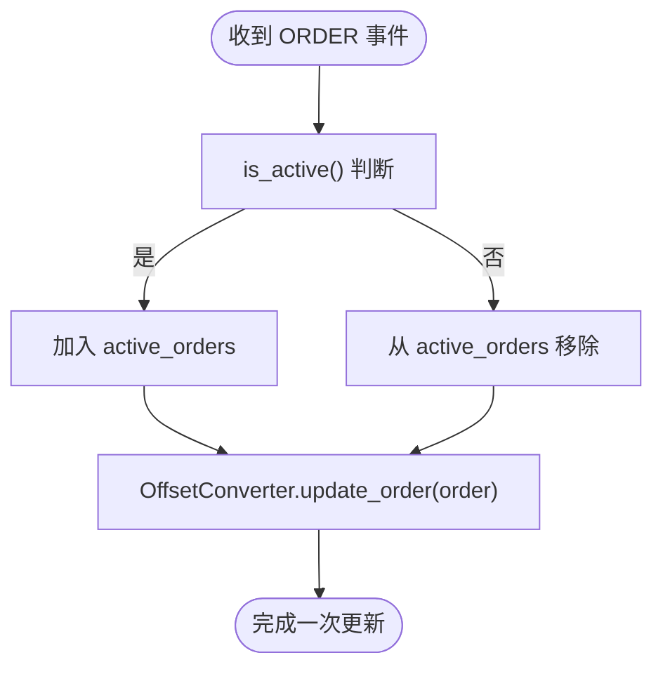
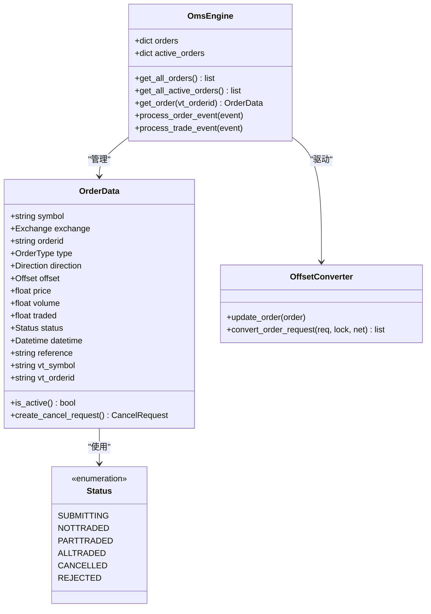

# 订单数据

<cite>
**本文引用的文件**
- [object.py](file://vnpy/trader/object.py)
- [constant.py](file://vnpy/trader/constant.py)
- [engine.py](file://vnpy/trader/engine.py)
- [gateway.py](file://vnpy/trader/gateway.py)
- [converter.py](file://vnpy/trader/converter.py)
- [widget.py](file://vnpy/trader/ui/widget.py)
- [event.py](file://vnpy/trader/event.py)
- [backtesting.py](file://vnpy/alpha/strategy/backtesting.py)
</cite>

## 目录
1. [引言](#引言)
2. [项目结构](#项目结构)
3. [核心组件](#核心组件)
4. [架构总览](#架构总览)
5. [详细组件分析](#详细组件分析)
6. [依赖关系分析](#依赖关系分析)
7. [性能考量](#性能考量)
8. [故障排查指南](#故障排查指南)
9. [结论](#结论)
10. [附录](#附录)

## 引言
本文件围绕 vnpy 的订单数据模型进行深入文档化，重点解释 OrderData 的核心字段（orderid、status、direction、offset、price、volume 等）的业务含义；梳理订单状态机（SUBMITTING、NOTTRADED、PARTTRADED、ALLTRADED、CANCELLED、REJECTED）的转换逻辑与判断方法；阐明 is_active() 的实现原理与使用场景；说明 vt_orderid 的生成规则及系统内的唯一性保障；结合 OmsEngine 的订单管理机制，解释订单生命周期（从创建、更新到归档）；最后给出订单数据查询与状态监控的最佳实践。

## 项目结构
与订单数据直接相关的核心模块分布如下：
- 数据模型与常量：vnpy/trader/object.py、vnpy/trader/constant.py
- 订单引擎与事件：vnpy/trader/engine.py、vnpy/trader/event.py
- 网关抽象与唯一标识：vnpy/trader/gateway.py
- 偏移转换与活跃订单管理：vnpy/trader/converter.py
- UI 订单监控：vnpy/trader/ui/widget.py
- 回测示例中的状态推进：vnpy/alpha/strategy/backtesting.py

图表来源
- [gateway.py](file://vnpy/trader/gateway.py#L189-L221)
- [engine.py](file://vnpy/trader/engine.py#L339-L560)
- [object.py](file://vnpy/trader/object.py#L111-L176)
- [constant.py](file://vnpy/trader/constant.py#L10-L40)
- [converter.py](file://vnpy/trader/converter.py#L310-L402)
- [widget.py](file://vnpy/trader/ui/widget.py#L473-L505)

章节来源
- [object.py](file://vnpy/trader/object.py#L111-L176)
- [constant.py](file://vnpy/trader/constant.py#L10-L40)
- [engine.py](file://vnpy/trader/engine.py#L339-L560)
- [gateway.py](file://vnpy/trader/gateway.py#L189-L221)
- [converter.py](file://vnpy/trader/converter.py#L310-L402)
- [widget.py](file://vnpy/trader/ui/widget.py#L473-L505)

## 核心组件
- OrderData：订单数据载体，包含 symbol、exchange、orderid、type、direction、offset、price、volume、traded、status、datetime、reference 等字段；提供 vt_symbol、vt_orderid 的生成与 is_active() 判断。
- Status 枚举：定义订单状态集合，用于统一的状态表达与判断。
- OmsEngine：订单管理引擎，负责接收事件、维护 orders/active_orders 字典、驱动 OffsetConverter 更新冻结仓位。
- OffsetConverter/PositionHolding：根据合约模式与交易所规则，对订单请求进行偏移拆分与冻结计算，同时维护活跃订单集合。
- Gateway 抽象：定义 send_order/cancel_order 等接口契约，要求在发送订单时分配 gateway 实例作用域内的唯一 orderid，并设置初始状态。

章节来源
- [object.py](file://vnpy/trader/object.py#L111-L176)
- [constant.py](file://vnpy/trader/constant.py#L30-L40)
- [engine.py](file://vnpy/trader/engine.py#L339-L560)
- [converter.py](file://vnpy/trader/converter.py#L310-L402)
- [gateway.py](file://vnpy/trader/gateway.py#L189-L221)

## 架构总览
订单数据在系统中的流转路径如下：
- Gateway 层负责创建 OrderData 并分配唯一 orderid，随后通过事件引擎推送 ORDER 事件。
- OmsEngine 接收 ORDER 事件，更新 orders 与 active_orders，并通知 OffsetConverter 进行冻结计算。
- UI 层通过 OrderMonitor/ActiveOrderMonitor 订阅 EVENT_ORDER，展示与筛选订单。
- Trade/Quote 等其他事件持续更新，驱动状态变化与归档。

图表来源
- [gateway.py](file://vnpy/trader/gateway.py#L189-L221)
- [engine.py](file://vnpy/trader/engine.py#L363-L394)
- [converter.py](file://vnpy/trader/converter.py#L337-L344)
- [widget.py](file://vnpy/trader/ui/widget.py#L473-L505)

## 详细组件分析

### OrderData 字段与业务含义
- orderid：网关实例作用域内的唯一委托编号，由 Gateway 在 send_order 中分配。
- status：订单状态，来源于 Status 枚举，初始为 SUBMITTING。
- direction：订单方向（多/空/净）。
- offset：开平标志（开/平/平今/平昨）。
- price：下单价格。
- volume：下单总量。
- traded：已成交数量。
- datetime：时间戳。
- reference：来源标记。
- vt_symbol/vt_orderid：全局唯一标识，vt_symbol = "{symbol}.{exchange.value}"，vt_orderid = "{gateway_name}.{orderid}"。

章节来源
- [object.py](file://vnpy/trader/object.py#L111-L176)

### 订单状态机与转换逻辑
- 状态集合：SUBMITTING、NOTTRADED、PARTTRADED、ALLTRADED、CANCELLED、REJECTED。
- 初始状态：Gateway 在 send_order 成功发送后将状态置为 SUBMITTING；若发送失败则置为 REJECTED。
- 状态推进：
  - SUBMITTING → NOTTRADED：回测或外部逻辑可将 SUBMITTING 推进为 NOTTRADED。
  - NOTTRADED → PARTTRADED：部分成交发生，traded 增长，status 更新为 PARTTRADED。
  - PARTTRADED → ALLTRADED：traded 达到 volume，status 更新为 ALLTRADED。
  - CANCELLED/REJECTED：订单被撤销或拒单，视为非活跃状态。
- 判断方法：is_active() 返回 status 是否属于 ACTIVE_STATUSES = {SUBMITTING, NOTTRADED, PARTTRADED}。

章节来源
- [constant.py](file://vnpy/trader/constant.py#L30-L40)
- [object.py](file://vnpy/trader/object.py#L14-L16)
- [object.py](file://vnpy/trader/object.py#L111-L176)
- [backtesting.py](file://vnpy/alpha/strategy/backtesting.py#L624-L691)

### is_active() 方法实现与使用场景
- 实现：返回 self.status in ACTIVE_STATUSES。
- 使用场景：
  - OmsEngine 在处理 ORDER 事件时，依据 is_active() 将订单加入/移出 active_orders。
  - UI 的 ActiveOrderMonitor 依据 is_active() 控制行显隐。
  - OffsetConverter 在 update_order 时依据 is_active() 维护活跃订单集合与冻结计算。

章节来源
- [object.py](file://vnpy/trader/object.py#L14-L16)
- [object.py](file://vnpy/trader/object.py#L111-L176)
- [engine.py](file://vnpy/trader/engine.py#L378-L394)
- [converter.py](file://vnpy/trader/converter.py#L54-L63)
- [widget.py](file://vnpy/trader/ui/widget.py#L1053-L1072)

### vt_orderid 生成规则与唯一性保证
- 生成规则：vt_orderid = "{gateway_name}.{orderid}"。
- 唯一性保障：
  - Gateway 必须为每笔订单分配“gateway 实例作用域内唯一”的 orderid（契约要求）。
  - 因此 vt_orderid 在同一 gateway_name 下唯一，跨网关实例可重复，但系统以 vt_orderid 作为全局索引键，确保跨网关场景下的唯一性由上层路由与命名空间约束保证。

章节来源
- [object.py](file://vnpy/trader/object.py#L132-L136)
- [gateway.py](file://vnpy/trader/gateway.py#L189-L221)

### OmsEngine 的订单生命周期管理
- 创建：Gateway 发送订单后，OmsEngine 在 process_order_event 中将 order 写入 orders，并依据 is_active() 写入/移除 active_orders。
- 更新：随着 TRADE/ORDER 事件到达，订单状态与已成交数更新；OmsEngine 同步 OffsetConverter 进行冻结计算。
- 归档：当订单变为非活跃（CANCELLED/REJECTED/ALLTRADED）时，OmsEngine 会将其从 active_orders 移除，但仍保留在 orders 中供查询与审计。

图表来源
- [engine.py](file://vnpy/trader/engine.py#L378-L394)
- [converter.py](file://vnpy/trader/converter.py#L337-L344)

章节来源
- [engine.py](file://vnpy/trader/engine.py#L339-L560)
- [converter.py](file://vnpy/trader/converter.py#L310-L402)

### 订单数据查询与状态监控最佳实践
- 查询接口：
  - 获取全部订单：get_all_orders()
  - 获取全部活跃订单：get_all_active_orders()
  - 按 vt_orderid 获取订单：get_order(vt_orderid)
- 监控建议：
  - 使用 OrderMonitor 订阅 EVENT_ORDER，展示关键字段（价格、数量、已成交、状态、时间）。
  - 使用 ActiveOrderMonitor 仅显示活跃订单，便于快速定位未成交/部分成交订单。
  - 结合 OffsetConverter 的冻结计算结果，关注平今/平昨优先级与可用仓位变化。
- 状态推进验证：
  - 对于回测或策略驱动的订单，可在策略侧推进状态（如 SUBMITTING→NOTTRADED→PARTTRADED→ALLTRADED），并在推进后触发 update_order 事件。

章节来源
- [engine.py](file://vnpy/trader/engine.py#L447-L471)
- [engine.py](file://vnpy/trader/engine.py#L525-L535)
- [widget.py](file://vnpy/trader/ui/widget.py#L473-L505)
- [widget.py](file://vnpy/trader/ui/widget.py#L1053-L1072)
- [backtesting.py](file://vnpy/alpha/strategy/backtesting.py#L624-L691)

## 依赖关系分析
- OrderData 依赖 Status/Direction/Offset/OrderType 枚举。
- OmsEngine 依赖事件类型常量 EVENT_ORDER、EVENT_TRADE、EVENT_POSITION、EVENT_ACCOUNT、EVENT_CONTRACT、EVENT_QUOTE。
- OffsetConverter 依赖 ContractData 与 Exchange 规则，对 SHFE/INE 等特殊市场的平仓优先级进行拆分。
- Gateway 抽象定义 send_order/cancel_order 的契约，要求分配唯一 orderid 并设置初始状态。

图表来源
- [object.py](file://vnpy/trader/object.py#L111-L176)
- [constant.py](file://vnpy/trader/constant.py#L30-L40)
- [engine.py](file://vnpy/trader/engine.py#L339-L560)
- [converter.py](file://vnpy/trader/converter.py#L310-L402)

章节来源
- [object.py](file://vnpy/trader/object.py#L111-L176)
- [constant.py](file://vnpy/trader/constant.py#L30-L40)
- [engine.py](file://vnpy/trader/engine.py#L339-L560)
- [converter.py](file://vnpy/trader/converter.py#L310-L402)

## 性能考量
- 活跃订单集合 active_orders：仅维护活跃订单，避免遍历全量订单，提升查询效率。
- 冻结计算：OffsetConverter 在 update_order/update_trade 中进行冻结汇总，避免重复扫描，复杂度与活跃订单数量线性相关。
- 事件驱动：通过事件引擎异步处理订单/成交/行情，减少阻塞，提高吞吐。

## 故障排查指南
- 订单未进入活跃列表：
  - 检查 is_active() 判断是否正确（状态是否为 SUBMITTING/NOTTRADED/PARTTRADED）。
  - 检查 OmsEngine.process_order_event 是否被触发。
- 订单状态异常推进：
  - 确认 Gateway.send_order 是否按契约设置初始状态（成功→SUBMITTING，失败→REJECTED）。
  - 回测或策略侧推进状态时，确保 traded 与 volume 的一致性。
- vt_orderid 冲突：
  - 确认 Gateway 分配的 orderid 在 gateway 实例作用域内唯一。
  - 若跨网关场景，确保上层命名空间区分（如不同 gateway_name）。

章节来源
- [engine.py](file://vnpy/trader/engine.py#L378-L394)
- [object.py](file://vnpy/trader/object.py#L14-L16)
- [gateway.py](file://vnpy/trader/gateway.py#L189-L221)
- [backtesting.py](file://vnpy/alpha/strategy/backtesting.py#L624-L691)

## 结论
OrderData 作为 vnpy 订单体系的核心数据模型，通过明确的字段语义、规范的状态机与 is_active() 判断，配合 OmsEngine 的事件驱动与 OffsetConverter 的冻结计算，实现了高效、可追踪的订单生命周期管理。vt_orderid 的生成规则与 Gateway 的唯一性约束共同保证了跨网关场景下的全局唯一性。结合 UI 的监控组件与查询接口，可实现对订单状态的实时掌控与审计。

## 附录
- 关键 API 路径参考：
  - 订单查询：get_all_orders(), get_all_active_orders(), get_order(vt_orderid)
  - 订单推进：Gateway.send_order()（契约要求）、策略侧状态推进
  - 监控组件：OrderMonitor、ActiveOrderMonitor