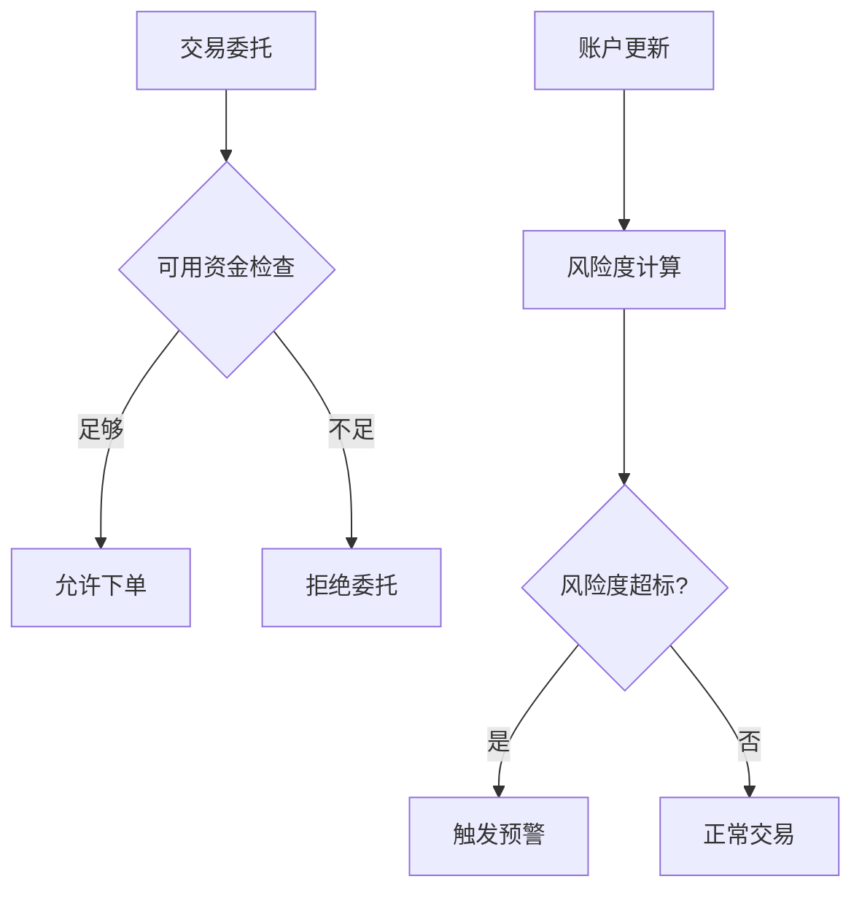

# 账户数据

<cite>
**本文档引用的文件**
- [object.py](file://vnpy/trader/object.py)
- [engine.py](file://vnpy/trader/engine.py)
- [gateway.py](file://vnpy/trader/gateway.py)
- [widget.py](file://vnpy/trader/ui/widget.py)
- [paper_account.md](file://docs/community/app/paper_account.md)
- [risk_manager.md](file://docs/community/app/risk_manager.md)
- [elite_riskmanager.md](file://docs/elite/strategy/elite_riskmanager.md)
</cite>

## 目录
1. [账户数据模型](#账户数据模型)
2. [核心字段业务含义](#核心字段业务含义)
3. [可用资金计算逻辑](#可用资金计算逻辑)
4. [账户数据更新机制](#账户数据更新机制)
5. [vt_accountid生成规则](#vt_accountid生成规则)
6. [资金风险控制应用](#资金风险控制应用)
7. [数据安全与一致性](#数据安全与一致性)

## 账户数据模型

账户数据模型是交易系统中的核心数据结构之一，用于记录和管理用户的资金信息。该模型通过`AccountData`类实现，继承自基础数据类`BaseData`，包含了账户的基本信息和资金状态。

**Section sources**
- [object.py](file://vnpy/trader/object.py#L200-L216)

## 核心字段业务含义

账户数据模型包含多个核心字段，每个字段都有明确的业务含义：

- **accountid**: 账户ID，由交易接口提供，用于标识特定账户
- **balance**: 余额，表示账户的总资金量
- **frozen**: 冻结资金，表示因未成交委托而被锁定的资金量
- **available**: 可用资金，表示当前可用于交易的资金量
- **gateway_name**: 网关名称，标识账户所属的交易接口

这些字段共同构成了账户资金状态的完整视图，为交易决策和风险控制提供数据支持。

**Section sources**
- [object.py](file://vnpy/trader/object.py#L207-L211)

## 可用资金计算逻辑

可用资金的计算是账户管理中的关键逻辑，直接影响交易下单的风控判断。

### 动态计算机制

可用资金字段`available`采用动态计算方式，其值等于余额减去冻结资金：

```python
self.available: float = self.balance - self.frozen
```

这种计算方式确保了可用资金始终反映账户的真实可交易状态，无需额外存储。

### 下单风控中的关键作用

在交易下单过程中，系统会检查可用资金是否足够支持新委托。当用户提交买入委托时，系统会验证可用资金是否大于等于委托金额；对于卖出委托，则检查相应持仓是否充足。这种机制有效防止了超买超卖的风险。

**Section sources**
- [object.py](file://vnpy/trader/object.py#L214)

## 账户数据更新机制

账户数据的更新通过事件驱动机制实现，确保数据的实时性和一致性。

### 资金划转场景

当发生资金划转（如入金、出金）时，交易接口会推送最新的账户数据。网关组件通过`on_account`方法接收这些数据，并通过事件引擎广播：

```python
def on_account(self, account: AccountData) -> None:
    self.on_event(EVENT_ACCOUNT, account)
    self.on_event(EVENT_ACCOUNT + account.vt_accountid, account)
```

### 交易结算场景

交易成交后，交易所会更新账户资金状态。这一变化通过以下流程反映到系统中：
1. 成交信息通过`on_trade`事件接收
2. 交易引擎更新持仓和账户信息
3. 更新后的账户数据通过`EVENT_ACCOUNT`事件广播
4. 各组件接收并处理最新的账户数据

**Section sources**
- [gateway.py](file://vnpy/trader/gateway.py#L125-L131)
- [engine.py](file://vnpy/trader/engine.py#L415-L418)

## vt_accountid生成规则

`vt_accountid`是账户的全局唯一标识符，其生成规则确保了在多账户管理系统中的唯一性。

### 生成机制

`vt_accountid`由网关名称和账户ID组合而成，格式为`{gateway_name}.{accountid}`：

```python
self.vt_accountid: str = f"{self.gateway_name}.{self.accountid}"
```

这种命名约定避免了不同交易接口间账户ID的冲突，实现了跨接口的账户统一管理。

### 多账户管理应用

在多账户管理场景中，`vt_accountid`的应用体现在：
- 通过`vt_accountid`作为键存储所有账户数据
- 提供`get_account(vt_accountid)`方法快速查询特定账户
- 支持按`vt_accountid`订阅特定账户的更新事件

这种设计使得系统能够高效管理多个交易接口的多个账户。

**Section sources**
- [object.py](file://vnpy/trader/object.py#L215)
- [engine.py](file://vnpy/trader/engine.py#L464-L469)

## 资金风险控制应用

账户数据在资金风险控制模块中扮演着核心角色，支持多种风控功能的实现。

### 保证金监控

系统通过实时监控账户余额和可用资金，确保账户维持足够的保证金水平。当可用资金低于预设阈值时，系统可触发预警或限制新开仓操作。

### 风险预警

基于账户数据，系统可实现多种风险预警机制：
- 账户风险度预警（余额变动率）
- 资金大幅波动预警
- 可用资金不足预警

### 交易限制

账户数据直接参与交易限制决策：
- 根据可用资金限制单笔委托金额
- 基于账户余额设置最大持仓规模
- 实现账户级别的交易额度控制



**Diagram sources**
- [risk_manager.md](file://docs/community/app/risk_manager.md#L38-L47)
- [elite_riskmanager.md](file://docs/elite/strategy/elite_riskmanager.md#L16)

## 数据安全与一致性

账户数据的安全性和一致性通过多层次机制保障。

### 事件驱动架构

系统采用事件驱动架构确保数据一致性：
- 所有账户更新通过统一事件通道
- 事件处理保证原子性
- 多组件间数据同步通过事件广播实现

### 数据持久化

虽然账户数据主要在内存中维护，但关键变化可通过日志记录等方式持久化，确保系统重启后能恢复重要状态。

### 并发控制

在多线程环境下，账户数据的更新操作受到适当同步机制保护，防止竞态条件导致的数据不一致。

**Section sources**
- [engine.py](file://vnpy/trader/engine.py#L417)
- [gateway.py](file://vnpy/trader/gateway.py#L129-L131)