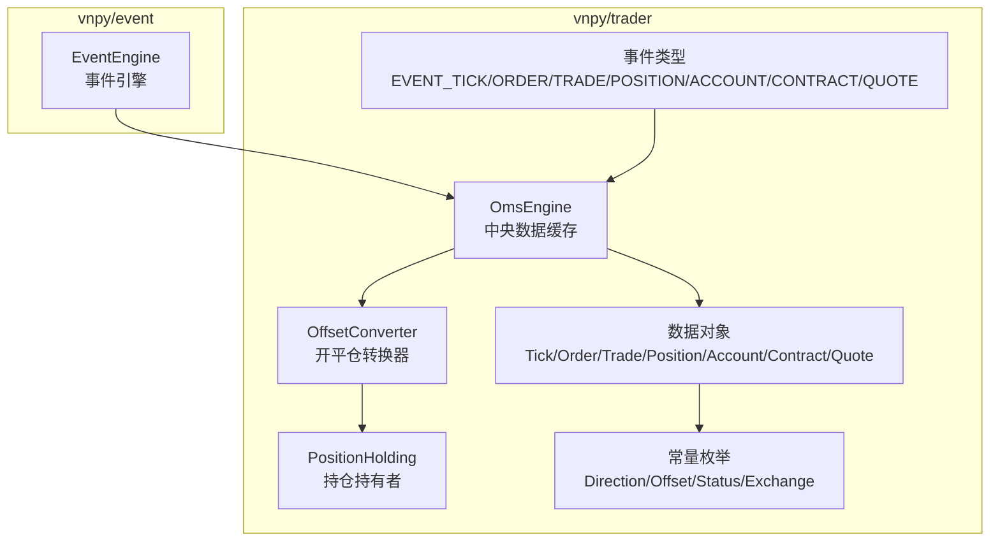
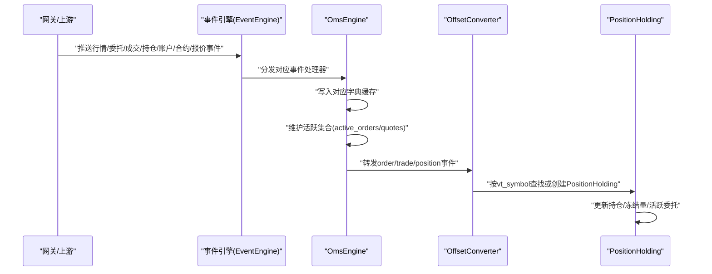
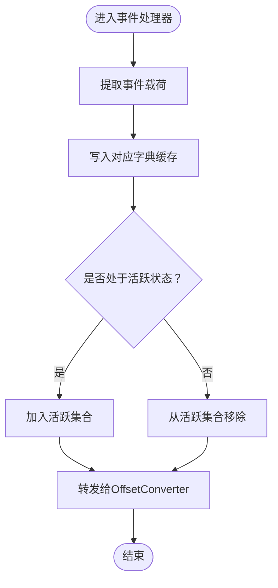
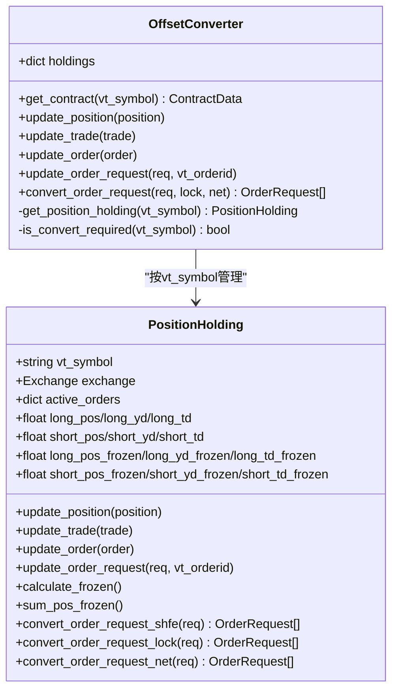
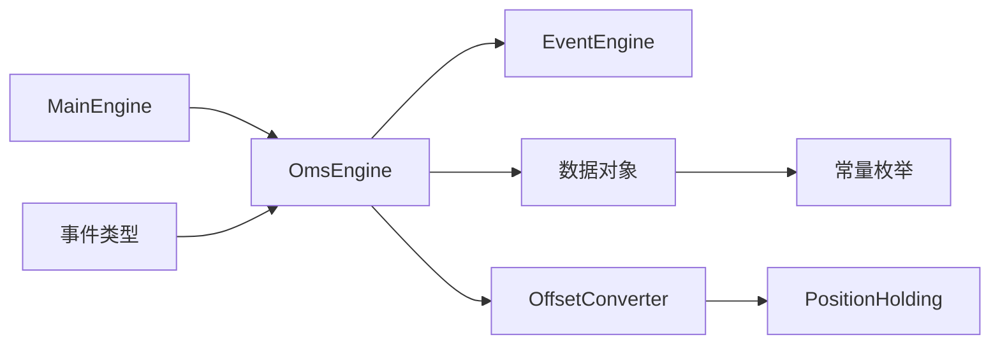

# 订单管理系统引擎 (OmsEngine)

<cite>
**本文引用的文件列表**
- [vnpy/trader/engine.py](file://vnpy/trader/engine.py)
- [vnpy/trader/converter.py](file://vnpy/trader/converter.py)
- [vnpy/trader/object.py](file://vnpy/trader/object.py)
- [vnpy/trader/constant.py](file://vnpy/trader/constant.py)
- [vnpy/trader/event.py](file://vnpy/trader/event.py)
- [vnpy/event/engine.py](file://vnpy/event/engine.py)
</cite>

## 目录
1. [引言](#引言)
2. [项目结构](#项目结构)
3. [核心组件](#核心组件)
4. [架构总览](#架构总览)
5. [详细组件分析](#详细组件分析)
6. [依赖关系分析](#依赖关系分析)
7. [性能考量](#性能考量)
8. [故障排查指南](#故障排查指南)
9. [结论](#结论)

## 引言
本文件围绕订单管理系统引擎（OmsEngine）展开，系统性解析其作为中央数据缓存的角色定位、字典结构管理的实时数据（tick、order、trade、position、account、contract、quote）更新策略、事件处理器（process_tick_event、process_order_event 等）的实现逻辑、活跃订单与报价的维护机制、查询方法（如 get_all_active_orders）的性能特征，以及 OffsetConverter 在期货开平仓逻辑中的关键作用与与 OmsEngine 的集成方式，并给出高并发场景下的性能优化建议。文档力求兼顾技术深度与可读性，使非专业读者也能理解其核心价值与工作机制。

## 项目结构
OmsEngine 所在的模块位于 vnpy/trader 子系统中，与事件驱动框架、数据对象、常量枚举、以及上层 MainEngine 协同工作。其核心职责是：
- 作为“中央数据缓存”，以字典结构维护各类交易实体的最新状态；
- 注册并处理来自事件引擎的行情、委托、成交、持仓、账户、合约、报价等事件；
- 为上层应用提供统一的查询接口与开平仓转换能力（OffsetConverter）。

图示来源
- [vnpy/trader/engine.py](file://vnpy/trader/engine.py#L339-L463)
- [vnpy/trader/converter.py](file://vnpy/trader/converter.py#L1-L120)
- [vnpy/trader/object.py](file://vnpy/trader/object.py#L1-L120)
- [vnpy/trader/constant.py](file://vnpy/trader/constant.py#L1-L80)
- [vnpy/trader/event.py](file://vnpy/trader/event.py#L1-L14)
- [vnpy/event/engine.py](file://vnpy/event/engine.py#L1-L200)

章节来源
- [vnpy/trader/engine.py](file://vnpy/trader/engine.py#L136-L160)
- [vnpy/trader/engine.py](file://vnpy/trader/engine.py#L339-L463)
- [vnpy/trader/event.py](file://vnpy/trader/event.py#L1-L14)

## 核心组件
- OmsEngine：中央数据缓存，维护各实体字典与活跃集合，注册事件处理器，提供查询与转换接口。
- OffsetConverter：按合约维度维护 PositionHolding，负责开平仓偏移转换与冻结量计算。
- PositionHolding：按方向与日期（td/yd）维护总仓、冻结量、活跃委托等，实现 SHFE/INE 等交易所的差异化平仓逻辑。
- 数据对象与常量：TickData、OrderData、TradeData、PositionData、AccountData、ContractData、QuoteData 及 Direction、Offset、Status、Exchange 等枚举。

章节来源
- [vnpy/trader/engine.py](file://vnpy/trader/engine.py#L339-L463)
- [vnpy/trader/converter.py](file://vnpy/trader/converter.py#L1-L120)
- [vnpy/trader/object.py](file://vnpy/trader/object.py#L1-L120)
- [vnpy/trader/constant.py](file://vnpy/trader/constant.py#L1-L80)

## 架构总览
OmsEngine 通过事件驱动的方式接收来自网关的数据更新，将其写入对应的字典缓存；同时维护“活跃”集合（active_orders、active_quotes），以便快速查询未成交/部分成交的委托与报价。OffsetConverter 与 OmsEngine 解耦，通过合约查询接口获取合约信息，按需创建 PositionHolding 并在收到 order/trade/position 事件时同步更新。

图示来源
- [vnpy/trader/engine.py](file://vnpy/trader/engine.py#L363-L463)
- [vnpy/trader/converter.py](file://vnpy/trader/converter.py#L310-L390)

章节来源
- [vnpy/trader/engine.py](file://vnpy/trader/engine.py#L363-L463)
- [vnpy/trader/converter.py](file://vnpy/trader/converter.py#L310-L390)

## 详细组件分析

### OmsEngine：中央数据缓存与事件处理器
- 字典结构管理
  - ticks、orders、trades、positions、accounts、contracts、quotes：以唯一键（vt_symbol/vt_orderid/vt_tradeid/vt_positionid/vt_accountid/vt_quoteid）存储最新数据。
  - active_orders、active_quotes：仅保存处于“活跃”状态的委托与报价，便于快速筛选。
- 事件处理器
  - process_tick_event：将最新Tick写入 ticks。
  - process_order_event：写入 orders；若订单处于活跃状态则加入 active_orders，否则从活跃集合移除；同时转发给 OffsetConverter 更新。
  - process_trade_event：写入 trades；转发给 OffsetConverter 更新。
  - process_position_event：写入 positions；转发给 OffsetConverter 更新。
  - process_account_event：写入 accounts。
  - process_contract_event：写入 contracts；当首次出现某 gateway_name 的合约时，初始化该网关的 OffsetConverter。
  - process_quote_event：写入 quotes；若报价处于活跃状态则加入 active_quotes，否则从活跃集合移除。
- 查询方法
  - get_tick/get_order/get_trade/get_position/get_account/get_contract/get_quote：按键获取最新数据。
  - get_all_ticks/get_all_orders/get_all_trades/get_all_positions/get_all_accounts/get_all_contracts/get_all_quotes：返回对应字典的值列表。
  - get_all_active_orders/get_all_active_quotes：返回活跃集合的值列表。
- 开平仓转换
  - update_order_request：将原始 OrderRequest 交由 OffsetConverter 更新（用于下单前的请求预处理）。
  - convert_order_request：根据 lock/net 模式与交易所规则，将原始请求拆分为多个子请求（开/平今/平昨/平仓）。
  - get_converter：按 gateway_name 获取 OffsetConverter 实例。

图示来源
- [vnpy/trader/engine.py](file://vnpy/trader/engine.py#L373-L463)

章节来源
- [vnpy/trader/engine.py](file://vnpy/trader/engine.py#L348-L361)
- [vnpy/trader/engine.py](file://vnpy/trader/engine.py#L363-L463)
- [vnpy/trader/engine.py](file://vnpy/trader/engine.py#L525-L567)

### OffsetConverter 与 PositionHolding：期货开平仓逻辑
- 初始化与合约绑定
  - 通过 OmsEngine 的 get_contract 获取合约信息，按 vt_symbol 创建 PositionHolding。
- 更新路径
  - update_position/update_trade/update_order：在收到 position/trade/order 事件时，更新 PositionHolding 的总仓、td/yd、冻结量与活跃委托。
- 开平仓转换策略
  - convert_order_request：根据 lock/net 模式与交易所差异（如 SHFE/INE 的平今/平昨优先级），将原始请求拆分为多个子请求，确保合规与可用性最大化。
  - SHFE/INE 特例：优先使用平今，不足时再使用平昨；net/lock 模式下分别按可用量拆分。
  - 其他交易所：优先使用 CLOSE 平仓，必要时拆分为 OPEN。

图示来源
- [vnpy/trader/converter.py](file://vnpy/trader/converter.py#L1-L120)
- [vnpy/trader/converter.py](file://vnpy/trader/converter.py#L310-L390)

章节来源
- [vnpy/trader/converter.py](file://vnpy/trader/converter.py#L1-L120)
- [vnpy/trader/converter.py](file://vnpy/trader/converter.py#L168-L308)
- [vnpy/trader/converter.py](file://vnpy/trader/converter.py#L310-L390)

### 数据模型与活跃状态
- 数据对象
  - TickData、BarData、OrderData、TradeData、PositionData、AccountData、ContractData、QuoteData 等，均提供 vt_symbol/vt_orderid/vt_tradeid/vt_positionid/vt_accountid/vt_quoteid 等唯一标识。
- 活跃状态
  - ACTIVE_STATUSES：SUBMITTING、NOTTRADED、PARTTRADED。
  - OrderData.is_active()/QuoteData.is_active()：判断是否仍处于活跃状态。

章节来源
- [vnpy/trader/object.py](file://vnpy/trader/object.py#L1-L120)
- [vnpy/trader/object.py](file://vnpy/trader/object.py#L200-L320)
- [vnpy/trader/constant.py](file://vnpy/trader/constant.py#L1-L80)

## 依赖关系分析
- OmsEngine 依赖
  - 事件引擎：注册 EVENT_TICK/ORDER/TRADE/POSITION/ACCOUNT/CONTRACT/QUOTE 事件处理器。
  - 数据对象与常量：用于构造 vt_* 标识与状态判断。
  - OffsetConverter：按 gateway_name 维护转换器实例，按合约维度管理 PositionHolding。
- OffsetConverter 依赖
  - OmsEngine 的 get_contract 接口，用于按 vt_symbol 获取合约信息。
  - PositionHolding：按合约维度维护持仓与冻结量。
- MainEngine 集成
  - MainEngine 在初始化时添加 OmsEngine，并将常用查询与转换方法暴露给上层应用。

图示来源
- [vnpy/trader/engine.py](file://vnpy/trader/engine.py#L130-L160)
- [vnpy/trader/engine.py](file://vnpy/trader/engine.py#L339-L463)
- [vnpy/trader/converter.py](file://vnpy/trader/converter.py#L310-L390)
- [vnpy/trader/event.py](file://vnpy/trader/event.py#L1-L14)

章节来源
- [vnpy/trader/engine.py](file://vnpy/trader/engine.py#L130-L160)
- [vnpy/trader/engine.py](file://vnpy/trader/engine.py#L339-L463)
- [vnpy/trader/converter.py](file://vnpy/trader/converter.py#L310-L390)
- [vnpy/trader/event.py](file://vnpy/trader/event.py#L1-L14)

## 性能考量
- 字典访问复杂度
  - OmsEngine 使用字典结构存储各实体，查询与写入均为平均 O(1)，适合高频事件驱动场景。
- 活跃集合的维护
  - active_orders/active_quotes 仅维护活跃实体，避免全量遍历；但每次订单/报价状态变更都需要同步更新两个集合，存在一次额外的字典操作。
- get_all_* 方法的复杂度
  - get_all_ticks/get_all_orders/get_all_trades/get_all_positions/get_all_accounts/get_all_contracts/get_all_quotes 返回 values() 列表，时间复杂度 O(N)，其中 N 为当前缓存条目数。
  - get_all_active_orders/get_all_active_quotes 同样为 O(N_active)。
- OffsetConverter 的转换成本
  - convert_order_request 在 SHFE/INE 或 net/lock 模式下会拆分请求，增加后续下单次数；但能显著提高可用性与合规性。
- 并发与线程安全
  - 当前实现未显式加锁，若在多线程环境下直接修改共享字典，可能引发竞态。建议：
    - 在事件处理器内部保持原子性（事件引擎通常串行派发，但外部调用需谨慎）。
    - 对需要跨线程使用的查询结果进行浅拷贝或不可变视图。
    - 对热点路径（如高频 tick）考虑读写分离或无锁队列缓冲。
- 优化建议
  - 将活跃集合改为弱引用或惰性清理，避免长期持有不再活跃的委托。
  - 对 get_all_* 方法提供分页/过滤参数，减少一次性大列表返回。
  - 对 OffsetConverter 的 PositionHolding 缓存设置 TTL 或 LRU，避免无限增长。
  - 对高频写入路径（如 tick）考虑批量合并或去重策略，降低重复写入成本。

章节来源
- [vnpy/trader/engine.py](file://vnpy/trader/engine.py#L483-L567)
- [vnpy/trader/converter.py](file://vnpy/trader/converter.py#L310-L390)

## 故障排查指南
- 订单未出现在 get_all_active_orders
  - 检查订单状态是否仍在 ACTIVE_STATUSES；若已成交/撤销，则会被从活跃集合移除。
  - 确认事件是否正确派发至 OmsEngine 的 process_order_event。
- 无法获取最新行情
  - 确认 EVENT_TICK 是否已注册并被事件引擎派发。
  - 检查 vt_symbol 是否与合约/订阅一致。
- OffsetConverter 未生效
  - 确认合约是否设置了 net_position=False（仅对长/短双向持仓模式启用转换）。
  - 确认 convert_order_request 的 lock/net 参数与交易所规则匹配。
- 查询性能问题
  - get_all_* 返回大量数据导致卡顿，建议分页或按条件过滤。
  - 活跃集合过大时，考虑定期清理或限制最大容量。

章节来源
- [vnpy/trader/engine.py](file://vnpy/trader/engine.py#L363-L463)
- [vnpy/trader/converter.py](file://vnpy/trader/converter.py#L390-L403)
- [vnpy/trader/object.py](file://vnpy/trader/object.py#L1-L120)

## 结论
OmsEngine 以字典为核心的数据缓存与事件驱动机制，为上层策略与应用提供了稳定、高效的实时数据支撑。通过 OffsetConverter 与 PositionHolding 的协作，系统在期货开平仓逻辑上实现了对交易所规则的精细化适配。在高并发场景下，应关注活跃集合的维护成本、查询方法的批量化与过滤化，以及外部调用的线程安全问题。通过合理的缓存策略与拆分转换，可在保证合规与可用性的前提下进一步提升吞吐与响应性能。