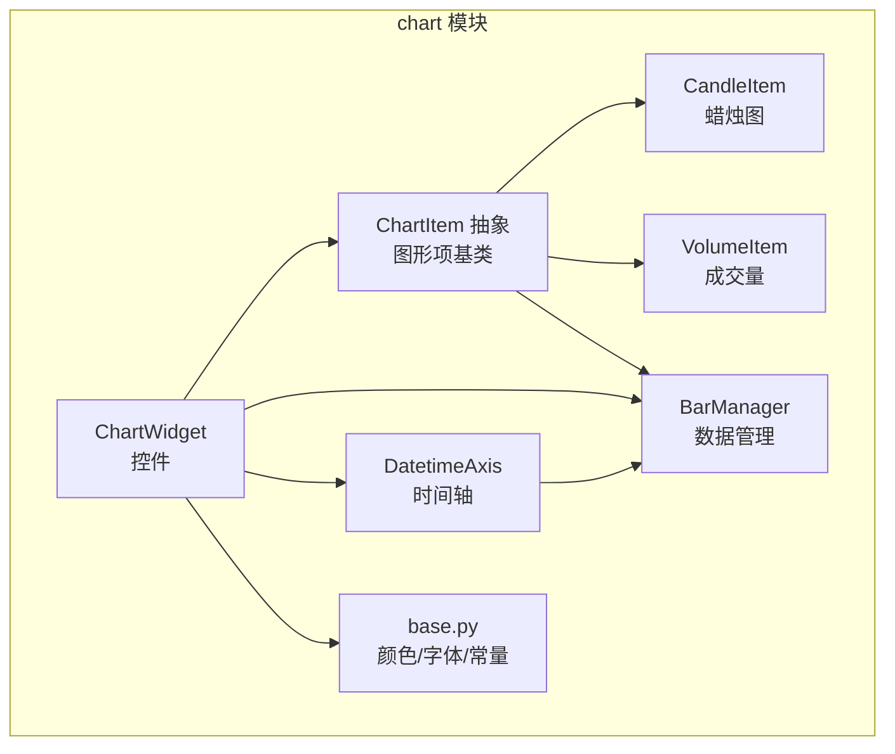
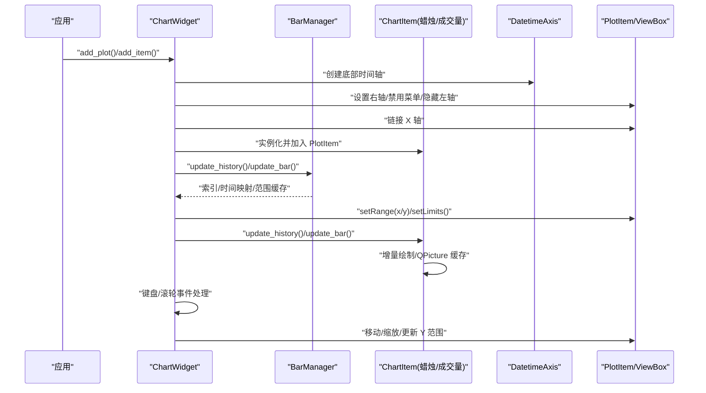
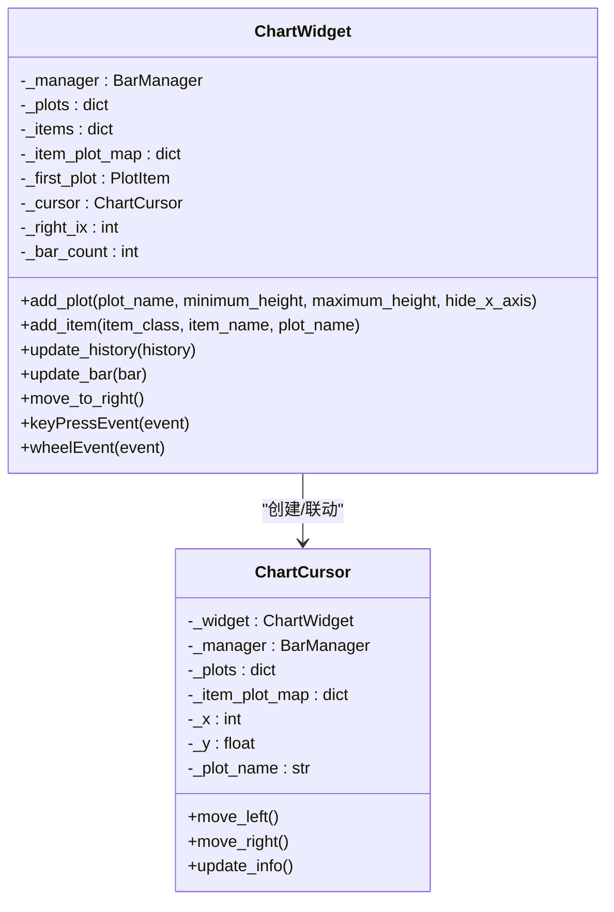
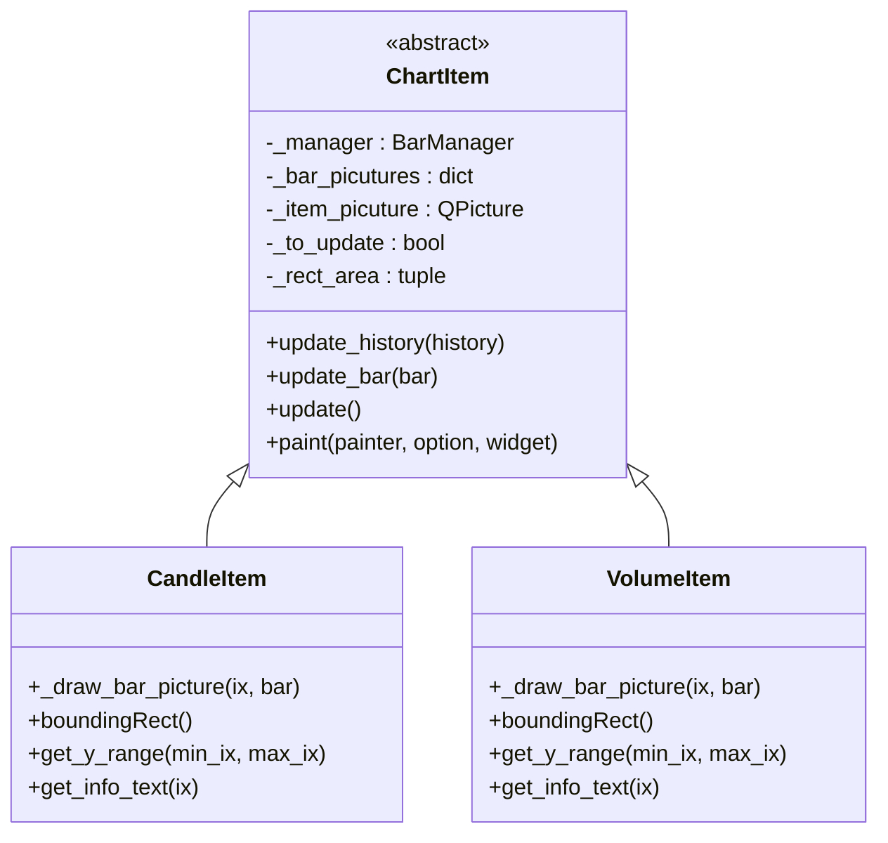
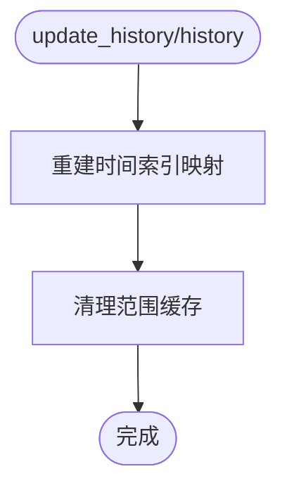
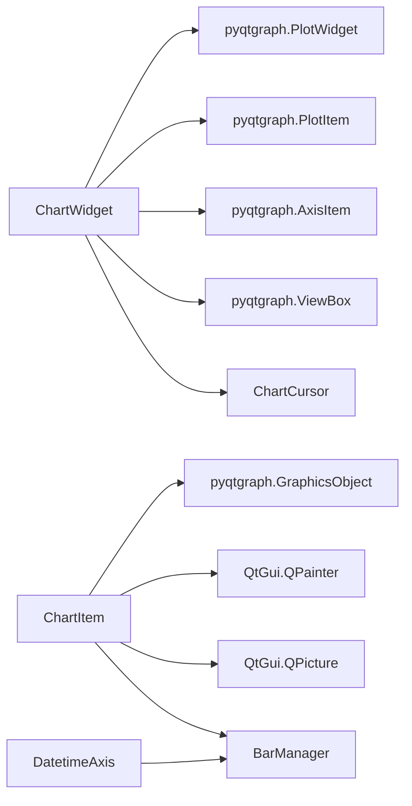

# 图表组件模块（chart）

<cite>
**本文引用的文件列表**
- [__init__.py](file://vnpy/chart/__init__.py)
- [widget.py](file://vnpy/chart/widget.py)
- [item.py](file://vnpy/chart/item.py)
- [manager.py](file://vnpy/chart/manager.py)
- [axis.py](file://vnpy/chart/axis.py)
- [base.py](file://vnpy/chart/base.py)
- [run.py](file://examples/candle_chart/run.py)
- [CLAUDE.md](file://vnpy/chart/CLAUDE.md)
</cite>

## 目录
1. [简介](#简介)
2. [项目结构](#项目结构)
3. [核心组件](#核心组件)
4. [架构总览](#架构总览)
5. [详细组件分析](#详细组件分析)
6. [依赖关系分析](#依赖关系分析)
7. [性能考量](#性能考量)
8. [故障排查指南](#故障排查指南)
9. [结论](#结论)
10. [附录](#附录)

## 简介
本文件系统性梳理 vnpy 的图表组件模块（chart），重点说明 ChartWidget 如何基于 PyQtGraph 实现高性能的实时 K 线图渲染，涵盖蜡烛图、成交量、技术指标的绘制；解释 ChartItem 作为基础图形元素的抽象，以及 CandleItem、VolumeItem 等具体实现；阐述 ChartManager 对多个图表实例的统一管理机制；并提供在自定义 GUI 应用中嵌入实时行情图表的使用示例与交互实现思路，最后总结图形性能优化技巧（如数据降采样、增量绘制、视口裁剪）。

## 项目结构
chart 模块采用“控件 + 图形项 + 管理器 + 轴”的分层设计：
- 控件层：ChartWidget 负责布局、交互、视图联动与滚动缩放
- 图形项层：ChartItem 抽象基类，CandleItem、VolumeItem 等具体实现
- 管理层：BarManager 统一维护时间序列数据、索引映射与范围缓存
- 轴层：DatetimeAxis 将索引转换为人类可读的时间标签
- 导出入口：__init__.py 暴露 ChartWidget、CandleItem、VolumeItem

**图表来源**
- [widget.py](file://vnpy/chart/widget.py#L20-L120)
- [item.py](file://vnpy/chart/item.py#L12-L167)
- [manager.py](file://vnpy/chart/manager.py#L9-L38)
- [axis.py](file://vnpy/chart/axis.py#L10-L45)
- [base.py](file://vnpy/chart/base.py#L1-L22)

**章节来源**
- [__init__.py](file://vnpy/chart/__init__.py#L1-L10)
- [CLAUDE.md](file://vnpy/chart/CLAUDE.md#L1-L163)

## 核心组件
- ChartWidget：基于 PlotWidget 的图表容器，负责多 PlotItem 的布局、联动、键盘/滚轮交互、滚动与缩放、游标联动与信息展示
- ChartItem：基于 GraphicsObject 的抽象图形项，提供增量绘制、QPicture 缓存、视口裁剪、范围查询与信息文本
- CandleItem：蜡烛图绘制，包含影线与实体，依据涨跌切换颜色
- VolumeItem：成交量柱状图绘制，以时间为 x 轴，成交量为 y 轴
- BarManager：时间序列数据管理，维护 BarData 字典、索引映射、价格/成交量范围缓存
- DatetimeAxis：将索引映射为时间字符串，支持按间距控制显示密度
- base：颜色、画笔宽度、字体、常量等通用配置

**章节来源**
- [widget.py](file://vnpy/chart/widget.py#L20-L120)
- [item.py](file://vnpy/chart/item.py#L12-L167)
- [manager.py](file://vnpy/chart/manager.py#L9-L171)
- [axis.py](file://vnpy/chart/axis.py#L10-L45)
- [base.py](file://vnpy/chart/base.py#L1-L22)

## 架构总览
下图展示了 ChartWidget 与各子系统的交互关系，以及 PyQtGraph 的关键组件参与方式。

**图表来源**
- [widget.py](file://vnpy/chart/widget.py#L62-L120)
- [item.py](file://vnpy/chart/item.py#L74-L167)
- [manager.py](file://vnpy/chart/manager.py#L21-L171)
- [axis.py](file://vnpy/chart/axis.py#L10-L45)

## 详细组件分析

### ChartWidget：高性能实时图表控件
- 初始化与布局
  - 内部持有 BarManager、PlotItem 字典、ChartItem 字典、游标对象
  - 使用 GraphicsLayout 构建多区域布局，设置边框与间距
- 多 Plot 区域管理
  - add_plot：创建 PlotItem，设置右轴、隐藏左轴、启用下采样、限制按钮、最小高度、最大高度、隐藏 X 轴
  - 首个 Plot 作为基准，后续 Plot 通过 setXLink 与之联动，保证多图同步滚动
- 图形项注册
  - add_item：实例化具体 ChartItem 并加入指定 Plot，建立 item 到 Plot 的映射
- 数据更新与滚动
  - update_history/update_bar：委托 BarManager 更新数据，触发各 ChartItem 的增量更新
  - _update_plot_limits：根据 ChartItem 的 get_y_range 设置 Plot 的 x/y 限制
  - _update_x_range/_update_y_range：根据当前 ViewBox 的可视范围，更新 X/Y 范围
  - move_to_right：自动滚动到最后一条数据
- 交互与游标
  - 键盘左右移动、上下缩放（滚轮同方向）
  - paintEvent：在每次绘制前更新右侧索引，驱动滚动
  - add_cursor：创建 ChartCursor，监听鼠标移动，绘制垂直/水平线与信息面板
- 事件处理
  - keyPressEvent/wheelEvent：实现键盘与滚轮交互
  - _on_key_left/_on_key_right/_on_key_up/_on_key_down：分别处理移动、缩放

**图表来源**
- [widget.py](file://vnpy/chart/widget.py#L20-L323)

**章节来源**
- [widget.py](file://vnpy/chart/widget.py#L20-L323)

### ChartItem 抽象与具体实现
- 抽象基类 ChartItem
  - 维护每个 bar 的 QPicture 缓存，仅重绘可见区域，显著提升性能
  - 重写 paint：根据 exposedRect 计算可视区间，必要时重建 item 的 QPicture
  - update_history/update_bar：清空或标记对应 bar 的 QPicture 为待绘制，并请求场景刷新
  - boundingRect/get_y_range/get_info_text：由子类实现，用于范围查询与游标信息
- CandleItem（蜡烛图）
  - 根据涨跌选择画笔/画刷，绘制影线与实体矩形
  - boundingRect：返回全量价格范围
  - get_y_range：返回指定区间的最高最低价
  - get_info_text：返回 K 线的日期/时间/开盘/最高/最低/收盘
- VolumeItem（成交量）
  - 依据涨跌选择颜色，绘制以时间为 x、成交量为高的矩形
  - boundingRect：返回全量成交量范围
  - get_y_range：返回指定区间的最高成交量
  - get_info_text：返回成交量信息

**图表来源**
- [item.py](file://vnpy/chart/item.py#L12-L334)

**章节来源**
- [item.py](file://vnpy/chart/item.py#L12-L334)

### BarManager：统一数据管理
- 数据结构
  - _bars：按时间排序的 BarData 映射
  - _datetime_index_map/_index_datetime_map：双向索引映射
  - _price_ranges/_volume_ranges：按区间缓存价格/成交量范围，避免重复计算
- 接口
  - update_history：批量更新并重建索引与缓存
  - update_bar：单条更新并清理缓存
  - get_count/get_index/get_datetime/get_bar：索引与时间互转、取条目
  - get_price_range/get_volume_range：按可视区间计算范围
  - clear_all：清空全部数据与缓存

**图表来源**
- [manager.py](file://vnpy/chart/manager.py#L21-L171)

**章节来源**
- [manager.py](file://vnpy/chart/manager.py#L9-L171)

### DatetimeAxis：时间轴标签
- 将索引映射为时间字符串，按显示间距决定是否显示
- 在小时存在时显示“年-月-日\n时:分:秒”，否则仅显示“年-月-日”

**章节来源**
- [axis.py](file://vnpy/chart/axis.py#L10-L45)

### 基础配置与颜色
- 颜色与画笔：白色、黑色、灰色、上涨/下跌颜色、画笔宽度、蜡烛宽度、轴线宽度
- 字体：统一的 NORMAL_FONT

**章节来源**
- [base.py](file://vnpy/chart/base.py#L1-L22)

## 依赖关系分析
- ChartWidget 依赖 PyQtGraph 的 PlotWidget、PlotItem、ViewBox、AxisItem、GraphicsLayout、InfiniteLine、TextItem、QPicture 等
- ChartItem 依赖 PyQtGraph 的 GraphicsObject、QPainter、QPicture
- BarManager 依赖 vnpy.trader.object.BarData
- DatetimeAxis 依赖 PyQtGraph 的 AxisItem 与 BarManager

**图表来源**
- [widget.py](file://vnpy/chart/widget.py#L1-L120)
- [item.py](file://vnpy/chart/item.py#L1-L167)
- [axis.py](file://vnpy/chart/axis.py#L10-L45)
- [manager.py](file://vnpy/chart/manager.py#L9-L38)

**章节来源**
- [widget.py](file://vnpy/chart/widget.py#L1-L120)
- [item.py](file://vnpy/chart/item.py#L1-L167)
- [axis.py](file://vnpy/chart/axis.py#L10-L45)
- [manager.py](file://vnpy/chart/manager.py#L9-L38)

## 性能考量
- 增量绘制与 QPicture 缓存
  - ChartItem 为每个 bar 维护 QPicture，仅在需要时重绘，避免全量重绘
  - paint 中根据 exposedRect 仅绘制可见区间，显著降低 CPU/GPU 压力
- 视口裁剪与范围缓存
  - BarManager 缓存价格/成交量的区间范围，避免重复扫描
  - ChartWidget 在视图变化时仅更新可视区间的 Y 范围
- 下采样与缩放策略
  - PlotItem 启用 setDownsampling(mode="peak")，在缩放时减少点数，提高渲染效率
  - 键盘/滚轮缩放采用倍率调整，避免频繁小步长重绘
- 双缓冲与抗锯齿
  - PyQtGraph 配置 antialias=True，提升视觉质量
  - 通过 QPicture 的 play 绘制，实现“离屏绘制 + 快速播放”的双缓冲效果
- 数据降采样
  - 对于超大数据集，建议在业务侧进行降采样（例如从 1 分钟线降采样到 5/15 分钟线再渲染）
- 交互优化
  - 多 Plot X 轴联动，减少重复计算
  - 游标信息按需更新，避免在非热点区域频繁刷新

**章节来源**
- [item.py](file://vnpy/chart/item.py#L74-L167)
- [widget.py](file://vnpy/chart/widget.py#L72-L120)
- [manager.py](file://vnpy/chart/manager.py#L93-L171)

## 故障排查指南
- 图表不显示或空白
  - 检查是否调用了 update_history 或 update_bar，并确保传入的 BarData 已按时间排序
  - 确认已 add_plot 且 add_item 成功加入到目标 Plot
- 滚动无效或越界
  - 确保未超过 BarManager 的数据总量；检查 move_to_right 是否被调用
  - 键盘/滚轮事件是否被正确拦截与处理
- 游标信息不更新
  - 确认 add_cursor 已调用；检查 ChartCursor 的 _mouse_moved 信号连接
  - 确保 ChartItem 的 get_info_text 返回有效文本
- 性能抖动
  - 检查是否频繁全量重绘；确认 QPicture 缓存是否生效
  - 适当增大 MIN_BAR_COUNT 与下采样策略，减少点数

**章节来源**
- [widget.py](file://vnpy/chart/widget.py#L143-L323)
- [item.py](file://vnpy/chart/item.py#L74-L167)
- [manager.py](file://vnpy/chart/manager.py#L21-L171)

## 结论
chart 模块通过“控件 + 图形项 + 管理器 + 轴”的清晰分层，结合 PyQtGraph 的高性能渲染能力，实现了量化交易场景下的实时 K 线与成交量可视化。其核心优势在于：
- 增量绘制与 QPicture 缓存，显著降低重绘成本
- 视口裁剪与范围缓存，减少不必要的扫描与计算
- 多 Plot 联动与下采样，兼顾精度与性能
- 游标联动与信息面板，增强交互体验

在实际应用中，建议配合业务侧的数据降采样策略与合理的缩放/滚动策略，以获得最佳的实时渲染效果。

## 附录

### 在自定义 GUI 应用中嵌入实时行情图表（示例路径）
- 示例程序演示了如何加载数据库的历史 K 线数据，创建 ChartWidget，添加蜡烛图与成交量图，添加游标，并通过定时器模拟实时推送新 K 线：
  - [示例入口](file://examples/candle_chart/run.py#L1-L44)
- 基本步骤
  - 创建 ChartWidget
  - add_plot 添加主图与成交量区域
  - add_item 注册 CandleItem 与 VolumeItem
  - add_cursor 添加十字光标
  - update_history 加载历史数据
  - update_bar 推送实时 K 线
  - show 与事件循环运行

**章节来源**
- [run.py](file://examples/candle_chart/run.py#L1-L44)

### 交互功能与快捷键
- 键盘
  - 左/右：横向移动
  - 上/下：纵向缩放
- 鼠标
  - 鼠标移动：显示垂直/水平线与信息面板
  - 鼠标滚轮：纵向缩放
- 自动滚动
  - 当新数据靠近右侧边界时，自动滚动至最右侧

**章节来源**
- [widget.py](file://vnpy/chart/widget.py#L237-L323)

### 技术指标的扩展思路
- 由于 chart 模块提供 ChartItem 抽象，可在业务侧计算指标序列（如 MA、MACD、RSI 等），然后以 LineItem/ScatterItem/HistogramItem 等形式叠加到图表中
- 参考文档中对“线图/散点图/直方图/技术指标”的说明与扩展开发指引：
  - [模块文档](file://vnpy/chart/CLAUDE.md#L38-L132)