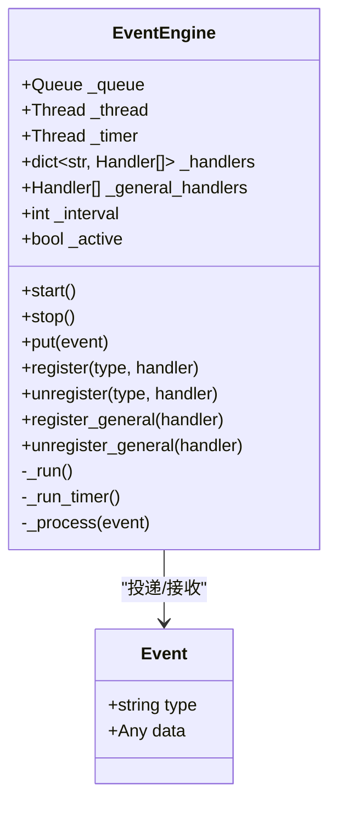
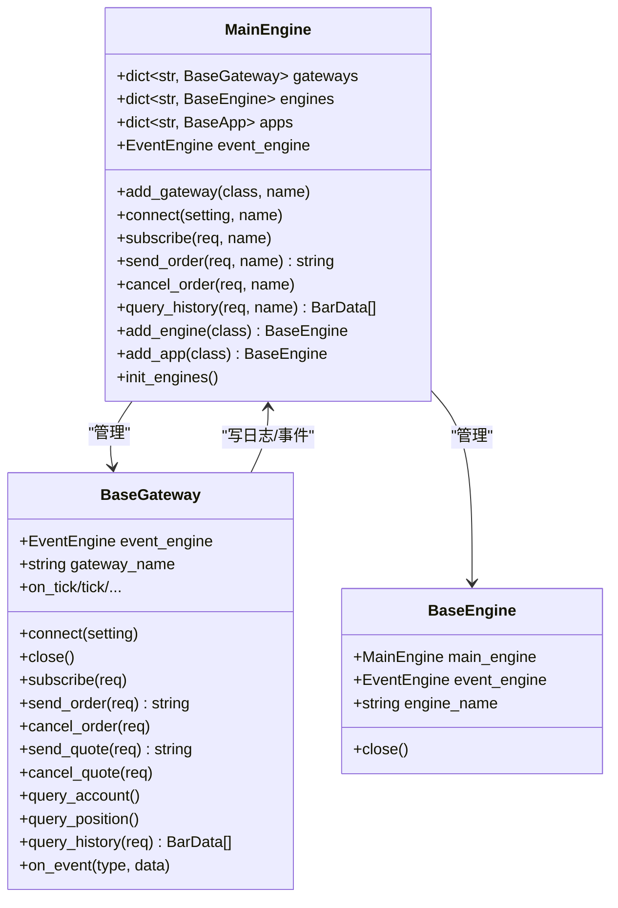
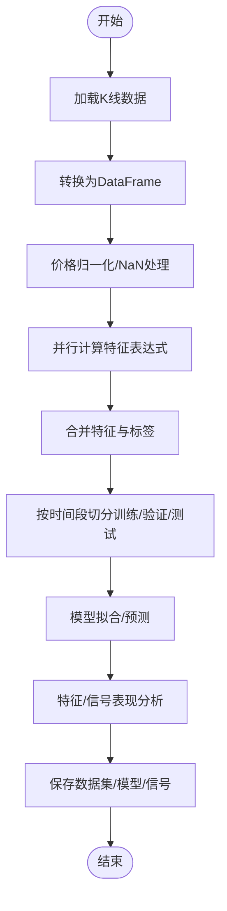
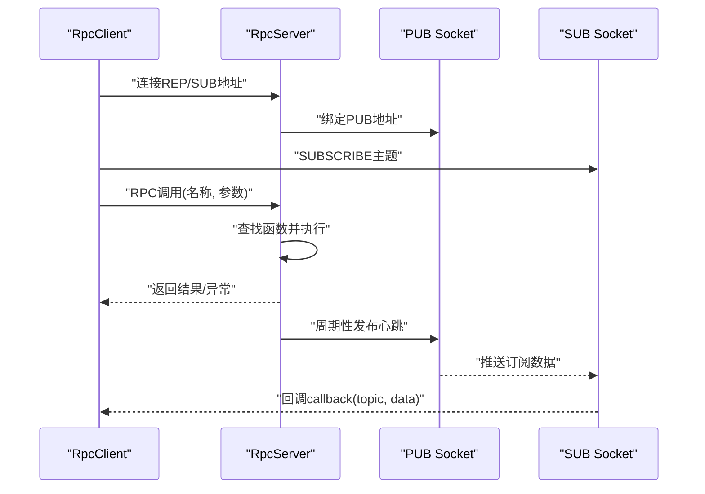
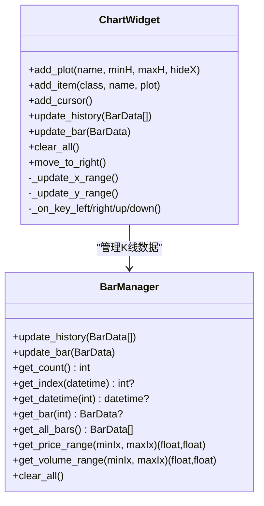

# 核心模块

<cite>
**本文引用的文件列表**
- [vnpy/event/engine.py](file://vnpy/event/engine.py)
- [vnpy/trader/engine.py](file://vnpy/trader/engine.py)
- [vnpy/trader/gateway.py](file://vnpy/trader/gateway.py)
- [vnpy/trader/app.py](file://vnpy/trader/app.py)
- [vnpy/alpha/lab.py](file://vnpy/alpha/lab.py)
- [vnpy/alpha/dataset/template.py](file://vnpy/alpha/dataset/template.py)
- [vnpy/alpha/model/template.py](file://vnpy/alpha/model/template.py)
- [vnpy/rpc/client.py](file://vnpy/rpc/client.py)
- [vnpy/rpc/server.py](file://vnpy/rpc/server.py)
- [vnpy/chart/widget.py](file://vnpy/chart/widget.py)
- [vnpy/chart/manager.py](file://vnpy/chart/manager.py)
- [examples/candle_chart/run.py](file://examples/candle_chart/run.py)
- [examples/client_server/run_client.py](file://examples/client_server/run_client.py)
</cite>

## 目录
1. [引言](#引言)
2. [项目结构](#项目结构)
3. [核心组件](#核心组件)
4. [架构总览](#架构总览)
5. [详细组件分析](#详细组件分析)
6. [依赖关系分析](#依赖关系分析)
7. [性能考量](#性能考量)
8. [故障排查指南](#故障排查指南)
9. [结论](#结论)
10. [附录](#附录)

## 引言
本文件系统性梳理 vnpy 的五大核心模块：event（事件驱动）、trader（交易核心）、alpha（AI量化）、rpc（远程调用）与 chart（图表组件）。围绕每个模块的设计目的、核心功能、关键类结构及其在整体系统中的角色展开，并通过示例路径展示如何在策略或应用中集成这些能力。同时强调模块间的依赖关系与集成方式，帮助开发者构建完整认知。

## 项目结构
vnpy 将系统按“领域分层 + 功能模块”组织：
- event 模块：提供统一事件总线与定时器机制，是所有模块解耦协作的基础。
- trader 模块：提供主引擎、引擎抽象、网关抽象、对象模型与常用工具，支撑交易全流程。
- alpha 模块：提供因子工程、数据集模板、模型模板与实验室工具，支持 AI/量化研究。
- rpc 模块：提供 REQ/REP 请求-响应与 PUB/SUB 订阅发布模式，实现跨进程/跨机器通信。
- chart 模块：基于 pyqtgraph 提供 K 线与成交量等图表项，支持交互式滚动与缩放。

```mermaid
graph TB
subgraph "事件驱动(event)"
E1["EventEngine<br/>定时器与事件分发"]
end
subgraph "交易核心(trader)"
T1["MainEngine<br/>聚合网关/引擎/App"]
T2["BaseGateway<br/>抽象网关"]
T3["BaseEngine<br/>抽象引擎"]
end
subgraph "AI量化(alpha)"
A1["AlphaLab<br/>数据/模型/信号存取"]
A2["AlphaDataset<br/>因子工程模板"]
A3["AlphaModel<br/>模型模板"]
end
subgraph "远程调用(rpc)"
R1["RpcServer<br/>函数注册/心跳/PUB"]
R2["RpcClient<br/>REQ/回调/心跳检测"]
end
subgraph "图表(chart)"
C1["ChartWidget<br/>Plot/Item/游标"]
C2["BarManager<br/>K线索引/范围缓存"]
end
E1 --> T1
T1 --> T2
T1 --> T3
T1 --> A1
A1 --> A2
A1 --> A3
R1 <- --> R2
C1 --> C2
T1 --> C1
```

图示来源
- [vnpy/event/engine.py](file://vnpy/event/engine.py#L1-L146)
- [vnpy/trader/engine.py](file://vnpy/trader/engine.py#L1-L120)
- [vnpy/trader/gateway.py](file://vnpy/trader/gateway.py#L1-L160)
- [vnpy/alpha/lab.py](file://vnpy/alpha/lab.py#L1-L120)
- [vnpy/alpha/dataset/template.py](file://vnpy/alpha/dataset/template.py#L1-L120)
- [vnpy/alpha/model/template.py](file://vnpy/alpha/model/template.py#L1-L31)
- [vnpy/rpc/server.py](file://vnpy/rpc/server.py#L1-L80)
- [vnpy/rpc/client.py](file://vnpy/rpc/client.py#L1-L80)
- [vnpy/chart/widget.py](file://vnpy/chart/widget.py#L1-L120)
- [vnpy/chart/manager.py](file://vnpy/chart/manager.py#L1-L80)

章节来源
- [vnpy/event/engine.py](file://vnpy/event/engine.py#L1-L146)
- [vnpy/trader/engine.py](file://vnpy/trader/engine.py#L1-L120)
- [vnpy/trader/gateway.py](file://vnpy/trader/gateway.py#L1-L160)
- [vnpy/alpha/lab.py](file://vnpy/alpha/lab.py#L1-L120)
- [vnpy/alpha/dataset/template.py](file://vnpy/alpha/dataset/template.py#L1-L120)
- [vnpy/alpha/model/template.py](file://vnpy/alpha/model/template.py#L1-L31)
- [vnpy/rpc/server.py](file://vnpy/rpc/server.py#L1-L80)
- [vnpy/rpc/client.py](file://vnpy/rpc/client.py#L1-L80)
- [vnpy/chart/widget.py](file://vnpy/chart/widget.py#L1-L120)
- [vnpy/chart/manager.py](file://vnpy/chart/manager.py#L1-L80)

## 核心组件
- event 模块
  - 设计目的：提供统一事件总线，支持类型化事件分发与定时器触发，解耦模块间直接调用。
  - 关键类：Event、EventEngine（线程安全队列+定时器线程+通用处理器）。
  - 典型用途：tick/order/trade/position/account/contract/log/quote 等事件的产生与处理。
- trader 模块
  - 设计目的：作为交易平台中枢，统一管理网关、引擎与应用，提供订单管理、日志、邮件等基础能力。
  - 关键类：MainEngine（添加网关/引擎/App，封装对外接口）、BaseEngine（引擎基类）、BaseGateway（网关基类）。
  - 典型用途：连接网关、订阅行情、下单/撤单、查询历史、集中日志与邮件。
- alpha 模块
  - 设计目的：为因子工程与模型训练提供数据集模板、模型模板与实验室工具。
  - 关键类：AlphaLab（数据/模型/信号持久化与加载）、AlphaDataset（特征表达式/标签/处理器/分段数据）、AlphaModel（拟合/预测模板）。
  - 典型用途：K线数据保存/加载、多周期数据拼接、特征计算、回测信号分析。
- rpc 模块
  - 设计目的：以 ZeroMQ 实现 REQ/REP 请求-响应与 PUB/SUB 发布-订阅，支持心跳保活与回调。
  - 关键类：RpcServer（函数注册、请求处理、心跳发布）、RpcClient（远程方法代理、订阅回调、断连检测）。
  - 典型用途：跨进程/跨机服务暴露与调用、推送数据订阅。
- chart 模块
  - 设计目的：提供交互式 K 线与成交量图表，支持滚动、缩放与游标信息。
  - 关键类：ChartWidget（布局/画板/游标/键盘/滚轮）、BarManager（K线索引/时间映射/价格/成交量范围缓存）。
  - 典型用途：历史K线初始化、增量更新、自动滚动到最新、交互式查看。

章节来源
- [vnpy/event/engine.py](file://vnpy/event/engine.py#L1-L146)
- [vnpy/trader/engine.py](file://vnpy/trader/engine.py#L1-L200)
- [vnpy/trader/gateway.py](file://vnpy/trader/gateway.py#L1-L160)
- [vnpy/alpha/lab.py](file://vnpy/alpha/lab.py#L1-L120)
- [vnpy/alpha/dataset/template.py](file://vnpy/alpha/dataset/template.py#L1-L120)
- [vnpy/alpha/model/template.py](file://vnpy/alpha/model/template.py#L1-L31)
- [vnpy/rpc/server.py](file://vnpy/rpc/server.py#L1-L120)
- [vnpy/rpc/client.py](file://vnpy/rpc/client.py#L1-L120)
- [vnpy/chart/widget.py](file://vnpy/chart/widget.py#L1-L160)
- [vnpy/chart/manager.py](file://vnpy/chart/manager.py#L1-L120)

## 架构总览
下图展示了五大模块在系统中的位置与交互关系：event 提供事件基础设施；trader 聚合网关与引擎，负责业务编排；alpha 与 chart 分别面向量化研究与可视化；rpc 作为可选的远程通信通道。

```mermaid
graph TB
EV["EventEngine"]
ME["MainEngine"]
GW["BaseGateway"]
OE["OmsEngine(LogEngine/EmailEngine)"]
AL["AlphaLab/AlphaDataset/AlphaModel"]
RP["RpcServer/RpcClient"]
CW["ChartWidget"]
BM["BarManager"]
EV --> ME
ME --> GW
ME --> OE
ME --> AL
RP <- --> RP
CW --> BM
ME --> CW
```

图示来源
- [vnpy/event/engine.py](file://vnpy/event/engine.py#L1-L146)
- [vnpy/trader/engine.py](file://vnpy/trader/engine.py#L1-L200)
- [vnpy/trader/gateway.py](file://vnpy/trader/gateway.py#L1-L160)
- [vnpy/alpha/lab.py](file://vnpy/alpha/lab.py#L1-L120)
- [vnpy/rpc/server.py](file://vnpy/rpc/server.py#L1-L120)
- [vnpy/rpc/client.py](file://vnpy/rpc/client.py#L1-L120)
- [vnpy/chart/widget.py](file://vnpy/chart/widget.py#L1-L160)
- [vnpy/chart/manager.py](file://vnpy/chart/manager.py#L1-L120)

## 详细组件分析

### event 模块：事件驱动与定时器
- 设计要点
  - 事件对象包含类型与数据，便于按类型分发。
  - EventEngine 内部维护队列、工作线程与定时器线程，定时生成“eTimer”事件。
  - 支持按类型注册处理器与“通用处理器”（监听所有事件类型）。
- 关键流程
  - 启动：启动工作线程与定时器线程。
  - 处理：从队列取出事件，先按类型分发，再分发给通用处理器。
  - 停止：停止定时器线程与工作线程，保证有序退出。
- API 调用示例（路径）
  - 注册处理器：[vnpy/event/engine.py](file://vnpy/event/engine.py#L111-L146)
  - 投递事件：[vnpy/event/engine.py](file://vnpy/event/engine.py#L105-L110)
  - 启动/停止：[vnpy/event/engine.py](file://vnpy/event/engine.py#L97-L104)



图示来源
- [vnpy/event/engine.py](file://vnpy/event/engine.py#L1-L146)

章节来源
- [vnpy/event/engine.py](file://vnpy/event/engine.py#L1-L146)

### trader 模块：交易核心与网关管理
- 设计要点
  - MainEngine 聚合网关、引擎与应用，统一对外接口；内部通过事件引擎进行事件分发。
  - BaseEngine 为各功能引擎提供统一生命周期与事件绑定入口。
  - BaseGateway 定义与外部系统的对接契约，包括连接、订阅、下单、撤单、查询历史等。
- 关键流程
  - 初始化：创建事件引擎并启动；初始化日志引擎；初始化订单管理引擎（OmsEngine）等。
  - 网关管理：添加网关、连接、订阅、下单/撤单、查询历史。
  - 数据存储：OmsEngine 维护各类数据字典与活跃订单/报价集合，并与 OffsetConverter 协作。
- API 调用示例（路径）
  - 添加网关：[vnpy/trader/engine.py](file://vnpy/trader/engine.py#L102-L119)
  - 连接/订阅/下单/撤单：[vnpy/trader/engine.py](file://vnpy/trader/engine.py#L213-L276)
  - 查询历史：[vnpy/trader/engine.py](file://vnpy/trader/engine.py#L277-L288)
  - 网关回调事件推送：[vnpy/trader/gateway.py](file://vnpy/trader/gateway.py#L86-L159)



图示来源
- [vnpy/trader/engine.py](file://vnpy/trader/engine.py#L73-L200)
- [vnpy/trader/gateway.py](file://vnpy/trader/gateway.py#L1-L160)

章节来源
- [vnpy/trader/engine.py](file://vnpy/trader/engine.py#L73-L200)
- [vnpy/trader/gateway.py](file://vnpy/trader/gateway.py#L1-L160)

### alpha 模块：因子工程与模型训练
- 设计要点
  - AlphaLab：提供数据/模型/信号的本地持久化与加载，支持日线/分钟线 parquet 存储、指数成分数据 shelf 存储、合约设置 JSON 存储。
  - AlphaDataset：定义特征表达式/标签表达式、预处理与学习处理管线、按时间段分段（训练/验证/测试）抽取。
  - AlphaModel：定义 fit/predict/detail 抽象接口，便于扩展不同算法。
- 关键流程
  - 数据准备：读取 BarData，转换为 Polars DataFrame，按 vt_symbol/datetime 排序，填充空值与 NaN，规范化价格，拼接特征与标签。
  - 特征计算：支持表达式与 Polars 表达式两种方式，多进程并行计算，最终合并到结果表。
  - 回测分析：使用 alphalens 对单特征或信号进行分位表现分析。
- API 调用示例（路径）
  - 保存/加载 K 线：[vnpy/alpha/lab.py](file://vnpy/alpha/lab.py#L51-L155)
  - 加载多标的 DataFrame：[vnpy/alpha/lab.py](file://vnpy/alpha/lab.py#L156-L244)
  - 指数成分数据存取：[vnpy/alpha/lab.py](file://vnpy/alpha/lab.py#L245-L348)
  - 合约设置存取：[vnpy/alpha/lab.py](file://vnpy/alpha/lab.py#L349-L388)
  - 数据集/模型/信号存取：[vnpy/alpha/lab.py](file://vnpy/alpha/lab.py#L389-L481)
  - 数据集模板：[vnpy/alpha/dataset/template.py](file://vnpy/alpha/dataset/template.py#L1-L120)
  - 模型模板：[vnpy/alpha/model/template.py](file://vnpy/alpha/model/template.py#L1-L31)



图示来源
- [vnpy/alpha/lab.py](file://vnpy/alpha/lab.py#L51-L244)
- [vnpy/alpha/dataset/template.py](file://vnpy/alpha/dataset/template.py#L90-L171)

章节来源
- [vnpy/alpha/lab.py](file://vnpy/alpha/lab.py#L51-L244)
- [vnpy/alpha/dataset/template.py](file://vnpy/alpha/dataset/template.py#L1-L171)
- [vnpy/alpha/model/template.py](file://vnpy/alpha/model/template.py#L1-L31)

### rpc 模块：客户端-服务端通信
- 设计要点
  - RpcServer：绑定 REP 与 PUB 两个套接字，维护函数字典，接收请求后执行并返回结果；周期性发布心跳。
  - RpcClient：REQ 套接字用于请求-响应，SUB 套接字用于订阅推送；通过 __getattr__ 动态生成远程调用；带超时与断连检测。
- 关键流程
  - 服务端：启动后进入循环，轮询 REP 套接字；收到请求后查找已注册函数执行，异常捕获并返回错误信息；按心跳间隔发布心跳。
  - 客户端：连接 REQ/SUB 地址，启动订阅线程；通过动态属性发起远程调用；收到订阅消息后回调用户实现的 callback。
- API 调用示例（路径）
  - 服务端启动/注册/发布：[vnpy/rpc/server.py](file://vnpy/rpc/server.py#L42-L123)
  - 客户端启动/远程调用/订阅：[vnpy/rpc/client.py](file://vnpy/rpc/client.py#L88-L169)



图示来源
- [vnpy/rpc/server.py](file://vnpy/rpc/server.py#L42-L141)
- [vnpy/rpc/client.py](file://vnpy/rpc/client.py#L88-L169)

章节来源
- [vnpy/rpc/server.py](file://vnpy/rpc/server.py#L1-L141)
- [vnpy/rpc/client.py](file://vnpy/rpc/client.py#L1-L170)

### chart 模块：实时K线渲染
- 设计要点
  - ChartWidget：基于 pyqtgraph，支持多 Plot 区域、右侧 Y 轴、X 链接联动、鼠标滚轮缩放与方向键平移；内置游标，显示当前点位信息。
  - BarManager：维护 K 线字典与时间索引映射，缓存指定区间的价格/成交量范围，支持历史批量更新与增量更新。
- 关键流程
  - 初始化：创建 BarManager，添加 Plot 区域与 ChartItem，设置 X 联动与轴样式。
  - 更新：update_history 批量更新并移动到最右；update_bar 增量更新并在右侧附近自动滚动。
  - 交互：键盘/滚轮事件更新视图范围；游标移动时同步更新垂直线、标签与信息面板。
- API 调用示例（路径）
  - 创建图表与添加项：[examples/candle_chart/run.py](file://examples/candle_chart/run.py#L21-L31)
  - 历史与增量更新：[vnpy/chart/widget.py](file://vnpy/chart/widget.py#L155-L181)
  - 视图控制与游标：[vnpy/chart/widget.py](file://vnpy/chart/widget.py#L237-L323)
  - 数据管理：[vnpy/chart/manager.py](file://vnpy/chart/manager.py#L21-L92)



图示来源
- [vnpy/chart/widget.py](file://vnpy/chart/widget.py#L1-L200)
- [vnpy/chart/manager.py](file://vnpy/chart/manager.py#L1-L120)

章节来源
- [vnpy/chart/widget.py](file://vnpy/chart/widget.py#L1-L200)
- [vnpy/chart/manager.py](file://vnpy/chart/manager.py#L1-L120)
- [examples/candle_chart/run.py](file://examples/candle_chart/run.py#L1-L44)

## 依赖关系分析
- 模块内聚与耦合
  - event 与 trader：trader 的 MainEngine 默认持有 EventEngine，所有网关与引擎均通过事件进行解耦。
  - trader 与 alpha：MainEngine 可初始化 OmsEngine 并提供统一查询接口，alpha 使用这些接口读取市场数据。
  - rpc 与 trader：示例中通过 RpcGateway 将远端服务接入 MainEngine，形成“远程网关”形态。
  - chart 与 trader：chart 通过数据库或历史数据初始化，也可由实时事件驱动增量更新。
- 外部依赖
  - rpc 模块依赖 ZeroMQ；chart 模块依赖 pyqtgraph；alpha 模块依赖 Polars、Alphalens 等。
- 循环依赖
  - 当前模块间无明显循环依赖；若自定义网关或应用需遵循“只向下依赖”的原则。

```mermaid
graph LR
Event["event.engine"] --> Trader["trader.engine"]
Trader --> Gateway["trader.gateway"]
Trader --> AlphaLab["alpha.lab"]
AlphaLab --> AlphaDS["alpha.dataset.template"]
AlphaLab --> AlphaModel["alpha.model.template"]
RpcS["rpc.server"] <- --> RpcC["rpc.client"]
ChartW["chart.widget"] --> BarM["chart.manager"]
Trader --> ChartW
```

图示来源
- [vnpy/event/engine.py](file://vnpy/event/engine.py#L1-L146)
- [vnpy/trader/engine.py](file://vnpy/trader/engine.py#L1-L200)
- [vnpy/trader/gateway.py](file://vnpy/trader/gateway.py#L1-L160)
- [vnpy/alpha/lab.py](file://vnpy/alpha/lab.py#L1-L120)
- [vnpy/alpha/dataset/template.py](file://vnpy/alpha/dataset/template.py#L1-L120)
- [vnpy/alpha/model/template.py](file://vnpy/alpha/model/template.py#L1-L31)
- [vnpy/rpc/server.py](file://vnpy/rpc/server.py#L1-L120)
- [vnpy/rpc/client.py](file://vnpy/rpc/client.py#L1-L120)
- [vnpy/chart/widget.py](file://vnpy/chart/widget.py#L1-L160)
- [vnpy/chart/manager.py](file://vnpy/chart/manager.py#L1-L120)

章节来源
- [vnpy/event/engine.py](file://vnpy/event/engine.py#L1-L146)
- [vnpy/trader/engine.py](file://vnpy/trader/engine.py#L1-L200)
- [vnpy/trader/gateway.py](file://vnpy/trader/gateway.py#L1-L160)
- [vnpy/alpha/lab.py](file://vnpy/alpha/lab.py#L1-L120)
- [vnpy/alpha/dataset/template.py](file://vnpy/alpha/dataset/template.py#L1-L120)
- [vnpy/alpha/model/template.py](file://vnpy/alpha/model/template.py#L1-L31)
- [vnpy/rpc/server.py](file://vnpy/rpc/server.py#L1-L120)
- [vnpy/rpc/client.py](file://vnpy/rpc/client.py#L1-L120)
- [vnpy/chart/widget.py](file://vnpy/chart/widget.py#L1-L160)
- [vnpy/chart/manager.py](file://vnpy/chart/manager.py#L1-L120)

## 性能考量
- 事件驱动
  - 使用队列与线程分离事件投递与处理，避免阻塞；定时器按固定间隔生成事件，注意 interval 设置与 CPU 占用平衡。
- 交易核心
  - OmsEngine 维护大量字典与活跃集合，建议在高频场景下减少不必要的拷贝与重复查询；OffsetConverter 与订单/成交/持仓联动需谨慎更新。
- AI量化
  - 特征计算采用多进程并行，合理设置进程数；数据合并与排序成本较高，建议按 vt_symbol 分桶或分区处理。
- 远程调用
  - REQ/REP 有超时控制，建议根据网络状况调整超时参数；PUB/SUB 心跳容忍度决定断连检测灵敏度。
- 图表渲染
  - pyqtgraph 渲染开销与数据量成正比，建议启用降采样与缓存价格/成交量范围；游标信息按需更新，避免频繁重绘。

## 故障排查指南
- 事件未到达
  - 检查 EventEngine 是否已启动；确认处理器是否正确注册；核对事件类型字符串是否一致。
  - 参考：[vnpy/event/engine.py](file://vnpy/event/engine.py#L97-L146)
- 网关连接失败
  - 查看网关默认配置与连接参数；检查 MainEngine.connect 调用链；关注 on_log 输出。
  - 参考：[vnpy/trader/gateway.py](file://vnpy/trader/gateway.py#L160-L273)，[vnpy/trader/engine.py](file://vnpy/trader/engine.py#L213-L244)
- 订单状态异常
  - 检查 OmsEngine 中活跃订单集合更新逻辑；确认 OffsetConverter 是否正确更新。
  - 参考：[vnpy/trader/engine.py](file://vnpy/trader/engine.py#L373-L440)
- RPC 调用超时
  - 调整超时参数；检查服务端是否仍在运行；确认函数已通过 register 注册。
  - 参考：[vnpy/rpc/client.py](file://vnpy/rpc/client.py#L61-L87)，[vnpy/rpc/server.py](file://vnpy/rpc/server.py#L100-L111)
- 图表不更新
  - 确认 update_history/update_bar 已调用；检查 BarManager 索引映射是否正确；确认视图范围更新逻辑。
  - 参考：[vnpy/chart/widget.py](file://vnpy/chart/widget.py#L155-L181)，[vnpy/chart/manager.py](file://vnpy/chart/manager.py#L21-L92)

章节来源
- [vnpy/event/engine.py](file://vnpy/event/engine.py#L97-L146)
- [vnpy/trader/gateway.py](file://vnpy/trader/gateway.py#L160-L273)
- [vnpy/trader/engine.py](file://vnpy/trader/engine.py#L373-L440)
- [vnpy/rpc/client.py](file://vnpy/rpc/client.py#L61-L87)
- [vnpy/rpc/server.py](file://vnpy/rpc/server.py#L100-L111)
- [vnpy/chart/widget.py](file://vnpy/chart/widget.py#L155-L181)
- [vnpy/chart/manager.py](file://vnpy/chart/manager.py#L21-L92)

## 结论
vnpy 的五大模块以 event 为基石，通过 trader 的主引擎聚合网关与引擎，辅以 alpha 的因子工程与模型模板、rpc 的远程通信能力以及 chart 的可视化渲染，形成了完整的量化研发与交易闭环。理解各模块职责与交互方式，有助于在策略开发、数据研究与系统运维中高效集成与扩展。

## 附录
- 示例路径参考
  - 远程网关集成示例：[examples/client_server/run_client.py](file://examples/client_server/run_client.py#L1-L28)
  - 图表示例：[examples/candle_chart/run.py](file://examples/candle_chart/run.py#L1-L44)
- 模块导出
  - alpha 模块导出：[vnpy/alpha/__init__.py](file://vnpy/alpha/__init__.py#L1-L18)