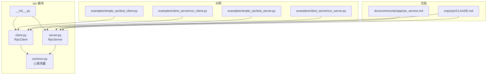
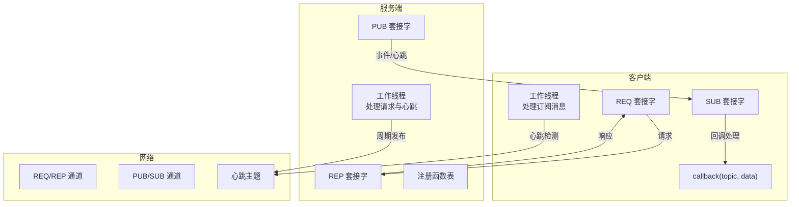
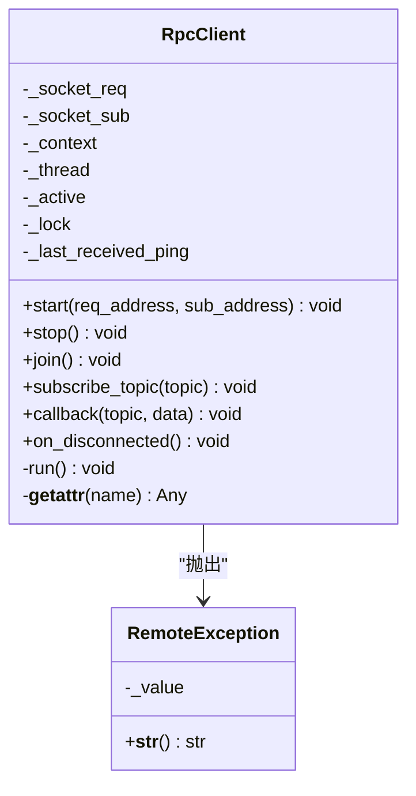
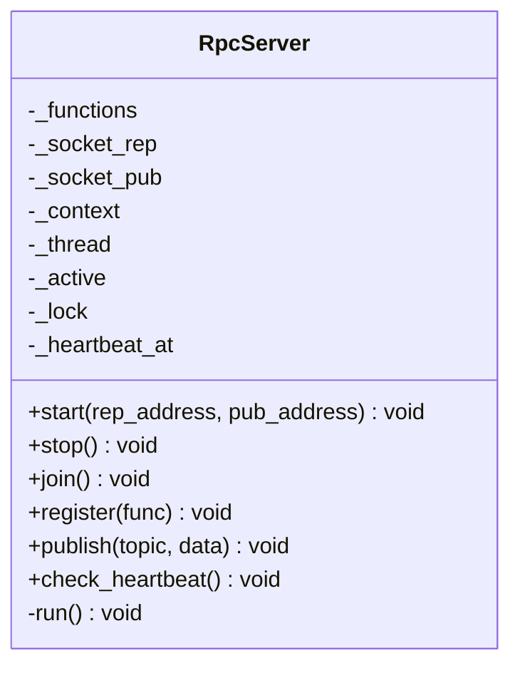
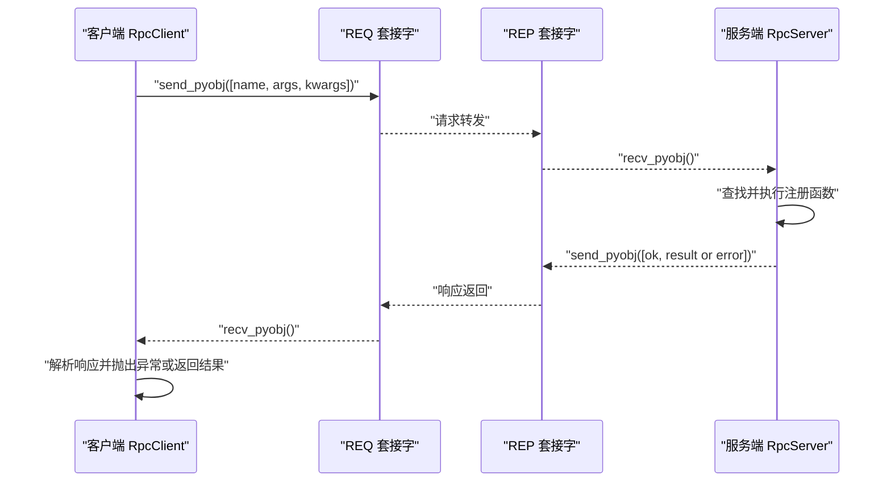
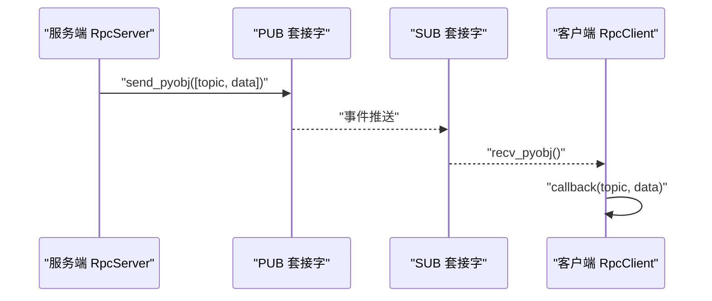
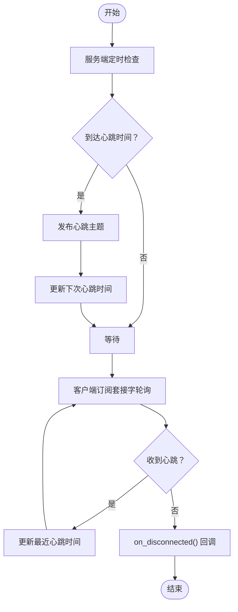
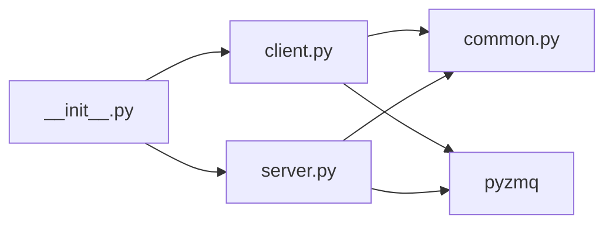
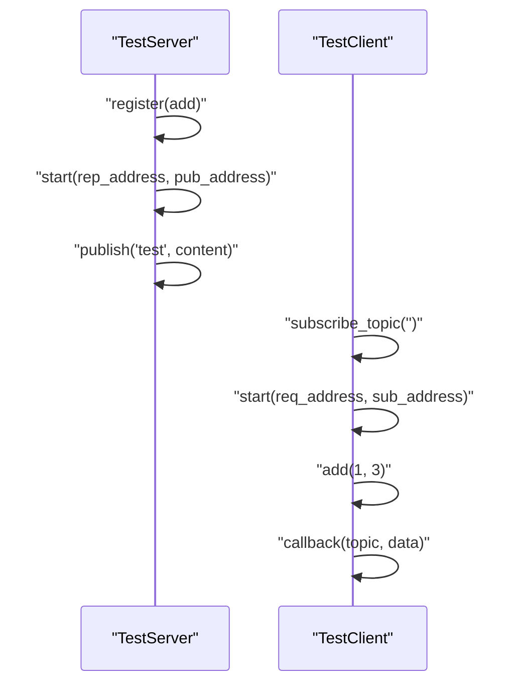
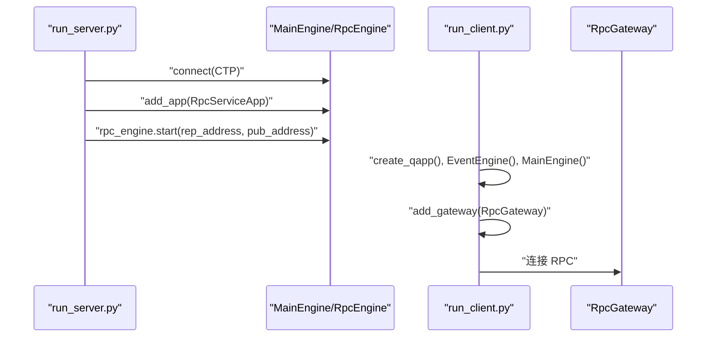

# 远程调用模块 (rpc)

<cite>
**本文引用的文件列表**
- [vnpy/rpc/__init__.py](file://vnpy/rpc/__init__.py)
- [vnpy/rpc/client.py](file://vnpy/rpc/client.py)
- [vnpy/rpc/server.py](file://vnpy/rpc/server.py)
- [vnpy/rpc/common.py](file://vnpy/rpc/common.py)
- [examples/simple_rpc/test_client.py](file://examples/simple_rpc/test_client.py)
- [examples/simple_rpc/test_server.py](file://examples/simple_rpc/test_server.py)
- [examples/client_server/run_client.py](file://examples/client_server/run_client.py)
- [examples/client_server/run_server.py](file://examples/client_server/run_server.py)
- [docs/community/app/rpc_service.md](file://docs/community/app/rpc_service.md)
- [vnpy/rpc/CLAUDE.md](file://vnpy/rpc/CLAUDE.md)
</cite>

## 目录
1. [引言](#引言)
2. [项目结构](#项目结构)
3. [核心组件](#核心组件)
4. [架构总览](#架构总览)
5. [详细组件分析](#详细组件分析)
6. [依赖关系分析](#依赖关系分析)
7. [性能与超时配置](#性能与超时配置)
8. [安全配置与最佳实践](#安全配置与最佳实践)
9. [分布式部署实战示例](#分布式部署实战示例)
10. [故障排查指南](#故障排查指南)
11. [结论](#结论)

## 引言
本文件面向开发者与运维人员，系统化梳理 vnpy 的远程调用模块（rpc），围绕基于 ZeroMQ 的客户端-服务端通信协议，详细说明：
- 请求-响应与发布-订阅两种模式的消息流与实现
- 消息序列化格式与握手过程
- RpcServer 如何暴露本地方法供远程调用，RpcClient 如何代理远程对象
- 公共接口、异常处理机制与超时配置
- 在分布式部署场景下，如何使用 RPC 模块实现主从架构或跨进程通信
- 安全配置、性能基准与故障排查

## 项目结构
rpc 模块位于 vnpy/rpc，核心文件包括：
- __init__.py：导出 RpcClient、RpcServer
- client.py：客户端实现，包含 REQ/REQ 模式调用与 SUB 订阅
- server.py：服务端实现，包含 REP/REQ 模式处理与 PUB 广播
- common.py：心跳主题、心跳间隔与容忍度等通用常量

示例与文档：
- examples/simple_rpc：最小可用示例（服务端注册函数、客户端动态调用与订阅）
- examples/client_server：结合 vntrader 的 GUI/CLI 启动示例
- docs/community/app/rpc_service.md：RpcService 文档（服务端能力与使用说明）
- vnpy/rpc/CLAUDE.md：模块设计与实现要点（通信流程、异常处理、性能与安全）

图表来源
- [vnpy/rpc/__init__.py](file://vnpy/rpc/__init__.py#L1-L8)
- [vnpy/rpc/client.py](file://vnpy/rpc/client.py#L1-L169)
- [vnpy/rpc/server.py](file://vnpy/rpc/server.py#L1-L141)
- [vnpy/rpc/common.py](file://vnpy/rpc/common.py#L1-L11)
- [examples/simple_rpc/test_client.py](file://examples/simple_rpc/test_client.py#L1-L35)
- [examples/simple_rpc/test_server.py](file://examples/simple_rpc/test_server.py#L1-L39)
- [examples/client_server/run_client.py](file://examples/client_server/run_client.py#L1-L28)
- [examples/client_server/run_server.py](file://examples/client_server/run_server.py#L1-L74)
- [docs/community/app/rpc_service.md](file://docs/community/app/rpc_service.md#L1-L111)
- [vnpy/rpc/CLAUDE.md](file://vnpy/rpc/CLAUDE.md#L1-L158)

章节来源
- [vnpy/rpc/__init__.py](file://vnpy/rpc/__init__.py#L1-L8)
- [vnpy/rpc/client.py](file://vnpy/rpc/client.py#L1-L169)
- [vnpy/rpc/server.py](file://vnpy/rpc/server.py#L1-L141)
- [vnpy/rpc/common.py](file://vnpy/rpc/common.py#L1-L11)

## 核心组件
- RpcClient：负责发起请求-响应调用与订阅事件推送；内部维护 REQ 与 SUB 两个套接字，线程循环处理订阅消息，支持心跳检测与断连回调。
- RpcServer：负责接收请求并执行注册函数，返回结果；同时以 PUB 广播事件；内置心跳定时发布。
- 公共常量：心跳主题、心跳间隔、心跳容忍度，用于心跳检测与断连判定。

章节来源
- [vnpy/rpc/client.py](file://vnpy/rpc/client.py#L1-L169)
- [vnpy/rpc/server.py](file://vnpy/rpc/server.py#L1-L141)
- [vnpy/rpc/common.py](file://vnpy/rpc/common.py#L1-L11)

## 架构总览
rpc 模块采用 ZeroMQ 的 REQ/REP 与 PUB/SUB 组合：
- 请求-响应：客户端 REQ 发送调用请求，服务端 REP 接收并执行，返回结果。
- 发布-订阅：服务端 PUB 主动推送事件，客户端 SUB 订阅并回调处理。
- 心跳：服务端周期性发布心跳主题，客户端据此判断连接健康。

图表来源
- [vnpy/rpc/client.py](file://vnpy/rpc/client.py#L1-L169)
- [vnpy/rpc/server.py](file://vnpy/rpc/server.py#L1-L141)
- [vnpy/rpc/common.py](file://vnpy/rpc/common.py#L1-L11)

## 详细组件分析

### RpcClient 组件
- 角色与职责
  - 提供动态远程方法代理：通过 __getattr__ 返回可调用的 dorpc 包装函数，实现“远程方法名即本地调用”的体验。
  - 请求-响应调用：发送序列化请求，等待响应，按约定格式解析结果或异常。
  - 订阅事件：建立 SUB 套接字，订阅指定主题，线程循环接收并回调处理；内置心跳检测与断连回调。
- 关键接口
  - start(req_address, sub_address)：连接 REQ/REP 与 SUB 地址，启动工作线程。
  - stop()/join()：停止并等待线程退出。
  - subscribe_topic(topic)：订阅主题。
  - callback(topic, data)：子类需实现的回调处理。
  - on_disconnected()：心跳超时触发的断连回调，默认打印提示。
- 消息与序列化
  - 请求格式：包含函数名、位置参数元组、关键字参数字典。
  - 响应格式：布尔标志 + 结果或异常文本。
  - 序列化：使用 pyzmq 的 Python 对象序列化（recv_pyobj/send_pyobj）。
- 超时与异常
  - 调用超时：通过 poll(timeout) 判断是否在超时时间内收到响应，否则抛出 RemoteException。
  - 远程异常：服务端抛出的异常会被捕获并以字符串形式返回，客户端侧抛出 RemoteException。
- 心跳与断连
  - 服务端周期发布心跳主题；客户端收到心跳更新最近心跳时间；若超过容忍阈值未收到心跳，则触发 on_disconnected。

图表来源
- [vnpy/rpc/client.py](file://vnpy/rpc/client.py#L1-L169)

章节来源
- [vnpy/rpc/client.py](file://vnpy/rpc/client.py#L1-L169)

### RpcServer 组件
- 角色与职责
  - 提供函数注册：将本地可调用对象映射到函数名，供客户端远程调用。
  - 处理请求：监听 REP 套接字，接收请求，查找注册函数并执行，返回结果或异常栈。
  - 广播事件：通过 PUB 套接字向所有订阅者推送主题化数据。
  - 心跳：周期性发布心跳主题，维持客户端连接健康感知。
- 关键接口
  - start(rep_address, pub_address)：绑定 REP/REQ 与 PUB 地址，启动工作线程。
  - stop()/join()：停止并等待线程退出。
  - register(func)：注册可远程调用的函数。
  - publish(topic, data)：发布主题化数据。
  - check_heartbeat()：检查是否需要发布心跳。
- 消息与序列化
  - 请求格式：函数名、位置参数元组、关键字参数字典。
  - 响应格式：布尔标志 + 结果或异常栈字符串。
  - 序列化：recv_pyobj/send_pyobj。
- 异常处理
  - 服务端执行异常被捕获并以字符串形式返回，客户端侧抛出 RemoteException。

图表来源
- [vnpy/rpc/server.py](file://vnpy/rpc/server.py#L1-L141)

章节来源
- [vnpy/rpc/server.py](file://vnpy/rpc/server.py#L1-L141)

### 消息序列化与握手流程

#### 请求-响应模式（REQ/REP）

图表来源
- [vnpy/rpc/client.py](file://vnpy/rpc/client.py#L55-L87)
- [vnpy/rpc/server.py](file://vnpy/rpc/server.py#L83-L115)

#### 发布-订阅模式（PUB/SUB）

图表来源
- [vnpy/rpc/server.py](file://vnpy/rpc/server.py#L116-L122)
- [vnpy/rpc/client.py](file://vnpy/rpc/client.py#L132-L147)

#### 心跳与断连检测

图表来源
- [vnpy/rpc/server.py](file://vnpy/rpc/server.py#L129-L141)
- [vnpy/rpc/client.py](file://vnpy/rpc/client.py#L132-L169)
- [vnpy/rpc/common.py](file://vnpy/rpc/common.py#L8-L11)

## 依赖关系分析
- 内部依赖
  - client.py 依赖 common.py 中的心跳常量。
  - server.py 依赖 common.py 中的心跳常量。
  - __init__.py 导出 RpcClient、RpcServer。
- 外部依赖
  - pyzmq：ZeroMQ Python 绑定，提供 REQ/REP、PUB/SUB、poll、recv_pyobj/send_pyobj 等能力。
- 潜在耦合点
  - 请求/响应与发布/订阅两条通道分离，避免相互阻塞。
  - 心跳主题固定，客户端与服务端一致，便于跨进程/跨网络连接健康监测。

图表来源
- [vnpy/rpc/__init__.py](file://vnpy/rpc/__init__.py#L1-L8)
- [vnpy/rpc/client.py](file://vnpy/rpc/client.py#L1-L169)
- [vnpy/rpc/server.py](file://vnpy/rpc/server.py#L1-L141)
- [vnpy/rpc/common.py](file://vnpy/rpc/common.py#L1-L11)

章节来源
- [vnpy/rpc/__init__.py](file://vnpy/rpc/__init__.py#L1-L8)
- [vnpy/rpc/client.py](file://vnpy/rpc/client.py#L1-L169)
- [vnpy/rpc/server.py](file://vnpy/rpc/server.py#L1-L141)
- [vnpy/rpc/common.py](file://vnpy/rpc/common.py#L1-L11)

## 性能与超时配置
- 超时配置
  - 客户端调用超时：通过调用时传入 timeout（毫秒）参数，默认 30 秒；若 poll 超时则抛出 RemoteException。
  - 心跳容忍：客户端根据 HEARTBEAT_TOLERANCE（秒）判断是否断连。
- 心跳与吞吐
  - 服务端按 HEARTBEAT_INTERVAL（秒）周期发布心跳，避免长连接空闲被中间设备回收。
  - 客户端线程轮询 SUB 套接字，避免阻塞；心跳轮询阈值转换为毫秒参与 poll。
- 序列化开销
  - 使用 pyzmq 对象序列化，简单高效；不适合传输超大数据对象，建议改为共享存储或数据库。
- 并发与锁
  - 客户端请求发送使用锁保护 REQ 套接字，避免并发竞争。
  - 服务端响应发送使用锁保护 PUB 套接字，确保广播一致性。

章节来源
- [vnpy/rpc/client.py](file://vnpy/rpc/client.py#L55-L87)
- [vnpy/rpc/server.py](file://vnpy/rpc/server.py#L83-L115)
- [vnpy/rpc/common.py](file://vnpy/rpc/common.py#L8-L11)
- [vnpy/rpc/CLAUDE.md](file://vnpy/rpc/CLAUDE.md#L93-L105)

## 安全配置与最佳实践
- 当前限制
  - 无内置认证、加密与访问控制。
- 建议措施
  - 网络隔离：仅在内网或专用网络使用，避免暴露公网。
  - 传输加密：结合 VPN 或 TLS 封装（如通过代理或容器网络）。
  - 服务端加固：在服务端实现自定义认证与鉴权逻辑，限制可注册函数范围。
  - 最小权限：仅暴露必要函数，避免执行危险操作。
  - 日志审计：记录关键调用与异常，便于追踪与审计。

章节来源
- [vnpy/rpc/CLAUDE.md](file://vnpy/rpc/CLAUDE.md#L106-L117)
- [docs/community/app/rpc_service.md](file://docs/community/app/rpc_service.md#L62-L73)

## 分布式部署实战示例

### 示例一：最小可用（函数注册 + 动态调用 + 订阅）
- 服务端
  - 继承 RpcServer，注册本地函数 add。
  - start(rep_address, pub_address)，周期 publish 主题化数据。
- 客户端
  - 继承 RpcClient，实现 callback 处理订阅消息。
  - start(req_address, sub_address)，订阅全部主题，动态调用 add。

图表来源
- [examples/simple_rpc/test_server.py](file://examples/simple_rpc/test_server.py#L1-L39)
- [examples/simple_rpc/test_client.py](file://examples/simple_rpc/test_client.py#L1-L35)

章节来源
- [examples/simple_rpc/test_server.py](file://examples/simple_rpc/test_server.py#L1-L39)
- [examples/simple_rpc/test_client.py](file://examples/simple_rpc/test_client.py#L1-L35)

### 示例二：与 vntrader 集成（GUI/CLI 启动）
- 服务端（CLI）
  - 创建 MainEngine，连接交易接口，启动 RpcServiceApp，调用 rpc_engine.start(rep_address, pub_address)。
- 客户端（GUI）
  - 创建 MainEngine，添加 RpcGateway，展示主界面，连接 RPC。

图表来源
- [examples/client_server/run_server.py](file://examples/client_server/run_server.py#L1-L74)
- [examples/client_server/run_client.py](file://examples/client_server/run_client.py#L1-L28)
- [docs/community/app/rpc_service.md](file://docs/community/app/rpc_service.md#L1-L111)

章节来源
- [examples/client_server/run_server.py](file://examples/client_server/run_server.py#L1-L74)
- [examples/client_server/run_client.py](file://examples/client_server/run_client.py#L1-L28)
- [docs/community/app/rpc_service.md](file://docs/community/app/rpc_service.md#L1-L111)

## 故障排查指南
- 常见问题
  - 超时：客户端调用超时，检查服务端是否正常运行、REP/REQ 地址是否正确、网络是否可达。
  - 断连：客户端 on_disconnected 回调被触发，检查心跳容忍、网络丢包、中间设备保活策略。
  - 订阅不到消息：确认客户端已订阅主题、服务端已发布、主题名一致。
  - 函数不存在：服务端未注册对应函数名，检查注册逻辑。
- 排查步骤
  - 确认地址格式与协议（tcp:// 或 ipc://），服务端 bind，客户端 connect。
  - 查看服务端日志与客户端回调输出，定位异常栈。
  - 使用最小示例验证 REQ/REP 与 PUB/SUB 是否正常。
  - 检查防火墙与网络策略，确保端口开放。
- 相关实现参考
  - 客户端超时与异常：请求发送、poll、响应解析与 RemoteException 抛出。
  - 服务端异常捕获与响应：try/except 捕获异常并返回字符串。
  - 心跳容忍与断连回调：客户端心跳轮询与 on_disconnected。

章节来源
- [vnpy/rpc/client.py](file://vnpy/rpc/client.py#L55-L87)
- [vnpy/rpc/server.py](file://vnpy/rpc/server.py#L96-L110)
- [vnpy/rpc/common.py](file://vnpy/rpc/common.py#L8-L11)

## 结论
rpc 模块以轻量实现提供可靠的跨进程/跨网络远程调用能力：
- 通过 REQ/REP 与 PUB/SUB 的组合，满足请求-响应与事件推送两类核心需求。
- 以心跳机制保障连接健康，配合超时与异常处理提升鲁棒性。
- 在分布式部署中，可作为主从架构或跨进程通信的基础组件，结合 vntrader 的 RpcGateway 实现交易与数据服务的统一接入。
- 安全方面建议在网络隔离、认证与访问控制上加强，避免直接暴露公网。