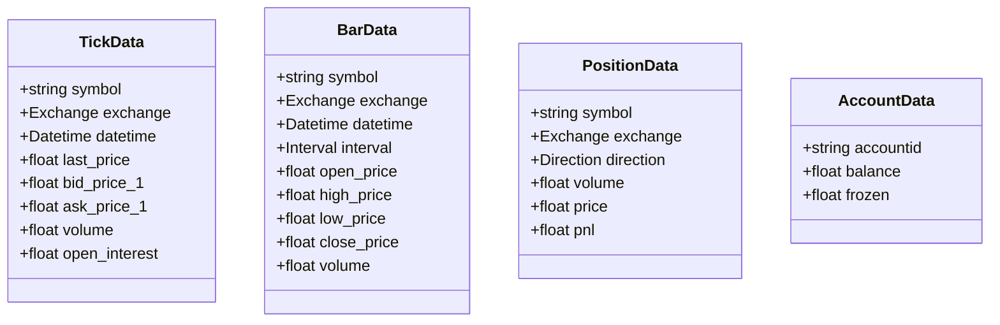
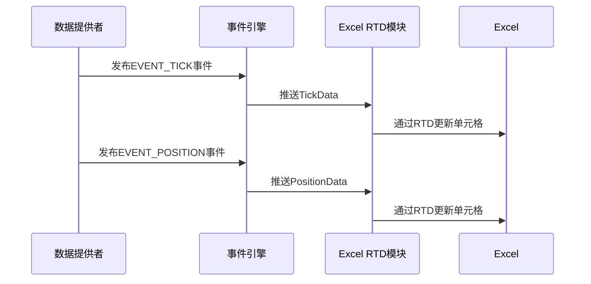
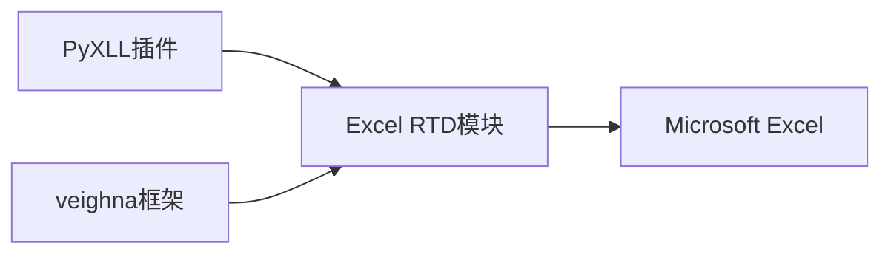

# Excel实时数据服务

<cite>
**本文档引用的文件**  
- [excel_rtd.md](file://docs/community/app/excel_rtd.md)
- [object.py](file://vnpy/trader/object.py)
- [engine.py](file://vnpy/trader/engine.py)
- [event.py](file://vnpy/trader/event.py)
- [event_engine.py](file://vnpy/event/engine.py)
</cite>

## 目录
1. [简介](#简介)
2. [项目结构](#项目结构)
3. [核心组件](#核心组件)
4. [架构概述](#架构概述)
5. [详细组件分析](#详细组件分析)
6. [依赖分析](#依赖分析)
7. [性能考虑](#性能考虑)
8. [故障排除指南](#故障排除指南)
9. [结论](#结论)

## 简介
Excel RTD（Real-Time Data）服务是VeighNa量化交易平台的一个功能模块，允许用户在Excel中访问程序内的实时数据信息。该功能依赖于PyXLL插件（www.pyxll.com），这是一个商业软件，需要购买才能使用（提供30天免费试用）。通过Excel RTD模块，用户可以在Excel表格中实时获取行情数据（如TickData、BarData）、账户信息、持仓数据等，适用于投资组合监控、风险报表生成等场景。

## 项目结构
项目结构显示了vn.py框架的整体布局，其中Excel RTD相关的文档位于`docs/community/app/excel_rtd.md`。该模块已被剥离到独立的`vnpy_excelrtd`项目中，但其集成和使用方法在主项目文档中有详细说明。

**本节来源**
- [excel_rtd.md](file://docs/community/app/excel_rtd.md)

## 核心组件
Excel RTD服务的核心在于通过PyXLL插件将vn.py的实时数据推送到Excel。主要涉及`ExcelRtdApp`应用模块，该模块通过事件驱动机制订阅vn.py内部的实时数据事件（如行情、订单、成交、持仓等），并在Excel中通过RTD函数（如`rtd_tick_data`）进行调用和展示。

**本节来源**
- [excel_rtd.md](file://docs/community/app/excel_rtd.md)
- [engine.py](file://vnpy/trader/engine.py)

## 架构概述
Excel RTD服务的架构基于vn.py的事件驱动引擎。当数据更新时，vn.py会发布相应的事件（如`EVENT_TICK`、`EVENT_POSITION`等），Excel RTD模块作为事件的订阅者接收这些数据，并通过PyXLL提供的RTD功能将数据推送到Excel单元格。

```mermaid
graph TB
subgraph "vn.py 核心"
EventEngine[事件引擎]
DataProvider[数据提供者]
DataProvider --> |发布事件| EventEngine
end
subgraph "Excel RTD 模块"
EventSubscriber[事件订阅者]
RTDServer[RTD服务器]
EventEngine --> |订阅事件| EventSubscriber
EventSubscriber --> |推送数据| RTDServer
end
subgraph "Excel"
RTDClient[RTD客户端]
Cells[Excel单元格]
RTDServer < --> |实时数据| RTDClient
RTDClient --> Cells
end
```

**图表来源**  
- [event_engine.py](file://vnpy/event/engine.py)
- [event.py](file://vnpy/trader/event.py)

## 详细组件分析

### 数据模型分析
vn.py定义了统一的数据模型，如`TickData`、`BarData`、`PositionData`等，这些数据模型是Excel RTD服务的数据源。



**图表来源**  
- [object.py](file://vnpy/trader/object.py)

### 事件驱动机制分析
Excel RTD服务依赖于vn.py的事件驱动架构。事件引擎负责分发各类数据更新事件。



**图表来源**  
- [event_engine.py](file://vnpy/event/engine.py)
- [event.py](file://vnpy/trader/event.py)

### Excel函数调用示例
用户可以在Excel单元格中直接调用`rtd_tick_data`函数来获取实时行情数据。例如：
- `=rtd_tick_data("IF2206.CFFEX", "last_price")` 获取IF2206合约的最新价
- `=rtd_tick_data("IF2206.CFFEX", "bid_price_1")` 获取IF2206合约的买一价
- `=rtd_tick_data("IF2206.CFFEX", "ask_price_1")` 获取IF2206合约的卖一价

**本节来源**
- [excel_rtd.md](file://docs/community/app/excel_rtd.md)

## 依赖分析
Excel RTD服务依赖于PyXLL插件与Excel集成，并依赖于vn.py的事件引擎和数据模型。其核心依赖关系如下：



**图表来源**  
- [excel_rtd.md](file://docs/community/app/excel_rtd.md)

## 性能考虑
由于Excel RTD是通过事件驱动的方式实时推送数据，因此在大量数据更新时可能会对Excel的性能产生影响。建议合理配置数据更新频率，避免在单个Excel文件中订阅过多的实时数据点。

## 故障排除指南
常见问题包括PyXLL安装失败、Excel无法连接到vn.py、数据更新延迟等。确保PyXLL正确安装并激活，且vn.py程序正常运行并已连接交易接口。

**本节来源**
- [excel_rtd.md](file://docs/community/app/excel_rtd.md)

## 结论
Excel RTD服务为vn.py用户提供了一种强大的方式，将实时交易数据无缝集成到Excel中，极大地提升了数据分析和监控的灵活性。通过合理的配置和使用，可以有效支持投资组合监控、风险管理和交易决策等关键业务场景。