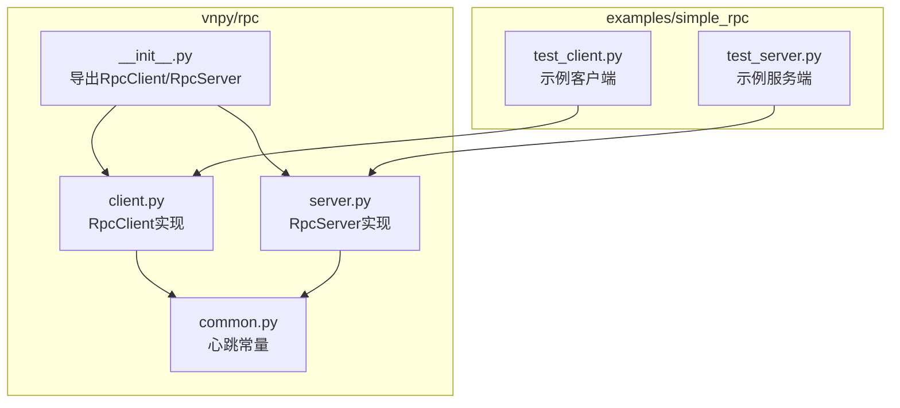
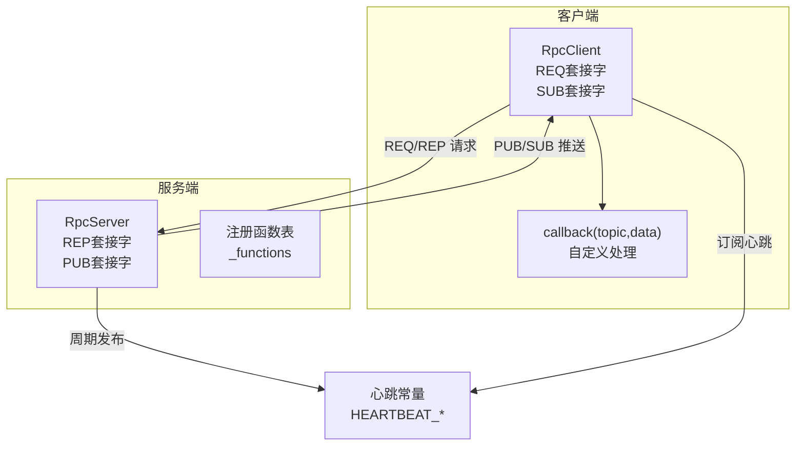
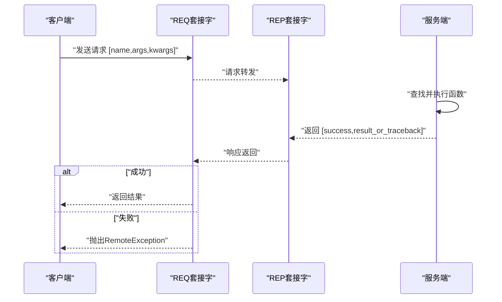
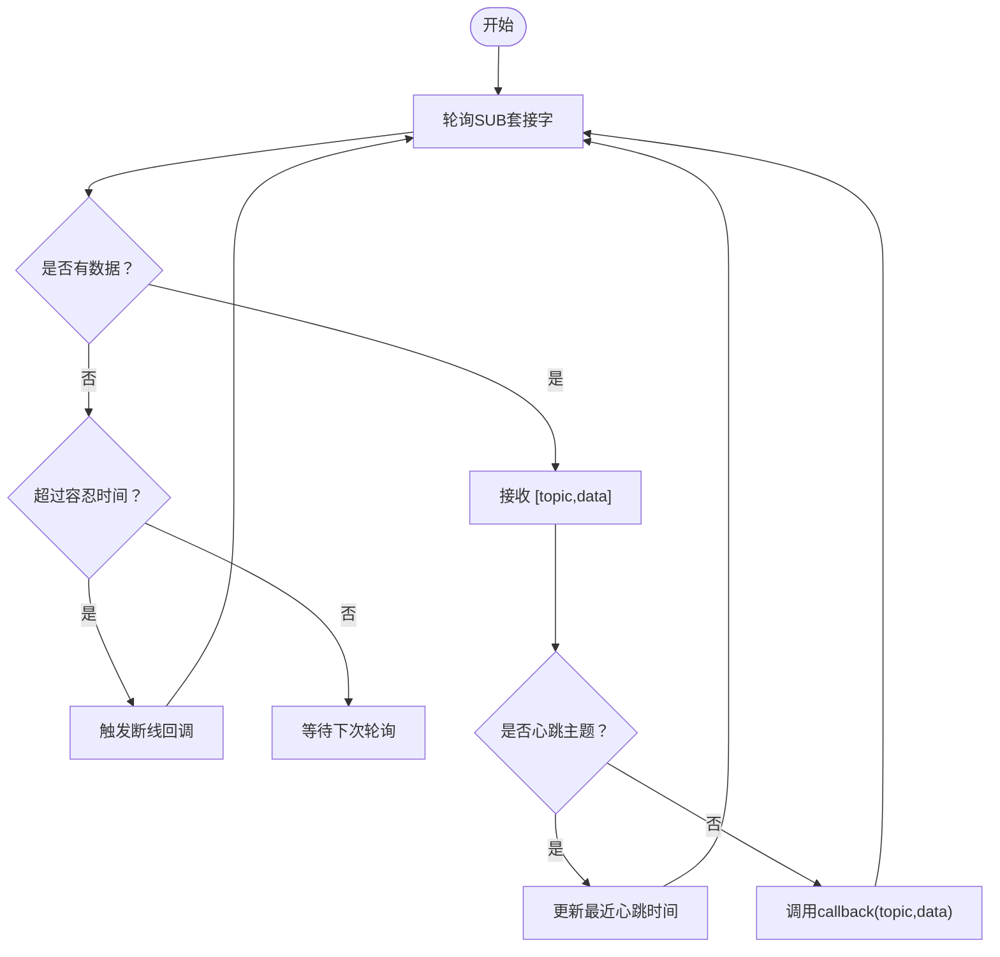
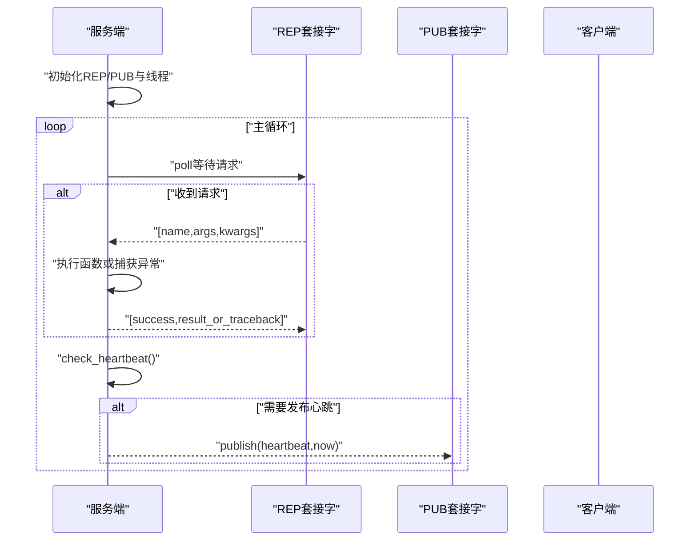
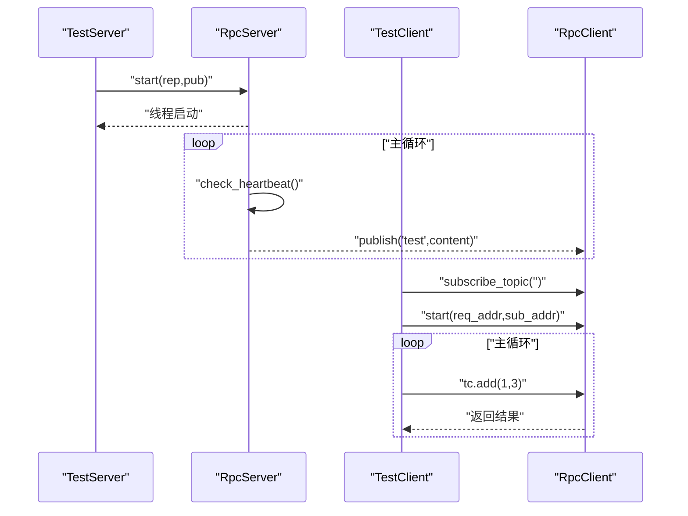
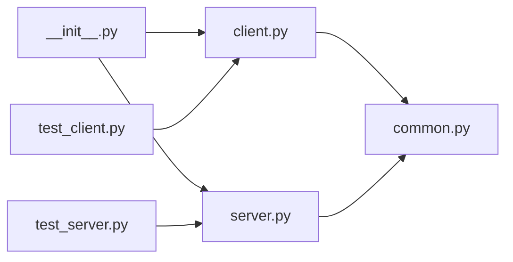

# RPC服务

<cite>
**本文引用的文件**
- [vnpy/rpc/__init__.py](file://vnpy/rpc/__init__.py)
- [vnpy/rpc/client.py](file://vnpy/rpc/client.py)
- [vnpy/rpc/server.py](file://vnpy/rpc/server.py)
- [vnpy/rpc/common.py](file://vnpy/rpc/common.py)
- [examples/simple_rpc/test_client.py](file://examples/simple_rpc/test_client.py)
- [examples/simple_rpc/test_server.py](file://examples/simple_rpc/test_server.py)
- [docs/community/app/rpc_service.md](file://docs/community/app/rpc_service.md)
- [vnpy/rpc/CLAUDE.md](file://vnpy/rpc/CLAUDE.md)
</cite>

## 目录
1. [引言](#引言)
2. [项目结构](#项目结构)
3. [核心组件](#核心组件)
4. [架构总览](#架构总览)
5. [详细组件分析](#详细组件分析)
6. [依赖关系分析](#依赖关系分析)
7. [性能考量](#性能考量)
8. [故障排查指南](#故障排查指南)
9. [结论](#结论)
10. [附录](#附录)

## 引言
本文件面向vnpy RPC服务的技术文档，围绕基于ZeroMQ实现的远程过程调用机制展开，重点覆盖以下方面：
- 同步请求-响应模式与异步推送-订阅模式的实现原理
- RpcClient与RpcServer类的接口定义、连接管理、消息序列化（使用pickle）
- 异常传播机制与断线检测策略
- 服务端暴露方法的装饰器使用方式与客户端调用远程方法的参数传递与返回值处理
- 结合examples/simple_rpc中的test_client.py与test_server.py，演示分布式部署场景下的实际应用
- 安全配置选项如身份验证、加密通信的扩展可能性
- 性能调优建议、常见网络问题排查方法及多客户端并发访问的处理能力

## 项目结构
vnpy的RPC模块位于vnpy/rpc目录，包含客户端、服务端与公共配置；示例位于examples/simple_rpc目录，演示了最小可用的客户端与服务端交互。

图表来源
- [vnpy/rpc/__init__.py](file://vnpy/rpc/__init__.py#L1-L9)
- [vnpy/rpc/client.py](file://vnpy/rpc/client.py#L1-L170)
- [vnpy/rpc/server.py](file://vnpy/rpc/server.py#L1-L141)
- [vnpy/rpc/common.py](file://vnpy/rpc/common.py#L1-L11)
- [examples/simple_rpc/test_client.py](file://examples/simple_rpc/test_client.py#L1-L35)
- [examples/simple_rpc/test_server.py](file://examples/simple_rpc/test_server.py#L1-L39)

章节来源
- [vnpy/rpc/__init__.py](file://vnpy/rpc/__init__.py#L1-L9)
- [vnpy/rpc/client.py](file://vnpy/rpc/client.py#L1-L170)
- [vnpy/rpc/server.py](file://vnpy/rpc/server.py#L1-L141)
- [vnpy/rpc/common.py](file://vnpy/rpc/common.py#L1-L11)
- [examples/simple_rpc/test_client.py](file://examples/simple_rpc/test_client.py#L1-L35)
- [examples/simple_rpc/test_server.py](file://examples/simple_rpc/test_server.py#L1-L39)

## 核心组件
- RpcClient：负责发起同步请求、订阅推送、心跳检测与断线回调
- RpcServer：负责注册可远程调用函数、处理请求、发布心跳与业务推送
- 公共配置：心跳主题、心跳间隔与容忍度

章节来源
- [vnpy/rpc/client.py](file://vnpy/rpc/client.py#L1-L170)
- [vnpy/rpc/server.py](file://vnpy/rpc/server.py#L1-L141)
- [vnpy/rpc/common.py](file://vnpy/rpc/common.py#L1-L11)

## 架构总览
RPC服务采用ZeroMQ的REQ/REP与PUB/SUB双通道：
- REQ/REP：客户端请求-服务端响应，用于同步调用
- PUB/SUB：服务端主动推送，客户端订阅，用于异步事件分发
- 心跳：服务端周期性发布心跳主题，客户端通过订阅检测连接健康

图表来源
- [vnpy/rpc/client.py](file://vnpy/rpc/client.py#L1-L170)
- [vnpy/rpc/server.py](file://vnpy/rpc/server.py#L1-L141)
- [vnpy/rpc/common.py](file://vnpy/rpc/common.py#L1-L11)

## 详细组件分析

### RpcClient 组件
- 角色与职责
  - 提供动态远程方法代理：通过__getattr__生成远程调用闭包，封装请求发送与响应解析
  - 订阅与回调：通过SUB套接字订阅主题，收到非心跳主题时调用callback进行处理
  - 心跳检测：基于心跳主题与容忍度判断连接是否断开
  - 生命周期管理：start/connect、stop/join、run工作线程
- 关键接口
  - start(req_address, sub_address)：建立REQ与SUB连接并启动工作线程
  - stop()/join()：停止与等待线程退出
  - subscribe_topic(topic)：订阅指定主题
  - callback(topic, data)：抽象方法，子类实现具体业务处理
  - on_disconnected()：断线回调，默认打印提示
- 同步调用流程
  - 客户端构造请求[name, args, kwargs]，发送至REP套接字
  - 客户端等待响应，超时则抛出RemoteException
  - 响应格式为[success, result_or_traceback]，成功返回结果，失败抛出RemoteException
- 异步推送流程
  - 客户端工作线程轮询SUB套接字
  - 若收到主题为心跳，则更新最近心跳时间
  - 若收到其他主题，则调用callback(topic, data)
- 断线检测
  - 工作线程以心跳容忍度为轮询超时，若超时未收到心跳则触发on_disconnected()

图表来源
- [vnpy/rpc/client.py](file://vnpy/rpc/client.py#L55-L87)
- [vnpy/rpc/server.py](file://vnpy/rpc/server.py#L95-L111)

图表来源
- [vnpy/rpc/client.py](file://vnpy/rpc/client.py#L128-L169)
- [vnpy/rpc/common.py](file://vnpy/rpc/common.py#L8-L11)

章节来源
- [vnpy/rpc/client.py](file://vnpy/rpc/client.py#L1-L170)

### RpcServer 组件
- 角色与职责
  - 注册函数：将可远程调用的函数登记到函数表
  - 处理请求：从REP套接字接收请求，执行函数并返回结果
  - 发布推送：通过PUB套接字发布业务主题消息
  - 心跳管理：周期性发布心跳主题
- 关键接口
  - start(rep_address, pub_address)：绑定REP与PUB地址并启动工作线程
  - stop()/join()：停止与等待线程退出
  - register(func)：注册函数
  - publish(topic, data)：发布主题消息
  - check_heartbeat()：按间隔发布心跳
- 请求处理流程
  - 从REP套接字接收请求[name, args, kwargs]
  - 查找函数并执行，捕获异常并返回traceback
  - 将结果以[success, result_or_traceback]发送回客户端
- 心跳发布
  - 服务端维护下一次心跳发布时间，到达时间点后发布心跳主题

图表来源
- [vnpy/rpc/server.py](file://vnpy/rpc/server.py#L83-L141)
- [vnpy/rpc/common.py](file://vnpy/rpc/common.py#L8-L11)

章节来源
- [vnpy/rpc/server.py](file://vnpy/rpc/server.py#L1-L141)

### 公共配置
- 心跳主题、心跳间隔、心跳容忍度
- 信号处理：允许Ctrl-C中断

章节来源
- [vnpy/rpc/common.py](file://vnpy/rpc/common.py#L1-L11)

### 示例：simple_rpc
- 服务端
  - 继承RpcServer，注册add函数
  - 启动后周期性publish业务主题
- 客户端
  - 继承RpcClient，实现callback处理订阅消息
  - 订阅空主题（全部主题）并发起远程调用

图表来源
- [examples/simple_rpc/test_server.py](file://examples/simple_rpc/test_server.py#L1-L39)
- [examples/simple_rpc/test_client.py](file://examples/simple_rpc/test_client.py#L1-L35)
- [vnpy/rpc/server.py](file://vnpy/rpc/server.py#L83-L141)
- [vnpy/rpc/client.py](file://vnpy/rpc/client.py#L128-L169)

章节来源
- [examples/simple_rpc/test_server.py](file://examples/simple_rpc/test_server.py#L1-L39)
- [examples/simple_rpc/test_client.py](file://examples/simple_rpc/test_client.py#L1-L35)

## 依赖关系分析
- 模块导出
  - __init__.py导出RpcClient与RpcServer，便于外部直接导入
- 组件耦合
  - RpcClient与RpcServer通过ZeroMQ套接字通信，解耦于具体业务
  - 服务端通过函数表管理可远程调用函数，客户端通过动态代理调用
- 外部依赖
  - pyzmq（ZeroMQ Python绑定）
  - pickle（对象序列化）

图表来源
- [vnpy/rpc/__init__.py](file://vnpy/rpc/__init__.py#L1-L9)
- [vnpy/rpc/client.py](file://vnpy/rpc/client.py#L1-L170)
- [vnpy/rpc/server.py](file://vnpy/rpc/server.py#L1-L141)
- [vnpy/rpc/common.py](file://vnpy/rpc/common.py#L1-L11)
- [examples/simple_rpc/test_client.py](file://examples/simple_rpc/test_client.py#L1-L35)
- [examples/simple_rpc/test_server.py](file://examples/simple_rpc/test_server.py#L1-L39)

章节来源
- [vnpy/rpc/__init__.py](file://vnpy/rpc/__init__.py#L1-L9)

## 性能考量
- 序列化开销
  - 使用pickle进行对象序列化，适合小中型对象；大对象传输会带来明显开销
- 并发与I/O
  - 采用REQ/REP与PUB/SUB双通道，配合线程模型实现异步I/O
  - 客户端与服务端均使用锁保护关键路径（如请求发送与发布）
- 超时与心跳
  - 客户端请求超时避免阻塞；服务端心跳用于检测连接健康
- 网络延迟
  - 网络延迟直接影响请求响应时间，建议优化网络拓扑与带宽

章节来源
- [vnpy/rpc/CLAUDE.md](file://vnpy/rpc/CLAUDE.md#L93-L105)
- [vnpy/rpc/client.py](file://vnpy/rpc/client.py#L55-L87)
- [vnpy/rpc/server.py](file://vnpy/rpc/server.py#L83-L141)

## 故障排查指南
- 连接问题
  - 地址格式与端口：确保REQ/REP与PUB/SUB地址正确绑定与连接
  - 防火墙与网络策略：确认端口放通与网络可达
- 超时与断线
  - 客户端请求超时：检查服务端负载与网络延迟
  - 心跳断线：检查服务端心跳发布频率与客户端容忍度
- 异常传播
  - 服务端异常会被序列化为traceback返回客户端，客户端抛出RemoteException
- 日志与监控
  - 服务端定期打印当前时间戳，便于观察运行状态
  - 客户端回调中打印订阅消息，便于调试

章节来源
- [vnpy/rpc/client.py](file://vnpy/rpc/client.py#L55-L87)
- [vnpy/rpc/server.py](file://vnpy/rpc/server.py#L95-L111)
- [examples/simple_rpc/test_server.py](file://examples/simple_rpc/test_server.py#L27-L39)
- [examples/simple_rpc/test_client.py](file://examples/simple_rpc/test_client.py#L17-L22)

## 结论
vnpy RPC服务以轻量级ZeroMQ为基础，提供了清晰的同步请求-响应与异步推送-订阅两类通信模式。通过函数注册与动态代理，实现了简洁易用的远程调用体验；通过心跳与断线回调，增强了连接健康监测能力。在生产环境中，建议结合网络安全策略与性能优化手段，确保稳定与高效。

## 附录

### 接口与使用要点
- 服务端暴露方法
  - 通过继承RpcServer并在构造函数中注册函数，或在子类中显式注册
  - 使用publish(topic, data)进行业务推送
- 客户端调用
  - 通过继承RpcClient，实现callback处理订阅消息
  - 使用subscribe_topic("")订阅全部主题
  - 通过动态代理tc.add(...)发起远程调用，注意超时参数与异常处理

章节来源
- [examples/simple_rpc/test_server.py](file://examples/simple_rpc/test_server.py#L1-L39)
- [examples/simple_rpc/test_client.py](file://examples/simple_rpc/test_client.py#L1-L35)
- [vnpy/rpc/server.py](file://vnpy/rpc/server.py#L116-L141)
- [vnpy/rpc/client.py](file://vnpy/rpc/client.py#L152-L169)

### 安全配置与扩展
- 当前限制
  - 无内置认证机制、无加密传输、无访问控制
- 建议措施
  - 使用VPN或专用网络隔离
  - 在服务端实现认证与授权逻辑
  - 限制可注册函数范围，仅暴露必要接口

章节来源
- [vnpy/rpc/CLAUDE.md](file://vnpy/rpc/CLAUDE.md#L106-L117)

### 分布式部署与多客户端并发
- 分布式场景
  - 服务端集中提供交易路由、行情数据推送、持仓资金查询等能力
  - 多客户端并发访问：服务端通过REP套接字逐条处理请求，客户端通过SUB订阅推送
- 并发与稳定性
  - 控制请求超时与心跳容忍度，避免长时间阻塞
  - 对大对象传输进行规避，改用共享存储或数据库

章节来源
- [docs/community/app/rpc_service.md](file://docs/community/app/rpc_service.md#L1-L111)
- [vnpy/rpc/CLAUDE.md](file://vnpy/rpc/CLAUDE.md#L118-L141)