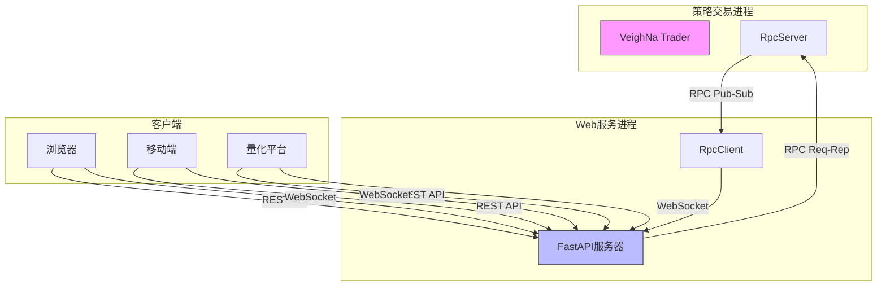
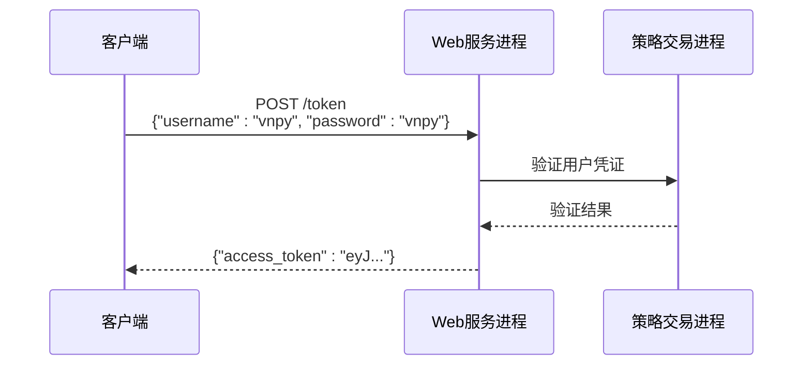
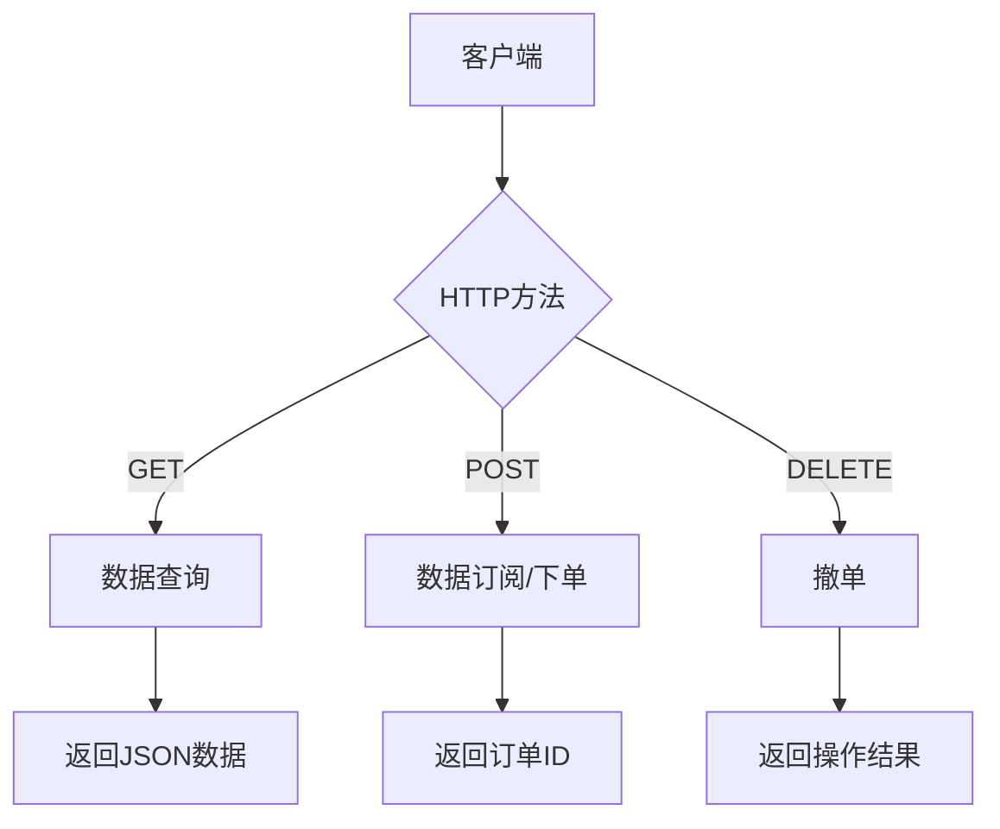
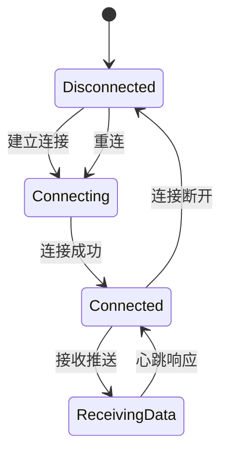
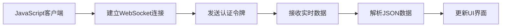
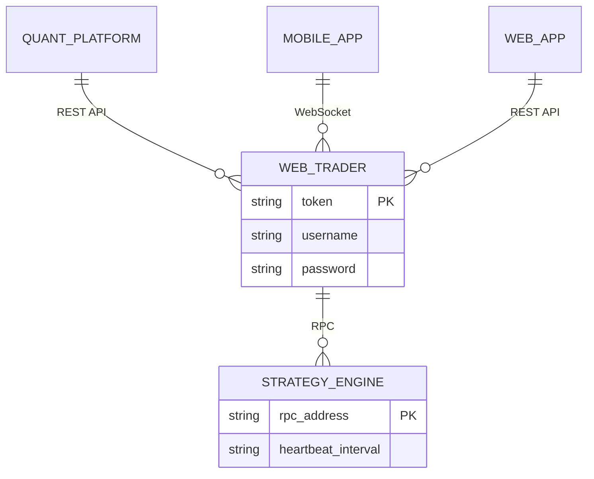

# Web交易接口

<cite>
**本文档引用文件**  
- [web_trader.md](file://docs/community/app/web_trader.md)
- [server.py](file://vnpy/rpc/server.py)
- [client.py](file://vnpy/rpc/client.py)
- [common.py](file://vnpy/rpc/common.py)
</cite>

## 目录
1. [简介](#简介)
2. [系统架构](#系统架构)
3. [认证机制](#认证机制)
4. [RESTful API规范](#restful-api规范)
5. [WebSocket接口](#websocket接口)
6. [错误码体系](#错误码体系)
7. [前端集成示例](#前端集成示例)
8. [外部系统集成](#外部系统集成)

## 简介
WebTrader是VeighNa量化交易平台的Web后端服务模块，为用户提供基于浏览器的交易管理功能。该模块采用FastAPI框架构建，支持RESTful主动请求和WebSocket被动数据推送两种通信模式，使用户无需依赖PyQt桌面客户端即可通过浏览器进行量化策略交易管理。

**Section sources**
- [web_trader.md](file://docs/community/app/web_trader.md#L1-L6)

## 系统架构

**Diagram sources**
- [web_trader.md](file://docs/community/app/web_trader.md#L9-L31)

WebTrader系统由两个独立进程组成：
- **策略交易进程**：运行VeighNa Trader，负责所有策略交易功能，启动RpcServer用于接收Web服务进程的调用
- **Web服务进程**：运行FastAPI服务器，负责对外提供Web访问服务，启动RpcClient用于调用策略交易进程功能

通信模式分为：
- **主动请求调用**：浏览器通过REST API发起请求 → Web服务进程 → RPC请求 → 策略交易进程 → 返回结果
- **被动数据推送**：浏览器建立WebSocket连接 → 策略交易进程通过RPC推送 → Web服务进程 → WebSocket推送至浏览器

**Section sources**
- [web_trader.md](file://docs/community/app/web_trader.md#L7-L31)

## 认证机制

WebTrader采用基于JWT的令牌认证机制，用户需先通过用户名密码获取访问令牌，后续所有API请求均需在HTTP头中携带该令牌。

### 令牌获取

**Diagram sources**
- [web_trader.md](file://docs/community/app/web_trader.md#L78-L93)

用户通过POST请求`/token`端点获取JWT令牌，后续请求需在Authorization头中携带`Bearer <token>`。

**Section sources**
- [web_trader.md](file://docs/community/app/web_trader.md#L78-L93)

## RESTful API规范

**Diagram sources**
- [web_trader.md](file://docs/community/app/web_trader.md#L96-L163)

### 主要端点
- `GET /contract`：查询合约信息
- `GET /account`：查询账户信息
- `GET /position`：查询持仓信息
- `GET /order`：查询委托信息
- `GET /trade`：查询成交信息
- `POST /tick/{symbol}`：订阅行情
- `POST /order`：提交委托
- `DELETE /order/{vt_orderid}`：撤销委托

**Section sources**
- [web_trader.md](file://docs/community/app/web_trader.md#L96-L163)

## WebSocket接口

**Diagram sources**
- [web_trader.md](file://docs/community/app/web_trader.md#L166-L177)
- [common.py](file://vnpy/rpc/common.py#L8-L10)

### 生命周期管理
- **连接建立**：通过`ws://127.0.0.1:8000/ws/?token=<token>`建立连接
- **心跳机制**：每10秒发送一次心跳，30秒未收到响应则判定连接断开
- **重连策略**：连接断开后立即尝试重连，指数退避避免频繁重试

**Section sources**
- [web_trader.md](file://docs/community/app/web_trader.md#L166-L182)
- [common.py](file://vnpy/rpc/common.py#L8-L10)

## 错误码体系
WebTrader遵循标准HTTP状态码规范：
- `200 OK`：请求成功
- `400 Bad Request`：请求参数错误
- `401 Unauthorized`：认证失败
- `404 Not Found`：资源不存在
- `500 Internal Server Error`：服务器内部错误

**Section sources**
- [web_trader.md](file://docs/community/app/web_trader.md)

## 前端集成示例

**Diagram sources**
- [web_trader.md](file://docs/community/app/web_trader.md#L166-L177)

JavaScript客户端可通过标准WebSocket API连接并消费实时数据流，实现行情、委托等数据的实时展示。

**Section sources**
- [web_trader.md](file://docs/community/app/web_trader.md#L166-L182)

## 外部系统集成

**Diagram sources**
- [web_trader.md](file://docs/community/app/web_trader.md)

WebTrader作为外部系统集成桥梁，支持量化平台、Web前端和移动端的无缝对接，通过标准化API实现与VeighNa核心交易引擎的交互。

**Section sources**
- [web_trader.md](file://docs/community/app/web_trader.md#L183-L187)