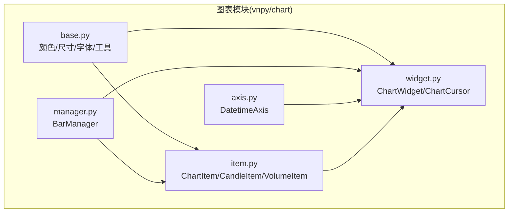
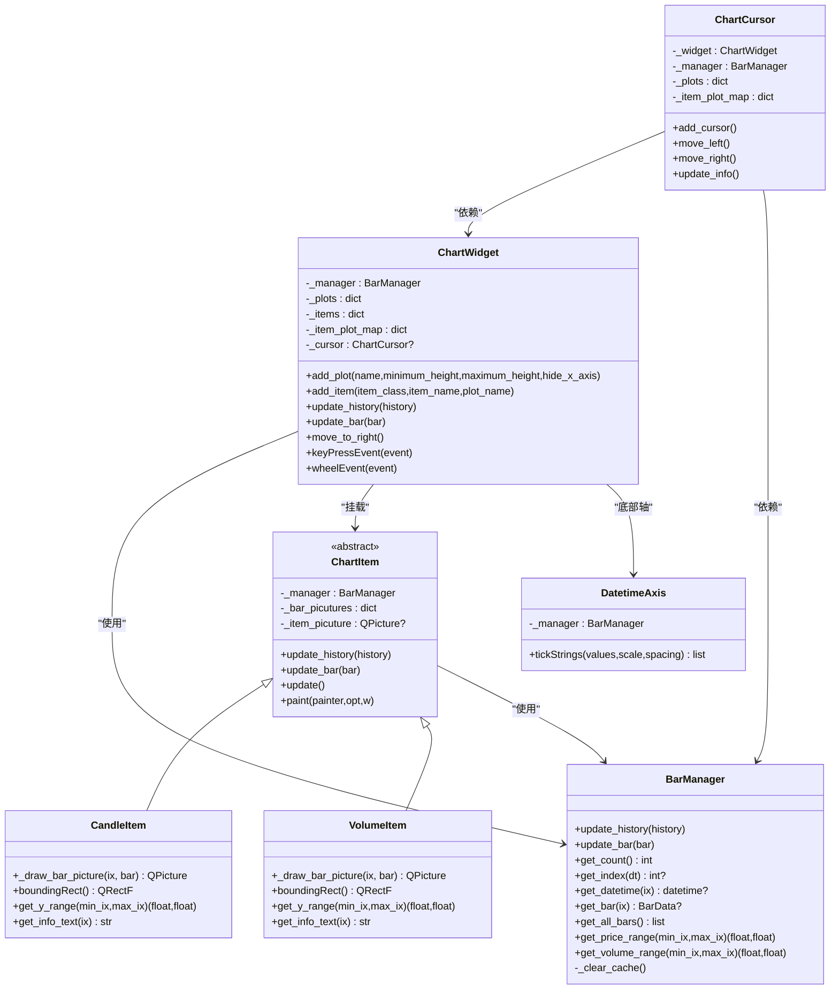
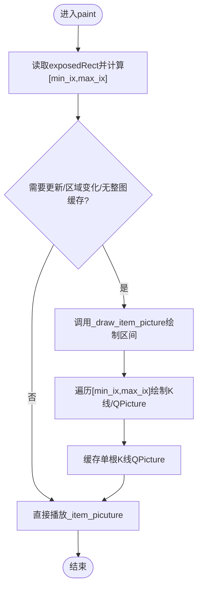
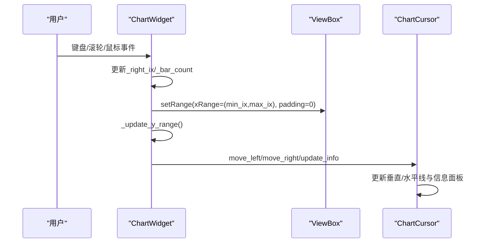
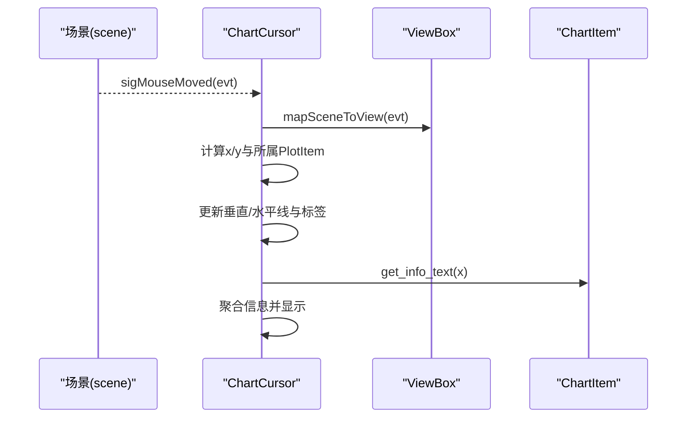
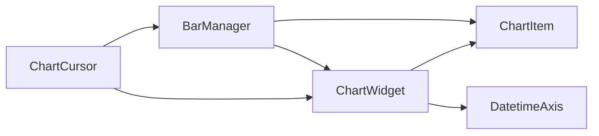

# 图表组件

<cite>
**本文引用的文件列表**
- [vnpy/chart/__init__.py](file://vnpy/chart/__init__.py)
- [vnpy/chart/base.py](file://vnpy/chart/base.py)
- [vnpy/chart/item.py](file://vnpy/chart/item.py)
- [vnpy/chart/widget.py](file://vnpy/chart/widget.py)
- [vnpy/chart/manager.py](file://vnpy/chart/manager.py)
- [vnpy/chart/axis.py](file://vnpy/chart/axis.py)
- [examples/candle_chart/run.py](file://examples/candle_chart/run.py)
- [docs/community/app/chart_wizard.md](file://docs/community/app/chart_wizard.md)
- [vnpy/trader/utility.py](file://vnpy/trader/utility.py)
</cite>

## 目录
1. [引言](#引言)
2. [项目结构](#项目结构)
3. [核心组件](#核心组件)
4. [架构总览](#架构总览)
5. [详细组件分析](#详细组件分析)
6. [依赖关系分析](#依赖关系分析)
7. [性能考量](#性能考量)
8. [故障排查指南](#故障排查指南)
9. [结论](#结论)
10. [附录](#附录)

## 引言
本文件面向Chart Wizard的UI组件，系统性说明基于PyQtGraph构建的高性能K线图表组件。内容覆盖CandleItem、VolumeItem等图形项的渲染机制，ChartWidget如何实现K线与技术指标的叠加显示；重点阐述大数据量下的性能优化策略（数据降采样、增量更新与视图范围动态加载）；交互功能（十字光标、区域缩放、拖拽平移）的实现方式；自定义技术指标绘制的扩展接口与TA-Lib集成路径；以及样式定制、主题切换与响应式布局的配置方法。

## 项目结构
Chart Wizard的图表模块位于vnpy/chart目录下，采用分层设计：
- 基础常量与工具：颜色、画笔宽度、字体、通用转换函数
- 数据管理：BarManager负责K线数据索引、缓存与范围查询
- 图形项：CandleItem与VolumeItem继承自ChartItem，实现K线蜡烛与成交量柱状图的绘制
- 视图与交互：ChartWidget封装PlotWidget，提供多子图布局、联动、缩放与十字光标
- 时间轴：DatetimeAxis将索引映射为人类可读的时间字符串
- 示例与文档：examples/candle_chart/run.py演示如何使用；chart_wizard.md提供用户操作说明

**图表来源**
- [vnpy/chart/base.py](file://vnpy/chart/base.py#L1-L22)
- [vnpy/chart/manager.py](file://vnpy/chart/manager.py#L1-L171)
- [vnpy/chart/item.py](file://vnpy/chart/item.py#L1-L334)
- [vnpy/chart/axis.py](file://vnpy/chart/axis.py#L1-L45)
- [vnpy/chart/widget.py](file://vnpy/chart/widget.py#L1-L557)

**章节来源**
- [vnpy/chart/__init__.py](file://vnpy/chart/__init__.py#L1-L10)
- [vnpy/chart/base.py](file://vnpy/chart/base.py#L1-L22)
- [vnpy/chart/manager.py](file://vnpy/chart/manager.py#L1-L171)
- [vnpy/chart/item.py](file://vnpy/chart/item.py#L1-L334)
- [vnpy/chart/axis.py](file://vnpy/chart/axis.py#L1-L45)
- [vnpy/chart/widget.py](file://vnpy/chart/widget.py#L1-L557)

## 核心组件
- BarManager：维护K线字典、索引映射、缓存价格/成交量范围，提供按索引范围查询价格区间与成交量区间的能力，支持增量更新与全量更新，并清理缓存。
- ChartItem：抽象基类，持有BarManager引用，维护每根K线的QPicture缓存与整图缓存，重写paint仅绘制可见区域，避免全量重绘。
- CandleItem：绘制K线蜡烛（影线+实体），根据涨跌设置不同画笔与刷子，提供边界矩形与Y轴范围查询、信息文本生成。
- VolumeItem：绘制成交量柱状图，依据涨跌决定颜色，提供边界矩形与Y轴范围查询、信息文本生成。
- ChartWidget：继承PlotWidget，管理多个PlotItem（子图）、多个ChartItem（K线/指标），提供add_plot/add_item、update_history/update_bar、移动到最右侧、键盘与滚轮交互、十字光标集成。
- ChartCursor：跨子图的十字光标，包含垂直/水平线、坐标标签、信息面板，监听场景鼠标移动事件，按当前鼠标位置更新各子图的光标与信息。
- DatetimeAxis：将索引转换为日期时间字符串，支持按刻度间距控制显示密度。

**章节来源**
- [vnpy/chart/manager.py](file://vnpy/chart/manager.py#L1-L171)
- [vnpy/chart/item.py](file://vnpy/chart/item.py#L1-L334)
- [vnpy/chart/widget.py](file://vnpy/chart/widget.py#L1-L557)
- [vnpy/chart/axis.py](file://vnpy/chart/axis.py#L1-L45)

## 架构总览
ChartWidget作为顶层容器，内部通过GraphicsLayout组织多个PlotItem（行情图、成交量图等），每个PlotItem内挂载一个或多个ChartItem（CandleItem、VolumeItem或自定义指标）。BarManager统一管理数据与索引，ChartItem负责将数据转为QPicture缓存，仅绘制可见区域，显著提升渲染性能。DatetimeAxis将索引映射为时间字符串，配合ChartWidget的键盘/滚轮事件实现平移与缩放。ChartCursor在所有PlotItem的ViewBox上叠加十字光标与信息面板，实现跨图联动。

**图表来源**
- [vnpy/chart/manager.py](file://vnpy/chart/manager.py#L1-L171)
- [vnpy/chart/item.py](file://vnpy/chart/item.py#L1-L334)
- [vnpy/chart/widget.py](file://vnpy/chart/widget.py#L1-L557)
- [vnpy/chart/axis.py](file://vnpy/chart/axis.py#L1-L45)

## 详细组件分析

### CandleItem与VolumeItem渲染机制
- 继承关系：两者均继承自ChartItem，复用其增量绘制与可见区域裁剪逻辑。
- 绘制流程：
  - paint接收QStyleOptionGraphicsItem的exposedRect，计算可见索引区间[min_ix, max_ix]。
  - 若需要更新或区域变化，则调用_draw_item_picture，逐个绘制该区间的K线/QPicture。
  - 每根K线的QPicture被缓存至_bar_picutures，避免重复绘制。
  - 整体图的QPicture缓存至_item_picuture，直接播放以完成绘制。
- 颜色与样式：依据涨跌选择不同画笔/刷子；BAR_WIDTH控制蜡烛实体宽度；PEN_WIDTH控制线条宽度。
- Y轴范围：CandleItem返回价格范围，VolumeItem返回成交量范围；支持按可视范围动态查询。
- 信息文本：CandleItem返回OHLC等信息，VolumeItem返回成交量信息。

**图表来源**
- [vnpy/chart/item.py](file://vnpy/chart/item.py#L107-L158)
- [vnpy/chart/item.py](file://vnpy/chart/item.py#L168-L266)
- [vnpy/chart/item.py](file://vnpy/chart/item.py#L268-L334)

**章节来源**
- [vnpy/chart/item.py](file://vnpy/chart/item.py#L1-L334)

### ChartWidget：多子图与交互
- 多子图：add_plot创建PlotItem，设置右轴、隐藏左轴、启用裁剪、设置最小高度、最大高度、隐藏X轴等；首个PlotItem作为基准，后续PlotItem通过setXLink与之联动，保证X轴同步。
- 数据更新：update_history与update_bar分别处理批量与单条增量更新；随后更新各PlotItem的limits与可视范围，并将光标移动到最右侧。
- 缩放与平移：
  - 键盘：左右移动、上下缩放（改变可见K线数量）
  - 滚轮：向上放大、向下缩小
  - 鼠标拖拽：通过PyQtGraph的ViewBox默认行为实现横向平移
- 十字光标：add_cursor创建ChartCursor，绑定场景sigMouseMoved信号，跨子图显示垂直/水平线与信息面板。

**图表来源**
- [vnpy/chart/widget.py](file://vnpy/chart/widget.py#L206-L322)
- [vnpy/chart/widget.py](file://vnpy/chart/widget.py#L324-L557)

**章节来源**
- [vnpy/chart/widget.py](file://vnpy/chart/widget.py#L1-L557)

### ChartCursor：跨图十字光标
- 初始化：为每个PlotItem的ViewBox创建垂直/水平无限线，创建Y轴标签、X轴时间标签、信息面板TextItem。
- 鼠标移动：监听sigMouseMoved，定位当前鼠标所在PlotItem，计算索引x与y，仅在目标PlotItem显示水平线。
- 标签与信息：Y轴标签显示数值，X轴标签显示时间；信息面板聚合各ChartItem的get_info_text结果，按PlotItem分组显示。
- 增量移动：支持左右按键移动光标，自动更新Y值与标签。

**图表来源**
- [vnpy/chart/widget.py](file://vnpy/chart/widget.py#L324-L557)

**章节来源**
- [vnpy/chart/widget.py](file://vnpy/chart/widget.py#L324-L557)

### DatetimeAxis：时间轴标签
- 将索引映射为日期时间字符串，按刻度间距控制显示密度；当间距小于1时不显示标签，避免密集显示。
- 支持按小时显示完整时间，否则仅显示日期。

**章节来源**
- [vnpy/chart/axis.py](file://vnpy/chart/axis.py#L1-L45)

### BarManager：数据与范围缓存
- 索引映射：维护datetime->index与index->datetime双向映射，支持按时间查询索引与按索引查询时间。
- 范围缓存：对指定索引范围的价格与成交量范围进行缓存，避免重复扫描；在数据更新后清理缓存。
- 查询接口：按索引范围查询价格/成交量的min/max，供ChartItem与ChartWidget动态调整Y轴范围。

**章节来源**
- [vnpy/chart/manager.py](file://vnpy/chart/manager.py#L1-L171)

### 示例与使用
- 示例run.py展示了如何创建ChartWidget、添加行情与成交量子图、挂载CandleItem与VolumeItem、添加十字光标、加载历史数据并增量推送最新K线。

**章节来源**
- [examples/candle_chart/run.py](file://examples/candle_chart/run.py#L1-L44)

## 依赖关系分析
- 组件耦合：
  - ChartItem依赖BarManager进行数据访问与范围查询
  - ChartWidget依赖BarManager进行数据更新与范围限制，依赖DatetimeAxis提供X轴时间标签
  - ChartCursor依赖ChartWidget与BarManager进行位置与信息更新
- 外部依赖：
  - PyQtGraph用于绘图与交互（PlotWidget、PlotItem、ViewBox、InfiniteLine、TextItem、AxisItem等）
  - Qt绘图与事件系统（QPainter、QPicture、QPen、QBrush、QFont等）

**图表来源**
- [vnpy/chart/manager.py](file://vnpy/chart/manager.py#L1-L171)
- [vnpy/chart/item.py](file://vnpy/chart/item.py#L1-L334)
- [vnpy/chart/widget.py](file://vnpy/chart/widget.py#L1-L557)
- [vnpy/chart/axis.py](file://vnpy/chart/axis.py#L1-L45)

**章节来源**
- [vnpy/chart/manager.py](file://vnpy/chart/manager.py#L1-L171)
- [vnpy/chart/item.py](file://vnpy/chart/item.py#L1-L334)
- [vnpy/chart/widget.py](file://vnpy/chart/widget.py#L1-L557)
- [vnpy/chart/axis.py](file://vnpy/chart/axis.py#L1-L45)

## 性能考量
- 可见区域裁剪与增量绘制
  - ChartItem重写paint，仅绘制exposedRect对应的索引区间，避免全量重绘
  - 使用QPicture缓存单根K线与整图，减少重复绘制成本
- 数据范围缓存
  - BarManager对指定索引范围的价格/成交量范围进行缓存，降低频繁查询开销
- 视图范围动态更新
  - ChartWidget在X轴范围变化时，仅查询可视范围内的Y轴范围并设置PlotItem的yRange，避免全量扫描
- 渲染选项优化
  - 设置ItemUsesExtendedStyleOption，结合QPicture播放，进一步提升绘制效率
- 降采样与抗锯齿
  - PlotItem启用setDownsampling(mode="peak")，对大量数据进行降采样，提高交互流畅度
  - 全局开启抗锯齿，改善视觉质量
- 增量更新
  - update_bar仅更新单根K线，触发对应ChartItem的增量绘制，避免全量重建

**章节来源**
- [vnpy/chart/item.py](file://vnpy/chart/item.py#L107-L158)
- [vnpy/chart/manager.py](file://vnpy/chart/manager.py#L93-L153)
- [vnpy/chart/widget.py](file://vnpy/chart/widget.py#L70-L113)
- [vnpy/chart/widget.py](file://vnpy/chart/widget.py#L206-L241)

## 故障排查指南
- 十字光标不显示或不更新
  - 检查是否已调用add_cursor创建ChartCursor
  - 确认场景sigMouseMoved信号已连接到ChartCursor
  - 确保BarManager有数据且get_count()大于0
- 缩放/平移无效
  - 确认ChartWidget的ViewBox未禁用鼠标交互（默认x=True,y=False）
  - 检查键盘事件与滚轮事件是否被正确转发
- Y轴范围异常
  - 确认ChartWidget在X轴变化后调用了_update_y_range
  - 检查ChartItem的get_y_range实现是否正确
- 样式与主题问题
  - 颜色与字体来自base.py，若需修改请在相应位置调整
  - 字体大小与轴宽通过NORMAL_FONT与AXIS_WIDTH控制
- 用户交互说明
  - 文档chart_wizard.md提供了鼠标拖拽平移与滚轮缩放的操作说明

**章节来源**
- [vnpy/chart/widget.py](file://vnpy/chart/widget.py#L324-L557)
- [vnpy/chart/base.py](file://vnpy/chart/base.py#L1-L22)
- [docs/community/app/chart_wizard.md](file://docs/community/app/chart_wizard.md#L65-L71)

## 结论
Chart Wizard通过ChartItem的增量绘制与QPicture缓存、BarManager的数据索引与范围缓存、ChartWidget的多子图联动与动态范围更新，实现了高性能的K线与技术指标可视化。结合PyQtGraph的降采样与抗锯齿能力，可在大数据量场景下保持流畅的交互体验。十字光标与信息面板增强了用户定位与分析能力。通过扩展ChartItem接口与BarManager的数据接入，可轻松集成TA-Lib等外部指标库，实现丰富的技术分析功能。

## 附录

### 自定义技术指标绘制与扩展接口
- 扩展ChartItem
  - 新建类继承ChartItem，实现以下方法：
    - _draw_bar_picture(ix, bar)：绘制单根K线的QPicture
    - boundingRect()：返回该指标的边界矩形
    - get_y_range(min_ix, max_ix)：返回可视范围内Y轴范围
    - get_info_text(ix)：返回光标悬停时的信息文本
  - 在ChartWidget中通过add_item注册并挂载到指定PlotItem
- 接入TA-Lib计算结果
  - 使用vnpy/trader/utility.py中的技术分析函数（如RSI、ATR、MACD等），返回numpy数组或单值
  - 将TA-Lib结果转换为与K线对齐的序列，作为自定义指标数据源
  - 在自定义ChartItem中，从BarManager获取对应索引的数据，绘制指标曲线或柱状图
- 注意事项
  - 保持与BarManager索引一致，避免时间错位
  - 对于长序列，优先使用降采样或分段绘制，避免一次性绘制过多点
  - 利用get_y_range按可视范围动态计算Y轴范围，提升性能

**章节来源**
- [vnpy/chart/item.py](file://vnpy/chart/item.py#L1-L167)
- [vnpy/chart/widget.py](file://vnpy/chart/widget.py#L114-L131)
- [vnpy/trader/utility.py](file://vnpy/trader/utility.py#L744-L1116)

### 样式定制、主题切换与响应式布局
- 样式定制
  - 颜色与画笔：在base.py中调整UP_COLOR/DOWN_COLOR/BAR_WIDTH/PEN_WIDTH等参数
  - 字体：通过NORMAL_FONT统一设置，影响轴标签与信息面板
  - 轴宽：AXIS_WIDTH控制Y轴宽度
- 主题切换
  - 当前模块未内置主题切换逻辑，可通过修改base.py中的颜色常量实现浅色/深色主题
- 响应式布局
  - 子图高度：add_plot支持minimum_height与maximum_height，实现不同分辨率下的高度适配
  - X轴隐藏：hide_x_axis可隐藏底部时间轴，适合紧凑布局
  - 右轴显示：默认显示右侧Y轴，便于多指标叠加时区分

**章节来源**
- [vnpy/chart/base.py](file://vnpy/chart/base.py#L1-L22)
- [vnpy/chart/widget.py](file://vnpy/chart/widget.py#L62-L113)
- [vnpy/chart/axis.py](file://vnpy/chart/axis.py#L1-L45)