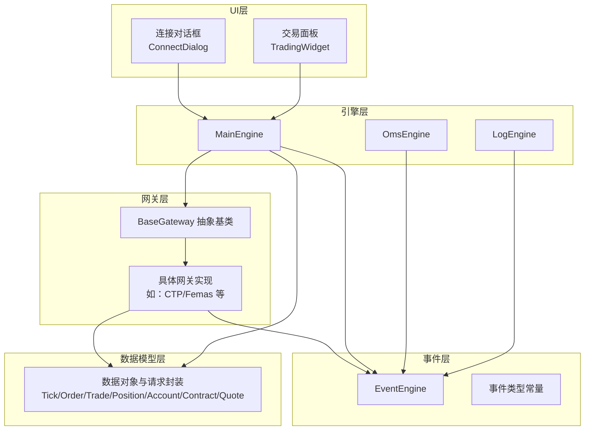
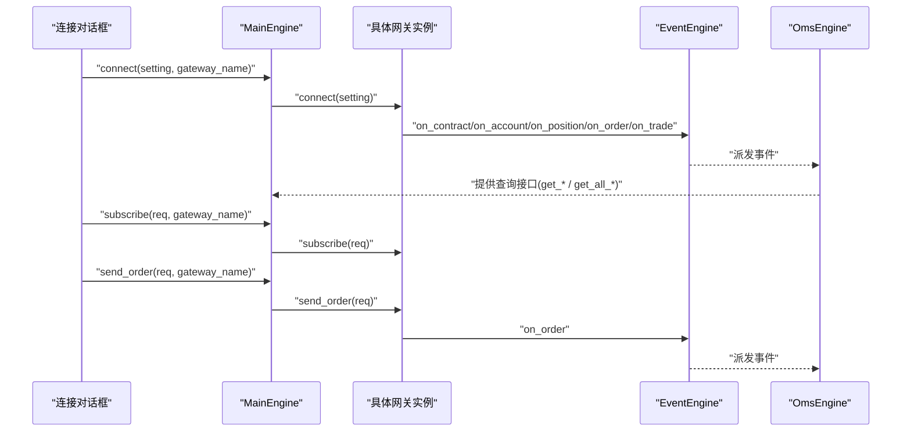
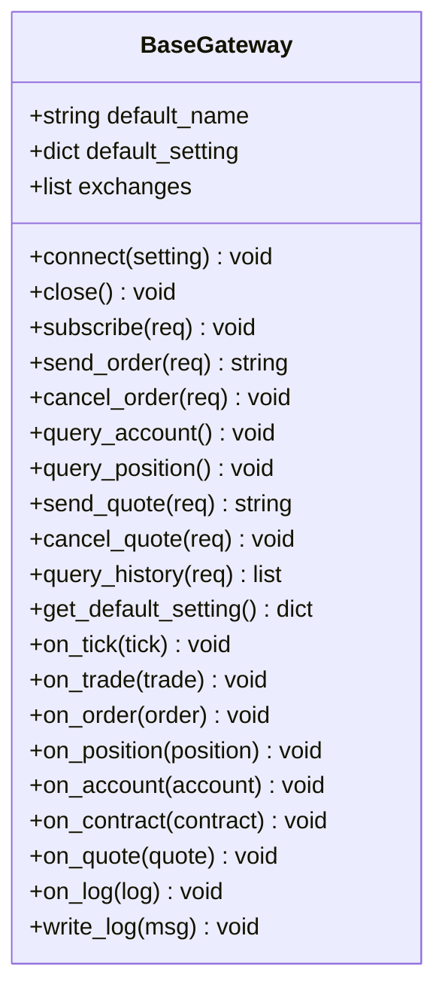
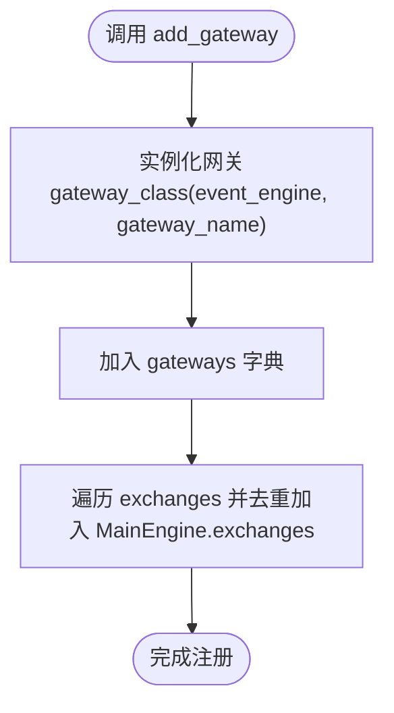
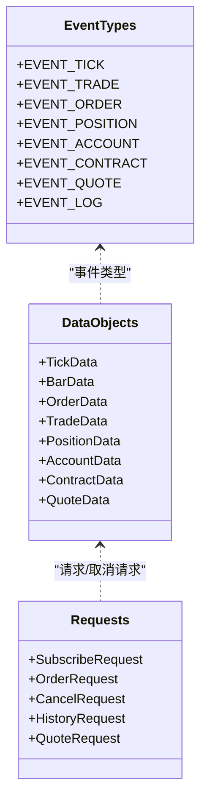
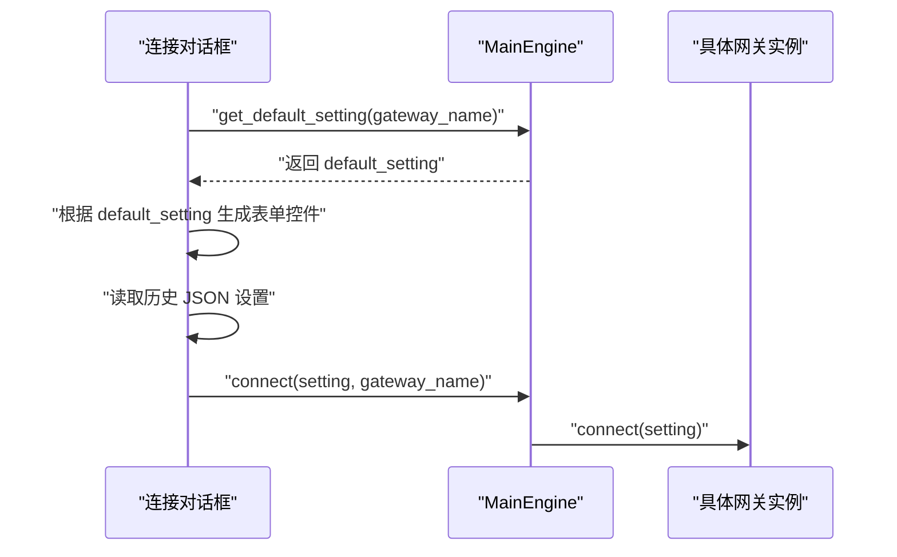
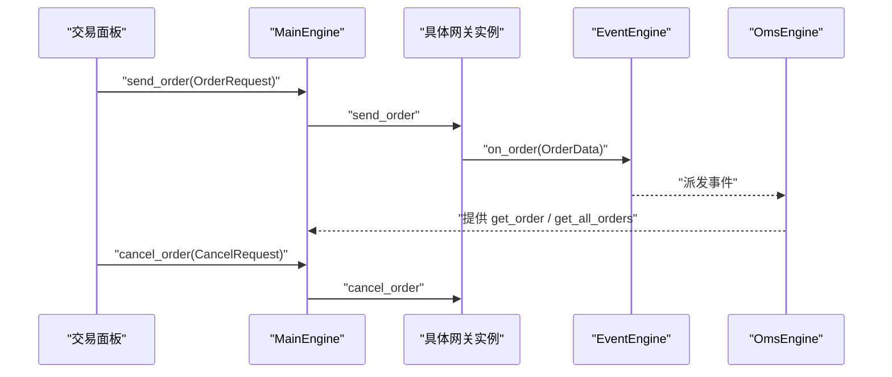
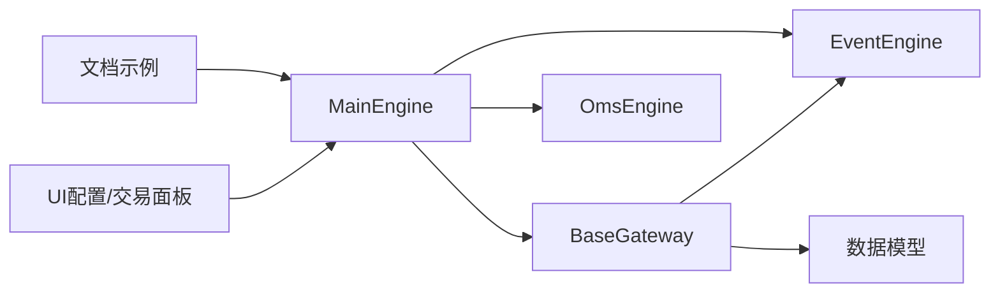

# 交易接口集成

<cite>
**本文引用的文件列表**
- [vnpy/trader/gateway.py](file://vnpy/trader/gateway.py)
- [vnpy/trader/engine.py](file://vnpy/trader/engine.py)
- [vnpy/trader/object.py](file://vnpy/trader/object.py)
- [vnpy/trader/event.py](file://vnpy/trader/event.py)
- [vnpy/trader/ui/widget.py](file://vnpy/trader/ui/widget.py)
- [docs/community/info/gateway.md](file://docs/community/info/gateway.md)
</cite>

## 目录
1. [引言](#引言)
2. [项目结构](#项目结构)
3. [核心组件](#核心组件)
4. [架构总览](#架构总览)
5. [详细组件分析](#详细组件分析)
6. [依赖关系分析](#依赖关系分析)
7. [性能与可靠性考量](#性能与可靠性考量)
8. [故障排查指南](#故障排查指南)
9. [结论](#结论)
10. [附录](#附录)

## 引言
本指南面向需要接入新交易所或交易系统的开发者，系统性讲解vnpy交易接口集成的技术规范与最佳实践。重点围绕BaseGateway抽象基类的方法契约、回调机制、线程安全与非阻塞设计、自动重连策略，以及MainEngine的网关注册与管理流程；并通过连接配置界面代码展示如何定义default_setting以支持用户友好的参数输入；最后给出实现期货交易接口的典型示例，覆盖行情订阅、下单撤单、持仓查询等完整业务流程。

## 项目结构
vnpy的核心交易层由“网关层”“引擎层”“事件层”“数据模型层”“UI配置层”构成。其中：
- 网关层：定义BaseGateway抽象基类及各具体网关实现（如CTP、飞马等），负责与外部交易系统对接。
- 引擎层：MainEngine作为平台中枢，负责网关注册、命令分发、事件路由与持久化。
- 事件层：统一事件类型常量与事件引擎，支撑异步回调与解耦。
- 数据模型层：定义Tick、Order、Trade、Position、Account、Contract、Quote等数据对象及其请求/取消请求封装。
- UI配置层：提供连接对话框与交易面板，基于网关default_setting自动生成参数输入表单。

图表来源
- [vnpy/trader/engine.py](file://vnpy/trader/engine.py#L73-L303)
- [vnpy/trader/gateway.py](file://vnpy/trader/gateway.py#L33-L273)
- [vnpy/trader/event.py](file://vnpy/trader/event.py#L1-L15)
- [vnpy/trader/object.py](file://vnpy/trader/object.py#L1-L428)
- [vnpy/trader/ui/widget.py](file://vnpy/trader/ui/widget.py#L599-L701)

章节来源
- [vnpy/trader/engine.py](file://vnpy/trader/engine.py#L73-L303)
- [vnpy/trader/gateway.py](file://vnpy/trader/gateway.py#L33-L273)
- [vnpy/trader/event.py](file://vnpy/trader/event.py#L1-L15)
- [vnpy/trader/object.py](file://vnpy/trader/object.py#L1-L428)
- [vnpy/trader/ui/widget.py](file://vnpy/trader/ui/widget.py#L599-L701)

## 核心组件
- BaseGateway：定义网关必须实现的抽象方法与回调机制，确保线程安全、非阻塞、自动重连等约束。
- MainEngine：负责网关注册、命令转发、日志记录与资源关闭。
- 事件系统：统一事件类型常量与事件引擎，支撑异步回调。
- 数据模型：封装Tick、Order、Trade、Position、Account、Contract、Quote等数据对象，以及SubscribeRequest、OrderRequest、CancelRequest、HistoryRequest、QuoteRequest等请求封装。
- UI配置：根据网关default_setting动态生成参数输入表单，支持密码隐藏、类型校验与历史值恢复。

章节来源
- [vnpy/trader/gateway.py](file://vnpy/trader/gateway.py#L33-L273)
- [vnpy/trader/engine.py](file://vnpy/trader/engine.py#L73-L303)
- [vnpy/trader/event.py](file://vnpy/trader/event.py#L1-L15)
- [vnpy/trader/object.py](file://vnpy/trader/object.py#L1-L428)
- [vnpy/trader/ui/widget.py](file://vnpy/trader/ui/widget.py#L599-L701)

## 架构总览
下面的序列图展示了从UI到MainEngine再到具体网关的调用链路，以及网关通过回调推送数据到事件引擎的路径。

图表来源
- [vnpy/trader/engine.py](file://vnpy/trader/engine.py#L213-L244)
- [vnpy/trader/gateway.py](file://vnpy/trader/gateway.py#L93-L158)
- [vnpy/trader/event.py](file://vnpy/trader/event.py#L1-L15)
- [vnpy/trader/object.py](file://vnpy/trader/object.py#L111-L176)

## 详细组件分析

### BaseGateway 抽象基类与回调机制
- 技术规范要点
  - 线程安全：所有方法需线程安全，避免共享可变状态。
  - 非阻塞：所有公共方法不得阻塞主线程。
  - 自动重连：连接断开时应自动重连。
  - 回调职责：必须手动触发on_tick、on_trade、on_order、on_position、on_account、on_contract等回调。
  - 数据不可变：传递给回调的数据对象不应被后续修改，必要时使用浅拷贝。
- 关键抽象方法
  - connect(setting): 建立连接、查询合约、账户资产、持仓、委托与成交，并写入日志。
  - close(): 关闭连接。
  - subscribe(req): 订阅行情。
  - send_order(req): 创建订单、分配唯一订单号、发送至服务器、设置状态、回调on_order并返回vt_orderid。
  - cancel_order(req): 发送撤单请求。
  - query_account()/query_position(): 查询账户与持仓。
  - send_quote()/cancel_quote(): 报价相关（默认空实现，可按需扩展）。
  - query_history(req): 查询K线历史（默认空实现）。
- 默认配置与交换所支持
  - default_setting: 网关参数字典，供UI生成表单。
  - exchanges: 网关支持的交易所集合。
  - get_default_setting(): 返回default_setting。

图表来源
- [vnpy/trader/gateway.py](file://vnpy/trader/gateway.py#L33-L273)

章节来源
- [vnpy/trader/gateway.py](file://vnpy/trader/gateway.py#L33-L273)

### MainEngine 的网关注册与管理
- add_gateway(gateway_class, gateway_name): 实例化网关并加入字典，同时收集其支持的交易所。
- connect/subscribe/send_order/cancel_order/send_quote/cancel_quote/query_history: 将上层请求转发至对应网关，并写入日志。
- get_gateway/get_engine/get_default_setting/get_all_gateway_names/get_all_exchanges: 提供查询与管理能力。
- close(): 停止事件引擎，依次关闭各引擎与网关。

图表来源
- [vnpy/trader/engine.py](file://vnpy/trader/engine.py#L102-L118)

章节来源
- [vnpy/trader/engine.py](file://vnpy/trader/engine.py#L73-L303)

### 事件系统与数据模型
- 事件类型常量：统一定义tick、trade、order、position、account、contract、quote、log等事件前缀。
- 数据对象：TickData、BarData、OrderData、TradeData、PositionData、AccountData、ContractData、QuoteData等，均包含vt_symbol/vt_orderid/vt_tradeid/vt_accountid/vt_positionid/vt_quoteid等全局唯一标识。
- 请求封装：SubscribeRequest、OrderRequest、CancelRequest、HistoryRequest、QuoteRequest，提供vt_symbol与便捷工厂方法（如OrderRequest.create_order_data）。

图表来源
- [vnpy/trader/event.py](file://vnpy/trader/event.py#L1-L15)
- [vnpy/trader/object.py](file://vnpy/trader/object.py#L1-L428)

章节来源
- [vnpy/trader/event.py](file://vnpy/trader/event.py#L1-L15)
- [vnpy/trader/object.py](file://vnpy/trader/object.py#L1-L428)

### 连接配置界面与 default_setting
- UI通过MainEngine.get_default_setting(gateway_name)读取网关的default_setting，动态生成表单控件（文本框、下拉框、密码框等），并支持历史值恢复与类型校验。
- 用户点击“连接”后，UI收集表单值构造setting字典，保存到本地JSON文件，并调用MainEngine.connect(setting, gateway_name)。

图表来源
- [vnpy/trader/ui/widget.py](file://vnpy/trader/ui/widget.py#L599-L701)
- [vnpy/trader/engine.py](file://vnpy/trader/engine.py#L186-L194)

章节来源
- [vnpy/trader/ui/widget.py](file://vnpy/trader/ui/widget.py#L599-L701)
- [vnpy/trader/engine.py](file://vnpy/trader/engine.py#L186-L194)

### 典型实现流程：期货交易接口（订阅/下单/撤单/查询）
- 行情订阅
  - UI层构造SubscribeRequest并调用MainEngine.subscribe。
  - MainEngine转发至具体网关的subscribe。
  - 网关内部建立订阅通道，收到行情后调用on_tick推送。
- 下单流程
  - UI层构造OrderRequest并调用MainEngine.send_order。
  - MainEngine转发至网关send_order，网关创建OrderData、分配唯一订单号、发送至服务器、设置状态为SUBMITTING并回调on_order。
  - OmsEngine接收事件并维护内存状态。
- 撤单流程
  - UI层构造CancelRequest并调用MainEngine.cancel_order。
  - MainEngine转发至网关cancel_order，网关内部处理撤单逻辑。
- 持仓/账户查询
  - 网关在connect阶段查询账户资产、持仓、委托与成交，并通过回调写入事件系统。
  - 上层可通过MainEngine.get_account/get_position等接口获取最新数据。

图表来源
- [vnpy/trader/engine.py](file://vnpy/trader/engine.py#L233-L254)
- [vnpy/trader/gateway.py](file://vnpy/trader/gateway.py#L196-L221)
- [vnpy/trader/object.py](file://vnpy/trader/object.py#L111-L176)

章节来源
- [vnpy/trader/engine.py](file://vnpy/trader/engine.py#L213-L254)
- [vnpy/trader/gateway.py](file://vnpy/trader/gateway.py#L196-L221)
- [vnpy/trader/object.py](file://vnpy/trader/object.py#L111-L176)

## 依赖关系分析
- BaseGateway依赖事件系统与数据模型，通过事件引擎分发回调。
- MainEngine聚合多个引擎（如OmsEngine、LogEngine），并持有Gateways字典。
- UI层依赖MainEngine提供的查询与管理接口，以及网关的default_setting。
- 文档示例展示了如何通过add_gateway方式加载具体网关（如CTP/Femas）。

图表来源
- [vnpy/trader/gateway.py](file://vnpy/trader/gateway.py#L33-L273)
- [vnpy/trader/engine.py](file://vnpy/trader/engine.py#L73-L303)
- [vnpy/trader/object.py](file://vnpy/trader/object.py#L1-L428)
- [docs/community/info/gateway.md](file://docs/community/info/gateway.md#L1-L20)

章节来源
- [vnpy/trader/gateway.py](file://vnpy/trader/gateway.py#L33-L273)
- [vnpy/trader/engine.py](file://vnpy/trader/engine.py#L73-L303)
- [vnpy/trader/object.py](file://vnpy/trader/object.py#L1-L428)
- [docs/community/info/gateway.md](file://docs/community/info/gateway.md#L1-L20)

## 性能与可靠性考量
- 线程安全与非阻塞
  - 所有公共方法必须线程安全且非阻塞，避免阻塞事件引擎或UI线程。
  - 使用事件引擎进行异步回调，不直接在IO线程中执行耗时操作。
- 自动重连
  - 在连接断开时主动尝试重连，保持服务可用性。
  - 对网络异常与心跳丢失进行检测与告警。
- 数据一致性
  - 回调数据对象不可变，必要时复制一份再传递，防止竞态条件。
- 资源管理
  - MainEngine在退出时先停止事件引擎，再依次关闭引擎与网关，确保有序释放。

章节来源
- [vnpy/trader/gateway.py](file://vnpy/trader/gateway.py#L33-L110)
- [vnpy/trader/engine.py](file://vnpy/trader/engine.py#L289-L303)

## 故障排查指南
- 无法找到网关
  - 检查是否已通过add_gateway注册，或MainEngine.get_gateway返回None。
  - 参考：MainEngine.get_gateway与get_all_gateway_names。
- 参数输入错误
  - UI会根据default_setting生成表单并进行类型转换，若转换失败会回退为默认值。
  - 参考：ConnectDialog中对字段类型的处理与保存。
- 日志定位
  - MainEngine与LogEngine会统一记录连接、订阅、下单、撤单等操作日志，便于问题追踪。
  - 参考：MainEngine.write_log与LogEngine.process_log_event。
- 历史数据查询
  - 若网关未实现query_history，默认返回空列表；请确认网关是否支持历史数据。
  - 参考：BaseGateway.query_history。

章节来源
- [vnpy/trader/engine.py](file://vnpy/trader/engine.py#L160-L185)
- [vnpy/trader/ui/widget.py](file://vnpy/trader/ui/widget.py#L667-L690)
- [vnpy/trader/gateway.py](file://vnpy/trader/gateway.py#L262-L267)

## 结论
通过遵循BaseGateway的抽象契约、严格遵守线程安全与非阻塞设计、实现自动重连与完善的回调机制，并借助MainEngine的统一调度与事件系统，开发者可以高效地将新的交易所或交易系统接入vnpy平台。UI层通过default_setting提供友好参数输入体验，配合完整的订阅、下单、撤单与查询流程，能够快速构建稳定可靠的交易基础设施。

## 附录
- 示例参考：文档中提供了通过add_gateway加载具体网关（如CTP/Femas）的方式，便于理解网关注册与使用的标准流程。
- 期货交易接口实现建议
  - 在connect中完成登录、查询合约、账户、持仓、委托与成交。
  - 在send_order中创建OrderData并设置状态，回调on_order。
  - 在subscribe中建立行情订阅通道，回调on_tick。
  - 在query_account/query_position中查询账户与持仓。
  - 在cancel_order中发送撤单请求。

章节来源
- [docs/community/info/gateway.md](file://docs/community/info/gateway.md#L1-L20)