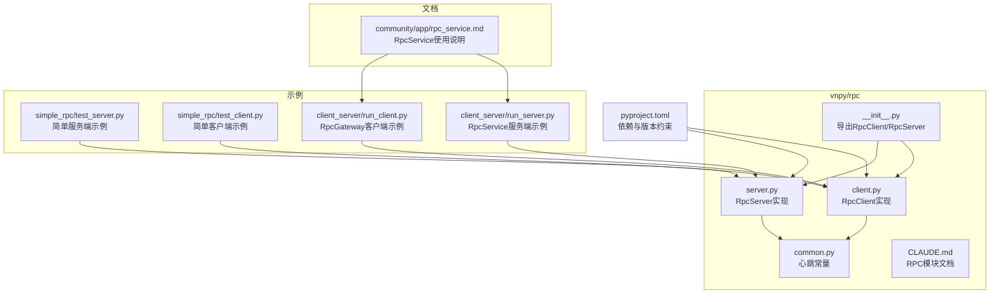
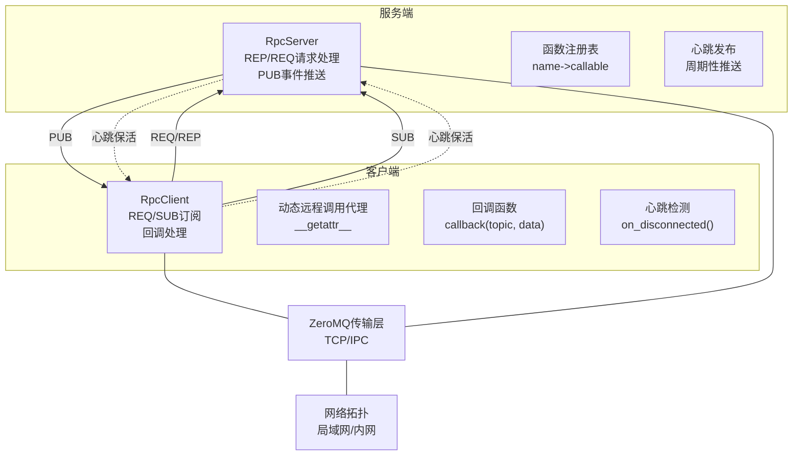
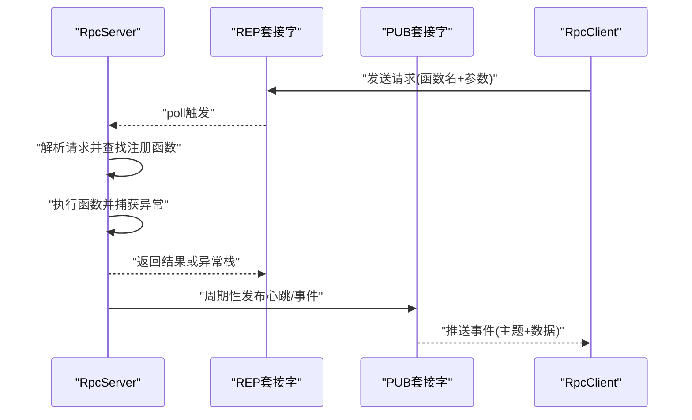
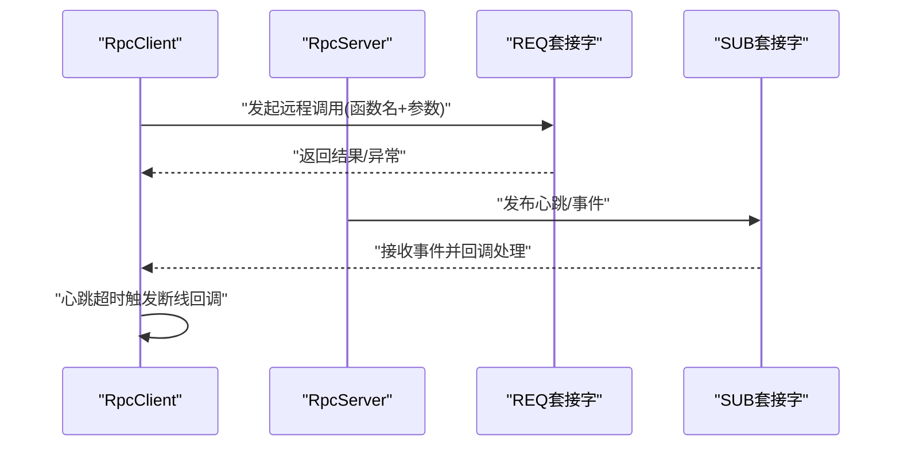
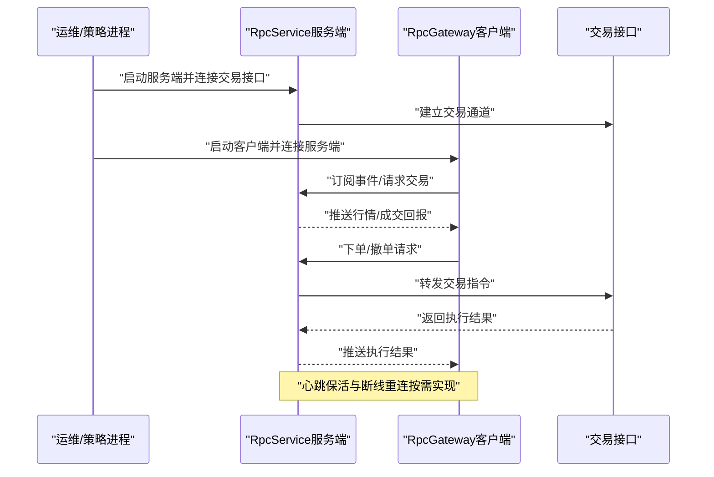
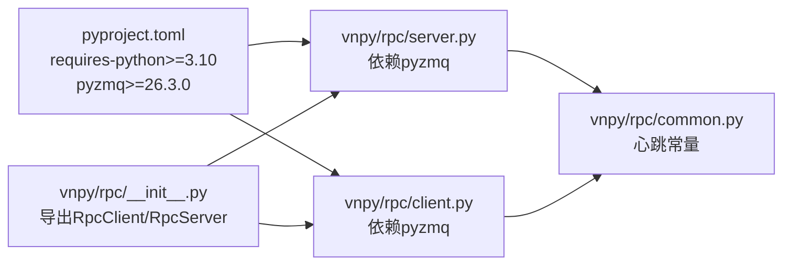
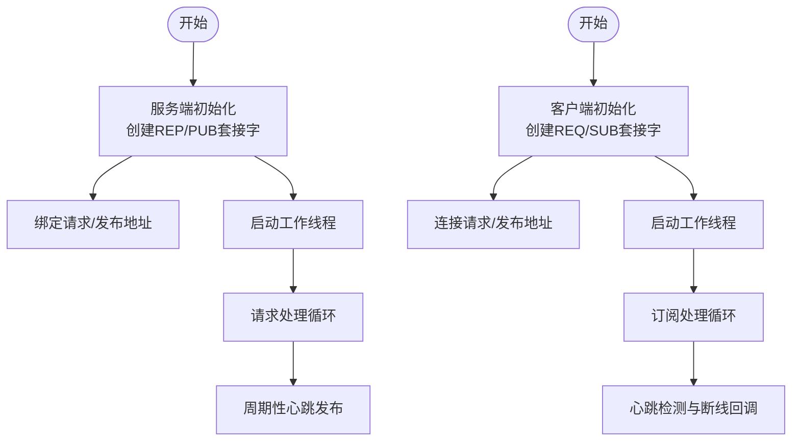

# 分布式部署

<cite>
**本文引用的文件**
- [vnpy/rpc/__init__.py](file://vnpy/rpc/__init__.py)
- [vnpy/rpc/client.py](file://vnpy/rpc/client.py)
- [vnpy/rpc/server.py](file://vnpy/rpc/server.py)
- [vnpy/rpc/common.py](file://vnpy/rpc/common.py)
- [vnpy/rpc/CLAUDE.md](file://vnpy/rpc/CLAUDE.md)
- [pyproject.toml](file://pyproject.toml)
- [examples/simple_rpc/test_server.py](file://examples/simple_rpc/test_server.py)
- [examples/simple_rpc/test_client.py](file://examples/simple_rpc/test_client.py)
- [examples/client_server/run_server.py](file://examples/client_server/run_server.py)
- [examples/client_server/run_client.py](file://examples/client_server/run_client.py)
- [docs/community/app/rpc_service.md](file://docs/community/app/rpc_service.md)
</cite>

## 目录
1. [引言](#引言)
2. [项目结构](#项目结构)
3. [核心组件](#核心组件)
4. [架构总览](#架构总览)
5. [组件详解](#组件详解)
6. [依赖关系分析](#依赖关系分析)
7. [性能与可靠性](#性能与可靠性)
8. [故障排查指南](#故障排查指南)
9. [结论](#结论)
10. [附录](#附录)

## 引言
本技术指南面向构建高性能交易集群的系统架构师，围绕vnpy的RPC模块展开，深入解析其通信机制与部署实践。重点覆盖RPC服务端与客户端的初始化流程、ZeroMQ传输协议配置、数据序列化方式；阐述如何通过RPC实现交易核心与策略计算的物理分离，构建多节点协同的分布式架构；结合pyproject.toml中的依赖管理，说明RPC相关组件的版本兼容性要求；并提供主从式交易集群的部署示例，包括服务端启动、客户端连接、异常重连、负载均衡等关键环节的实现方案，以及分布式环境下的时钟同步、日志聚合、监控告警等运维实践。

## 项目结构
vnpy的RPC能力位于vnpy/rpc子包，包含服务端、客户端与公共常量；同时仓库内提供了简单RPC示例与基于RpcService的客户端/服务端集成示例，便于理解端到端部署流程。

图表来源
- [vnpy/rpc/__init__.py](file://vnpy/rpc/__init__.py#L1-L9)
- [vnpy/rpc/client.py](file://vnpy/rpc/client.py#L1-L170)
- [vnpy/rpc/server.py](file://vnpy/rpc/server.py#L1-L141)
- [vnpy/rpc/common.py](file://vnpy/rpc/common.py#L1-L11)
- [examples/simple_rpc/test_server.py](file://examples/simple_rpc/test_server.py#L1-L39)
- [examples/simple_rpc/test_client.py](file://examples/simple_rpc/test_client.py#L1-L35)
- [examples/client_server/run_server.py](file://examples/client_server/run_server.py#L1-L74)
- [examples/client_server/run_client.py](file://examples/client_server/run_client.py#L1-L28)
- [docs/community/app/rpc_service.md](file://docs/community/app/rpc_service.md#L1-L111)
- [pyproject.toml](file://pyproject.toml#L24-L39)

章节来源
- [vnpy/rpc/__init__.py](file://vnpy/rpc/__init__.py#L1-L9)
- [pyproject.toml](file://pyproject.toml#L24-L39)

## 核心组件
- RpcServer：基于ZeroMQ REP/REQ与PUB/SUB模式，提供函数注册、请求处理、心跳发布与事件推送能力。
- RpcClient：基于ZeroMQ REQ/SUB模式，提供动态远程函数代理、订阅主题回调、心跳检测与断线处理。
- 心跳常量：统一心跳主题、心跳间隔与容忍阈值，保障连接健康检测。
- 示例与文档：提供最小可用示例与RpcService集成示例，便于快速落地。

章节来源
- [vnpy/rpc/server.py](file://vnpy/rpc/server.py#L1-L141)
- [vnpy/rpc/client.py](file://vnpy/rpc/client.py#L1-L170)
- [vnpy/rpc/common.py](file://vnpy/rpc/common.py#L1-L11)
- [vnpy/rpc/CLAUDE.md](file://vnpy/rpc/CLAUDE.md#L1-L158)

## 架构总览
下图展示vnpy分布式部署的典型拓扑：服务端负责交易路由与数据推送，客户端负责策略计算与交互；两者通过ZeroMQ REQ/REP与SUB/PUB进行通信，支持心跳保活与异常重连。

图表来源
- [vnpy/rpc/server.py](file://vnpy/rpc/server.py#L1-L141)
- [vnpy/rpc/client.py](file://vnpy/rpc/client.py#L1-L170)
- [vnpy/rpc/common.py](file://vnpy/rpc/common.py#L1-L11)

## 组件详解

### RpcServer：服务端初始化与请求处理
- 初始化与套接字
  - 创建ZMQ上下文与REP/ PUB套接字，设置线程与锁。
- 启动流程
  - 绑定请求与发布地址，标记活跃状态，启动工作线程，初始化心跳时间戳。
- 请求处理循环
  - 轮询REP套接字，若收到请求则解析函数名与参数，执行注册函数并返回结果；异常时返回异常栈文本。
- 心跳与推送
  - 周期性检查并发布心跳；通过PUB套接字向订阅者推送事件。
- 停止与资源回收
  - 停止标志位控制循环退出，关闭套接字并等待线程结束。

图表来源
- [vnpy/rpc/server.py](file://vnpy/rpc/server.py#L1-L141)

章节来源
- [vnpy/rpc/server.py](file://vnpy/rpc/server.py#L1-L141)

### RpcClient：客户端初始化与订阅回调
- 初始化与套接字
  - 创建ZMQ上下文与REQ/SUB套接字，启用TCP保活；准备线程、锁与心跳时间戳。
- 启动流程
  - 连接请求与订阅地址，标记活跃状态，启动工作线程，记录最近心跳时间。
- 工作线程
  - 轮询SUB套接字，若超时则触发断线回调；收到心跳主题更新最近心跳时间；其他主题交给回调处理。
- 动态远程调用
  - 通过__getattr__生成远程调用代理，发送请求并等待响应；支持超时与异常传播。
- 停止与资源回收
  - 停止标志位控制循环退出，关闭套接字并等待线程结束。

图表来源
- [vnpy/rpc/client.py](file://vnpy/rpc/client.py#L1-L170)

章节来源
- [vnpy/rpc/client.py](file://vnpy/rpc/client.py#L1-L170)

### ZeroMQ传输协议与序列化
- 传输协议
  - 服务端与客户端均使用ZeroMQ REQ/REP与SUB/PUB模式；地址采用tcp://或ipc://，支持本机与网络通信。
- 序列化方式
  - 使用Python内置pickle进行对象序列化，自动处理函数调用请求与响应的编解码。
- 心跳与容忍
  - 通过心跳主题与间隔/容忍阈值实现连接健康检测，超时触发断线回调。

章节来源
- [vnpy/rpc/server.py](file://vnpy/rpc/server.py#L1-L141)
- [vnpy/rpc/client.py](file://vnpy/rpc/client.py#L1-L170)
- [vnpy/rpc/common.py](file://vnpy/rpc/common.py#L1-L11)
- [vnpy/rpc/CLAUDE.md](file://vnpy/rpc/CLAUDE.md#L56-L78)

### 交易核心与策略计算的物理分离
- 服务端职责
  - 统一连接交易接口，提供行情订阅、委托下单/撤单、初始化信息查询等服务；通过PUB向客户端推送事件。
- 客户端职责
  - 运行策略计算逻辑，通过REQ调用服务端提供的交易能力；通过SUB接收实时行情与成交回报。
- 分离收益
  - 解决GIL限制带来的单核算力瓶颈，提升整体吞吐；便于横向扩展与多策略并行。

章节来源
- [docs/community/app/rpc_service.md](file://docs/community/app/rpc_service.md#L1-L111)
- [vnpy/rpc/CLAUDE.md](file://vnpy/rpc/CLAUDE.md#L118-L129)

### 主从式交易集群部署示例
- 服务端启动
  - 使用RpcServiceApp加载于主引擎，连接交易接口后启动RPC服务，绑定请求与发布地址。
- 客户端连接
  - 使用RpcGateway加载于主引擎，连接服务端的请求与发布地址，即可透明地进行交易。
- 异常重连与负载均衡
  - 客户端侧实现心跳检测与断线回调，按需触发重连；服务端侧通过多客户端连接实现横向扩展（需在应用层协调策略实例与账户）。

图表来源
- [examples/client_server/run_server.py](file://examples/client_server/run_server.py#L1-L74)
- [examples/client_server/run_client.py](file://examples/client_server/run_client.py#L1-L28)
- [docs/community/app/rpc_service.md](file://docs/community/app/rpc_service.md#L1-L111)

章节来源
- [examples/client_server/run_server.py](file://examples/client_server/run_server.py#L1-L74)
- [examples/client_server/run_client.py](file://examples/client_server/run_client.py#L1-L28)
- [docs/community/app/rpc_service.md](file://docs/community/app/rpc_service.md#L1-L111)

### 端到端最小示例
- 服务端示例
  - 创建测试服务端，注册可调用函数，绑定请求与发布地址，周期性发布事件。
- 客户端示例
  - 创建测试客户端，订阅全部主题，连接服务端请求与发布地址，动态调用远程函数并打印结果。

章节来源
- [examples/simple_rpc/test_server.py](file://examples/simple_rpc/test_server.py#L1-L39)
- [examples/simple_rpc/test_client.py](file://examples/simple_rpc/test_client.py#L1-L35)

## 依赖关系分析
- RPC核心依赖
  - pyzmq：ZeroMQ Python绑定，提供REQ/REP与SUB/PUB套接字。
  - pickle：对象序列化，用于函数调用请求与响应的编解码。
- 版本兼容性
  - pyproject.toml声明pyzmq最低版本要求，确保与当前ZeroMQ版本兼容；Python版本要求为3.10及以上。
- 模块导出
  - __init__.py导出RpcClient与RpcServer，便于直接从vnpy.rpc导入。

图表来源
- [pyproject.toml](file://pyproject.toml#L24-L39)
- [vnpy/rpc/__init__.py](file://vnpy/rpc/__init__.py#L1-L9)
- [vnpy/rpc/server.py](file://vnpy/rpc/server.py#L1-L141)
- [vnpy/rpc/client.py](file://vnpy/rpc/client.py#L1-L170)
- [vnpy/rpc/common.py](file://vnpy/rpc/common.py#L1-L11)

章节来源
- [pyproject.toml](file://pyproject.toml#L24-L39)
- [vnpy/rpc/__init__.py](file://vnpy/rpc/__init__.py#L1-L9)

## 性能与可靠性
- 性能特性
  - 轻量级实现，异步IO支持高并发；但pickle序列化存在开销，不适合传输大量数据。
- 可靠性与容错
  - 心跳保活与容忍阈值用于检测连接健康；客户端断线回调用于触发重连；服务端异常会传播至客户端。
- 部署建议
  - 优先使用TCP协议，必要时在Linux使用IPC以降低延迟；将服务端与客户端部署在同一局域网内，减少网络抖动。
  - 对于大规模并发，建议在应用层做策略实例隔离与限流，避免单点过载。

章节来源
- [vnpy/rpc/CLAUDE.md](file://vnpy/rpc/CLAUDE.md#L93-L117)
- [vnpy/rpc/common.py](file://vnpy/rpc/common.py#L1-L11)
- [vnpy/rpc/client.py](file://vnpy/rpc/client.py#L1-L170)
- [vnpy/rpc/server.py](file://vnpy/rpc/server.py#L1-L141)

## 故障排查指南
- 常见问题定位
  - 连接失败：确认服务端地址绑定与客户端连接地址一致；检查防火墙与网络可达性。
  - 超时异常：调整客户端调用超时参数；检查服务端是否阻塞或未及时处理请求。
  - 断线重连：观察心跳容忍阈值与断线回调触发频率；在客户端侧实现指数退避重连。
  - 大对象传输：避免直接传输大对象，改用共享存储或数据库。
- 日志与监控
  - 服务端与客户端均应输出RPC相关日志；结合事件引擎的日志事件进行聚合。
  - 建议引入外部监控系统，采集RPC服务端/客户端的连接数、请求耗时、异常次数等指标。

章节来源
- [vnpy/rpc/client.py](file://vnpy/rpc/client.py#L1-L170)
- [vnpy/rpc/server.py](file://vnpy/rpc/server.py#L1-L141)
- [vnpy/rpc/CLAUDE.md](file://vnpy/rpc/CLAUDE.md#L130-L141)

## 结论
vnpy的RPC模块以ZeroMQ为基础，提供了简洁高效的远程过程调用能力，能够有效支撑交易核心与策略计算的物理分离。通过合理的部署与运维实践，可在保证低延迟与高可靠性的前提下，构建可扩展的分布式交易集群。结合pyproject.toml中的依赖约束与示例工程，可快速落地主从式集群，并在此基础上扩展到多节点协同与多策略并行的复杂场景。

## 附录

### A. RPC服务端与客户端初始化流程对比

图表来源
- [vnpy/rpc/server.py](file://vnpy/rpc/server.py#L1-L141)
- [vnpy/rpc/client.py](file://vnpy/rpc/client.py#L1-L170)

### B. 依赖与版本兼容性对照
- Python版本：>=3.10
- pyzmq版本：>=26.3.0
- 序列化：pickle（随Python标准库）

章节来源
- [pyproject.toml](file://pyproject.toml#L24-L39)
- [vnpy/rpc/CLAUDE.md](file://vnpy/rpc/CLAUDE.md#L56-L78)