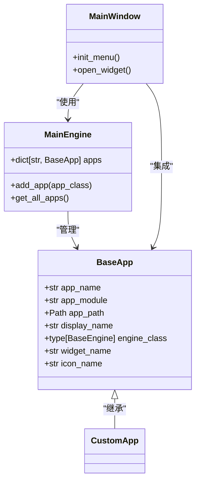
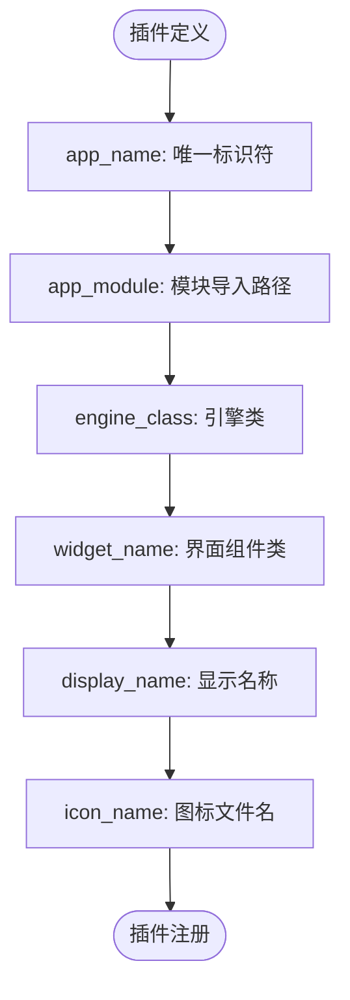
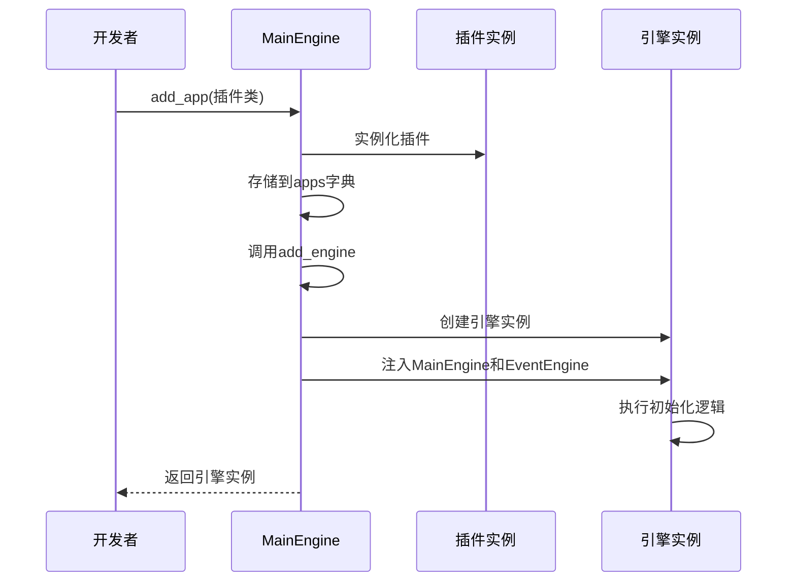
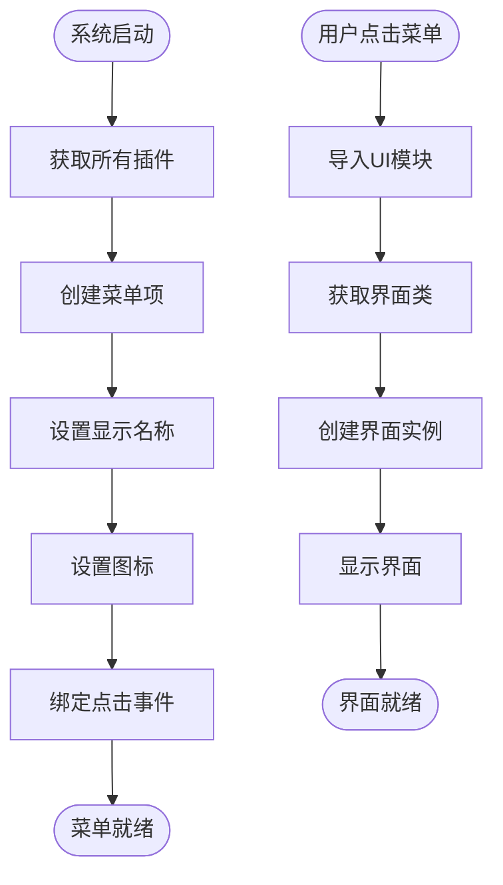
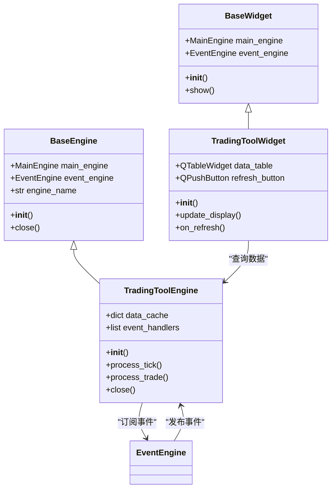
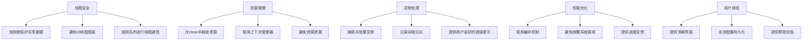

# 应用插件开发

<cite>
**本文档引用的文件**
- [app.py](file://vnpy/trader/app.py#L1-L21)
- [engine.py](file://vnpy/trader/engine.py#L120-L128)
- [mainwindow.py](file://vnpy/trader/ui/mainwindow.py#L130-L138)
- [widget.py](file://vnpy/trader/ui/widget.py#L48-L200)
</cite>

## 目录
1. [简介](#简介)
2. [BaseApp抽象基类设计原理](#baseapp抽象基类设计原理)
3. [核心属性详解](#核心属性详解)
4. [插件注册与加载流程](#插件注册与加载流程)
5. [UI界面集成机制](#ui界面集成机制)
6. [自定义交易工具插件开发示例](#自定义交易工具插件开发示例)
7. [最佳实践](#最佳实践)
8. [结论](#结论)

## 简介
vnpy是一个开源的量化交易系统框架，其插件化架构允许开发者轻松扩展系统功能。本指南将深入解析vnpy的应用插件开发机制，为希望扩展系统功能的开发者提供详细的指导。我们将从BaseApp抽象基类的设计原理开始，逐步介绍插件开发的各个方面，包括核心属性配置、注册加载流程、UI集成以及最佳实践。

## BaseApp抽象基类设计原理
BaseApp是vnpy插件系统的核心抽象基类，定义了所有应用插件必须遵循的接口规范。该类采用抽象基类（ABC）模式，确保所有插件实现统一的结构和行为。BaseApp的设计体现了面向对象的封装、继承和多态原则，为插件系统提供了良好的扩展性和维护性。

BaseApp类本身不包含具体实现，而是通过定义一系列类属性来规范插件的行为。这些属性在插件实例化时被读取和使用，实现了配置与实现的分离。这种设计模式使得插件系统具有高度的灵活性，开发者可以通过简单的属性配置来定制插件的行为，而无需修改核心框架代码。

**插件开发中的依赖关系**


**图表来源**
- [app.py](file://vnpy/trader/app.py#L10-L21)

**本节来源**
- [app.py](file://vnpy/trader/app.py#L10-L21)

## 核心属性详解
BaseApp类定义了多个核心属性，这些属性共同决定了插件的行为和外观。理解这些属性的作用和配置方法是开发vnpy插件的基础。

### app_name属性
app_name是插件的唯一标识符，用于在系统中区分不同的插件。这个名称必须是全局唯一的，通常采用小写字母和下划线的组合。app_name不仅用于创建引擎和界面组件，还作为配置文件和数据存储的命名依据。

### app_module属性
app_module指定了插件模块的导入路径，采用Python的模块导入语法。这个属性告诉系统如何动态导入插件的相关代码，是实现插件热加载的关键。例如，"vnpy_ctastrategy"表示从vnpy_ctastrategy包中导入相关模块。

### engine_class属性
engine_class指定了插件的引擎类，该类必须继承自BaseEngine。引擎类负责处理插件的核心业务逻辑，包括数据处理、策略执行、事件订阅等。引擎在后台线程中运行，确保不会阻塞UI界面的响应。

### widget_name属性
widget_name定义了插件界面组件的类名。这个类通常继承自QtWidgets.QWidget，负责提供用户交互界面。系统通过反射机制根据这个名称动态创建界面实例，实现了界面与逻辑的解耦。

### display_name属性
display_name是插件在菜单和界面上显示的名称，支持国际化。这个属性允许开发者为插件提供友好的用户界面名称，可以包含中文等非ASCII字符，提升了用户体验。

### icon_name属性
icon_name指定了插件图标的文件名。图标用于在菜单和工具栏中直观地标识插件，增强界面的可视化效果。图标文件通常存储在插件目录的特定位置，系统会自动加载并显示。

**核心属性配置示例**


**图表来源**
- [app.py](file://vnpy/trader/app.py#L15-L21)

**本节来源**
- [app.py](file://vnpy/trader/app.py#L15-L21)

## 插件注册与加载流程
vnpy的插件注册与加载流程是一个精心设计的自动化过程，确保了插件能够无缝集成到主系统中。这个流程主要由MainEngine类的add_app方法驱动，实现了从插件注册到引擎初始化的完整生命周期管理。

### 注册机制
插件注册通过MainEngine的add_app方法完成。当调用此方法时，系统首先实例化插件类，然后将其存储在apps字典中，以app_name作为键。这一步骤确保了插件的唯一性和可追溯性。注册过程是线程安全的，允许多个插件同时注册而不会产生冲突。

### 引擎初始化
注册完成后，系统会自动调用add_engine方法来初始化插件的引擎。引擎初始化是插件加载的关键步骤，它创建了插件的后台处理核心。引擎实例被存储在engines字典中，并与主事件引擎连接，使得插件能够接收和发布系统事件。

### 依赖注入
在引擎初始化过程中，系统会自动注入MainEngine和EventEngine实例。这种依赖注入模式使得插件能够访问系统的全局功能，如日志记录、事件发布、数据查询等。同时，插件引擎也可以通过事件机制与其他系统组件进行通信。

### 生命周期管理
MainEngine还负责插件的生命周期管理。在系统关闭时，会自动调用所有插件引擎的close方法，确保资源被正确释放。这种统一的生命周期管理避免了资源泄漏，提高了系统的稳定性和可靠性。

**插件注册与加载流程**


**图表来源**
- [engine.py](file://vnpy/trader/engine.py#L120-L128)

**本节来源**
- [engine.py](file://vnpy/trader/engine.py#L120-L128)

## UI界面集成机制
vnpy的UI界面集成机制通过MainWindow类的init_menu方法实现，将插件无缝整合到主界面中。这一机制确保了插件不仅在功能上可用，在用户体验上也与主系统保持一致。

### 菜单集成
插件的菜单项在系统启动时自动添加到"功能"菜单中。系统通过get_all_apps方法获取所有已注册的插件，然后为每个插件创建相应的菜单项。菜单项的显示名称来自插件的display_name属性，图标来自icon_name属性，实现了外观的可配置性。

### 组件加载
当用户点击菜单项时，系统通过open_widget方法动态加载插件界面。这个过程包括导入插件的UI模块、获取界面类、创建实例等步骤。界面实例被缓存以提高性能，避免重复创建。

### 事件绑定
插件界面与主系统的交互通过事件机制实现。主窗口可以订阅插件发布的事件，插件也可以订阅主系统或其他插件的事件。这种松耦合的通信模式提高了系统的灵活性和可维护性。

### 布局管理
插件界面通常以独立窗口或停靠窗口的形式显示。系统提供了灵活的布局管理功能，允许用户自定义窗口位置和大小。布局设置可以保存和恢复，提升了用户体验。

**UI集成流程**


**图表来源**
- [mainwindow.py](file://vnpy/trader/ui/mainwindow.py#L130-L138)

**本节来源**
- [mainwindow.py](file://vnpy/trader/ui/mainwindow.py#L130-L138)

## 自定义交易工具插件开发示例
本节将通过一个完整的示例，展示如何从零开始创建一个自定义交易工具插件。我们将创建一个简单的交易监控工具，演示插件开发的各个关键环节。

### 项目结构
自定义插件通常遵循标准的Python包结构：
```
my_trading_tool/
├── __init__.py
├── engine.py
├── ui.py
└── icons/
    └── tool.ico
```

### 引擎实现
引擎类负责处理核心业务逻辑，包括事件订阅、数据处理和状态管理。引擎必须继承自BaseEngine，并实现必要的初始化和关闭方法。

### 界面实现
界面类负责提供用户交互功能，通常继承自QtWidgets.QWidget。界面应该包含必要的控件和布局，以及与引擎的通信机制。

### 事件处理
插件通过事件机制与其他系统组件交互。可以订阅系统事件（如行情、成交）来更新界面，也可以发布自定义事件供其他组件使用。

### 配置管理
插件应该支持配置的持久化存储，包括用户偏好、连接设置等。vnpy提供了统一的配置管理接口，简化了这一过程。

**交易工具插件架构**


**图表来源**
- [widget.py](file://vnpy/trader/ui/widget.py#L48-L200)

**本节来源**
- [widget.py](file://vnpy/trader/ui/widget.py#L48-L200)

## 最佳实践
开发vnpy插件时，遵循一些最佳实践可以提高代码质量、性能和用户体验。

### 线程安全
由于vnpy采用多线程架构，插件必须注意线程安全问题。共享数据的访问应该使用适当的同步机制，如锁或队列。避免在UI线程中执行耗时操作，以免阻塞界面响应。

### 资源管理
正确管理资源是确保系统稳定的关键。插件应该在close方法中释放所有分配的资源，包括网络连接、文件句柄、定时器等。使用上下文管理器可以简化资源管理。

### 异常处理
完善的异常处理机制可以提高系统的健壮性。插件应该捕获并处理可能的异常，避免程序崩溃。同时，应该通过日志系统记录异常信息，便于问题排查。

### 性能优化
考虑插件的性能影响，避免频繁的系统调用和大数据量处理。使用缓存机制可以提高响应速度，但要注意内存使用。对于耗时操作，应该提供进度反馈。

### 用户体验
关注用户体验，提供清晰的界面和直观的操作。支持配置的持久化，记住用户偏好。提供必要的帮助文档和错误提示，降低使用门槛。

**插件开发最佳实践检查表**


**本节来源**
- [engine.py](file://vnpy/trader/engine.py#L68-L70)
- [widget.py](file://vnpy/trader/ui/widget.py#L48-L200)

## 结论
vnpy的插件系统提供了一个强大而灵活的扩展机制，使开发者能够轻松地为系统添加新功能。通过深入理解BaseApp抽象基类的设计原理、核心属性的配置方法、插件注册与加载流程以及UI集成机制，开发者可以创建出高质量的插件。遵循线程安全、资源管理、异常处理等方面的最佳实践，可以确保插件的稳定性、性能和用户体验。vnpy的插件化架构不仅增强了系统的功能性，也为社区贡献和定制开发提供了便利，是量化交易系统扩展的理想选择。