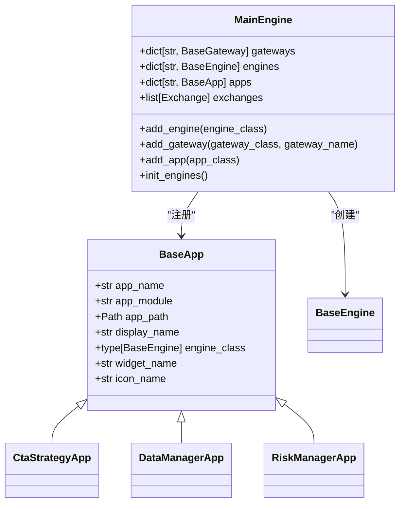
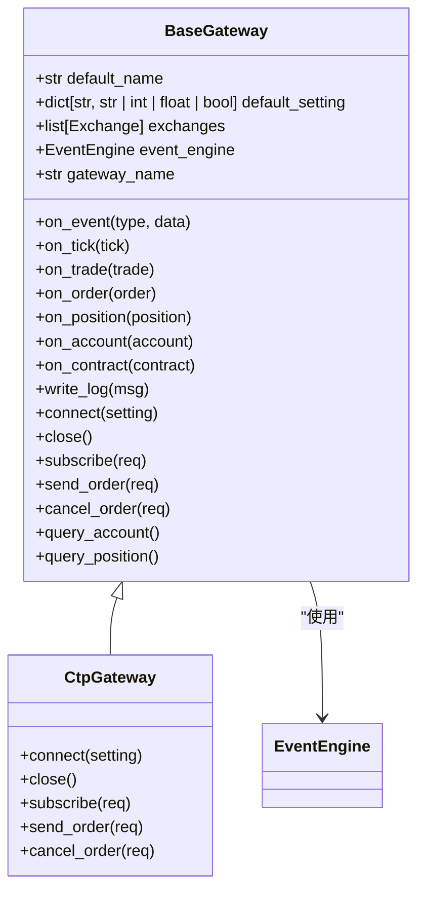
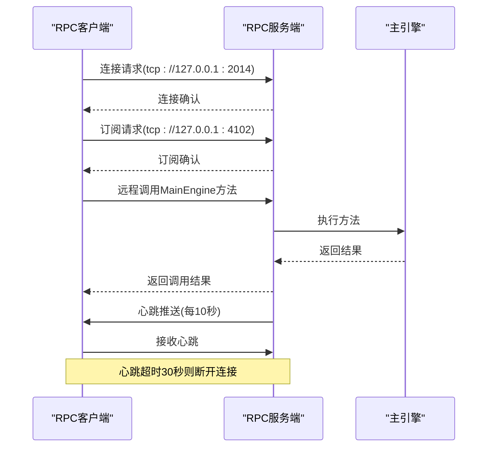
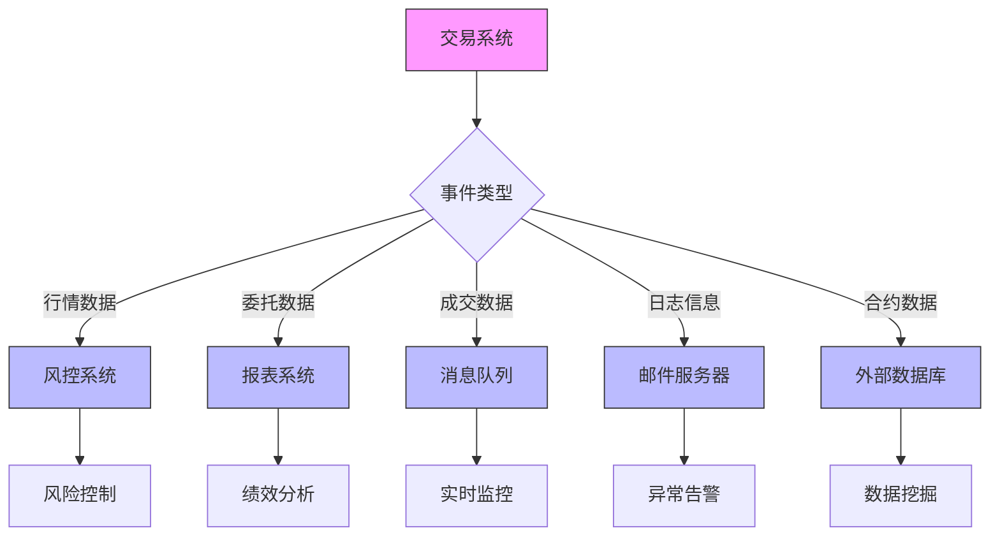
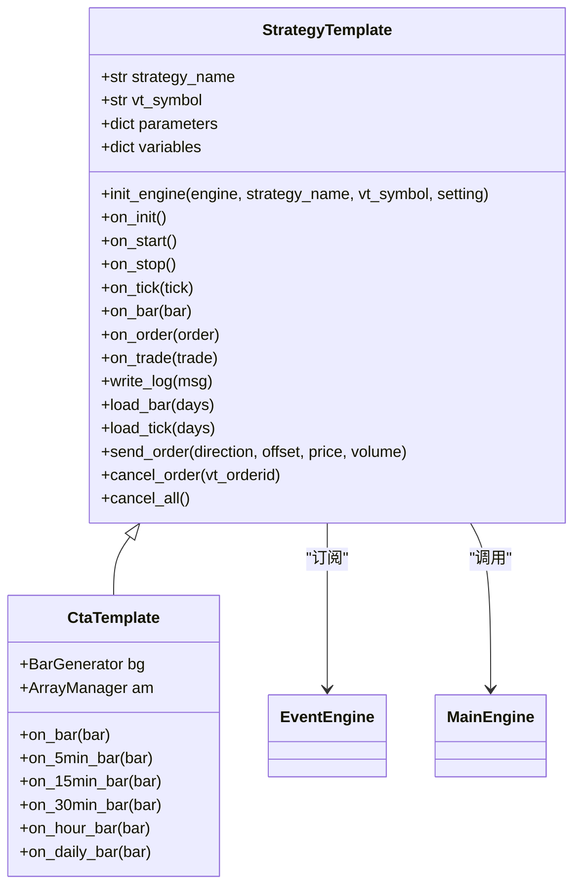
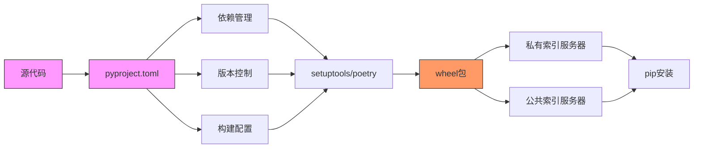

# 集成与扩展

<cite>
**本文档引用的文件**   
- [app.py](file://vnpy/trader/app.py)
- [gateway.py](file://vnpy/trader/gateway.py)
- [engine.py](file://vnpy/trader/engine.py)
- [server.py](file://vnpy/rpc/server.py)
- [client.py](file://vnpy/rpc/client.py)
- [common.py](file://vnpy/rpc/common.py)
- [object.py](file://vnpy/trader/object.py)
- [setting.py](file://vnpy/trader/setting.py)
- [logger.py](file://vnpy/trader/logger.py)
- [converter.py](file://vnpy/trader/converter.py)
- [run_server.py](file://examples/client_server/run_server.py)
- [run_client.py](file://examples/client_server/run_client.py)
- [demo_script.py](file://examples/veighna_trader/demo_script.py)
- [run.py](file://examples/veighna_trader/run.py)
</cite>

## 目录
1. [引言](#引言)
2. [插件化架构](#插件化架构)
3. [自定义网关开发](#自定义网关开发)
4. [RPC分布式架构](#rpc分布式架构)
5. [外部系统集成](#外部系统集成)
6. [策略开发最佳实践](#策略开发最佳实践)
7. [模块打包与发布](#模块打包与发布)
8. [结论](#结论)

## 引言
vnpy是一个开源的量化交易系统框架，为开发者提供了灵活的扩展能力。本指南面向希望定制化或扩展系统功能的开发者，详细说明如何通过继承App类开发新功能模块并注册到系统，如何实现自定义Gateway以接入新的交易接口，以及如何利用RPC机制构建分布式交易集群。同时，本指南还将介绍与外部系统（如风控系统、报表系统、消息队列）的集成模式，基于vnpy进行策略开发的最佳实践，以及打包发布自定义模块的流程。

## 插件化架构

vnpy采用插件化架构设计，通过继承BaseApp类来开发新功能模块。每个应用模块都包含一个唯一的名称、显示名称、图标名称，以及对应的引擎类和界面组件名称。系统通过MainEngine的add_app方法将应用模块注册到系统中，并初始化相应的引擎实例。

**图示来源**
- [app.py](file://vnpy/trader/app.py#L10-L22)
- [engine.py](file://vnpy/trader/engine.py#L73-L303)

**本节来源**
- [app.py](file://vnpy/trader/app.py#L1-L22)
- [engine.py](file://vnpy/trader/engine.py#L73-L303)

## 自定义网关开发

vnpy通过继承BaseGateway类来实现自定义交易接口的接入。网关类需要实现连接、断开、订阅行情、发送委托、撤单等抽象方法，并通过事件引擎将行情、委托、成交等数据推送到系统中。每个网关都需要定义默认名称、支持的交易所列表以及连接所需的配置参数。

**图示来源**
- [gateway.py](file://vnpy/trader/gateway.py#L33-L273)
- [object.py](file://vnpy/trader/object.py#L17-L29)

**本节来源**
- [gateway.py](file://vnpy/trader/gateway.py#L33-L273)
- [object.py](file://vnpy/trader/object.py#L17-L29)

## RPC分布式架构

vnpy通过RPC机制实现分布式交易集群的构建。RPC服务端（RpcServer）使用ZeroMQ的请求-回复模式和发布-订阅模式，提供远程过程调用和数据发布功能。客户端（RpcClient）通过代理模式实现远程方法调用，并订阅服务器推送的数据。心跳机制确保连接的可靠性。

**图示来源**
- [server.py](file://vnpy/rpc/server.py#L11-L141)
- [client.py](file://vnpy/rpc/client.py#L29-L170)
- [common.py](file://vnpy/rpc/common.py#L8-L10)

**本节来源**
- [server.py](file://vnpy/rpc/server.py#L11-L141)
- [client.py](file://vnpy/rpc/client.py#L29-L170)
- [common.py](file://vnpy/rpc/common.py#L8-L10)

## 外部系统集成

vnpy提供了多种与外部系统集成的模式。通过事件引擎机制，可以将交易系统的行情、委托、成交等数据实时推送到风控系统、报表系统或消息队列中。日志系统支持邮件通知，可以将关键事件发送到指定邮箱。数据管理模块可以与外部数据库集成，实现历史数据的存储和查询。

**图示来源**
- [engine.py](file://vnpy/trader/engine.py#L73-L303)
- [logger.py](file://vnpy/trader/logger.py#L6-L56)
- [setting.py](file://vnpy/trader/setting.py#L11-L38)

**本节来源**
- [engine.py](file://vnpy/trader/engine.py#L73-L303)
- [logger.py](file://vnpy/trader/logger.py#L6-L56)
- [setting.py](file://vnpy/trader/setting.py#L11-L38)

## 策略开发最佳实践

基于vnpy进行策略开发时，应遵循良好的代码组织、日志记录和异常处理实践。策略代码应按照功能模块进行组织，使用清晰的命名规范。日志记录应包含足够的上下文信息，便于问题排查。异常处理应覆盖网络中断、数据异常等常见情况，并实现自动重连机制。

**图示来源**
- [object.py](file://vnpy/trader/object.py#L17-L29)
- [converter.py](file://vnpy/trader/converter.py#L310-L403)
- [demo_script.py](file://examples/veighna_trader/demo_script.py#L6-L42)

**本节来源**
- [object.py](file://vnpy/trader/object.py#L17-L29)
- [converter.py](file://vnpy/trader/converter.py#L310-L403)
- [demo_script.py](file://examples/veighna_trader/demo_script.py#L6-L42)

## 模块打包与发布

自定义模块的打包发布应结合pyproject.toml文件进行依赖管理和版本控制。pyproject.toml文件定义了项目的基本信息、依赖项、构建系统和发布配置。通过setuptools或poetry工具，可以将自定义模块打包为wheel格式，并发布到私有或公共的Python包索引服务器。

**图示来源**
- [run.py](file://examples/veighna_trader/run.py#L39-L88)
- [setting.py](file://vnpy/trader/setting.py#L11-L38)
- [run_server.py](file://examples/client_server/run_server.py#L37-L74)

**本节来源**
- [run.py](file://examples/veighna_trader/run.py#L39-L88)
- [setting.py](file://vnpy/trader/setting.py#L11-L38)
- [run_server.py](file://examples/client_server/run_server.py#L37-L74)

## 结论
vnpy提供了强大的扩展能力，通过插件化架构、自定义网关、RPC分布式机制和丰富的集成模式，开发者可以灵活地定制和扩展系统功能。遵循最佳实践进行策略开发和模块打包，可以确保系统的稳定性和可维护性。通过合理利用vnpy的架构特性，可以构建出高效、可靠的量化交易系统。