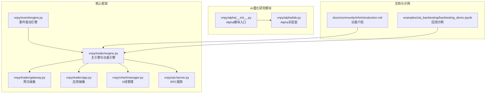
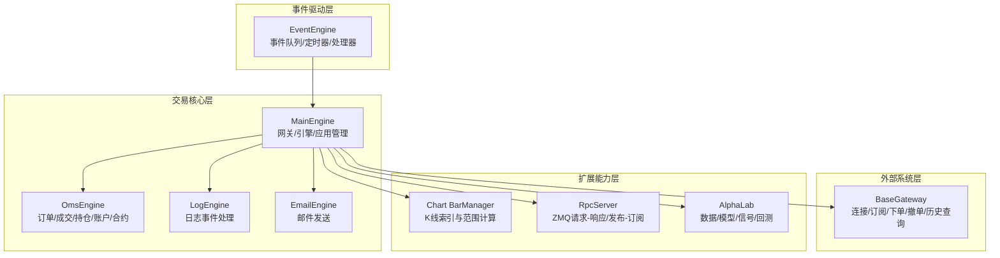
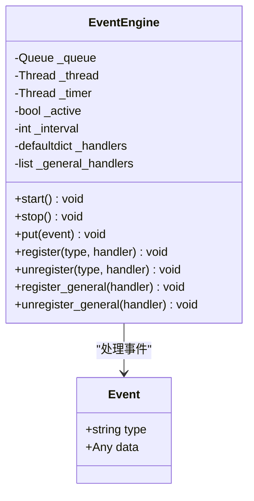
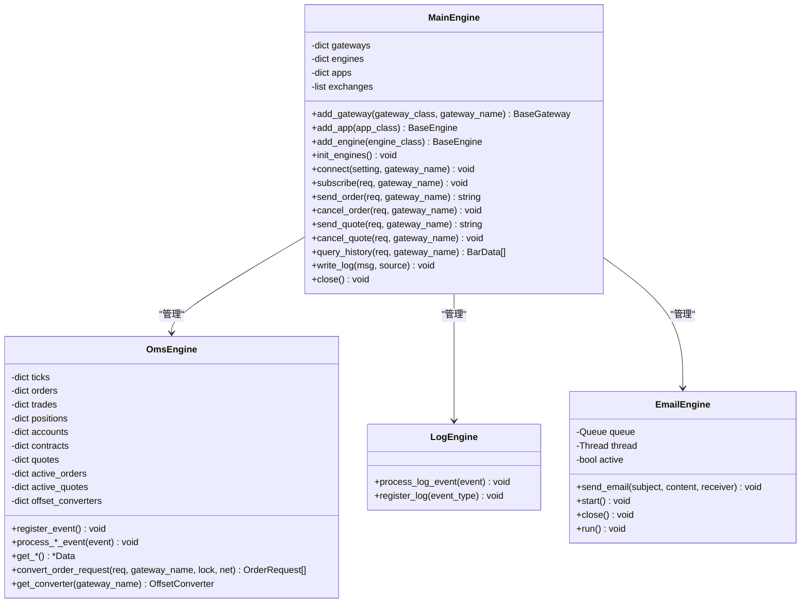
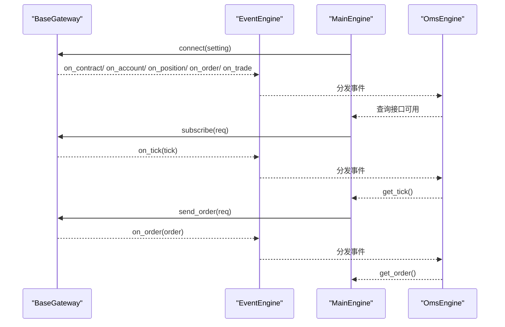
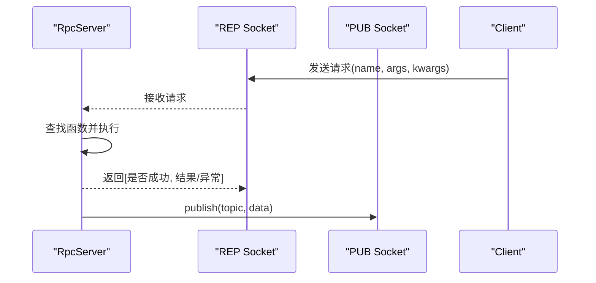
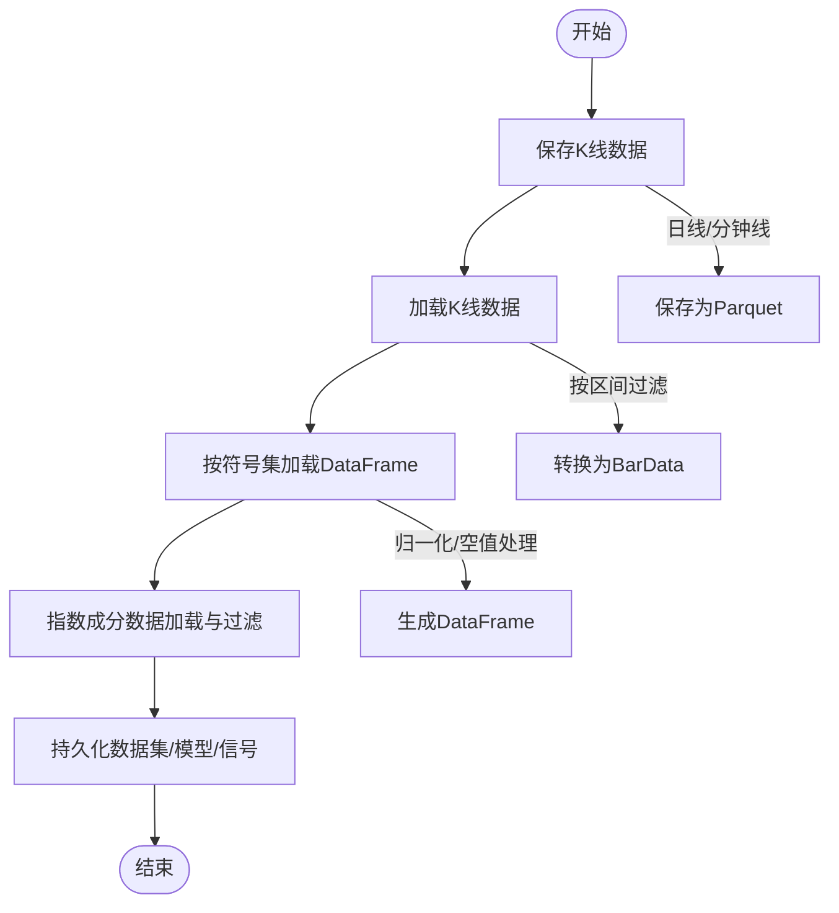
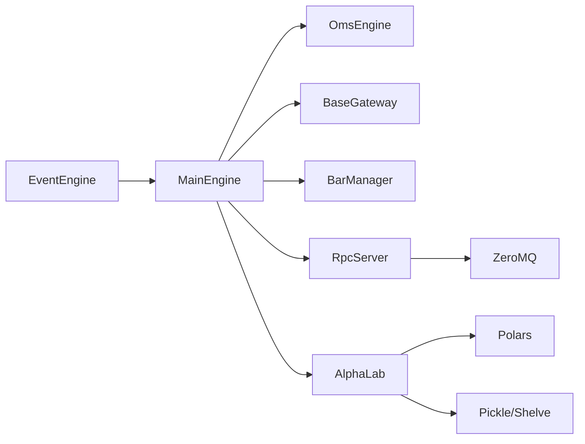

# 项目概述

<cite>
**本文引用的文件列表**
- [README.md](file://README.md)
- [README_ENG.md](file://README_ENG.md)
- [vnpy/__init__.py](file://vnpy/__init__.py)
- [vnpy/event/engine.py](file://vnpy/event/engine.py)
- [vnpy/trader/engine.py](file://vnpy/trader/engine.py)
- [vnpy/trader/gateway.py](file://vnpy/trader/gateway.py)
- [vnpy/trader/app.py](file://vnpy/trader/app.py)
- [vnpy/alpha/__init__.py](file://vnpy/alpha/__init__.py)
- [vnpy/alpha/lab.py](file://vnpy/alpha/lab.py)
- [vnpy/rpc/server.py](file://vnpy/rpc/server.py)
- [vnpy/chart/manager.py](file://vnpy/chart/manager.py)
- [docs/community/info/introduction.md](file://docs/community/info/introduction.md)
- [examples/cta_backtesting/backtesting_demo.ipynb](file://examples/cta_backtesting/backtesting_demo.ipynb)
</cite>

## 目录
1. [引言](#引言)
2. [项目结构](#项目结构)
3. [核心组件](#核心组件)
4. [架构总览](#架构总览)
5. [详细组件分析](#详细组件分析)
6. [依赖关系分析](#依赖关系分析)
7. [性能考量](#性能考量)
8. [故障排查指南](#故障排查指南)
9. [结论](#结论)
10. [附录](#附录)

## 引言
VeighNa（原名VeighNa，现简称vnpy）是一个由Traders、为Traders打造的AI驱动开源量化交易系统开发框架。项目自发布以来，持续演进为多功能量化交易平台，支持多市场、多品种交易，覆盖国内外期货、期权、股票、外盘等市场，并提供从策略开发、回测研究到实盘自动交易的完整闭环。2025年发布的4.0版本新增AI量化研究模块（vnpy.alpha），面向机器学习策略的一站式开发与实盘落地，融合数据管理、特征工程、模型训练、信号生成与策略回测等全流程能力。

目标用户包括专业个人投资者、创业型私募、券商资管部门等，既可直接使用VeighNa Trader进行实盘交易，也可基于事件驱动引擎与模块化架构进行定制扩展，满足个性化交易需求。

## 项目结构
从仓库结构可见，项目采用“核心框架 + 子模块 + 示例与文档”的组织方式：
- 核心框架：vnpy/event（事件驱动）、vnpy/trader（交易引擎与应用抽象）、vnpy/chart（K线图表）、vnpy/rpc（跨进程通信）
- AI量化研究模块：vnpy/alpha（数据集、模型、策略、实验室）
- 文档与示例：docs（社区文档、安装与使用指南）、examples（Alpha研究、回测、数据记录等）

图示来源
- [vnpy/event/engine.py](file://vnpy/event/engine.py#L1-L146)
- [vnpy/trader/engine.py](file://vnpy/trader/engine.py#L1-L300)
- [vnpy/trader/gateway.py](file://vnpy/trader/gateway.py#L1-L273)
- [vnpy/trader/app.py](file://vnpy/trader/app.py#L1-L22)
- [vnpy/chart/manager.py](file://vnpy/chart/manager.py#L1-L171)
- [vnpy/rpc/server.py](file://vnpy/rpc/server.py#L1-L141)
- [vnpy/alpha/__init__.py](file://vnpy/alpha/__init__.py#L1-L18)
- [vnpy/alpha/lab.py](file://vnpy/alpha/lab.py#L1-L120)
- [docs/community/info/introduction.md](file://docs/community/info/introduction.md#L1-L129)
- [examples/cta_backtesting/backtesting_demo.ipynb](file://examples/cta_backtesting/backtesting_demo.ipynb#L1-L120)

章节来源
- [README.md](file://README.md#L1-L120)
- [docs/community/info/introduction.md](file://docs/community/info/introduction.md#L1-L129)

## 核心组件
- 事件驱动引擎（vnpy/event/engine.py）：提供事件队列、定时器、处理器注册与分发机制，是系统异步解耦与模块协作的基础。
- 交易主引擎（vnpy/trader/engine.py）：负责网关、功能引擎、应用的注册与生命周期管理；封装订单、成交、持仓、账户、合约等数据的集中管理与事件分发。
- 网关抽象（vnpy/trader/gateway.py）：定义统一的连接、订阅、下单、撤单、历史查询等接口规范，屏蔽不同交易所/柜台的差异。
- 应用抽象（vnpy/trader/app.py）：定义应用的元信息（名称、模块、引擎类、UI部件等），支撑模块化策略与工具的统一接入。
- K线图表（vnpy/chart/manager.py）：提供历史K线的索引、范围计算与缓存，支撑高性能图表渲染与实时更新。
- RPC服务（vnpy/rpc/server.py）：基于ZeroMQ实现请求-响应与发布-订阅模式，支持跨进程通信与分布式部署。
- AI量化研究模块（vnpy/alpha）：提供数据集、模型、策略与实验室（AlphaLab）等组件，形成从数据到信号再到回测的完整工作流。

章节来源
- [vnpy/event/engine.py](file://vnpy/event/engine.py#L1-L146)
- [vnpy/trader/engine.py](file://vnpy/trader/engine.py#L1-L300)
- [vnpy/trader/gateway.py](file://vnpy/trader/gateway.py#L1-L273)
- [vnpy/trader/app.py](file://vnpy/trader/app.py#L1-L22)
- [vnpy/chart/manager.py](file://vnpy/chart/manager.py#L1-L171)
- [vnpy/rpc/server.py](file://vnpy/rpc/server.py#L1-L141)
- [vnpy/alpha/__init__.py](file://vnpy/alpha/__init__.py#L1-L18)
- [vnpy/alpha/lab.py](file://vnpy/alpha/lab.py#L1-L120)

## 架构总览
VeighNa采用事件驱动与模块化双轴设计：
- 事件驱动：事件引擎统一调度，各功能引擎与应用通过事件进行松耦合交互。
- 模块化：网关抽象统一外部系统接入；应用抽象统一策略与工具的生命周期与UI集成；RPC与图表模块提供横向扩展能力。

图示来源
- [vnpy/event/engine.py](file://vnpy/event/engine.py#L1-L146)
- [vnpy/trader/engine.py](file://vnpy/trader/engine.py#L1-L300)
- [vnpy/trader/gateway.py](file://vnpy/trader/gateway.py#L1-L273)
- [vnpy/chart/manager.py](file://vnpy/chart/manager.py#L1-L171)
- [vnpy/rpc/server.py](file://vnpy/rpc/server.py#L1-L141)
- [vnpy/alpha/lab.py](file://vnpy/alpha/lab.py#L1-L120)

## 详细组件分析

### 事件驱动引擎（EventEngine）
- 设计要点
  - 事件对象包含类型与数据，便于按类型分发。
  - 提供通用处理器与特定类型处理器两类注册方式，支持全局事件监听。
  - 定时器线程按固定间隔产生定时事件，用于周期性任务调度。
  - 队列与线程模型实现异步处理，避免阻塞。
- 关键流程
  - 启动：启动事件处理线程与定时器线程。
  - 停止：停止定时器与处理线程，释放资源。
  - 分发：根据事件类型分发至对应处理器，随后分发至通用处理器。

图示来源
- [vnpy/event/engine.py](file://vnpy/event/engine.py#L1-L146)

章节来源
- [vnpy/event/engine.py](file://vnpy/event/engine.py#L1-L146)

### 交易主引擎（MainEngine）与功能引擎
- 设计要点
  - MainEngine负责事件引擎、网关、功能引擎与应用的统一管理与初始化。
  - OmsEngine集中管理Tick、Order、Trade、Position、Account、Contract、Quote等数据，提供查询与活跃状态维护。
  - LogEngine与EmailEngine分别处理日志与邮件发送，均通过事件驱动进行解耦。
- 关键流程
  - 初始化：注册并启动日志引擎，初始化OMS引擎并暴露便捷查询接口。
  - 网关与应用：动态添加网关与应用，自动创建对应功能引擎。
  - 生命周期：关闭时先停止事件引擎，再依次关闭各引擎与网关。

图示来源
- [vnpy/trader/engine.py](file://vnpy/trader/engine.py#L1-L300)

章节来源
- [vnpy/trader/engine.py](file://vnpy/trader/engine.py#L1-L300)

### 网关抽象（BaseGateway）
- 设计要点
  - 统一接口：connect、close、subscribe、send_order、cancel_order、send_quote、cancel_quote、query_account、query_position、query_history等。
  - 事件推送：on_tick/on_trade/on_order/on_position/on_account/on_contract/on_quote/on_log等回调，统一通过事件引擎分发。
  - 线程安全与非阻塞：要求实现方法线程安全、非阻塞，并具备自动重连能力。
- 关键流程
  - 连接建立：完成合约、账户、持仓、订单、成交等初始查询与事件推送。
  - 行情与交易：订阅行情、发送委托、撤销委托、报价与撤报价、历史查询。

图示来源
- [vnpy/trader/gateway.py](file://vnpy/trader/gateway.py#L1-L273)
- [vnpy/trader/engine.py](file://vnpy/trader/engine.py#L1-L300)

章节来源
- [vnpy/trader/gateway.py](file://vnpy/trader/gateway.py#L1-L273)

### 应用抽象（BaseApp）
- 设计要点
  - BaseApp定义应用的唯一名称、模块字符串、路径、显示名称、引擎类、UI部件与图标等元信息，支撑应用的统一注册与加载。
- 作用
  - 为策略应用（如CTA、期权、组合策略等）提供一致的生命周期与UI集成入口。

章节来源
- [vnpy/trader/app.py](file://vnpy/trader/app.py#L1-L22)

### K线图表（BarManager）
- 设计要点
  - 维护BarData的字典、时间索引映射与缓存，支持历史批量更新、单条更新、索引与时间互转、价格/成交量范围计算等。
- 性能
  - 通过缓存价格与成交量范围，避免重复计算，提升图表渲染效率。

章节来源
- [vnpy/chart/manager.py](file://vnpy/chart/manager.py#L1-L171)

### RPC服务（RpcServer）
- 设计要点
  - 基于ZeroMQ实现请求-响应（REP）与发布-订阅（PUB）双通道，支持函数注册、心跳检测与线程安全。
- 关键流程
  - 启动：绑定地址、启动工作线程、初始化心跳时间戳。
  - 运行：轮询请求、执行注册函数、返回结果或异常信息。
  - 发布：按主题发布数据，支持心跳广播。

图示来源
- [vnpy/rpc/server.py](file://vnpy/rpc/server.py#L1-L141)

章节来源
- [vnpy/rpc/server.py](file://vnpy/rpc/server.py#L1-L141)

### AI量化研究模块（AlphaLab）
- 设计要点
  - AlphaLab提供数据集、模型、信号与合约设置的持久化管理，支持日线/分钟线数据的保存与加载、指数成分数据的增删查、数据集/模型/信号的增删查与列表。
  - 通过路径结构组织数据，便于实验复现与版本管理。
- 关键流程
  - 数据保存：将BarData转换为DataFrame并去重排序后保存为Parquet。
  - 数据加载：按vt_symbol与时间区间过滤，转换为BarData对象。
  - 指数成分：使用shelve存储成分变更历史，支持按时间区间查询与过滤。

图示来源
- [vnpy/alpha/lab.py](file://vnpy/alpha/lab.py#L1-L200)

章节来源
- [vnpy/alpha/lab.py](file://vnpy/alpha/lab.py#L1-L200)

## 依赖关系分析
- 组件耦合
  - MainEngine与EventEngine强耦合，通过事件驱动实现模块间解耦。
  - Gateway与EventEngine耦合，通过回调事件向上游传递市场数据与状态。
  - OmsEngine与EventEngine耦合，集中管理交易数据并提供查询接口。
  - Chart与交易数据对象（BarData）耦合，通过BarManager进行索引与范围计算。
  - RPC与ZeroMQ耦合，提供跨进程通信能力。
  - AlphaLab与Polars、Pickle、Shelve等库耦合，承担数据与模型的持久化与加载。
- 外部依赖
  - ZeroMQ（RPC）
  - Polars（AlphaLab数据处理）
  - Pickle/Shelve（AlphaLab持久化）
  - NumPy/SciPy/Scikit-learn/LightGBM/Torch（Alpha模型训练）

图示来源
- [vnpy/event/engine.py](file://vnpy/event/engine.py#L1-L146)
- [vnpy/trader/engine.py](file://vnpy/trader/engine.py#L1-L300)
- [vnpy/trader/gateway.py](file://vnpy/trader/gateway.py#L1-L273)
- [vnpy/chart/manager.py](file://vnpy/chart/manager.py#L1-L171)
- [vnpy/rpc/server.py](file://vnpy/rpc/server.py#L1-L141)
- [vnpy/alpha/lab.py](file://vnpy/alpha/lab.py#L1-L120)

章节来源
- [vnpy/rpc/server.py](file://vnpy/rpc/server.py#L1-L141)
- [vnpy/alpha/lab.py](file://vnpy/alpha/lab.py#L1-L120)

## 性能考量
- 事件驱动与异步处理：通过队列与线程模型降低阻塞，定时器事件用于周期性任务，避免主线程压力。
- 数据缓存：BarManager对价格/成交量范围进行缓存，减少重复计算。
- 持久化格式：AlphaLab使用Parquet存储K线数据，支持高效读写与去重合并。
- 网关线程安全：要求网关实现方法线程安全与非阻塞，保障高并发下的稳定性。
- RPC通信：ZeroMQ双通道设计支持高吞吐与低延迟的跨进程通信。

## 故障排查指南
- 事件未分发
  - 检查事件类型是否正确注册，确认通用处理器与特定类型处理器均已注册。
  - 确认事件引擎已启动且未提前停止。
- 网关连接失败
  - 核对网关默认设置项与连接参数，确认网络与服务器可达。
  - 观察日志事件输出，定位连接阶段错误。
- 订单状态异常
  - 检查OmsEngine中订单活跃字典与状态更新逻辑，确认OffsetConverter是否正确更新。
- RPC通信问题
  - 检查REP与PUB地址绑定、线程状态与心跳检测，确认客户端与服务端地址一致。
- AlphaLab数据加载失败
  - 检查数据文件是否存在、时间区间是否合理、Parquet格式是否正确。

章节来源
- [vnpy/event/engine.py](file://vnpy/event/engine.py#L1-L146)
- [vnpy/trader/engine.py](file://vnpy/trader/engine.py#L1-L300)
- [vnpy/trader/gateway.py](file://vnpy/trader/gateway.py#L1-L273)
- [vnpy/rpc/server.py](file://vnpy/rpc/server.py#L1-L141)
- [vnpy/alpha/lab.py](file://vnpy/alpha/lab.py#L1-L200)

## 结论
VeighNa以事件驱动为核心，结合模块化设计，构建了覆盖多市场、多品种的量化交易基础设施。4.0版本新增的AI量化研究模块（vnpy.alpha）进一步完善了从数据到信号再到回测的全链路能力。通过统一的网关抽象、功能引擎与应用抽象，开发者可在保证性能与稳定性的前提下，快速扩展策略与工具，满足从个人投资者到机构用户的多样化需求。

## 附录
- 目标用户与应用场景
  - 专业个人投资者：CTA策略开发与实盘交易。
  - 创业型私募：基于RPC服务构建分布式统一报盘通道。
  - 券商资管部门：基于事件驱动引擎定制多策略复杂系统。
- 支持的接口与应用
  - 覆盖国内期货、期权、ETF期权、A股、黄金TD、外盘期货等多市场。
  - 提供CTA策略、期权交易、组合策略、算法交易、数据管理、数据记录、风险控制、Web服务、图表、RPC服务等应用模块。
- 学习路径建议
  - 初学者：从VeighNa Station图形化启动入手，熟悉界面与基本操作；阅读功能介绍文档；尝试简单策略与回测。
  - 进阶用户：深入理解事件驱动与MainEngine/OmsEngine的工作原理；基于BaseGateway与BaseApp扩展网关与应用；结合AlphaLab进行AI量化研究实践。
- 参考示例
  - 回测示例：参见回测笔记本，了解策略参数设置、历史数据加载与统计指标输出流程。

章节来源
- [README.md](file://README.md#L1-L220)
- [docs/community/info/introduction.md](file://docs/community/info/introduction.md#L1-L129)
- [examples/cta_backtesting/backtesting_demo.ipynb](file://examples/cta_backtesting/backtesting_demo.ipynb#L1-L120)