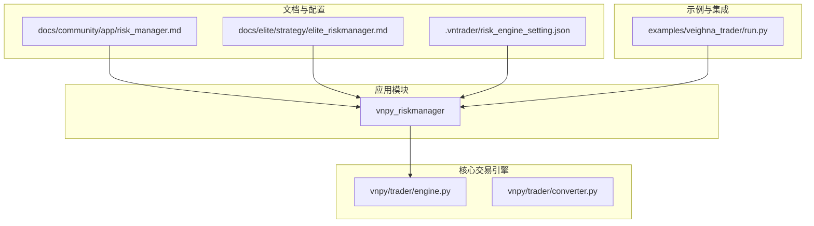
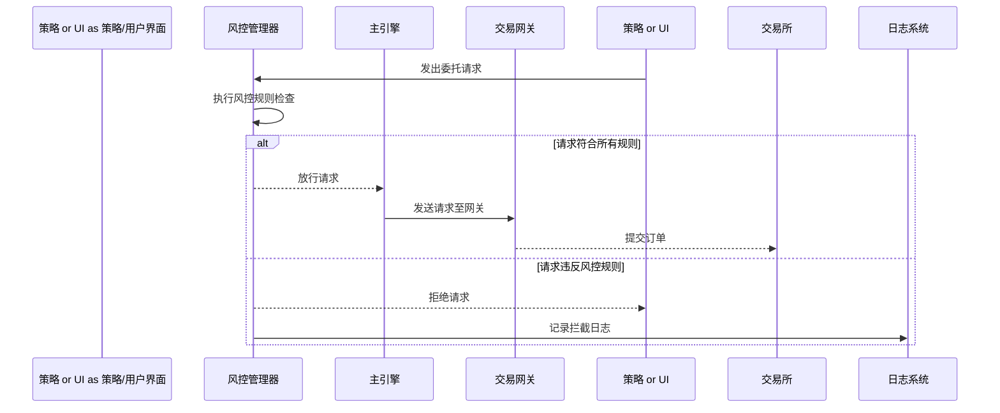
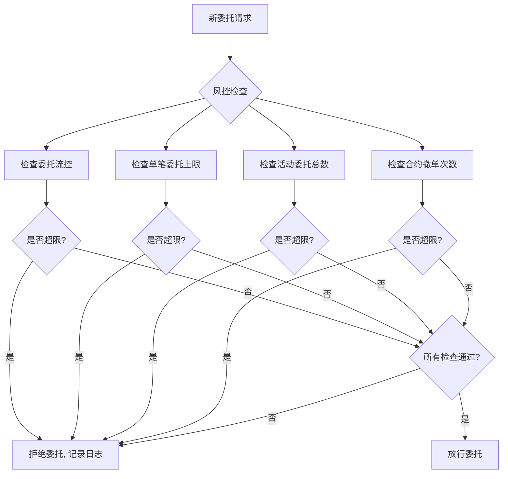
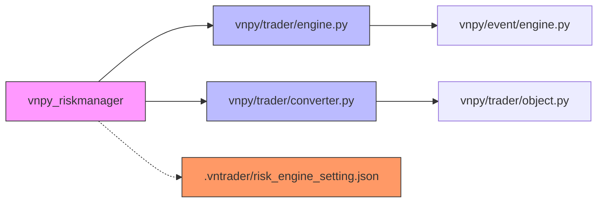

# 风险管理

<cite>
**本文档中引用的文件**   
- [risk_manager.md](file://docs/community/app/risk_manager.md)
- [elite_riskmanager.md](file://docs/elite/strategy/elite_riskmanager.md)
- [run.py](file://examples/veighna_trader/run.py)
- [converter.py](file://vnpy/trader/converter.py)
- [engine.py](file://vnpy/trader/engine.py)
</cite>

## 目录
1. [简介](#简介)
2. [项目结构](#项目结构)
3. [核心组件](#核心组件)
4. [架构概述](#架构概述)
5. [详细组件分析](#详细组件分析)
6. [依赖分析](#依赖分析)
7. [性能考虑](#性能考虑)
8. [故障排除指南](#故障排除指南)
9. [结论](#结论)

## 简介
本专项文档聚焦于vnpy框架中前端风险管理模块的实现机制，重点阐述`risk_manager`组件如何通过事前风控保障交易安全。文档详细说明了交易流控、下单数量限制、活动委托总数控制、撤单频率监控等核心风控规则的技术实现原理，解析风险规则的配置方式、实时检测逻辑及触发后的处理策略（如拒绝订单、报警通知）。同时，文档将结合代码结构说明如何扩展自定义风控规则，并提供典型风控场景的配置示例（如防止程序化误下单、控制高频交易风险），最后强调该模块在实盘环境中的重要性及部署建议。

## 项目结构
vnpy的风险管理功能主要通过独立的`vnpy_riskmanager`应用模块实现，该模块作为可插拔的应用集成到主交易引擎中。其配置和规则定义主要通过文档和配置文件进行管理。

**Diagram sources**
- [risk_manager.md](file://docs/community/app/risk_manager.md)
- [elite_riskmanager.md](file://docs/elite/strategy/elite_riskmanager.md)
- [engine.py](file://vnpy/trader/engine.py)
- [converter.py](file://vnpy/trader/converter.py)
- [run.py](file://examples/veighna_trader/run.py)

**Section sources**
- [risk_manager.md](file://docs/community/app/risk_manager.md)
- [elite_riskmanager.md](file://docs/elite/strategy/elite_riskmanager.md)

## 核心组件
`risk_manager`组件的核心是作为vnpy框架中的一个应用（App），通过拦截和验证所有发出的委托请求（OrderRequest）来实现事前风控。其主要功能包括交易流控、下单数量限制、活动委托控制和撤单监控等。该模块通过标准化的规则引擎架构，支持内置风控规则和用户自定义规则的灵活配置与扩展。

**Section sources**
- [risk_manager.md](file://docs/community/app/risk_manager.md)
- [elite_riskmanager.md](file://docs/elite/strategy/elite_riskmanager.md)

## 架构概述
`risk_manager`模块的架构设计遵循事件驱动模式，紧密集成于vnpy的主引擎（MainEngine）中。当交易策略或用户界面发出一个委托请求时，该请求首先被`risk_manager`拦截。模块会根据预设的风控规则集对请求进行实时检查。如果请求违反了任何一条激活的规则，该请求将被拒绝，并生成相应的日志记录；如果通过所有检查，则请求被放行并传递给底层的交易网关（Gateway）进行处理。

**Diagram sources**
- [risk_manager.md](file://docs/community/app/risk_manager.md)
- [elite_riskmanager.md](file://docs/elite/strategy/elite_riskmanager.md)
- [engine.py](file://vnpy/trader/engine.py)

## 详细组件分析
### 风控规则实现机制分析
`risk_manager`模块通过一系列具体的风控规则来保障交易安全，这些规则在委托发出前进行实时检测。

#### 交易流控与数量限制
该模块实现了多种基础风控规则，包括：
- **委托流量控制（OrderFlowRule）**：通过设置时间窗口（`order_flow_interval`）和该窗口内的最大委托笔数（`order_flow_limit`）来限制高频交易行为，防止系统过载或异常高频下单。
- **下单数量限制（OrderLimitRule）**：通过`order_volume_limit`参数限制单笔委托的最大下单量，防止因程序错误导致的巨额下单。
- **活动委托控制**：通过`active_order_limit`参数限制系统内处于活动状态（未成交、部分成交）的委托总数，避免持仓和委托过于分散。
- **撤单频率监控**：通过`order_cancel_limit`参数限制单个合约在日内允许的撤单次数，防止通过频繁撤单来探测市场或进行不当交易。

**Diagram sources**
- [risk_manager.md](file://docs/community/app/risk_manager.md)
- [elite_riskmanager.md](file://docs/elite/strategy/elite_riskmanager.md)

#### 高级风控规则与配置
除了基础规则，`risk_manager`还支持更复杂的风控逻辑：
- **价格偏离度规则（PriceRangeRule）**：确保委托价格在合理范围内，防止因行情延迟或错误导致的极端价格下单。其价格上下限基于合约最新价乘以(1±`price_range_limit`)计算得出。
- **持仓上限规则（PosLimitRule）**：对特定合约的多头、空头、净头寸和总头寸设置上限，有效控制单一合约的风险敞口。
- **账户风险度规则（RiskLevelRule）**：监控账户的保证金风险度，当风险度超过设定的`risk_level_limit`时，阻止新委托的发出，防止账户穿仓。

**Section sources**
- [elite_riskmanager.md](file://docs/elite/strategy/elite_riskmanager.md)

### 自定义风控规则扩展
`risk_manager`模块的设计优势在于其可扩展性。它提供了一个标准化的风控规则开发模板，允许用户根据自身需求开发各种自定义风控规则。开发者可以继承基础规则类，实现自己的检查逻辑，并将其集成到规则引擎中。这使得系统能够适应不同市场、不同策略的个性化风控需求。

**Section sources**
- [elite_riskmanager.md](file://docs/elite/strategy/elite_riskmanager.md)

## 依赖分析
`risk_manager`模块的正常运行依赖于vnpy框架的多个核心组件。

**Diagram sources**
- [engine.py](file://vnpy/trader/engine.py)
- [converter.py](file://vnpy/trader/converter.py)
- [run.py](file://examples/veighna_trader/run.py)

**Section sources**
- [engine.py](file://vnpy/trader/engine.py)
- [converter.py](file://vnpy/trader/converter.py)

## 性能考虑
由于`risk_manager`在每笔委托发出前都会进行检查，其性能直接影响到整个交易系统的响应速度。因此，所有风控规则的检查逻辑都应设计得尽可能高效，避免复杂的计算或I/O操作。对于需要统计历史数据的规则（如委托流控），应使用高效的内存数据结构（如计数器、滑动窗口）来实现，确保检查过程在毫秒级内完成，以满足实盘交易的低延迟要求。

## 故障排除指南
当发现委托被意外拦截时，应首先检查`risk_manager`的UI界面或日志输出，确认是哪一条规则触发了拦截。检查对应的规则配置参数是否设置合理。确保交易接口已成功连接，并且能够正常获取到合约行情和账户资金等必要信息，因为部分规则（如PriceRangeRule、RiskLevelRule）的执行依赖于这些实时数据。此外，确认`risk_engine_setting.json`文件中的规则`active`字段已正确设置为`true`以启用规则。

**Section sources**
- [risk_manager.md](file://docs/community/app/risk_manager.md)
- [elite_riskmanager.md](file://docs/elite/strategy/elite_riskmanager.md)

## 结论
`risk_manager`模块是vnpy框架中保障交易安全的关键组件。通过在委托发出前进行多层次、多维度的实时检查，它能有效防止程序错误、网络异常或策略缺陷导致的灾难性交易。其灵活的规则配置和可扩展的架构设计，使其既能满足通用的风控需求，也能适应复杂的个性化场景。在实盘部署时，强烈建议根据交易品种、资金规模和策略特性，精心配置和启用相应的风控规则，将`risk_manager`作为交易系统的“安全阀”，为自动化交易提供坚实的保障。