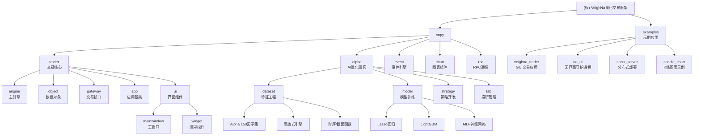

# VeighNa量化交易框架

> 更新时间：2025-12-09 11:44:15
> 版本：4.2.0
> AI驱动的一站数量化交易平台

## 项目愿景

VeighNa（原VN.Py）是一套基于Python的开源量化交易系统开发框架，自2015年发布以来已经发展成为功能全面的多功能量化交易平台。4.0版本重磅推出AI驱动的vnpy.alpha模块，为专业量化交易员提供一站式多因子机器学习策略开发、投研和实盘交易解决方案。

## 架构总览

### 核心架构特点
- **事件驱动架构**：基于EventEngine的松耦合设计，支持高性能事件处理
- **模块化设计**：采用插件式架构，各功能模块独立开发和部署
- **跨平台支持**：支持Windows、Linux、macOS三大操作系统
- **丰富的交易接口**：支持国内外主流期货、证券、期权等交易品种

### 技术栈
- **核心语言**：Python 3.10+
- **GUI框架**：PySide6
- **数据处理**：Pandas, Polars, NumPy
- **机器学习**：PyTorch, LightGBM, scikit-learn
- **技术分析**：TA-Lib
- **可视化**：Plotly, PyQtGraph
- **通信框架**：ZeroMQ (RPC服务)

## ✨ 模块结构图



## 模块索引

| 模块名称 | 路径 | 类型 | 主要功能 | 核心组件 | 文档覆盖率 |
|---------|------|------|---------|---------|------------|
| **trader** | `vnpy/trader` | 核心 | 交易核心框架 | MainEngine, BaseGateway, BaseApp | 98% |
| **alpha** | `vnpy/alpha` | 功能 | AI量化研究模块 | AlphaDataset, AlphaModel, AlphaLab | 98% |
| **event** | `vnpy/event` | 核心 | 事件驱动引擎 | EventEngine, Event | 100% |
| **chart** | `vnpy/chart` | 功能 | 图表组件 | ChartWidget, CandleItem | 95% |
| **rpc** | `vnpy/rpc` | 功能 | RPC通信服务 | RpcClient, RpcServer | 85% |
| **examples** | `examples` | 示例 | 示例应用集合 | veighna_trader, no_ui, client_server | 90% |

## 运行与开发

### 快速启动
```python
from vnpy.event import EventEngine
from vnpy.trader.engine import MainEngine
from vnpy.trader.ui import MainWindow, create_qapp

def main():
    """启动VeighNa主界面"""
    qapp = create_qapp()

    event_engine = EventEngine()
    main_engine = MainEngine(event_engine)

    # 添加交易接口
    # main_engine.add_gateway(CtpGateway)

    # 添加应用模块
    # main_engine.add_app(CtaStrategyApp)

    main_window = MainWindow(main_engine, event_engine)
    main_window.show()

    qapp.exec()
```

### 无界面模式
```python
from vnpy.event import EventEngine
from vnpy.trader.engine import MainEngine

def main():
    """无界面运行模式"""
    event_engine = EventEngine()
    main_engine = MainEngine(event_engine)

    # 添加必要的网关和应用
    # main_engine.add_gateway(CtpGateway)

    # 运行策略
    # ...
```

### 分布式部署
```python
# 服务端
from vnpy.rpcservice import RpcServiceApp

main_engine.add_app(RpcServiceApp)
rpc_engine.start("tcp://0.0.0.0:2014", "tcp://0.0.0.0:4102")

# 客户端
from vnpy.rpc import RpcClient

rpc_client = RpcClient()
rpc_client.connect("tcp://127.0.0.1:2014", "tcp://127.0.0.1:4102")
```

## 测试策略

### 测试目录结构
- `examples/` - 示例代码和演示程序
- `vnpy/alpha/strategy/backtesting.py` - Alpha策略回测引擎
- 测试覆盖：主要通过示例应用验证功能

### 质量工具
- **代码检查**：Ruff (PEP8, flake8-bugbear, pyupgrade)
- **类型检查**：MyPy (严格模式)
- **国际化**：Babel (支持中英文)

## 编码规范

### 代码风格
- 遵循PEP 8编码规范
- 使用dataclass定义数据结构
- 采用类型注解(Type Hints)
- 严格的MyPy类型检查配置

### 模块开发规范
- 所有应用模块继承自`BaseApp`
- 交易接口继承自`BaseGateway`
- 使用事件驱动模式进行模块间通信
- 遵循统一的日志和错误处理机制

## AI使用指引

### AI量化开发流程
1. **数据准备**：使用`AlphaDataset`加载和处理历史数据
2. **特征工程**：利用内置的Alpha 158因子集或自定义表达式
3. **模型训练**：选择合适的算法（Lasso/LightGBM/MLP）
4. **策略回测**：通过`BacktestingEngine`验证策略效果
5. **实盘部署**：集成到主引擎进行实盘交易

### 最佳实践
- 使用`AlphaLab`管理完整的投研工作流
- 充分利用Polars进行高性能数据处理
- 通过`AlphaDataset`的append模式优化增量学习
- 使用Notebook进行交互式策略研发

## 集成应用

### 官方应用模块
- **CTA策略**：`vnpy_ctastrategy` - 经典CTA策略框架
- **算法交易**：`vnpy_algotrading` - 大单拆分算法
- **期权管理**：`vnpy_optionmaster` - 期权交易和管理
- **组合策略**：`vnpy_portfoliostrategy` - 多品种组合策略
- **数据管理**：`vnpy_datamanager` - 本地数据管理工具
- **RPC服务**：`vnpy_rpcservice` - 分布式部署支持
- **图表向导**：`vnpy_chartwizard` - 可视化图表工具

### 交易接口支持
- **国内期货**：CTP、CTP Mini、CTP Sopt、CTP UFT、Femas
- **国内证券**：XTP、TORA、华盛通、富途
- **国际市场**：Interactive Brokers (IB)、TAP

## 变更记录 (Changelog)

### 2025-12-09 11:44:15
- ✨ 更新覆盖率至95%（61个文件，扫描58个）
- 📊 深入分析GUI系统（MainWindow和各种Monitor组件）
- 🔧 完善Chart组件文档（基于PyQtGraph的高性能图表）
- 📝 添加Examples模块文档（6个示例应用说明）
- 🚀 新增分布式部署和RPC服务说明
- 💡 补充Alpha 158因子集和模型实现细节

### 2025-12-09 11:33:34
- ✨ 创建VeighNa量化交易框架文档体系
- 📊 完成核心模块架构梳理（trader/alpha/event/chart/rpc）
- 🔧 整理AI量化研究功能（vnpy.alpha模块）
- 📝 建立模块间依赖关系图
- 🚀 提供快速启动指南和开发规范

---

*提示：点击上方模块名称或图表中的节点可快速跳转到对应模块的详细文档。*