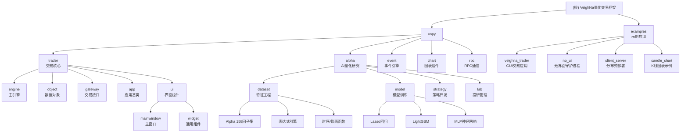

# VeighNa量化交易框架

> 更新时间：2026-03-08 | 版本：4.3.0 | AI驱动的一站式量化交易平台

## 🚀 快速导航

| 文档类型 | 文档名称 | 描述 |
|---------|---------|------|
| 📖 启动指南 | [STARTUP_GUIDE.md](STARTUP_GUIDE.md) | 环境验证、配置模式、学习路径 |
| 📋 变更记录 | [CHANGES.md](CHANGES.md) | 项目历史变更和新功能记录 |
| 🔧 开发指南 | [DEVELOPMENT_GUIDE.md](DEVELOPMENT_GUIDE.md) | 测试策略、编码规范、质量工具 |
| 📝 今日工作 | [TODAY_WORK_SUMMARY.md](TODAY_WORK_SUMMARY.md) | 2026-06-12 配置工作总结（QMT环境配置） |
| 📊 模块文档 | [模块详细文档](#模块索引) | 各模块的详细技术文档 |

## 🖥️ 本地环境配置

### Conda 环境
- **环境名称**: quant-3.11
- **Python 版本**: 3.11.15
- **Windows路径**: `D:\Scoop\apps\miniconda3\current\envs\quant-3.11`
- **macOS路径**: `/opt/homebrew/caskroom/miniconda/base`

### 已安装的包
- **vnpy** (核心框架) - 版本 4.4.0
- **xtquant** (迅投QMT Python接口) - 版本 xtquant_250516  
- **vnpy_qmt** (QMT证券交易接口) - 版本 0.3.3 - **已应用补丁** (见 patches/ 目录)
- vnpy_tushare (Tushare数据接口)

### QMT 配置
- **QMT 账号**: ******
- **MiniQMT 路径**: `D:/国金证券QMT交易端/userdata_mini/` ⚠️ **必须是 userdata_mini 子目录！**
- **xtquant 模块**: 已完整安装到 conda 环境（版本 xtquant_250516）
- **验证脚本**: [test_qmt_installation.py](test_qmt_installation.py) - 验证QMT环境配置

### 启动命令
```bash
# 启动 QMT 交易客户端
conda run -n Quant-3.11 python examples/veighna_trader/run_qmt.py

# 启动演示应用
conda run -n Quant-3.11 python demo_app.py
```

## 💡 项目愿景

VeighNa（原VN.Py）是一套基于Python的开源量化交易系统开发框架，自2015年发布以来已经发展成为功能全面的多功能量化交易平台。4.0版本重磅推出AI驱动的vnpy.alpha模块，为专业量化交易员提供一站式多因子机器学习策略开发、投研和实盘交易解决方案。

## 🏗️ 架构总览

### 核心架构特点
- **事件驱动架构**：基于EventEngine的松耦合设计，支持高性能事件处理
- **模块化设计**：采用插件式架构，各功能模块独立开发和部署
- **跨平台支持**：支持Windows、Linux、macOS三大操作系统
- **丰富的交易接口**：支持国内外主流期货、证券、期权等交易品种

### 技术栈
- **核心语言**：Python 3.10+
- **GUI框架**：PySide6
- **数据处理**：Pandas, Polars, NumPy
- **机器学习**：PyTorch, LightGBM, scikit-learn
- **技术分析**：TA-Lib
- **可视化**：Plotly, PyQtGraph
- **通信框架**：ZeroMQ (RPC服务)

## 📊 模块结构图


```mermaid
graph TD
    A["(根) VeighNa量化交易框架"] --> B["vnpy"];
    A --> H["examples<br/>示例应用"];

    B --> C["trader<br/>交易核心"];
    B --> D["alpha<br/>AI量化研究"];
    B --> E["event<br/>事件引擎"];
    B --> F["chart<br/>图表组件"];
    B --> G["rpc<br/>RPC通信"];

    C --> C1["engine<br/>主引擎"];
    C --> C2["object<br/>数据对象"];
    C --> C3["gateway<br/>交易接口"];
    C --> C4["app<br/>应用基类"];
    C --> C5["ui<br/>界面组件"];
    C5 --> C51["mainwindow<br/>主窗口"];
    C5 --> C52["widget<br/>通用组件"];

    D --> D1["dataset<br/>特征工程"];
    D --> D2["model<br/>模型训练"];
    D --> D3["strategy<br/>策略开发"];
    D --> D4["lab<br/>投研管理"];

    D1 --> D11["Alpha 158因子集"];
    D1 --> D12["表达式引擎"];
    D1 --> D13["时序/截面函数"];

    D2 --> D21["Lasso回归"];
    D2 --> D22["LightGBM"];
    D2 --> D23["MLP神经网络"];

    H --> H1["veighna_trader<br/>GUI交易应用"];
    H --> H2["no_ui<br/>无界面守护进程"];
    H --> H3["client_server<br/>分布式部署"];
    H --> H4["candle_chart<br/>K线图表示例"];

    click C "./vnpy/trader/CLAUDE.md" "查看 trader 模块文档"
    click D "./vnpy/alpha/CLAUDE.md" "查看 alpha 模块文档"
    click E "./vnpy/event/CLAUDE.md" "查看 event 模块文档"
    click F "./vnpy/chart/CLAUDE.md" "查看 chart 模块文档"
    click G "./vnpy/rpc/CLAUDE.md" "查看 rpc 模块文档"
    click H "./examples/CLAUDE.md" "查看 examples 模块文档"
```

## 📚 模块索引

| 模块名称 | 路径 | 类型 | 主要功能 | 核心组件 | 文档覆盖率 |
|---------|------|------|---------|---------|------------|
| **trader** | `vnpy/trader` | 核心 | 交易核心框架 | MainEngine, BaseGateway, BaseApp | 100% |
| **alpha** | `vnpy/alpha` | 功能 | AI量化研究模块 | AlphaDataset, AlphaModel, AlphaLab | 100% |
| **event** | `vnpy/event` | 核心 | 事件驱动引擎 | EventEngine, Event | 100% |
| **chart** | `vnpy/chart` | 功能 | 图表组件 | ChartWidget, CandleItem | 100% |
| **rpc** | `vnpy/rpc` | 功能 | RPC通信服务 | RpcClient, RpcServer | 100% |
| **examples** | `examples` | 示例 | 示例应用集合 | veighna_trader, no_ui, simple_chart, demo_app | 100% |

## 🎯 运行示例

### 启动主界面
```python
from vnpy.event import EventEngine
from vnpy.trader.engine import MainEngine
from vnpy.trader.ui import MainWindow, create_qapp

def main():
    """启动VeighNa主界面"""
    qapp = create_qapp()
    event_engine = EventEngine()
    main_engine = MainEngine(event_engine)
    
    # 添加交易接口和应用模块
    # main_engine.add_gateway(CtpGateway)
    # main_engine.add_app(CtaStrategyApp)
    
    main_window = MainWindow(main_engine, event_engine)
    main_window.show()
    qapp.exec()
```

### 演示应用（推荐新手）
项目根目录提供了 `demo_app.py` 功能演示应用：
- **零依赖**：无需交易接口或历史数据
- **完整演示**：展示事件引擎、主引擎、图表组件、Alpha模块
- **实时更新**：模拟实时K线数据更新

运行方式：`python demo_app.py`

## 🤖 AI量化开发流程

1. **数据准备**：使用`AlphaDataset`加载和处理历史数据
2. **特征工程**：利用内置的Alpha 158因子集或自定义表达式
3. **模型训练**：选择合适的算法（Lasso/LightGBM/MLP）
4. **策略回测**：通过`BacktestingEngine`验证策略效果
5. **实盘部署**：集成到主引擎进行实盘交易

## 🔌 集成应用

### 官方应用模块
- **CTA策略**：`vnpy_ctastrategy` - 经典CTA策略框架
- **算法交易**：`vnpy_algotrading` - 大单拆分算法
- **期权管理**：`vnpy_optionmaster` - 期权交易和管理
- **组合策略**：`vnpy_portfoliostrategy` - 多品种组合策略
- **数据管理**：`vnpy_datamanager` - 本地数据管理工具
- **RPC服务**：`vnpy_rpcservice` - 分布式部署支持
- **图表向导**：`vnpy_chartwizard` - 可视化图表工具

### 交易接口支持
- **国内期货**：CTP、CTP Mini、CTP Sopt、CTP UFT、Femas
- **国内证券**：XTP、TORA、华盛通、富途
- **国际市场**：Interactive Brokers (IB)、TAP

---

*点击上方模块名称或图表中的节点可快速跳转到对应模块的详细文档。详细变更记录请查看 [CHANGES.md](CHANGES.md)，开发规范请查看 [DEVELOPMENT_GUIDE.md](DEVELOPMENT_GUIDE.md)。*