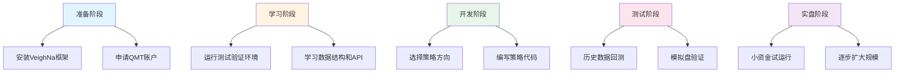

# VeighNa 个人量化交易者完整指南（QMT版）

> 基于VeighNa 4.3.0 + 迅投QMT接口
> 适用于：A股个人量化交易者
> 更新时间：2026-01-18

## 📖 文档概述

本指南专为**个人量化交易者**设计，提供从零开始到实盘交易的完整路径。重点介绍使用**迅投QMT接口**进行A股量化交易的全流程，包括环境搭建、策略开发、模拟测试到实盘部署。

### 为什么选择QMT接口？

- ✅ **个人可申请**：相比机构接口，QMT对个人投资者开放申请
- ✅ **全市场覆盖**：支持股票、ETF、可转债、期权等多个品种
- ✅ **稳定可靠**：迅投科技专业金融终端，稳定性有保障
- ✅ **行情丰富**：提供Level-2行情、资金流向等数据
- ✅ **社区活跃**：VeighNa官方支持，社区资源丰富

---

## 🎯 使用路径概览



---

## 第一部分：环境准备

### 1.1 系统要求

**硬件配置：**
- CPU：4核以上推荐
- 内存：8GB以上（推荐16GB）
- 硬盘：50GB以上可用空间（历史数据存储）
- 网络：稳定的互联网连接

**软件环境：**
- 操作系统：Windows 10/11 或 Windows Server 2019+
- Python版本：3.10 或 3.13（推荐3.13）
- 数据库：SQLite（默认）或 MySQL（可选）

### 1.2 安装VeighNa框架

```bash
# 1. 克隆项目
git clone https://github.com/vnpy/vnpy.git
cd vnpy

# 2. 创建虚拟环境（推荐）
python -m venv venv
venv\Scripts\activate  # Windows
# 或
source venv/bin/activate  # Linux/Mac

# 3. 安装VeighNa
pip install -e .

# 4. 验证安装
python test_quick.py
```

### 1.3 安装QMT接口

```bash
# 方式1：从pip安装（推荐）
pip install vnpy_qmt

# 方式2：从源码安装（如需最新版本）
git clone https://github.com/vnpy/vnpy_qmt.git
cd vnpy_qmt
pip install -e .
```

### 1.4 安装必备应用模块

```bash
# CTA策略模块（最常用）
pip install vnpy_ctastrategy

# 回测模块
pip install vnpy_ctabacktester

# 算法交易模块（适合大额资金）
pip install vnpy_algotrading

# 组合策略模块（适合多品种交易）
pip install vnpy_portfoliostrategy

# 数据服务（三选一）
pip install vnpy_xt       # 迅投研数据（推荐，QMT用户有优惠）
pip install vnpy_tushare  # TuShare（免费版可用）
pip install vnpy_rqdata   # 米筐数据（收费，质量最好）
```

---

## 第二部分：QMT接口配置

### 2.1 申请QMT账户

**申请流程：**

1. **下载QMT客户端**
   - 访问[迅投官网](https://www.thinktrader.net/)
   - 下载最新版QMT终端

2. **开通券商账户**
   - 支持QMT的券商列表：
     - 国金证券
     - 中信建投
     - 华泰证券
     - 申万宏源
     - 银河证券
     - 更多券商请咨询迅投客服

3. **申请QMT权限**
   - 联系券商客户经理
   - 申请开通"迅投QMT"交易权限
   - 说明用途：个人量化交易
   - 通常需要风险测评和协议签署

4. **获取配置信息**
   ```plaintext
   需要获取的信息：
   - QMT安装路径
   - 用户账号（资金账号）
   - 密码
   - 交易服务器地址
   - 行情服务器地址
   ```

### 2.2 配置QMT连接

**方式1：通过VeighNa Trader界面配置**

```python
# 启动VeighNa Trader
cd examples/veighna_trader
python run.py

# 在界面中：
# 1. 点击"系统" -> "交易接口"
# 2. 选择"QMT Gateway"
# 3. 填写配置信息：
#    - 用户名：[资金账号]
#    - 密码：[交易密码]
#    - QMT路径：C:\Program Files\QMT\...  # QMT安装路径
#    - 交易服务器：[由券商提供]
#    - 行情服务器：[由券商提供]
# 4. 点击"连接"
```

**方式2：通过代码配置**

```python
# config_qmt.py
from pathlib import Path

# QMT配置文件
QMT_SETTINGS = {
    "用户名": "你的资金账号",
    "密码": "你的交易密码",
    "QMT路径": r"C:\Program Files\QMT\userdata",
    "会话ID": 0,  # QMT session_id，通常为0
    "行情服务器": "127.0.0.1:47404",  # 本地行情端口
    "交易服务器": "127.0.0.1:47405",  # 本地交易端口
}
```

### 2.3 测试QMT连接

```python
# test_qmt_connection.py
from vnpy.event import EventEngine
from vnpy.trader.engine import MainEngine
from vnpy_qmt import QmtGateway

def test_qmt_connection():
    """测试QMT连接"""
    event_engine = EventEngine()
    main_engine = MainEngine(event_engine)

    # 添加QMT网关
    main_engine.add_gateway(QmtGateway)

    # 在VeighNa Trader界面中配置连接信息
    # 或通过配置文件读取

    print("QMT连接测试...")
    print("请在VeighNa Trader界面中配置QMT连接信息并点击连接")

    input("按回车键退出...")

if __name__ == "__main__":
    test_qmt_connection()
```

---

## 第三部分：策略开发

### 3.1 策略类型选择

根据个人交易风格选择合适的策略类型：

| 策略类型 | 适用场景 | 模块 | 代码复杂度 |
|---------|---------|------|-----------|
| **CTA趋势策略** | 趋势跟踪、突破策略 | vnpy_ctastrategy | ⭐⭐ |
| **Alpha选股策略** | 多因子选股、轮动 | vnpy_portfoliostrategy | ⭐⭐⭐⭐ |
| **网格交易策略** | 震荡市场、高抛低吸 | vnpy_ctastrategy | ⭐⭐⭐ |
| **套利策略** | 跨品种、跨期套利 | vnpy_spreadtrading | ⭐⭐⭐⭐⭐ |
| **算法交易** | 大额资金拆单 | vnpy_algotrading | ⭐⭐⭐⭐ |

### 3.2 简单CTA策略示例

```python
# strategies/dual_thrust_strategy.py
from vnpy_ctastrategy import (
    CtaTemplate,
    StrategyData,
    TickData,
    BarData,
    TradeData,
    OrderData,
    StopOrder,
    BarGenerator,
    ArrayManager,
)

class DualThrustStrategy(CtaTemplate):
    """Dual Thrust策略

    经典的日内突破策略，适合A股T+1规则下的开盘突破交易
    """

    author = "量化交易者"

    # 策略参数
    k1: float = 0.5        # 上轨系数
    k2: float = 0.5        # 下轨系数
    window: int = 30       # 计算窗口
    fixed_size: int = 100  # 固定手数

    # 策略变量
    bg: BarGenerator = None
    am: ArrayManager = None
    upper_band: float = 0
    lower_band: float = 0

    parameters = ["k1", "k2", "window", "fixed_size"]
    variables = ["upper_band", "lower_band"]

    def __init__(self, cta_engine: object, strategy_name: str, vt_symbol: str, setting: dict):
        """初始化"""
        super().__init__(cta_engine, strategy_name, vt_symbol, setting)

        # K线生成器：将Tick合成为1分钟K线
        self.bg = BarGenerator(self.on_bar, window=5, on_window_bar=self.on_5min_bar)
        # 时间序列管理器：管理技术指标计算
        self.am = ArrayManager(self.window)

    def on_init(self):
        """策略初始化"""
        self.write_log("Dual Thrust策略初始化")
        # 加载历史数据用于计算指标
        self.load_bar(self.window)

    def on_start(self):
        """策略启动"""
        self.write_log("Dual Thrust策略启动")

    def on_stop(self):
        """策略停止"""
        self.write_log("Dual Thrust策略停止")

    def on_tick(self, tick: TickData):
        """Tick数据回调"""
        self.bg.update_tick(tick)

    def on_bar(self, bar: BarData):
        """1分钟K线回调"""
        self.bg.update_bar(bar)

    def on_5min_bar(self, bar: BarData):
        """5分钟K线回调"""
        self.am.update_bar(bar)

        if not self.am.inited:
            return

        # 计算Dual Thrust上下轨
        hh = self.am.highest(self.window, "high_price")
        ll = self.am.lowest(self.window, "low_price")
        hc = self.am.high_close(self.window)
        lc = self.am.low_close(self.window)

        range_high = hh - lc
        range_low = hc - ll

        self.upper_band = bar.open_price + self.k1 * range_high
        self.lower_band = bar.open_price - self.k2 * range_low

        # 持仓检查
        long_pos = self.pos >= 0
        short_pos = self.pos <= 0

        # 突破上轨，买入
        if not long_pos and bar.close_price >= self.upper_band:
            self.buy(bar.close_price + 5, self.fixed_size, stop=False)

        # 突破下轨，卖出
        elif not short_pos and bar.close_price <= self.lower_band:
            self.short(bar.close_price - 5, self.fixed_size, stop=False)

        # 止盈止损
        if long_pos and bar.close_price <= self.lower_band:
            self.sell(bar.close_price - 5, abs(self.pos), stop=False)

        elif short_pos and bar.close_price >= self.upper_band:
            self.cover(bar.close_price + 5, abs(self.pos), stop=False)

        # 同步图形界面
        self.put_event()
```

### 3.3 Alpha多因子策略示例

```python
# strategies/alpha_stock_strategy.py
from vnpy_portfoliostrategy import StrategyTemplate
from vnpy.trader.object import BarData, TickData, OrderData, TradeData
from vnpy.trader.constant import Interval
import pandas as pd
import numpy as np

class AlphaStockStrategy(StrategyTemplate):
    """Alpha多因子选股策略

    基于技术指标的选股策略，适合A股T+1规则
    """

    author = "量化交易者"

    # 策略参数
    lookback_days: int = 20        # 回看天数
    stock_pool_size: int = 50      # 股票池大小
    rebalance_days: int = 5        # 调仓周期（天）
    top_n: int = 10                # 选股数量

    # 因子权重
    momentum_weight: float = 0.4
    volatility_weight: float = 0.3
    volume_weight: float = 0.3

    parameters = [
        "lookback_days",
        "stock_pool_size",
        "rebalance_days",
        "top_n",
        "momentum_weight",
        "volatility_weight",
        "volume_weight"
    ]

    def __init__(self, strategy_engine, strategy_name: str, vt_symbols: list, setting: dict):
        """初始化"""
        super().__init__(strategy_engine, strategy_name, vt_symbols, setting)

        self.stock_data = {}  # 存储股票数据
        self.factor_scores = {}  # 因子得分

    def on_init(self):
        """策略初始化"""
        self.write_log("Alpha选股策略初始化")
        # 加载历史数据
        for vt_symbol in self.vt_symbols:
            bars = self.load_bar(
                vt_symbol,
                days=self.lookback_days,
                interval=Interval.DAILY
            )
            self.stock_data[vt_symbol] = bars

    def calculate_factors(self, vt_symbol: str) -> float:
        """计算综合因子得分"""
        bars = self.stock_data.get(vt_symbol, [])

        if len(bars) < self.lookback_days:
            return 0.0

        df = pd.DataFrame([{
            "datetime": bar.datetime,
            "close": bar.close_price,
            "high": bar.high_price,
            "low": bar.low_price,
            "volume": bar.volume
        } for bar in bars])

        # 动量因子：20日收益率
        momentum = (df["close"].iloc[-1] / df["close"].iloc[0] - 1) * 100

        # 波动率因子：20日标准差
        returns = df["close"].pct_change()
        volatility = returns.std() * 100

        # 成交量因子：量比
        recent_volume = df["volume"].iloc[-5:].mean()
        past_volume = df["volume"].iloc[-20:-5].mean()
        volume_ratio = (recent_volume / past_volume - 1) * 100

        # 标准化并加权
        score = (
            momentum * self.momentum_weight +
            (100 - volatility) * self.volatility_weight +
            volume_ratio * self.volume_weight
        )

        return score

    def on_ba(self):
        """交易时间到达（每天盘后调用）"""
        # 计算所有股票的因子得分
        for vt_symbol in self.vt_symbols:
            score = self.calculate_factors(vt_symbol)
            self.factor_scores[vt_symbol] = score

        # 选出得分最高的N只股票
        sorted_stocks = sorted(
            self.factor_scores.items(),
            key=lambda x: x[1],
            reverse=True
        )
        target_stocks = sorted_stocks[:self.top_n]

        # 调仓逻辑
        target_symbols = [s[0] for s in target_stocks]

        # 卖出不在目标池中的股票
        for vt_symbol in self.get_pos_holdings():
            if vt_symbol not in target_symbols:
                self.sell(vt_symbol, "全部", order_type="市价单")

        # 买入目标股票（等权配置）
        for vt_symbol in target_symbols:
            current_pos = self.get_pos(vt_symbol)
            if current_pos == 0:
                self.buy(vt_symbol, "等权", order_type="市价单")

    def on_trade(self, trade: TradeData):
        """成交回调"""
        self.write_log(f"成交: {trade.vt_symbol}, 方向: {trade.direction}, "
                      f"价格: {trade.price}, 数量: {trade.volume}")

    def on_order(self, order: OrderData):
        """委托回调"""
        self.write_log(f"委托: {order.vt_symbol}, 状态: {order.status}, "
                      f"价格: {order.price}, 数量: {order.volume}")
```

### 3.4 网格交易策略示例

```python
# strategies/grid_trading_strategy.py
from vnpy_ctastrategy import CtaTemplate, BarGenerator, ArrayManager
from vnpy.trader.object import TickData, BarData, TradeData, OrderData
from vnpy.trader.constant import Direction

class GridTradingStrategy(CtaTemplate):
    """网格交易策略

    适合震荡市场，在设定的价格网格上高抛低吸
    """

    author = "量化交易者"

    # 策略参数
    grid_height: float = 0.01   # 网格高度（百分比）
    grid_levels: int = 10       # 网格层数
    fixed_size: int = 100       # 每格交易数量

    # 策略变量
    bg: BarGenerator = None
    base_price: float = 0       # 基准价格
    grid_lines: list = []       # 网格线列表
    last_grid_level: int = 0    # 上次触发的网格层级

    parameters = ["grid_height", "grid_levels", "fixed_size"]
    variables = ["base_price", "grid_lines", "last_grid_level"]

    def __init__(self, cta_engine, strategy_name, vt_symbol, setting):
        super().__init__(cta_engine, strategy_name, vt_symbol, setting)
        self.bg = BarGenerator(self.on_bar)

    def on_init(self):
        """策略初始化"""
        self.write_log("网格交易策略初始化")
        self.load_bar(20)

        # 计算基准价格（使用20日均线）
        bars = self.load_bar(20)
        if bars:
            self.base_price = sum(bar.close_price for bar in bars) / len(bars)

        # 生成网格线
        step = self.base_price * self.grid_height
        self.grid_lines = [
            self.base_price + step * i
            for i in range(-self.grid_levels // 2, self.grid_levels // 2 + 1)
        ]

        self.write_log(f"基准价格: {self.base_price:.2f}, 网格线: {self.grid_lines}")

    def on_tick(self, tick: TickData):
        """Tick回调"""
        self.bg.update_tick(tick)

    def on_bar(self, bar: BarData):
        """K线回调"""
        # 判断当前价格所在网格层级
        current_level = self.get_grid_level(bar.close_price)

        # 价格上升，卖出
        if current_level > self.last_grid_level and self.pos > 0:
            sell_price = self.grid_lines[current_level - 1]
            self.sell(sell_price, self.fixed_size)

        # 价格下降，买入
        elif current_level < self.last_grid_level and self.pos < self.grid_levels * self.fixed_size:
            buy_price = self.grid_lines[current_level + 1]
            self.buy(buy_price, self.fixed_size)

        self.last_grid_level = current_level

    def get_grid_level(self, price: float) -> int:
        """获取价格所在的网格层级"""
        for i, line in enumerate(self.grid_lines):
            if price <= line:
                return i - self.grid_levels // 2
        return self.grid_levels // 2
```

---

## 第四部分：策略回测

### 4.1 使用CtaBacktester回测

```python
# backtesting/run_backtest.py
from vnpy.event import EventEngine
from vnpy.trader.engine import MainEngine
from vnpy.trader.database import get_database, BaseDatabase
from vnpy_ctastrategy.backtesting import BacktestingEngine, OptimizationSetting
from datetime import datetime
import pandas as pd

# 导入策略
import sys
sys.path.append(".")
from strategies.dual_thrust_strategy import DualThrustStrategy

def run_backtest():
    """运行回测"""

    # 创建回测引擎
    engine = BacktestingEngine()

    # 设置回测参数
    engine.set_parameters(
        vt_symbol="600000ETF.SSE",  # 交易标的
        interval="1m",               # K线周期
        start=datetime(2024, 1, 1),  # 回测开始日期
        end=datetime(2024, 12, 31),  # 回测结束日期
        rate=0.3/10000,              # 手续费率（万0.3）
        slippage=0.2,                # 滑点（跳）
        size=100,                    # 合约乘数
        pricetick=0.001,             # 最小价格跳动
        capital=100000,              # 初始资金
    )

    # 加载历史数据
    database = get_database()
    bars = database.load_bar_data(
        symbol="600000ETF",
        exchange="SSE",
        interval="1m",
        start=datetime(2024, 1, 1),
        end=datetime(2024, 12, 31)
    )
    engine.load_data(bars)

    # 添加策略
    engine.add_strategy(
        DualThrustStrategy,
        {
            "k1": 0.5,
            "k2": 0.5,
            "window": 30,
            "fixed_size": 100
        }
    )

    # 运行回测
    engine.run_backtesting()

    # 计算回测结果
    result = engine.calculate_result()

    # 输出结果
    print("=" * 50)
    print("回测结果统计")
    print("=" * 50)
    print(f"总资金: {result['end_balance']:.2f}")
    print(f"总收益率: {result['total_return']:.2f}%")
    print(f"年化收益率: {result['annual_return']:.2f}%")
    print(f"最大回撤: {result['max_drawdown']:.2f}%")
    print(f"夏普比率: {result['sharpe_ratio']:.2f}")

    print("\n交易统计")
    print("-" * 50)
    print(f"总交易次数: {result['total_trades']}")
    print(f"盈利交易: {result['winning_trades']}")
    print(f"亏损交易: {result['losing_trades']}")
    print(f"胜率: {result['win_rate']:.2f}%")

    print("\n盈亏统计")
    print("-" * 50)
    print(f"总盈利: {result['total_pnl']:.2f}")
    print(f"平均盈利: {result['average_pnl']:.2f}")
    print(f"最大单笔盈利: {result['best_trade']:.2f}")
    print(f"最大单笔亏损: {result['worst_trade']:.2f}")

    # 绘制图表
    engine.show_result()

    return result

def optimize_strategy():
    """参数优化"""

    engine = BacktestingEngine()

    # 设置回测参数
    engine.set_parameters(
        vt_symbol="600000ETF.SSE",
        interval="1m",
        start=datetime(2024, 1, 1),
        end=datetime(2024, 12, 31),
        rate=0.3/10000,
        slippage=0.2,
        size=100,
        pricetick=0.001,
        capital=100000,
    )

    # 加载数据
    database = get_database()
    bars = database.load_bar_data(
        symbol="600000ETF",
        exchange="SSE",
        interval="1m",
        start=datetime(2024, 1, 1),
        end=datetime(2024, 12, 31)
    )
    engine.load_data(bars)

    # 设置优化目标
    optimization_setting = OptimizationSetting()
    optimization_setting.set_target("sharpe_ratio")

    # 设置参数范围
    optimization_setting.add_parameter("k1", 0.3, 0.7, 0.1)
    optimization_setting.add_parameter("k2", 0.3, 0.7, 0.1)
    optimization_setting.add_parameter("window", 20, 40, 5)

    # 运行优化
    result = engine.run_optimization(
        DualThrustStrategy,
        optimization_setting,
        is_multi_process=True  # 多进程加速
    )

    # 输出最优参数
    print("\n最优参数组合:")
    print("-" * 50)
    for i, param in enumerate(result[:10]):
        print(f"{i+1}. {param}")

if __name__ == "__main__":
    # 运行回测
    result = run_backtest()

    # 运行优化（可选）
    # optimize_strategy()
```

### 4.2 使用PortfolioStrategy回测

```python
# backtesting/run_portfolio_backtest.py
from vnpy_portfoliostrategy import BacktestingEngine
from datetime import datetime
from strategies.alpha_stock_strategy import AlphaStockStrategy

def run_portfolio_backtest():
    """组合策略回测"""

    # 创建回测引擎
    engine = BacktestingEngine()

    # 设置回测参数
    engine.set_parameters(
        vt_symbols=["000001.SZSE", "000002.SZSE", "600000.SSE"],  # 股票池
        interval="d",              # 日线
        start=datetime(2024, 1, 1),
        end=datetime(2024, 12, 31),
        capital=1000000,           # 100万初始资金
    )

    # 添加策略
    engine.add_strategy(
        AlphaStockStrategy,
        {
            "lookback_days": 20,
            "stock_pool_size": 50,
            "rebalance_days": 5,
            "top_n": 10
        }
    )

    # 运行回测
    engine.run_backtesting()

    # 获取结果
    df = engine.get_result()

    print(df.describe())

    # 绘制净值曲线
    import matplotlib.pyplot as plt
    df["net_value"].plot()
    plt.title("策略净值曲线")
    plt.show()

if __name__ == "__main__":
    run_portfolio_backtest()
```

---

## 第五部分：模拟盘验证

### 5.1 QMT模拟盘设置

QMT提供**7x24小时模拟环境**，与实盘环境完全一致：

```python
# paper_trading/paper_qmt_config.py
"""QMT模拟盘配置"""

# 模拟盘配置
PAPER_TRADING_CONFIG = {
    # 模拟账户信息
    "account": {
        "userid": "模拟账号",  # 在QMT中获取
        "password": "模拟密码",
        "session_id": 0,
    },

    # 模拟环境设置
    "environment": {
        "is_paper_trading": True,  # 启用模拟模式
        "slippage_mode": "fixed",  # 滑点模式：fixed/percent
        "slippage_value": 0.001,   # 固定滑点值
        "commission_mode": "percent",  # 手续费模式
        "commission_value": 0.0003,   # 万分之三
    },

    # 风控设置
    "risk_control": {
        "max_position": 1000000,    # 最大持仓金额
        "max_single_order": 100000, # 单笔最大金额
        "max_daily_trades": 50,     # 每日最大交易次数
    }
}
```

### 5.2 启动模拟盘交易

```python
# paper_trading/run_paper_trading.py
from vnpy.event import EventEngine
from vnpy.trader.engine import MainEngine
from vnpy.trader.ui import MainWindow, create_qapp
from vnpy_qmt import QmtGateway
from vnpy_ctastrategy import CtaStrategyApp
from strategies.dual_thrust_strategy import DualThrustStrategy

def main():
    """启动模拟盘交易"""

    # 创建应用
    qapp = create_qapp()

    # 创建事件引擎
    event_engine = EventEngine()

    # 创建主引擎
    main_engine = MainEngine(event_engine)

    # 添加QMT网关（模拟盘模式）
    main_engine.add_gateway(QmtGateway)

    # 添加CTA策略应用
    main_engine.add_app(CtaStrategyApp)

    # 创建主窗口
    main_window = MainWindow(main_engine, event_engine)
    main_window.showMaximized()

    # 在界面中配置：
    # 1. 连接QMT（选择模拟盘服务器）
    # 2. 添加策略
    # 3. 启动策略

    print("=" * 50)
    print("VeighNa + QMT 模拟盘交易系统")
    print("=" * 50)
    print("请按照以下步骤操作：")
    print("1. 在界面中连接QMT（模拟盘）")
    print("2. 在【CTA策略】模块添加策略")
    print("3. 配置策略参数并初始化")
    print("4. 启动策略进行模拟交易")
    print("=" * 50)

    qapp.exec()

if __name__ == "__main__":
    main()
```

### 5.3 模拟盘验证清单

```markdown
## 模拟盘验证清单（至少运行1-3个月）

### 第一周：基础功能验证
- [ ] QMT连接稳定性
- [ ] 行情数据接收正常
- [ ] 委托下单功能正常
- [ ] 撤单功能正常
- [ ] 持仓查询正确
- [ ] 资金查询正确

### 第2-4周：策略稳定性验证
- [ ] 策略逻辑正确执行
- [ ] 无异常报错
- [ ] 信号触发及时
- [ ] 滑点在可接受范围
- [ ] 手续费计算正确

### 第2-3月：盈利能力验证
- [ ] 策略整体盈利
- [ ] 最大回撤可控
- [ ] 夏普比率合理
- [ ] 与回测结果偏差<20%

### 实盘前检查
- [ ] 风控规则设置完善
- [ ] 异常情况处理机制
- [ ] 监控告警设置
- [ ] 资金管理计划
- [ ] 心理准备充分
```

---

## 第六部分：实盘交易

### 6.1 实盘前准备

```markdown
## 实盘交易准备清单

### 1. 技术准备
- [ ] 策略代码最终审查
- [ ] 风控模块测试
- [ ] 异常处理完善
- [ ] 日志记录完整
- [ ] 监控告警设置

### 2. 资金准备
- [ ] 确定初始资金规模
- [ ] 单笔最大风险控制（建议<2%）
- [ ] 总仓位控制（建议<80%）
- [ ] 止损止盈规则明确

### 3. 心理准备
- [ ] 接受可能的亏损
- [ ] 不频繁干预策略
- [ ] 定期复盘评估
- [ ] 持续学习优化

### 4. 应急预案
- [ ] 断网处理方案
- [ ] 策略异常处理
- [ ] 极端行情应对
- [ ] 系统崩溃恢复
```

### 6.2 实盘交易启动

```python
# live_trading/run_live_trading.py
from vnpy.event import EventEngine
from vnpy.trader.engine import MainEngine
from vnpy.trader.ui import MainWindow, create_qapp
from vnpy_qmt import QmtGateway
from vnpy_ctastrategy import CtaStrategyApp
from vnpy_riskmanager import RiskManagerApp  # 风控模块
import logging

# 配置日志
logging.basicConfig(
    level=logging.INFO,
    format="%(asctime)s - %(name)s - %(levelname)s - %(message)s",
    handlers=[
        logging.FileHandler("live_trading.log"),
        logging.StreamHandler()
    ]
)

def main():
    """启动实盘交易"""

    logger = logging.getLogger(__name__)
    logger.info("=" * 50)
    logger.info("启动VeighNa + QMT 实盘交易系统")
    logger.info("=" * 50)

    # 创建应用
    qapp = create_qapp()

    # 创建引擎
    event_engine = EventEngine()
    main_engine = MainEngine(event_engine)

    # 添加QMT网关（实盘模式）
    main_engine.add_gateway(QmtGateway)

    # 添加应用模块
    main_engine.add_app(CtaStrategyApp)
    main_engine.add_app(RiskManagerApp)  # 添加风控

    # 创建主窗口
    main_window = MainWindow(main_engine, event_engine)
    main_window.showMaximized()

    logger.info("系统启动成功！")
    logger.info("实盘交易注意事项：")
    logger.info("1. 确保网络连接稳定")
    logger.info("2. 密切监控策略运行状态")
    logger.info("3. 设置风控告警")
    logger.info("4. 定期检查成交和持仓")
    logger.info("5. 异常情况及时处理")
    logger.info("=" * 50)

    qapp.exec()

if __name__ == "__main__":
    main()
```

### 6.3 风控配置

```python
# risk_management/risk_settings.py
"""实盘风控配置"""

RISK_SETTINGS = {
    # 流量控制
    "flow_control": {
        "max_orders_per_second": 5,    # 每秒最大委托数
        "max_orders_per_day": 500,     # 每日最大委托数
        "cancel_ratio_threshold": 0.5,  # 撤单比例阈值
    },

    # 仓位控制
    "position_control": {
        "max_single_position": 0.2,    # 单品种最大仓位（20%）
        "max_total_position": 0.8,     # 总仓位上限（80%）
        "max_loss_per_day": 0.05,      # 单日最大亏损（5%）
    },

    # 委托控制
    "order_control": {
        "max_order_amount": 100000,    # 单笔最大金额
        "price_deviation": 0.02,       # 价格偏离度限制（2%）
    },

    # 告警设置
    "alerts": {
        "loss_alert": 0.03,            # 亏损3%告警
        "position_alert": 0.7,         # 仓位70%告警
        "error_alert": True,           # 异常告警开启
    }
}
```

### 6.4 实盘监控脚本

```python
# monitoring/live_monitor.py
"""实盘监控脚本"""
import time
import requests
from datetime import datetime

def send_wechat_alert(message: str):
    """发送微信告警"""
    # 这里需要配置企业微信或个人的webhook
    webhook_url = "你的微信机器人webhook"
    data = {
        "msgtype": "text",
        "text": {"content": message}
    }
    requests.post(webhook_url, json=data)

def monitor_strategy():
    """监控策略运行状态"""
    while True:
        try:
            # 这里连接到VeighNa的RPC服务获取状态
            # 或直接查询数据库

            # 检查事项：
            # 1. 策略是否运行
            # 2. 当日盈亏
            # 3. 持仓情况
            # 4. 是否有异常

            now = datetime.now()
            message = f"""
【策略监控报告】
时间: {now.strftime('%Y-%m-%d %H:%M:%S')}
状态: 正常运行
今日盈亏: +1000.00
当前持仓: 3只股票
异常告警: 无
            """

            # 每小时发送一次
            if now.minute == 0:
                send_wechat_alert(message)

            time.sleep(60)  # 每分钟检查一次

        except Exception as e:
            error_msg = f"监控异常: {str(e)}"
            send_wechat_alert(error_msg)
            time.sleep(60)

if __name__ == "__main__":
    monitor_strategy()
```

---

## 第七部分：进阶功能

### 7.1 机器学习策略

```python
# strategies/ml_strategy.py
from vnpy.alpha import *
from vnpy.trader.object import BarData
from sklearn.ensemble import RandomForestClassifier
from sklearn.preprocessing import StandardScaler
import numpy as np

class MLStrategy:
    """机器学习选股策略"""

    def __init__(self):
        self.model = RandomForestClassifier(n_estimators=100)
        self.scaler = StandardScaler()

    def prepare_features(self, bars: list) -> np.ndarray:
        """准备特征数据"""
        # 技术指标特征
        features = []

        for bar in bars:
            # 这里可以添加更多技术指标
            feature = [
                bar.close_price,  # 收盘价
                bar.volume,       # 成交量
                # ... 更多特征
            ]
            features.append(feature)

        return np.array(features)

    def train_model(self, X_train, y_train):
        """训练模型"""
        X_scaled = self.scaler.fit_transform(X_train)
        self.model.fit(X_scaled, y_train)

    def predict(self, bars: list) -> int:
        """预测信号：1买入，0持有，-1卖出"""
        X = self.prepare_features(bars)
        X_scaled = self.scaler.transform(X[-1:])
        prediction = self.model.predict(X_scaled)
        return prediction[0]
```

### 7.2 多进程分布式架构

```python
# distributed/trading_server.py
"""分布式交易服务端"""
from vnpy.event import EventEngine
from vnpy.trader.engine import MainEngine
from vnpy.rpcservice import RpcServiceApp
from vnpy_qmt import QmtGateway

def start_server():
    """启动RPC服务端"""

    # 创建引擎
    event_engine = EventEngine()
    main_engine = MainEngine(event_engine)

    # 添加QMT网关
    main_engine.add_gateway(QmtGateway)

    # 启动RPC服务
    rpc_service = RpcServiceApp()
    main_engine.add_app(rpc_service)

    # 启动RPC服务器
    rpc_service.start_server("tcp://0.0.0.0:2014", "tcp://0.0.0.0:4102")

    print("RPC服务器已启动:")
    print("  - 请求端口: 2014")
    print("  - 订阅端口: 4102")

    # 保持运行
    import time
    while True:
        time.sleep(1)

if __name__ == "__main__":
    start_server()
```

```python
# distributed/trading_client.py
"""分布式交易客户端"""
from vnpy.rpc import RpcClient

def start_client():
    """启动RPC客户端"""

    # 连接服务端
    client = RpcClient()
    client.connect("tcp://127.0.0.1:2014", "tcp://127.0.0.1:4102")

    # 查询账户
    account = client.get_account()
    print(f"账户余额: {account.balance}")

    # 查询持仓
    positions = client.get_positions()
    print(f"持仓数量: {len(positions)}")

    # 下单
    order_req = {
        "symbol": "000001",
        "exchange": "SZSE",
        "direction": "LONG",
        "volume": 100,
        "price": 10.0,
        "type": "LIMIT"
    }
    orderid = client.send_order(**order_req)
    print(f"委托单号: {orderid}")

if __name__ == "__main__":
    start_client()
```

---

## 第八部分：常见问题与解决方案

### 8.1 QMT连接问题

```markdown
## QMT连接常见问题

### 问题1：无法连接到QMT
**原因**：
- QMT客户端未启动
- 端口号配置错误
- 防火墙阻止连接

**解决方案**：
1. 确保QMT客户端已登录
2. 检查端口号：行情端口47404，交易端口47405
3. 关闭防火墙或添加白名单

### 问题2：行情数据延迟
**原因**：
- 网络不稳定
- QMT数据节点拥堵

**解决方案**：
1. 检查网络连接
2. 尝试切换数据节点
3. 使用Level-2行情

### 问题3：委托失败
**原因**：
- 账户资金不足
- 持仓限制
- 交易时间不在允许范围

**解决方案**：
1. 检查账户资金
2. 检查持仓数量
3. 确认交易时间
```

### 8.2 策略运行问题

```markdown
## 策略运行常见问题

### 问题1：策略无信号
**可能原因**：
- 市场条件不符合
- 参数设置不当
- 数据加载问题

**排查步骤**：
1. 检查策略日志
2. 验证技术指标计算
3. 检查历史数据完整性

### 问题2：回测与实盘差异大
**原因**：
- 滑点估算不足
- 手续费设置错误
- 未来函数使用

**优化方案**：
1. 增加滑点设置
2. 使用实际手续费率
3. 避免使用未来数据
```

### 8.3 性能优化

```python
# optimization/performance_tips.py
"""性能优化建议"""

import time
from functools import wraps

def timing_decorator(func):
    """计时装饰器"""
    @wraps(func)
    def wrapper(*args, **kwargs):
        start = time.time()
        result = func(*args, **kwargs)
        end = time.time()
        print(f"{func.__name__} 执行时间: {end - start:.4f}秒")
        return result
    return wrapper

# 使用建议：
# 1. 使用数据库缓存历史数据
# 2. 避免频繁计算技术指标
# 3. 使用numpy/pandas向量化计算
# 4. 合理设置数据更新频率

@timing_decorator
def calculate_indicators(bars):
    """计算技术指标（优化版）"""
    import numpy as np
    import pandas as pd

    # 向量化计算
    df = pd.DataFrame([{
        "close": bar.close_price,
        "high": bar.high_price,
        "low": bar.low_price,
        "volume": bar.volume
    } for bar in bars])

    # 使用pandas内置函数（比循环快100倍）
    df["ma5"] = df["close"].rolling(5).mean()
    df["ma20"] = df["close"].rolling(20).mean()
    df["rsi"] = calculate_rsi(df["close"])

    return df

def calculate_rsi(prices, period=14):
    """计算RSI（向量化）"""
    delta = prices.diff()
    gain = (delta.where(delta > 0, 0)).rolling(window=period).mean()
    loss = (-delta.where(delta < 0, 0)).rolling(window=period).mean()
    rs = gain / loss
    rsi = 100 - (100 / (1 + rs))
    return rsi
```

---

## 第九部分：学习资源

### 9.1 官方资源

| 资源名称 | 链接 | 说明 |
|---------|------|------|
| VeighNa官网 | https://www.vnpy.com | 官方文档和教程 |
| 社区论坛 | https://www.vnpy.com/forum | 问题求助和经验分享 |
| GitHub仓库 | https://github.com/vnpy/vnpy | 源码和问题追踪 |
| 知乎专栏 | https://zhuanlan.zhihu.com/vn-py | 深度技术文章 |

### 9.2 推荐阅读

**量化交易基础：**
- 《量化交易：如何建立自己的算法交易》
- 《打开量化投资的黑箱》
- 《算法交易：策略与实战》

**Python量化：**
- 《Python金融大数据分析》
- 《利用Python进行数据分析》
- 《Python编程：从入门到实践》

**VeighNa专题：**
- [VeighNa官方文档](https://www.vnpy.com/docs)
- [vnpy迅投QMT接口](https://zhuanlan.zhihu.com/p/595358960) - A股交易必读
- [迅投研数据服务](https://github.com/vnpy/vnpy_xt) - 数据获取指南

### 9.3 社区交流

```markdown
## 加入VeighNa社区

### 官方QQ群
- 群号：262656087
- 管理严格，定期清理潜水成员
- 入群费捐赠给社区基金

### 微信群
- 扫描官方二维码加入
- 【VeighNa社区交流微信群】

### 技术支持
- GitHub Issues：报告Bug
- 论坛【提问求助】：获取帮助
- 论坛【经验分享】：分享心得
```

---

## 附录

### A. 配置文件模板

```python
# config/settings.py
"""VeighNa全局配置"""

# 数据库配置
DATABASE = {
    "name": "sqlite",  # sqlite, mysql, postgresql
    "sqlite": {
        "database_path": "database.db"
    },
    "mysql": {
        "host": "localhost",
        "port": 3306,
        "user": "root",
        "password": "",
        "database": "vnpy"
    }
}

# QMT接口配置
QMT_GATEWAY = {
    "用户名": "your_username",
    "密码": "your_password",
    "QMT路径": r"C:\Program Files\QMT\userdata",
    "会话ID": 0,
}

# 数据服务配置
DATAFEED = {
    "name": "xt",  # xt, tushare, rqdata
    "username": "your_username",
    "password": "your_password",
}

# 日志配置
LOGGING = {
    "level": "INFO",
    "format": "%(asctime)s - %(name)s - %(levelname)s - %(message)s",
    "file": "logs/vnpy.log",
}
```

### B. 快速命令参考

```bash
# VeighNa常用命令

# 安装VeighNa
pip install vnpy

# 安装QMT接口
pip install vnpy_qmt

# 安装策略模块
pip install vnpy_ctastrategy
pip install vnpy_portfoliostrategy
pip install vnpy_algotrading

# 安装数据服务
pip install vnpy_xt
pip install vnpy_tushare

# 运行测试
python test_quick.py

# 启动应用
python examples/veighna_trader/run.py

# 代码检查
ruff check .
mypy vnpy

# 运行回测
python backtesting/run_backtest.py
```

### C. 项目目录结构

```
vnpy_project/
├── config/                    # 配置文件
│   ├── __init__.py
│   └── settings.py
├── strategies/                # 策略代码
│   ├── __init__.py
│   ├── dual_thrust_strategy.py
│   ├── alpha_stock_strategy.py
│   └── grid_trading_strategy.py
├── backtesting/              # 回测脚本
│   ├── __init__.py
│   ├── run_backtest.py
│   └── run_portfolio_backtest.py
├── paper_trading/            # 模拟盘
│   ├── __init__.py
│   ├── paper_qmt_config.py
│   └── run_paper_trading.py
├── live_trading/             # 实盘交易
│   ├── __init__.py
│   ├── run_live_trading.py
│   └── risk_settings.py
├── monitoring/               # 监控脚本
│   ├── __init__.py
│   └── live_monitor.py
├── data/                     # 数据目录
│   ├── historical/           # 历史数据
│   └── cache/                # 缓存数据
├── logs/                     # 日志文件
├── results/                  # 回测结果
└── run.py                    # 启动脚本
```

---

## 结语

恭喜！通过本指南，您已经掌握了使用VeighNa + QMT进行个人量化交易的完整流程。

### 关键要点回顾

1. **循序渐进**：从测试→模拟→实盘，不要跳过任何阶段
2. **风险第一**：始终把风险控制放在第一位
3. **持续学习**：量化交易是一个不断学习和优化的过程
4. **社区交流**：积极参与社区讨论，分享经验

### 下一步行动

```markdown
[ ] 安装VeighNa框架
[ ] 申请QMT账户
[ ] 运行测试验证环境
[ ] 学习示例策略
[ ] 开发第一个策略
[ ] 历史数据回测
[ ] 模拟盘验证（1-3月）
[ ] 小资金实盘
[ ] 持续优化和扩展
```

**祝您在量化交易的道路上取得成功！**

---

**文档版本：** v1.0
**最后更新：** 2026-01-18
**适用版本：** VeighNa 4.3.0

---

## 参考资源

- [vnpy迅投QMT接口：vnpy_qmt](https://zhuanlan.zhihu.com/p/595358960) - A股QMT接口详细介绍
- [迅投QMT Python文档](https://zilchyao.github.io/xuntou_yao/) - QMT API文档
- [vnpy/vnpy_xt](https://github.com/vnpy/vnpy_xt) - 迅投研数据服务接口
- [VeighNa官方文档](https://www.vnpy.com/docs) - 完整框架文档
